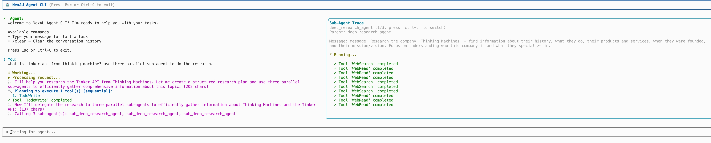

<p align="left">
    <a href="README_CN.md">中文</a> &nbsp ｜ &nbsp English
</p>


# NexAU Framework

A general-purpose agent framework for building intelligent agents with tool capabilities.

This framework provides a modular tool system, a flexible agent architecture, and seamless integration with various LLM providers.

**➡️ For the full documentation, please see the [`docs/`](./docs/index.md) directory.**

---

## Installation

### From GitHub Release (Recommended)

**Using pip:**
```bash
# Install from the latest release tag using SSH (you need to use ssh because nexau is a private repo)
pip install git+ssh://git@github.com/nex-agi/NexAU.git@v0.4.1

# or visit https://github.com/nex-agi/nexau/releases/ and download whl, then
pip install nexau-0.4.1-py3-none-any.whl
```

**Using uv:**
```bash
# Install from the latest release tag using SSH
uv pip install git+ssh://git@github.com/nex-agi/NexAU.git@v0.4.1

# or visit https://github.com/nex-agi/nexau/releases/ and download whl, then
uv pip install nexau-0.4.1-py3-none-any.whl
```

### Install Latest from Main Branch

**Using pip:**
```bash
pip install git+ssh://git@github.com/nex-agi/NexAU.git
```

**Using uv:**
```bash
uv pip install git+ssh://git@github.com/nex-agi/NexAU.git
```

### From Source

```bash
# Clone the repository
git clone git@github.com:nex-agi/NexAU.git
cd NexAU

# Install dependencies using uv
pip install uv
uv sync
```

## Quick Start

1.  **Set up your environment variables** in a `.env` file:
    ```.env
    LLM_MODEL="your-llm-model"
    LLM_BASE_URL="your-llm-api-base-url"
    LLM_API_KEY="your-llm-api-key"
    SERPER_API_KEY="api key from serper.dev" (required if you need to use web search)

    LANGFUSE_SECRET_KEY=sk-lf-xxx
    LANGFUSE_PUBLIC_KEY=pk-lf-xxx
    LANGFUSE_HOST="https://us.cloud.langfuse.com"
    ```
    Optional: NexAU uses Langfuse for tracing, setup your Langfuse keys if you want to enable traces.

2.  **Run an example:**
    ```bash
    # Ensure you have python-dotenv installed (`uv pip install python-dotenv`)
    dotenv run uv run examples/code_agent/start.py

    Enter your task: Build an algorithm art about 3-body problem
    ```

3.  **Prefer Python over YAML?** Create the same agent defined in `examples/code_agent/code_agent.yaml` directly in code, create a new file `code_agent.py`:
    ```python
    import logging
    import os
    from pathlib import Path

    from nexau import Agent, AgentConfig, LLMConfig, Skill, Tool
    from nexau.archs.main_sub.execution.hooks import LoggingMiddleware
    from nexau.archs.tracer.adapters.langfuse import LangfuseTracer
    from nexau.archs.tool.builtin import (
        glob,
        google_web_search,
        list_directory,
        read_file,
        read_many_files,
        replace,
        run_shell_command,
        search_file_content,
        web_fetch,
        write_file,
        write_todos,
    )

    logging.basicConfig(level=logging.INFO, format="%(asctime)s [%(name)s] %(levelname)s: %(message)s")

    base_dir = Path("examples/code_agent")

    # NexAU decouples the definition and implementation (binding) of tools
    tools = [
        Tool.from_yaml(base_dir / "tools/WebSearch.tool.yaml", binding=google_web_search),
        Tool.from_yaml(base_dir / "tools/WebFetch.tool.yaml", binding=web_fetch),
        Tool.from_yaml(base_dir / "tools/write_todos.tool.yaml", binding=write_todos),
        Tool.from_yaml(base_dir / "tools/search_file_content.tool.yaml", binding=search_file_content),
        Tool.from_yaml(base_dir / "tools/Glob.tool.yaml", binding=glob),
        Tool.from_yaml(base_dir / "tools/read_file.tool.yaml", binding=read_file),
        Tool.from_yaml(base_dir / "tools/write_file.tool.yaml", binding=write_file),
        Tool.from_yaml(base_dir / "tools/replace.tool.yaml", binding=replace),
        Tool.from_yaml(base_dir / "tools/run_shell_command.tool.yaml", binding=run_shell_command),
        Tool.from_yaml(base_dir / "tools/list_directory.tool.yaml", binding=list_directory),
        Tool.from_yaml(base_dir / "tools/read_many_files.tool.yaml", binding=read_many_files),
    ]

    # NexAU supports Skills (compatible with Claude Skills)
    skills = [
        Skill.from_folder(base_dir / "skills/theme-factory"),
        Skill.from_folder(base_dir / "skills/algorithmic-art"),
    ]

    # Tracer allows you to forward execution data for observability.
    tracer = LangfuseTracer(
        public_key=os.getenv("LANGFUSE_PUBLIC_KEY"),
        secret_key=os.getenv("LANGFUSE_SECRET_KEY"),
        host=os.getenv("LANGFUSE_HOST"),
    )

    agent_config = AgentConfig(
        name="nexau_code_agent",
        max_context_tokens=100000,
        system_prompt=str(base_dir / "system-workflow.md"),
        system_prompt_type="jinja",
        tool_call_mode="structured", # xml or structured
        llm_config=LLMConfig(
            temperature=0.7,
            max_tokens=4096,
            model=os.getenv("LLM_MODEL"),
            base_url=os.getenv("LLM_BASE_URL"),
            api_key=os.getenv("LLM_API_KEY"),
            api_type="openai_chat_completion",
        ),
        tools=tools,
        skills=skills,
        middlewares=[
            LoggingMiddleware(
                model_logger="nexau_code_agent",
                tool_logger="nexau_code_agent",
                log_model_calls=True,
            ),
        ],
        tracers=[tracer],
    )

    agent = Agent(config = agent_config)

    print(agent.run("Build an algorithm art about 3-body problem", context={"working_directory": os.getcwd()}))

    ```
    Run it with `dotenv run uv run code_agent.py`

4. **External tools (caller-executed)**

    Tools can also be declared with `kind: external` and no local binding. NexAU
    registers the schema with the LLM; when the model calls one, the agent loop
    pauses and returns the pending call to the caller, who executes it and feeds
    the result back to resume the loop. Useful for remote tool execution (IDE
    plugins, cross-language tools, sandboxed execution, LLM API pass-through).

    **Tool YAML** — set `kind: external` and leave out `binding`:

    ```yaml
    type: tool
    name: read_file
    kind: external
    description: Reads the content of a text file.
    input_schema:
      type: object
      properties:
        file_path: { type: string }
      required: [file_path]
    ```

    **Agent YAML** — list it like any other tool, just omit `binding` (the
    `kind: external` declaration lives in the tool YAML itself):

    ```yaml
    tools:
      - name: read_file
        yaml_path: ./tools/read_file.tool.yaml
        # no binding
    ```

    **Python `AgentConfig`** — build the `Tool` via `Tool.from_yaml` with no
    binding; local and external tools can coexist in the same agent:

    ```python
    from nexau import Agent, AgentConfig, Tool

    tools = [
        Tool.from_yaml("tools/read_file.tool.yaml"),                  # external
        Tool.from_yaml("tools/search.tool.yaml", binding=my_search),  # local tool
    ]
    agent = Agent(config=AgentConfig(name="mixed_agent", tools=tools, ...))
    ```

    **Pause / resume** — when an external tool is called, `agent.run_async()`
    returns `(response, {"stop_reason": "EXTERNAL_TOOL_CALL", "pending_tool_calls": [...], "trace_id": ...})`;
    the caller executes the pending calls and resumes with a `Role.TOOL` +
    `ToolResultBlock` message on the next `run_async`. A full driver example lives
    at [`examples/code_agent_external_tool/`](./examples/code_agent_external_tool/);
    design and HTTP contract details are in
    [`docs/core-concepts/tools.md`](./docs/core-concepts/tools.md#external-tools-caller-executed).

5. **Use NexAU CLI to run**

    **Using the run-agent script (Recommended)**
    ```bash
    # One-liner to run any NexAU agent yaml config
    ./run-agent examples/code_agent/code_agent.yaml
    ```
    NexAU CLI supports multi-round human interaction, tool call traces and sub-agent traces, which makes agent debugging easier.
    

## Development

### Environment Bootstrap

The root `Makefile` wraps every workflow the CI pipeline runs. After cloning the repo, install `uv` (if you haven’t already) and let the `install` target both sync dependencies and install the pre-commit hooks:

```bash
pip install uv        # skip if uv is already available
make install          # runs `uv sync` + `uv run pre-commit install`
```

### Day-to-day Workflows

All quality gates match the dedicated GitHub Actions jobs (`lint`, `typecheck`, `test`). Use the targets below for local parity:

```bash
make lint            # ruff lint suite
make format          # ruff formatter (auto-fix)
make format-check    # formatter check-only (same as CI)
make typecheck       # runs mypy + pyright
make mypy-coverage   # emits Cobertura + HTML reports under mypy_reports/
make test            # pytest with XML + HTML coverage (coverage.xml + htmlcov/)
make ci              # runs lint, format-check, typecheck, and test sequentially
```

Artifacts to inspect locally (and that CI uploads to Codecov):

- `mypy_reports/type_cobertura/cobertura.xml` plus `mypy_reports/type_html/index.html` for type coverage.
- `coverage.xml` plus `htmlcov/index.html` for runtime test coverage.
# Trigger CI with updated tests
