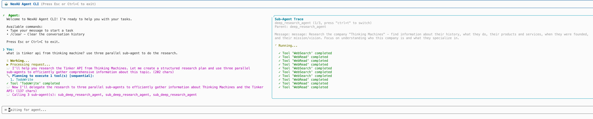

<p align="left">
   中文 &nbsp ｜ &nbsp  <a href="README_CN.md">English</a>
</p>


# NexAU 框架

一个通用 Agent 框架，用于构建具有工具能力的 Agent 。

该框架提供模块化的工具系统、灵活的 Agent 架构，以及与各种LLM提供商的无缝集成。

**➡️ 完整文档请查看 [`docs/`](./docs/index.md) 目录。**

---

## 安装

### 从 GitHub Release 安装（推荐）

**使用 pip：**
```bash
# 从最新发布版本安装（需要使用SSH，因为nexau是私有仓库）
pip install git+ssh://git@github.com/nex-agi/NexAU.git@v0.3.4

# 或者访问 https://github.com/nex-agi/NexAU/releases/ 下载 whl 文件，然后
pip install nexau-0.3.4-py3-none-any.whl
```

**使用 uv：**
```bash
# 从最新发布版本安装（需要使用SSH）
uv pip install git+ssh://git@github.com/nex-agi/NexAU.git@v0.3.4

# 或者访问 https://github.com/nex-agi/NexAU/releases/ 下载 whl 文件，然后
uv pip install nexau-0.3.4-py3-none-any.whl
```

### 从 Main 分支安装最新版本

**使用 pip：**
```bash
pip install git+ssh://git@github.com/nex-agi/NexAU.git
```

**使用 uv：**
```bash
uv pip install git+ssh://git@github.com/nex-agi/NexAU.git
```

### 从源码安装

```bash
# 克隆仓库
git clone git@github.com:nex-agi/NexAU.git
cd NexAU

# 使用 uv 安装依赖
pip install uv
uv sync
```

## 快速开始

1.  **设置环境变量**，在 `.env` 文件中：
    ```.env
    LLM_MODEL="你的-llm-模型"
    LLM_BASE_URL="你的-llm-api基础url"
    LLM_API_KEY="你的-llm-api密钥"
    SERPER_API_KEY="serper.dev的api密钥"（如果需要使用网络搜索）

    LANGFUSE_SECRET_KEY=sk-lf-xxx
    LANGFUSE_PUBLIC_KEY=pk-lf-xxx
    LANGFUSE_HOST="https://us.cloud.langfuse.com"
    ```
    可选：NexAU 使用 Langfuse 来进行轨迹捕捉，通过设置 Langfuse 的环境变量来开启它。

2.  **运行示例：**
    ```bash
    # 确保已安装 python-dotenv (`uv pip install python-dotenv`)
    dotenv run uv run examples/code_agent/start.py

    输入你的任务：构建一个关于三体问题的算法艺术
    ```

3.  **想直接用 Python 而不是 YAML？** 下面的代码与 `examples/code_agent/code_agent.yaml` 定义的 Agent 等价，创建code_agent.py：
    ```python
    import logging
    import os
    from pathlib import Path

    from nexau import Agent, AgentConfig, LLMConfig, Skill, Tool
    from nexau.archs.main_sub.execution.hooks import LoggingMiddleware

    from nexau.archs.tool.builtin import (
        bash_tool,
        file_edit_tool,
        file_read_tool,
        file_write_tool,
        glob_tool,
        grep_tool,
        ls_tool,
        multiedit_tool,
        todo_write,
        web_read,
        web_search,
    )

    logging.basicConfig(level=logging.INFO, format="%(asctime)s [%(name)s] %(levelname)s: %(message)s")

    base_dir = Path("examples/code_agent")

    # NexAU decouples the definition and implementation (binding) of tools
    tools = [
        Tool.from_yaml(base_dir / "tools/WebSearch.tool.yaml", binding=web_search),
        Tool.from_yaml(base_dir / "tools/WebFetch.tool.yaml", binding=web_read),
        Tool.from_yaml(base_dir / "tools/TodoWrite.tool.yaml", binding=todo_write),
        Tool.from_yaml(base_dir / "tools/Grep.tool.yaml", binding=grep_tool),
        Tool.from_yaml(base_dir / "tools/Glob.tool.yaml", binding=glob_tool),
        Tool.from_yaml(base_dir / "tools/Read.tool.yaml", binding=file_read_tool),
        Tool.from_yaml(base_dir / "tools/Write.tool.yaml", binding=file_write_tool),
        Tool.from_yaml(base_dir / "tools/Edit.tool.yaml", binding=file_edit_tool),
        Tool.from_yaml(base_dir / "tools/Bash.tool.yaml", binding=bash_tool),
        Tool.from_yaml(base_dir / "tools/Ls.tool.yaml", binding=ls_tool),
        Tool.from_yaml(base_dir / "tools/MultiEdit.tool.yaml", binding=multiedit_tool),
    ]

    # NexAU supports Skills (compatible with Claude Skills)
    skills = [
        Skill.from_folder(base_dir / "skills/theme-factory"),
        Skill.from_folder(base_dir / "skills/algorithmic-art"),
    ]

    # Tracer allows you to forward execution data for observability.
    tracer = LangfuseTracer(
        public_key=os.getenv("LANGFUSE_PUBLIC_KEY"),
        secret_key=os.getenv("LANGFUSE_SECRET_KEY"),
        host=os.getenv("LANGFUSE_HOST"),
    )

    agent_config = AgentConfig(
        name="nexau_code_agent",
        max_context_tokens=100000,
        system_prompt=str(base_dir / "system-workflow.md"),
        system_prompt_type="jinja",
        tool_call_mode="openai", # xml, openai or anthorpic
        llm_config=LLMConfig(
            temperature=0.7,
            max_tokens=4096,
            model=os.getenv("LLM_MODEL"),
            base_url=os.getenv("LLM_BASE_URL"),
            api_key=os.getenv("LLM_API_KEY"),
            api_type="openai_chat_completion", # support openai_chat_completion (default), openai_responses (especially for gpt-5-codex), anthropic_chat_completion
        ),
        tools=tools,
        skills=skills,
        middlewares=[
            LoggingMiddleware(
                model_logger="nexau_code_agent",
                tool_logger="nexau_code_agent",
                log_model_calls=True,
            ),
        ],
        tracers=[tracer]
    )

    agent = Agent(config = agent_config)

    print(agent.run("构建一个关于三体问题的算法艺术", context={"working_directory": os.getcwd()}))

    ```
    通过 `dotenv run uv run code_agent.py` 来运行 Agent

4. **使用 NexAU CLI 运行**

    **使用 run-agent 脚本（推荐）**
    ```bash
    # 一行命令运行任何 NexAU Agent 的 yaml 配置
    ./run-agent examples/code_agent/code_agent.yaml
    ```
    NexAU CLI 支持多轮交互、显示工具调用轨迹和Sub-agent的轨迹，非常适合用来调试 NexAU 的 Agent。
    

## 开发

### 环境初始化

根目录的 `Makefile` 已经封装了所有 CI 会跑的工作流。克隆仓库后先确保安装好 `uv`，再通过 `install` 目标同步依赖并安装 pre-commit 钩子：

```bash
pip install uv        # 如果已经安装可跳过
make install          # 执行 `uv sync` + `uv run pre-commit install`
```

### 日常工作流

下面的命令与 GitHub Actions 中的 lint/type/test 作业完全一致，保证本地与 CI 一致性：

```bash
make lint            # 运行 ruff lint 套件
make format          # 运行 ruff 自动格式化
make format-check    # 以检查模式运行 formatter（CI 同款）
make typecheck       # 同时运行 mypy 与 pyright
make mypy-coverage   # 在 mypy_reports/ 下生成 Cobertura + HTML 类型覆盖率
make test            # 运行 pytest，输出 coverage.xml 与 htmlcov/
make ci              # 按顺序执行 lint、format-check、typecheck、test
```

本地可以查看、CI 也会上传到 Codecov 的产物：

- `mypy_reports/type_cobertura/cobertura.xml` 与 `mypy_reports/type_html/index.html`（类型覆盖率）。
- `coverage.xml` 与 `htmlcov/index.html`（测试覆盖率）。
