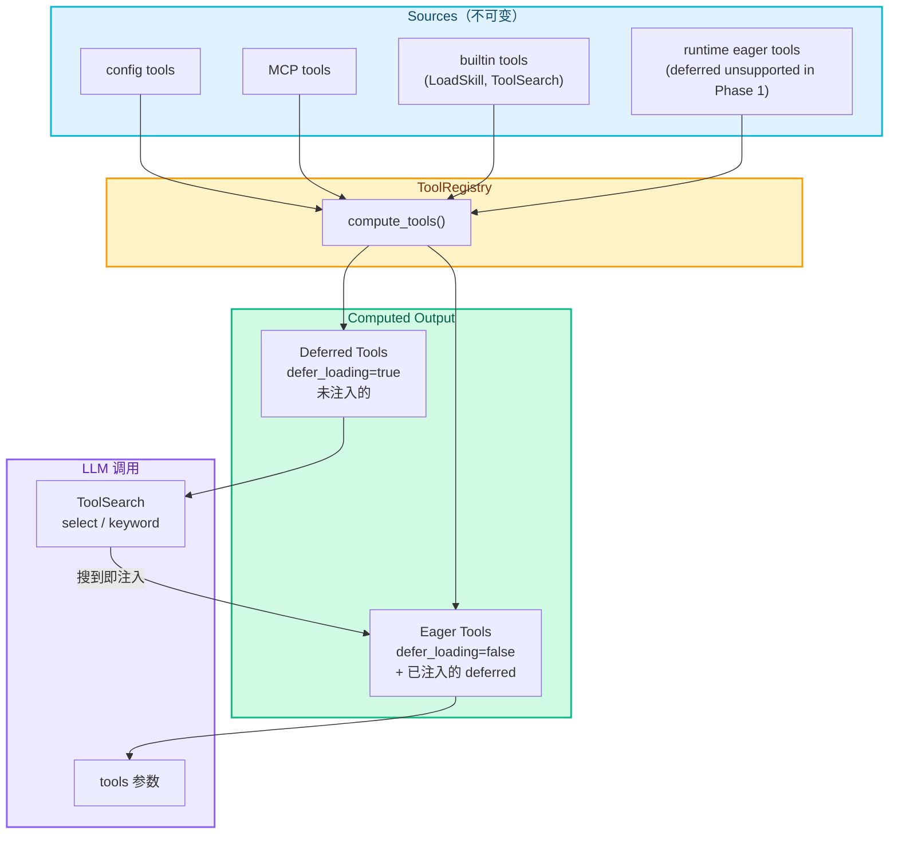
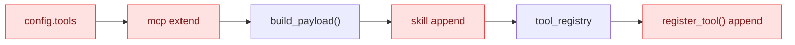
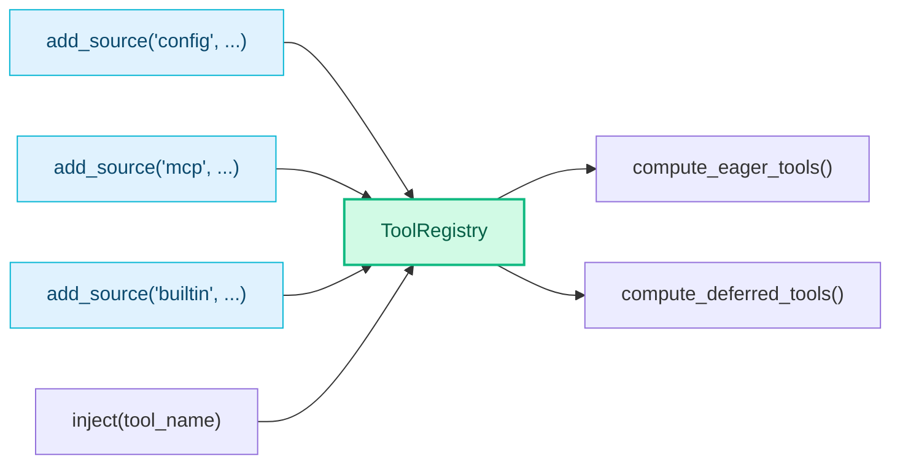

# RFC-0005: Tool Search — 工具按需动态注入

- **状态**: implemented (Phase 1.5)
- **优先级**: P1
- **标签**: `architecture`, `performance`
- **影响服务**: nexau (agent runtime)
- **创建日期**: 2026-03-06
- **更新日期**: 2026-03-12

## 摘要

当前 NexAU 将所有注册工具的完整 JSON Schema 全量传入 `tools` 参数，随着工具数量增长 context 开销线性膨胀。本 RFC 提出两个改进：

1. **Tool Search**：`defer_loading: true` 的工具不在启动时注入，通过 `ToolSearch` 工具按需搜索并自动注入
2. **Computed Tools**：重构工具组装逻辑，不可变来源 + 计算输出，替代当前的 mutation 模式

## 动机

- 每个工具 schema 约 200-500 tokens，20 个工具占 4000-10000 tokens，大部分任务只用 2-3 个
- MCP Server 接入后工具数量可达数十甚至上百，全量注册不可持续
- 现有 `as_skill` 解决的是"description 太长"，不解决"schema 太多"
- 行业趋势：Claude Code 2.1.69 通过类似机制将 context 从 18k 降至 4.8k tokens

## 设计

### 整体架构



### `defer_loading` 属性

在 `Tool` 上新增 `defer_loading: bool`，与 `as_skill` 完全正交：

| | `defer_loading=false` | `defer_loading=true` |
|---|---|---|
| **`as_skill=false`** | 默认：schema 全量注入，description 在 prompt 展示 | schema 按需注入，description 在 prompt 展示 |
| **`as_skill=true`** | schema 全量注入，description 通过 LoadSkill 加载 | schema 按需注入，description 通过 LoadSkill 加载 |

- `as_skill` 控制 **prompt 里的文档展示方式**
- `defer_loading` 控制 **tool schema 是否按需注入**

### ToolSearch 工具

注册为 eager tool，LLM 可调用。description 极简，只说明用法（搜索/选择），不列任何工具名。有 deferred tool 即激活，无阈值。

**搜索模式**：

| 模式 | 匹配方式 | 适用场景 |
|------|---------|---------|
| **select** | `select:ToolName1,ToolName2` 按名称精确匹配 | LLM 已经知道工具名，需要稳定、可预测的选择 |
| **keyword**（默认） | 对名字 + `description` + `search_hint` 做加权关键词匹配 | LLM 描述意图，需要轻量召回 |

**加权评分规则**：

| 匹配目标 | 条件 | 分值 |
|----------|------|------|
| tool name | token 精确匹配分词后的某个 part（支持 CamelCase / `_` / `-` 分词） | +10 |
| tool name | token 部分包含 | +5 |
| tool name | 全文包含 | +3 |
| search_hint | token 命中 | +4 |
| description | token 命中 | +2 |

name 分词示例：`WebSearch` → `[“web”, “search”]`，`slack_post` → `[“slack”, “post”]`。

`+keyword` 前缀语法做前置过滤（必须出现在 name 中），默认返回 top 5。

**为什么不用 BM25**：

- 加权关键词 vs BM25 的核心差异：BM25 考虑词频（TF）和逆文档频率（IDF），对长文档做归一化惩罚
- 工具规模 <100 时，name 权重远高于 description，加权关键词已够用
- 引入 BM25 需要分词器 + IDF 预计算，增加复杂度；保留 `ToolRegistry.search()` 接口，后续可无缝升级

**行为**：搜到即注入，无需额外 activate 步骤。注入后 session 生命周期内保持（additive）。下一轮 LLM 直接 function call。ToolSearch 的访问路径由 RFC-0006 统一为 `ctx.tools.search()`。

### Computed Tools 重构

#### 现状问题



多处 mutate 同一个 `config.tools`，顺序依赖，`build_payload()` 在 skill tool 添加之前执行。

#### 改造后



`ToolRegistry` 的核心接口：

- `add_source(name, tools)` — 注册工具来源（只追加，不修改已有条目）
- `compute_eager_tools()` — 计算当前应传给 LLM 的工具列表
- `compute_deferred_tools()` — 计算 ToolSearch 搜索池
- `inject(tool_name)` — 运行时注入 deferred tool（不修改任何 source）
- `get_all()` — 获取完整注册表（用于工具执行）

每次 LLM 调用前从 `compute_eager_tools()` 重新计算，`inject()` 后下一轮自动生效。

**当前范围（Phase 1）**：

- 支持运行时追加 **eager tools**
- 不支持运行时追加 **deferred tools**
- `ToolSearch` 的 discoverability 只对 agent 初始化阶段已注册的 deferred tools 定义

## 权衡取舍

### 考虑过的替代方案

| 方案 | 优点 | 缺点 | 决定 |
|------|------|------|------|
| 复用 `as_skill` 做 defer | 少一个属性 | 语义混淆，`as_skill` 已有明确职责 | **否** |
| Embedding 索引 | 语义匹配更准确 | 增加外部依赖和复杂度 | 否 |
| 搜索 + 单独 activate 步骤 | 可审核搜索结果 | 浪费一轮调用 | **否** |
| `regex` 名称匹配 | 表达能力强 | 让 LLM 生成/维护 regex 不稳定，语义过重 | 否（`select` 取代） |
| `BM25` 关键词检索 | 大规模工具集召回更强 | 引入分词、调参与测试复杂度 | 暂不采用 |
| `select / keyword`，搜到即注入 | 实现轻、行为稳、零额外依赖 | 召回能力不如专门检索器 | **采用** |

### 缺点

- 首次使用 deferred tool 多一轮 ToolSearch 调用
- 模糊搜索可能注入过多工具（通过 `max_inject_per_search` 限制）
- 弱模型可能不理解何时需要搜索（`defer_loading` 是 opt-in）

## 实现计划

### Phase 1: 核心机制

- [x] `ToolRegistry` 类（不可变来源 + computed tools + inject）
- [x] `Tool` 新增 `defer_loading` 属性
- [x] `ToolSearch` 内置工具（`select / keyword`，搜到即注入）
- [x] `Agent` 改用 `ToolRegistry`
- [x] `Executor` 每轮从 `compute_eager_tools()` 计算 tools

### Phase 1.5: Token 优化 + 搜索增强

Phase 1 存在三个问题需要修正。

#### 问题分析

1. **Description 膨胀**：`build_deferred_index()` 把每个 deferred tool 的名字 + 描述拼入 ToolSearch description，每条 ~10-15 tokens。100 个 deferred tool = 1000-1500 tokens，每轮都带，违背 defer_loading 省 token 的初衷。且 index 初始化时固定，注入后不更新。
2. **返回值冗余**：`tool_search()` 返回 `tools: [{name, description}]`，但 LLM 下一轮在 `tools` 参数里一定会看到完整 schema，description 是冗余 token。
3. **CamelCase 分词缺失**：`_score_tool` 只按 `_` / `-` 分词，不支持 CamelCase。搜 `"web"` 时 `WebSearch` 走部分包含 (+5) 而非精确匹配 (+10)。

#### 设计方案

**1. ToolSearch description 极简化**

不在 description 中列任何工具名或描述，只说明用法：

```yaml
# Phase 1（当前）
description: >-
  Search for or select deferred tools...
  <available-deferred-tools>
  - GetWeather: Get current weather for a city
  - SlackSend: Send message to Slack channel
  </available-deferred-tools>

# Phase 1.5
description: >-
  Search for or select deferred tools to make them available for use.
  Use "select:ToolName" for direct selection, or keywords to search.
```

LLM 不需要看到工具列表来决定何时搜索——当它需要某个不在 tools 参数里的能力时，自然会调 ToolSearch。工具名不够明确时，用户应在 `search_hint` 中补充语义线索。

Description 初始化时固定，不随 turn 更新。`build_deferred_index()` 方法保留用于调试，但不再拼入 description。

**2. 返回值精简**

```python
# Phase 1（当前）
{
    "result": "Found 2 tool(s). They are now available for use.",
    "tools": [{"name": "GetWeather", "description": "Get current..."}],
    "query": "weather",
    "matched_count": 2,
}

# Phase 1.5
"Found 2 tool(s): GetWeather, SlackSend. They are now available for use."
```

返回纯字符串。去掉 dict 结构和所有冗余字段。LLM 下一轮看到完整 schema，不需要提前知道描述。

**3. CamelCase 分词**

```python
# Phase 1（当前）
name_parts = re.split(r"[_\-]", name_lower)
# "WebSearch" → ["websearch"]  ← 无法精确匹配 "web"

# Phase 1.5: 两步 re.sub 处理连续大写
s = re.sub(r"([A-Z]+)([A-Z][a-z])", r"\1_\2", tool.name)
s = re.sub(r"([a-z\d])([A-Z])", r"\1_\2", s)
name_parts = [p for p in re.split(r"[_\-]", s.lower()) if p]
# "WebSearch" → ["web", "search"]  ← 精确匹配 "web" 得 +10
# "HTTPClient" → ["http", "client"]  ← 连续大写正确处理
```

与 Claude Code 的 CamelCase 分词行为对齐。

**4. 补齐 edge case 测试**

| 场景 | 预期行为 |
|------|---------|
| 空 query `""` / `"  "` | 返回空结果 |
| `select:NonExistent` | 返回空结果，不报错 |
| 搜索已注入工具 | 跳过，返回空 |
| deferred 池清空后搜索 | 返回空结果 |
| `max_results=0` | 返回空结果 |
| `get_tool` 查找存在/不存在的工具 | 分别返回 Tool / None |

#### 实现清单

- [x] ToolSearch description 改为极简（去掉 deferred index 拼接）
- [x] `tool_search()` 返回值精简：纯字符串，去掉 dict 结构
- [x] `_score_tool` 的 name 分词支持 CamelCase（两步 regex 处理连续大写）
- [x] 补齐 edge case 单元测试（CamelCase 7 tests + edge cases 12 tests）

### Phase 2: 增强

- [ ] MCP Server 工具自动标记 `defer_loading: true`
- [ ] 已注入工具的自动卸载
- [ ] 工具使用频率统计

### 相关文件

| 文件 | 说明 |
|------|------|
| `nexau/archs/tool/tool.py` | 新增 `defer_loading` 属性 |
| `nexau/archs/tool/tool_registry.py` | 新文件：ToolRegistry |
| `nexau/archs/main_sub/agent.py` | 改用 ToolRegistry |
| `nexau/archs/main_sub/execution/executor.py` | 每轮计算 tools |
| `nexau/archs/tool/builtin/tool_search.py` | 新文件：ToolSearch |

## 未解决的问题

1. 已注入工具的生命周期：整个 session 保持还是自动卸载？（→ Phase 2 自动卸载）
2. ~~注入数量上限的合理默认值？~~ → Phase 1 已确定 `max_inject_per_search=5`
3. 与 Context Compaction（RFC-0004）的交互：compaction 时是否保留 ToolSearch 历史？
4. ~~ToolSearch description 中 deferred index 的 token 膨胀问题~~ → Phase 1.5 已解决（极简静态 description）

## 附录 A：行业对比 — Claude Code / Codex CLI / NexAU

### 整体对比

| 维度 | Claude Code | OpenAI Codex CLI | NexAU (Phase 1.5) |
| ---- | ----------- | ---------------- | ----------------- |
| 索引格式 | 名字列表 `<available-deferred-tools>` | 不列工具名，只列 app 来源名 | 不列工具名，极简 description |
| 搜索算法 | 加权关键词 (CamelCase 分词) | BM25 全文检索 | 加权关键词 (CamelCase 分词) |
| 注入机制 | `tool_reference` (服务端) | Client 侧 | Client 侧 |
| 返回值 | 极简 (`tool_reference` 对象) | 全量 (name/desc/score/input_keys) | 极简 (名字列表 + count) |
| 描述更新 | 动态每轮 + delta 通知 | 静态模板 | 静态 |
| 激活条件 | token 占比 ≥10% | Feature flag | 有 deferred 即激活 |
| 注入生命周期 | Session additive | Session additive | Session additive |
| Deferred 范围 | 内置 + MCP | 仅 Apps/MCP | 用户自定义 |

### 搜索算法细节对比

| 评分项 | Claude Code | NexAU | Codex CLI |
| ------ | ----------- | ----- | --------- |
| name token 精确匹配 | +10 (MCP +12) | +10 | BM25 TF-IDF |
| name 部分包含 | +5 (MCP +6) | +5 | BM25 TF-IDF |
| name 全文包含 | +3 | +3 | — |
| search_hint 匹配 | +4 | +4 | — |
| description 匹配 | +2 | +2 | BM25 TF-IDF |
| input_keys 匹配 | — | — | BM25 TF-IDF |
| name 分词 | CamelCase + `_` + `-` | CamelCase + `_` + `-` | 空格分割 |
| `+keyword` 前置过滤 | 有 | 有 | — |
| 默认返回数 | 5 | 5 | 8 |

NexAU 与 Claude Code 的搜索算法基本一致，唯一差异是不区分 MCP 工具加权（后续接入大量 MCP 工具时可加）。

### 设计决策对比

#### 为什么 NexAU 不列工具名（比 Claude Code 更激进）

Claude Code 在 description 里列出所有 deferred 工具名（动态更新），帮助 LLM 判断何时搜索。NexAU 选择完全不列：

- Claude Code 可以用 `tool_reference` 服务端注入，description 的 token 开销相对可控
- NexAU 是 client 侧注入，每个 deferred 工具的 schema 注入后都增加 tools 参数体积，index 的边际价值更低
- LLM 在需要某个不在 tools 里的能力时，自然会调 ToolSearch，不需要名字列表来提示

#### 为什么 NexAU 返回值极简（比 Codex CLI 更激进）

Codex CLI 返回全量 `{name, title, description, score, input_keys}`，因为 OpenAI 模型在当前轮看不到被搜到的工具 schema，需要返回值给足信息让模型决策。但这是冗余设计——下一轮 tools 参数里会带完整 schema。NexAU 只返回名字列表和 count。

#### 为什么 NexAU 不做动态描述更新

Claude Code 每轮重建 description 并发 delta 通知。NexAU 选择静态 description：

- 极简 description 不含工具列表，无需更新
- 减少 Executor 和 ToolRegistry 之间的耦合
- 降低实现复杂度

## 附录 B：Claude Code 2.1.69 Tool Search 逆向分析

以下内容通过反编译 `@anthropic-ai/claude-code@2.1.69` npm 包的 `cli.js` 得出。

### 工具分类

Core Tools（10 个，始终加载）：

| 工具 | 用途 |
|------|------|
| Bash | 执行 shell 命令 |
| Read | 读文件/图片/PDF/notebook |
| Write | 创建或覆盖文件 |
| Edit | 修改文件内容 |
| Glob | 按文件名/通配符查找 |
| Grep | 用 regex 搜索文件内容（ripgrep） |
| Agent | 委派工作给 subagent |
| Skill | 调用 slash-command skill |
| StructuredOutput | 返回结构化 JSON 响应 |
| ListMcpResourcesTool | 列出 MCP server 资源 |

Deferred Tools（18 个，通过 ToolSearch 按需加载）：

| 工具 | 用途 |
|------|------|
| WebSearch | 搜索互联网 |
| WebFetch | 抓取 URL 内容 |
| NotebookEdit | 编辑 Jupyter notebook |
| LSP | 代码智能（定义/引用/符号/hover） |
| AskUserQuestion | 向用户提多选问题 |
| EnterPlanMode / ExitPlanMode | plan 模式切换 |
| EnterWorktree | 创建 git worktree |
| TodoWrite | 管理 session 任务清单 |
| TaskCreate/Get/Update/List/Stop/Output | 后台任务管理（6 个） |
| SendMessage | 向 agent 队友发消息（swarm） |
| TeamCreate / TeamDelete | 多 agent swarm 管理 |

MCP 工具自动全部 deferred。分类策略：文件操作 + shell + 代码搜索 = 始终加载；网络/任务管理/协作/高级功能 = 按需加载。

### 启用条件

```
是否启用 ToolSearch = 三个条件全满足：
  1. 模型支持 tool_reference（Sonnet 4+, Opus 4+，排除 haiku）
  2. ToolSearch 工具已注册
  3. deferred 工具的 token 占用 ≥ context 窗口的 10%（默认阈值）
```

- 阈值通过 `ENABLE_TOOL_SEARCH` 环境变量可调（数字=百分比，`auto`=默认 10%，`100`=禁用）
- Feature flag `tengu_defer_all_bn4` 开启后所有工具都 defer（除 ToolSearch 自身）

### 注入机制：tool_reference

Claude Code 利用 **Claude API 的 `tool_reference` 协议**实现服务端注入：

```
ToolSearch 返回结果时，tool_result 的 content 不是文本，而是：
[{type: "tool_reference", tool_name: "WebSearch"}, ...]
```

Claude API 收到 `tool_reference` 后，自动将对应工具的完整 schema 注入到模型的可用工具列表中。这是服务端行为，client 不需要手动修改 tools 参数。`tool_reference` 目前是 Claude 专有协议，其他 LLM provider 不支持。

### 增量通知

每次 system prompt 构建时，通过 `deferred_tools_delta` section 告知模型 deferred 工具池的变化（新增/移除），避免重复发送完整索引。

## 附录 C：OpenAI Codex CLI Tool Search 分析

### 架构

Codex CLI 的 `search_tool_bm25` 在 Apps 功能启用时自动注册。MCP 工具来自 Codex Apps 网关，自动从 LLM tool list 中隐藏，只通过搜索发现。

### 搜索机制

使用 BM25 全文检索，索引字段包括：`name`、`tool_name`、`server_name`、`title`、`description`、`connector_name`、`input_keys`（schema property 名称）。所有字段拼接为一个可搜索文档。

- 默认返回 top 8
- 搜索结果跨调用取并集（`merge_mcp_tool_selection()`），session 内 additive

### Description 策略

使用 Handlebars 模板，只列 app 来源名（如 "Google Calendar, Slack"），不列具体工具名。模板一次生成，不随 turn 更新。

### 返回值

返回全量信息：

```json
{
  "query": "calendar create",
  "total_tools": 42,
  "active_selected_tools": ["calendar_create_event", "slack_send"],
  "tools": [
    {
      "name": "calendar_create_event",
      "title": "Create Calendar Event",
      "description": "Creates a new event...",
      "connector_name": "Google Calendar",
      "input_keys": ["title", "start_time", "end_time"],
      "score": 15.7
    }
  ]
}
```

返回全量是因为 OpenAI 模型在当前轮看不到搜到的工具 schema，需要返回值提供足够信息。但这些 token 在下一轮 tools 参数中会重复出现。

## 参考资料

- [Claude Code 2.1.69 Tool Search](https://x.com/thecat88tw/status/2029485559362842631)
- [Tool 与 Skill 的分层设计](https://sxddhcrtbqu.feishu.cn/wiki/ChVwwdXJiiDNHzksQEmc9ktAnte)
- 反编译源码：`npm pack @anthropic-ai/claude-code@2.1.69`，`cli.js` 13079 行
- OpenAI Codex CLI: `github.com/openai/codex`，`codex-rs/core/src/tool_search.rs`
- Issue #280
