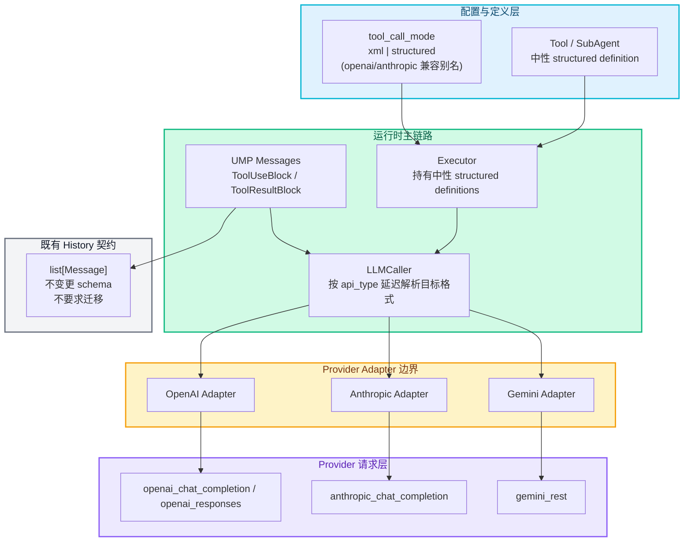
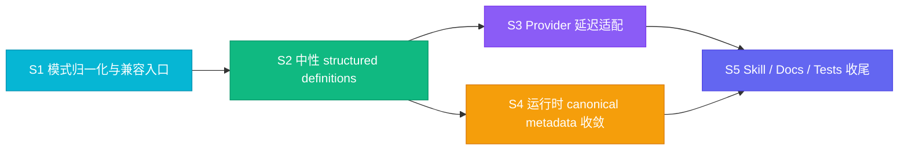

# RFC-0006: 中性 Structured Tool Calling 与 Provider 延迟适配

- **状态**: implementing
- **优先级**: P1
- **标签**: `architecture`, `runtime`, `api`, `dx`, `compatibility`
- **影响服务**: `nexau/archs/tool/`, `nexau/archs/main_sub/`, `nexau/core/`, `docs/`, `examples/`
- **创建日期**: 2026-03-12
- **更新日期**: 2026-03-13

## 摘要

当前 NexAU 的 `tool_call_mode` 同时承担了两层含义：

1. **交互模式**：XML 还是结构化 tool calling；
2. **provider 格式**：OpenAI / Anthropic 的请求 wire format。

这导致 tool 定义、请求组装、Gemini 适配与用户文档都出现了 provider 耦合。本 RFC 提出以下统一方案：

1. 对外将 `tool_call_mode` 收敛为两种语义：`xml` 与 `structured`；
2. `openai` / `anthropic` 保留为兼容别名，但统一归一化到 `structured`；
3. 内部以**中性 structured tool definition** 作为 structured 模式下的唯一上游表示；
4. 在**真正发送 LLM 请求时**，再根据 `llm_config.api_type` 选择 OpenAI / Anthropic / Gemini 的请求格式；
5. `gemini_rest` 不再以 OpenAI 形状作为主中转，而是从中性表示直接生成 Gemini request；
6. 运行时 tool call 元数据继续统一收敛到 `ModelToolCall` / `ToolUseBlock` / `ToolResultBlock`，并保持现有 UMP history 持久化链路不变；
7. tool-based skill、`LoadSkill`、README、示例与文档统一改写为 `xml` vs `structured` 的对外叙述。

该方案的目标是：**让“是否使用结构化 tool calling”成为用户关心的配置，让“具体 provider 要什么格式”成为边界适配层的职责。**

---

## 动机

### 1) `tool_call_mode` 当前混合了“模式选择”和“provider 选择”

现状中：

- `xml` 表示 XML tool call；
- `openai` 表示 OpenAI 结构化 tool call；
- `anthropic` 表示 Anthropic 结构化 tool call。

这意味着一个本应描述“交互范式”的配置项，被迫暴露了 provider 差异。对用户而言，真正关心的通常只有：

- 我要不要走 XML；
- 我要不要走结构化 tool calling。

至于结构化请求最后落成 OpenAI / Anthropic / Gemini 哪种 payload，本质上取决于 `llm_config.api_type`，不应再要求用户在 `tool_call_mode` 中重复表达。

### 2) provider 耦合已渗透到工具定义、执行器和 Gemini 适配链路

当前代码中已经存在多处 provider 耦合：

- `Tool.to_openai()` / `Tool.to_anthropic()` 直接输出 provider 形状；
- `Agent` 在初始化时就根据 `tool_call_mode` 构建 provider-specific payload；
- `Executor` 持有的是已经 vendor 化的 `structured_tool_payload`；
- `gemini_rest` 目前依赖 OpenAI 形状的 tool definitions / messages 再做二次转换。

这带来的问题是：

- 切换 provider 时，tool 定义的上游结构也要跟着变；
- 新增 provider 时，容易复用错误的中间 canonical 形状；
- 内部抽象层次不清晰：中性结构和 wire format 混在一起。

### 3) 运行时已经有中性 UMP 基础，但 structured 主链路仍不够彻底

NexAU 已经引入了：

- `Message` / `ToolUseBlock` / `ToolResultBlock`
- `ModelToolCall`
- OpenAI legacy ↔ UMP 的适配

这说明框架已经有了中性消息模型的基础。但当前 structured tool-calling 主链路仍未完全建立在这一抽象之上，主要问题包括：

- structured tools 的 provider 形状生成得太早；
- Gemini 仍然把 OpenAI 形状当作桥；
- `Tool.to_openai()` / `to_anthropic()` 仍是主干接口，而不是边界兼容包装。

### 4) 文档与 skill 表述仍然把 provider 名字暴露给最终用户

README、`docs/getting-started.md`、`docs/advanced-guides/skills.md`、示例 YAML 当前都在讲：

- `tool_call_mode: openai`
- `tool_call_mode: anthropic`

这会误导用户把 provider 选择和 tool calling 模式理解为同一件事，也会让 tool-based skill / `LoadSkill` 的说明在结构化模式下出现不必要的 provider 差异。

### 5) 现有 history 已经是 UMP，因此本 RFC 应聚焦请求侧与运行时主链路

当前 session history 的持久化载体是 `list[Message]`，也就是 UMP，而不是按 OpenAI / Anthropic / Gemini 分别保存不同 schema。即使 `xml` 模式下 assistant 文本中出现 `<tool_use>`，它在 history 里也只是合法的 UMP 文本内容，而不是需要迁移的数据格式。

因此，本 RFC 不应扩大为 history/session 数据迁移项目，而应聚焦：

- 中性 structured tool definition；
- provider 延迟适配；
- 运行时 canonical tool metadata；
- 文档与对外语义统一。

---

## 设计

### 目标

1. **对外配置去 provider 化**：`tool_call_mode` 表示 `xml` vs `structured`，而不是 OpenAI vs Anthropic。
2. **中性内部表示单一真源**：structured tool definition、tool call、tool result 在运行时统一以中性结构为主表示。
3. **provider 延迟适配**：仅在发送请求的边界把中性结构转换为 provider wire format。
4. **四类 provider 首批支持完整闭环**：`openai_chat_completion`、`openai_responses`、`anthropic_chat_completion`、`gemini_rest`。
5. **零/低迁移成本**：旧 YAML / Python API 尽量继续可用；不要求 session/history 数据迁移；文档更新为新语义。
6. **Gemini 去 OpenAI 中转**：Gemini 的 tools / messages 直接从中性表示转换。

### 非目标

1. 不移除 `xml` 模式；
2. 不重写工具 YAML schema 规范本身；
3. 不改变 tool execution / hook / middleware 的业务语义；
4. 不引入 session / history 数据迁移；
5. 不把 `history=` 的 legacy 输入兼容清理纳入本 RFC 主目标；
6. 不在本 RFC 中重构与 tool calling 无关的 reasoning / tracing / compaction 元数据。

### 核心原则

1. **模式归模式，provider 归 provider**：`tool_call_mode` 决定交互范式，`api_type` 决定 wire format。
2. **边界适配而非全链路 vendor 化**：vendor 形状只存在于请求/响应边界，不在 Agent/Executor 主状态中扩散。
3. **中性 UMP 持久化继续沿用**：history 仍以 `Message` + block 为准，本 RFC 不修改 persistence schema。
4. **兼容优先于扩大范围**：优先兼容旧 alias 与现有 API，不把 session migration 一并塞进同一 RFC。
5. **对外文档只讲稳定概念**：用户看到的是 `xml` 与 `structured`，而不是 provider-specific 术语。

### 架构概览



---

## 详细设计

### 1. `tool_call_mode` 语义收敛为 `xml` / `structured`

#### 1.1 对外接受值

为兼容旧配置，框架继续接受以下输入：

| 输入值 | 归一化结果 | 说明 |
|------|-----------|------|
| `xml` | `xml` | 保持现状 |
| `structured` | `structured` | 新的标准值 |
| `openai` | `structured` | 兼容别名，建议弃用 |
| `anthropic` | `structured` | 兼容别名，建议弃用 |
| `None` / 未配置 | `structured` | 新默认值 |

#### 1.2 兼容语义

兼容别名的含义仅为“我要结构化 tool calling”，**不再表示强制使用某个 provider 的 wire format**。

也就是说：

| `tool_call_mode` 输入 | `llm_config.api_type` | 实际结构化格式 |
|----------------------|-----------------------|----------------|
| `openai` | `openai_chat_completion` | OpenAI |
| `openai` | `anthropic_chat_completion` | Anthropic |
| `anthropic` | `openai_responses` | OpenAI |
| `anthropic` | `gemini_rest` | Gemini |
| `structured` | 任一已支持 provider | 由 provider 决定 |

这是一项**语义收敛**：旧 alias 被视为“历史上命名不准确的 structured”。

#### 1.3 日志与提示策略

- 配置使用 `openai` / `anthropic` 时，输出一次兼容/弃用提示；
- 文档、示例、注释、`AgentConfig` 默认值统一改为 `structured`；
- 测试仍覆盖 alias，以保证老配置不回归。

### 2. `api_type` 决定 provider wire format

在 `tool_call_mode == structured` 时，新增一个明确的 provider target 解析步骤：

| `llm_config.api_type` | provider target | 说明 |
|-----------------------|-----------------|------|
| `openai_chat_completion` | `openai` | OpenAI Chat Completions / OpenAI-compatible |
| `openai_responses` | `openai` | OpenAI Responses 家族，tool schema 仍属于 OpenAI family |
| `anthropic_chat_completion` | `anthropic` | Anthropic Messages |
| `gemini_rest` | `gemini` | Gemini REST 原生格式 |

约束如下：

1. `xml` 模式不做 structured provider 解析；
2. `structured` 模式若遇到未支持的 `api_type`，应 fail fast，并给出明确错误信息；
3. OpenAI / Responses / Anthropic / Gemini 之外的 provider，后续通过同一 adapter registry 扩展。

### 3. 中性 structured tool definition 作为唯一上游表示

#### 3.1 中性定义内容

Tool 与 SubAgent 在进入执行器前先被归一化为统一的中性 structured definition。其最小契约应覆盖：

- `name`
- `description`
- `input_schema`
- `kind`（`tool` / `sub_agent`）

示意结构：

```json
{
  "name": "read_file",
  "description": "Read and return file content.",
  "input_schema": {
    "type": "object",
    "properties": {
      "file_path": {"type": "string"}
    },
    "required": ["file_path"]
  },
  "kind": "tool"
}
```

#### 3.2 描述选择规则

中性 definition 中的 `description` 不是简单地复制原字段，而应先应用当前的“structured 模式描述决策”：

- 普通 tool：使用 `tool.description`
- `as_skill=true` 的 tool：在 structured 模式下对模型暴露 `skill_description`
- `LoadSkill` 仍承担返回完整 workflow 说明的职责

也就是说，**“模型初始能看到什么”** 与 **“LoadSkill 展开后能看到什么”** 仍然保留当前语义，但 provider-specific 差异不再影响这一层。

#### 3.3 `Tool.to_openai()` / `to_anthropic()` 的地位变化

`Tool.to_openai()` / `Tool.to_anthropic()` 可以保留一段过渡期，但它们应退化为：

- 基于中性 definition 的兼容包装；
- 不再是 Agent / Executor 主链路依赖的核心接口。

主链路改为：

`Tool` / `SubAgent` → **中性 definition** → provider adapter。

### 4. 请求组装延迟到 `LLMCaller` 边界

#### 4.1 现状问题

当前 `Agent` / `Executor` 会过早生成 vendor 化 tool payload，并在运行期持有该 payload。这意味着：

- provider 切换会影响上游对象结构；
- `add_tool()` / `add_sub_agent()` 需要按当前 provider 分支追加不同形状；
- `gemini_rest` 不得不接受 OpenAI 风格 `tools` 后再做二次转换。

#### 4.2 新方案

执行器内部只持有：

- `tool_call_mode` 的**归一化结果**：`xml` / `structured`
- 中性 structured definitions 列表
- UMP messages / runtime state

真正发送请求前，`LLMCaller` 执行：

1. 根据 `api_type` 解析 provider target；
2. 把中性 structured definitions 转成目标 provider payload；
3. 把 UMP messages 转成目标 provider messages；
4. 再进行 token counting、request body 构建和 API 调用。

#### 4.3 结果

这意味着：

- `Agent` / `Executor` 不再保存 vendor-specific `openai_tools` / `anthropic_tools` 主状态；
- `add_tool()` / `add_sub_agent()` 更新的是中性 definition，而不是指定 provider 形状；
- provider-specific payload 只在“即将发请求”的瞬间存在。

### 5. 运行时 canonical tool metadata 与既有 UMP history 的关系

本 RFC 不引入新的 provider-specific persisted schema，而是把现有中性对象正式定义为 structured 运行时的 canonical contract：

- `ModelToolCall.call_id`：运行时 canonical call ID
- `ModelToolCall.name`：工具名
- `ModelToolCall.arguments`：解析后的参数 dict
- `ModelToolCall.raw_arguments`：原始参数字符串（若 provider 有）
- `ToolUseBlock.id`：写入 history 时的 canonical call ID
- `ToolUseBlock.input`：解析后的参数 dict
- `ToolUseBlock.raw_input`：原始参数字符串（若需要保留）
- `ToolResultBlock.tool_use_id`：tool result 与 call 的关联键

约束如下：

1. OpenAI `tool_calls[*]`、Anthropic `tool_use/tool_result`、Gemini `functionCall/functionResponse` 都只是 adapter 输入/输出；
2. provider-specific envelope **不作为新的持久化 schema**；
3. 如果 provider 没有原生 call ID（如 Gemini 某些响应），框架在解析响应时生成 canonical ID，并在该轮执行后统一沿用；
4. provider-specific 原始 argument 文本仅作为可选调试/回放信息保留，不影响主语义。

#### 5.1 对 history 的明确边界

本 RFC 对 history 的要求只有两点：

1. **不改变现有持久化外层模型**：history 仍然是 `list[Message]`；
2. **不要求对已有 history 做迁移**：
   - `xml` 模式历史中的 XML 文本继续视为合法既有内容；
   - 已存在的 UMP history 不需要升级；
   - 本 RFC 只要求新的 structured 主链路继续正确落到现有 UMP history 模型。

#### 5.2 `history=` legacy 输入的范围界定

现有 `history=` 支持部分 legacy dict 输入，这条兼容路径继续保留，但**不作为本 RFC 的新增设计目标**。换言之：

- 本 RFC 不扩大 `history=` 的兼容矩阵；
- 也不把 legacy 输入清理或 session migration 作为交付物；
- 只要求 structured 改造不破坏现有兼容行为。

这使得后续 middleware、session persistence、context compaction、sub-agent 协作都可以继续围绕 UMP，而不必知道底层 provider 细节。

### 6. Gemini 改为“中性表示 → Gemini 原生格式”

当前 Gemini 主链路中，tools 和 messages 都带有明显的 OpenAI 中转痕迹。本 RFC 要求把 Gemini 纳入与 Anthropic 同级的一等适配目标：

1. **Tool definitions**：从中性 structured definitions 直接生成 Gemini `functionDeclarations`；
2. **Messages**：从 UMP 直接生成 Gemini `contents` / `systemInstruction`；
3. **Responses**：Gemini `functionCall` / `functionResponse` 直接归一化到 `ModelToolCall` / `ToolUseBlock` / `ToolResultBlock`；
4. **Compatibility wrappers**：原有以 OpenAI 形状为输入的 Gemini helper 可以保留过渡期，但只能作为兼容包装，内部应委托到中性 adapter。

这样 Gemini 不再被迫“长得像 OpenAI”，后续扩展 Gemini 特性也更自然。

### 7. Tool skill / `LoadSkill` / 文档统一改为 `structured`

#### 7.1 tool-based skill

当前 `build_tool_skill_detail()` 已经按 structured vs xml 分流，但上层文档和示例仍在讲 `openai` / `anthropic`。本 RFC 统一规定：

- `xml`：继续展示 XML 调用指引；
- `structured`：统一表示“模型通过 provider 原生 structured tool calling 调用工具”；
- 不再单独在 skill 文档中区分 OpenAI / Anthropic 结构化模式。

#### 7.2 `LoadSkill`

`LoadSkill` 的语义保持：

- structured 模式下，模型 upfront 看到 brief description / schema；
- 当需要更详细 workflow 指导时，再调用 `LoadSkill` 获取详细说明。

但文案要统一描述为：

- “structured mode”
- 不再写成 “openai mode / anthropic mode”

#### 7.3 文档与示例

以下文档应统一改写为 `structured`：

- `README.md`
- `README_CN.md`
- `docs/getting-started.md`
- `docs/advanced-guides/skills.md`
- 示例 YAML / Python 代码注释

同时保留一段兼容说明：

- `openai` / `anthropic` 仍可用，但仅为历史 alias；
- 推荐新配置一律写 `structured`。

---

## 公共接口与兼容性契约

### 1. 用户可见配置

#### 1.1 新标准写法

```yaml
tool_call_mode: structured
llm_config:
  api_type: anthropic_chat_completion
```

```python
AgentConfig(
    tool_call_mode="structured",
    llm_config=LLMConfig(api_type="gemini_rest"),
)
```

#### 1.2 兼容写法

以下配置仍然接受：

```yaml
tool_call_mode: openai
```

```yaml
tool_call_mode: anthropic
```

但两者都只表示 `structured`，并由 `api_type` 决定实际请求格式。

### 2. 默认值

`tool_call_mode` 默认值改为 `structured`。

理由：

- 旧默认 `openai` 在新语义下只是别名；
- 用 `structured` 作为默认值能让新文档与真实语义一致；
- 对显式未配置 `tool_call_mode` 的现有 OpenAI 用户，行为保持等价。

### 3. 向后兼容承诺

1. 旧配置中的 `openai` / `anthropic` 不需要立即修改；
2. 旧 alias 不再强制 provider wire format；wire format 完全跟随 `api_type`；
3. 现有 session/history 不需要迁移；
4. `xml` history 中已有的 XML 文本内容继续有效；
5. 对外 Python API 与 YAML 结构尽量不新增强制字段；
6. `history=` 的既有兼容路径继续保留，但不作为本 RFC 扩展目标。

### 4. 失败策略

- `tool_call_mode=structured` + 不支持的 `api_type`：启动或首次调用时明确报错；
- provider adapter 转换失败：保留现有失败路径，但错误信息需包含 provider target 与 tool name / call id；
- 动态注册 tool / sub-agent 后若无法生成对应 provider schema，应在下一轮请求前 fail fast，而不是静默跳过。

---

## 权衡取舍

### 考虑过的替代方案

| 方案 | 优点 | 缺点 | 决定 |
|------|------|------|------|
| 继续保留 `xml/openai/anthropic`，只为 Gemini 再加一个分支 | 变更面最小 | provider 继续泄漏到用户配置；Gemini 仍会复制同类耦合；文档问题不解决 | 否 |
| 把 OpenAI 形状继续当作内部 canonical，再由 Anthropic/Gemini 从 OpenAI 转换 | 复用现有 helper 较多 | “中性表示”名不副实；Anthropic/Gemini 语义被迫适配 OpenAI；Gemini 诉求无法真正满足 | 否 |
| 把 history/session 迁移也一并纳入本 RFC | 可以顺手清理更多 legacy 边角 | scope 明显膨胀；与当前 history 已是 UMP 的事实不匹配；会拖慢主目标落地 | 否 |
| `tool_call_mode=xml/structured` + provider 延迟适配 + 保持既有 UMP history 不变 | 抽象清晰；扩展新 provider 成本最低；scope 聚焦 | 需要改造 Agent/Executor/LLMCaller/docs 多层 | **采用** |

### 缺点

1. Adapter 层和测试矩阵会明显增加；
2. `openai` / `anthropic` alias 的“语义收敛”可能让少数用户感知到行为变化；
3. Gemini 去 OpenAI 中转后，会新增一套更明确的原生转换逻辑；
4. 仍会保留少量 legacy 包装接口一段时间，抽象过渡期会并存两套入口名。

---

## 实现计划

### 阶段划分

- [ ] Phase 1: `tool_call_mode` 语义收敛与兼容入口
- [ ] Phase 2: 中性 structured tool definitions 与执行器改造
- [ ] Phase 3: OpenAI / Anthropic / Gemini 延迟适配落到 `LLMCaller`
- [ ] Phase 4: 运行时 canonical metadata 收敛，并验证不破坏现有 UMP history
- [ ] Phase 5: skill / `LoadSkill` / docs / examples / tests 一致性收尾

### 子任务分解

#### 依赖关系图



#### 子任务列表

| ID | 标题 | 依赖 | 状态 | Ref |
|----|------|------|------|-----|
| S1 | 模式归一化与兼容入口 | - | pending | §6.3.1 |
| S2 | 中性 structured definitions 与 Agent/Executor 改造 | S1 | pending | §6.3.2 |
| S3 | OpenAI / Anthropic / Gemini 延迟适配 | S2 | pending | §6.3.3 |
| S4 | 运行时 canonical metadata 收敛与 history 非回归验证 | S2 | pending | §6.3.4 |
| S5 | skill / `LoadSkill` / docs / examples / tests 收尾 | S3, S4 | pending | §6.3.5 |

#### 子任务定义

##### §6.3.1 S1 — 模式归一化与兼容入口

**范围**

- 新增/调整 `tool_call_mode` 的合法值与默认值；
- 兼容别名 `openai` / `anthropic` → `structured`；
- 引入 `api_type -> provider target` 的统一解析函数。

**验收标准**

- 新配置默认值为 `structured`；
- alias 仍可通过配置校验；
- alias 与 provider 不匹配时不崩溃，且行为由 `api_type` 决定；
- 报错信息能明确指出不支持的 `api_type`。

**影响模块**

- `nexau/archs/main_sub/tool_call_modes.py`
- `nexau/archs/main_sub/config/base.py`
- `nexau/archs/main_sub/config/config.py`
- `tests/unit/test_agent_config.py`
- `tests/unit/test_config.py`

**验证策略**

- unit tests 覆盖默认值、alias、非法值、provider target resolution。

##### §6.3.2 S2 — 中性 structured definitions 与 Agent/Executor 改造

**范围**

- Tool / SubAgent 先转换为中性 structured definitions；
- `Agent` / `Executor` 持有中性 definitions，不再持有 provider 形状主状态；
- `add_tool()` / `add_sub_agent()` 更新中性定义；
- structured mode 的 description 选择规则在 vendor 适配前完成。

**验收标准**

- `Agent` 初始化后不存在“必须提前绑定 provider payload”的前提；
- `Executor` 每轮可以从中性 definitions 出发构建请求；
- 动态新增 tool / sub-agent 后，下轮 structured 请求仍正确生效。

**影响模块**

- `nexau/archs/tool/tool.py`
- `nexau/archs/main_sub/agent.py`
- `nexau/archs/main_sub/execution/executor.py`
- `nexau/archs/main_sub/skill.py`
- 相关单元测试

**验证策略**

- unit tests 覆盖初始化、动态 `add_tool()`、sub-agent 注入、as_skill 描述选择。

##### §6.3.3 S3 — OpenAI / Anthropic / Gemini 延迟适配

**范围**

- `LLMCaller` 在发请求前按 `api_type` 选择 adapter；
- OpenAI / Responses、Anthropic、Gemini 全部从中性 definitions + UMP 转换；
- Gemini tools / messages 直接由中性表示生成，不再依赖 OpenAI 中转作为主链路；
- 响应解析保持归一化到 `ModelResponse` / `ModelToolCall`。

**验收标准**

- `openai_chat_completion` 与 `openai_responses` 使用 OpenAI family structured tools；
- `anthropic_chat_completion` 使用 Anthropic tool schema；
- `gemini_rest` 使用 Gemini 原生 `functionDeclarations` / `contents`；
- 四类 provider 都能回到统一 `ModelResponse`。

**影响模块**

- `nexau/archs/main_sub/execution/llm_caller.py`
- `nexau/archs/main_sub/execution/model_response.py`
- `nexau/core/adapters/anthropic_messages.py`
- Gemini 相关 adapter / helper
- `tests/unit/test_llm_caller.py`
- `tests/unit/test_gemini_rest.py`

**验证策略**

- unit tests 覆盖四类 provider 的 request payload；
- integration tests 覆盖 structured mode 实际调用路径。

##### §6.3.4 S4 — 运行时 canonical metadata 收敛与 history 非回归验证

**范围**

- 明确 `ModelToolCall` / `ToolUseBlock` / `ToolResultBlock` 的 canonical 字段契约；
- structured 主链路统一经由这些中性对象回写运行时消息；
- 明确 `xml` 与 `structured` 两种模式下写入 history 的边界；
- 验证 structured 改造不破坏现有 `list[Message]` 持久化模型。

**验收标准**

- structured 模式下 tool call / tool result 继续正确落成 UMP blocks；
- `xml` 模式下既有文本 history 行为不回归；
- 不新增 session migration；
- session persistence、context compaction、hook/middleware 对既有 Message history 的依赖不被破坏。

**影响模块**

- `nexau/core/messages.py`
- `nexau/archs/main_sub/execution/model_response.py`
- `nexau/archs/main_sub/execution/executor.py`
- 相关 unit / integration tests

**验证策略**

- unit tests 覆盖 canonical call id、raw arguments、tool_result 关联；
- integration tests 覆盖 structured 与 xml 两条 history 路径的非回归。

##### §6.3.5 S5 — skill / `LoadSkill` / docs / examples / tests 收尾

**范围**

- `build_tool_skill_detail()`、`LoadSkill` 说明统一为 `structured`；
- README、CN README、getting-started、skills guide、examples 全部改写；
- 为 alias、Gemini 直连、history 非回归补足测试。

**验收标准**

- 文档不再把 OpenAI / Anthropic 当作结构化模式的用户选择；
- examples 默认使用 `structured`；
- tool-based skill 文档只区分 `xml` / `structured`；
- 新增测试覆盖关键兼容路径。

**影响模块**

- `README.md`
- `README_CN.md`
- `docs/getting-started.md`
- `docs/advanced-guides/skills.md`
- `examples/**/*.yaml`
- integration / unit tests

**验证策略**

- 文档示例 smoke check；
- integration tests 覆盖 skill / `LoadSkill` 在 structured 下的行为。

### 影响范围

| 领域 | 主要文件/模块 | 变更重点 |
|------|---------------|---------|
| 配置语义 | `tool_call_modes.py`, config models | `structured` 标准化、alias 兼容 |
| Tool 定义 | `tool.py`, sub-agent tool definition | 中性 structured definitions |
| 请求边界 | `llm_caller.py`, provider adapters | 延迟适配、Gemini 去 OpenAI 中转 |
| 响应归一化 | `model_response.py` | canonical call id / arguments 收敛 |
| 运行时消息 | `core/messages.py`, executor/runtime path | 维持既有 UMP history 契约，不引入 migration |
| 文档与技能 | README/docs/examples/skills | 对外统一为 `xml` / `structured` |

---

## 测试方案

### 单元测试

1. `tool_call_mode` 归一化：
   - `structured` / `xml` / alias / 默认值 / 非法值；
2. provider target resolution：
   - `openai_chat_completion` / `openai_responses` / `anthropic_chat_completion` / `gemini_rest`；
3. 中性 structured definition 转换：
   - tool、sub-agent、as_skill 描述选择；
4. provider adapter：
   - OpenAI、Anthropic、Gemini 的 tools / messages 转换；
5. canonical runtime metadata：
   - call id、raw arguments、tool_result 关联；
6. history 非回归：
   - structured 路径继续写入 `Message` blocks；
   - xml 路径继续保持既有文本行为。

### 集成测试

1. 同一份 `tool_call_mode=structured` 配置分别驱动：
   - `openai_chat_completion`
   - `openai_responses`
   - `anthropic_chat_completion`
   - `gemini_rest`
2. `as_skill` + `LoadSkill` 在 structured 下的文案与 schema 暴露行为；
3. 动态 `add_tool()` / `add_sub_agent()` 后的下一轮 structured 请求；
4. structured 改造后，session persistence 与既有 Message history 链路保持正常。

### 回归测试

1. `xml` 模式行为不变；
2. `openai` / `anthropic` alias 仍可运行；
3. context compaction、token counting、session persistence 不因 canonical 化而回归；
4. Gemini tool call / tool result 往返不再依赖 OpenAI 形状主链路。

### 手动验证

1. 使用旧 YAML（`tool_call_mode: openai`）启动 agent，确认有兼容提示且 structured tool calling 正常；
2. 将同一配置改成 `structured`，切换 `api_type` 到 Anthropic / Gemini，确认无需修改 tool 定义；
3. 跑一轮 structured tool call，确认 history 仍以既有 `Message` / UMP 形式落盘；
4. 检查 README / getting-started / examples 均已切换到 `structured`。

---

## 验收标准

1. 新代码路径中，`tool_call_mode` 的内部归一化结果只剩 `xml` / `structured`；
2. 四类首批 provider 都通过“中性 definitions + UMP → provider adapter → request”主链路；
3. Gemini 不再依赖 OpenAI-shaped tool definitions 作为主适配入口；
4. structured 改造不要求 history migration，且不破坏现有 UMP history / session persistence；
5. `LoadSkill` / docs / examples 对外只讲 `xml` / `structured`；
6. 旧 alias 不会导致会话中断或需要用户手工迁移。

---

## 未解决的问题

1. `openai` / `anthropic` alias 的弃用周期是否需要在一个后续 RFC 中明确到版本号；
2. `Tool.to_openai()` / `Tool.to_anthropic()` 应保留到哪个阶段再完全退居兼容层。

---

## 相关文件

| 文件 | 说明 |
|------|------|
| `nexau/archs/main_sub/tool_call_modes.py` | `tool_call_mode` 归一化与 provider target 解析 |
| `nexau/archs/tool/tool.py` | Tool → 中性 structured definition |
| `nexau/archs/main_sub/agent.py` | Agent 初始化不再提前 vendor 化 tools |
| `nexau/archs/main_sub/execution/executor.py` | Executor 持有中性 definitions，并保持 UMP history 非回归 |
| `nexau/archs/main_sub/execution/llm_caller.py` | 请求边界延迟适配 |
| `nexau/archs/main_sub/execution/model_response.py` | provider 响应归一化 |
| `nexau/core/adapters/legacy.py` | 既有 legacy 输入兼容，不作为本 RFC 扩展主目标 |
| `nexau/core/adapters/anthropic_messages.py` | Anthropic 原生消息适配 |
| `nexau/core/messages.py` | canonical UMP tool metadata 契约 |
| `docs/advanced-guides/skills.md` | skill / `LoadSkill` 文案更新 |
| `README.md`, `README_CN.md`, `docs/getting-started.md` | `structured` 新语义对外文档 |

---

## 参考资料

- [GitHub Issue #258](https://github.com/china-qijizhifeng/nexau/issues/258) - 设计中性 `tool_call_mode`，发送请求时再决定 OpenAI / Anthropic / Gemini 格式
- [RFC-0005: Tool Search — 工具按需动态注入](./0005-tool-search.md)
- [RFC-0004: Context 超限治理与 TokenCounter Block 原生计数迁移](./0004-context-overflow-emergency-compaction-and-error-events.md)
- [RFC 撰写指南](./WRITING_GUIDE.md)
