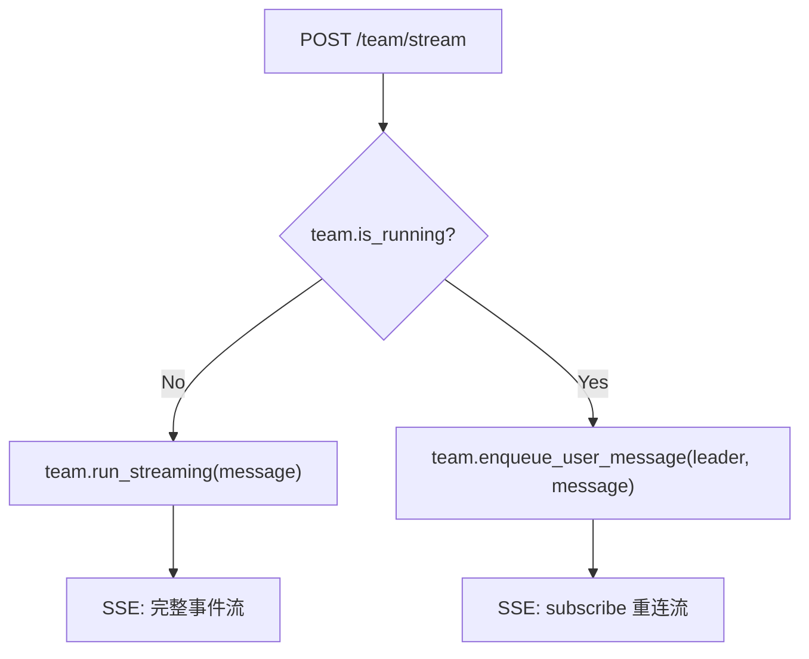
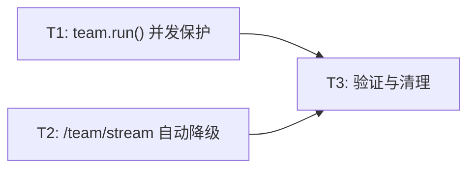

# RFC-0014: Team Stream 重复调用锁死修复

- **状态**: implemented
- **优先级**: P0
- **标签**: `bugfix`, `concurrency`, `team`
- **影响服务**: `team_routes.py`, `agent_team.py`
- **创建日期**: 2026-03-26
- **更新日期**: 2026-03-26

## 摘要

修复 AgentTeam 在 team_mode 运行期间，前端再次 `POST /team/stream` 导致 leader agent lock 冲突并永久锁死的 bug。

## 动机

### 问题现象

用户在 DevBox 前端操作 AgentTeam 时，任务接近完成（89%）后，系统报错：

```
Error: Agent leader in session devbox-session-...:leader is already locked (holder: 1c1c4a787)
```

此后 team 完全无响应，用户发送任何消息都无法唤醒 agent。

### 根因分析

前端在 team 运行期间发送后续消息（如"继续"）时，调用的是 `POST /team/stream`（启动新 run）而非 `POST /team/user-message`（enqueue 消息）。

完整调用链：

```
POST /team/stream (message="继续")
 → registry.get_or_create()     # 返回已有的 AgentTeam 实例
 → team.run_streaming()
   → team.run()                  # 第二次调用！
     → 创建新 leader Agent
     → leader.run_async()
       → agent_lock.acquire("...:leader", "leader")
         → ❌ TimeoutError（锁被第一个 leader 持有，heartbeat 持续续期）
```

问题本质：
1. `/team/stream` 端点不区分"首次启动"和"运行期间发消息"
2. `team.run()` 无并发调用保护
3. Leader 的 agent lock 有 heartbeat 续期机制，在 team_mode 永久循环下锁永远不会过期

### 复现测试

已在 `tests/unit/archs/main_sub/team/test_team_lock_conflict.py` 中提供三层复现测试，全部通过。

## 设计

### 概述

分两层修复：

1. **HTTP 路由层**（`team_routes.py`）：`/team/stream` 端点检测 `team.is_running`，若已在运行则自动降级为 `enqueue_user_message` + 返回 subscribe SSE 流
2. **AgentTeam 层**（`agent_team.py`）：`run()` 方法添加 `_is_running` 并发保护，防止重复调用

### 关键设计决策

1. **自动降级而非报错**: `/team/stream` 在 team 运行中收到请求时，自动调用 `enqueue_user_message(leader, message)` 并返回 `/team/subscribe` 风格的 SSE 流。前端无需修改即可正常工作。
   - 理由：前端已部署且修改周期长，后端兼容处理可立即解决问题
   - 理由：用户体验一致，不会看到额外错误

2. **`team.run()` 添加防御性检查**: 当 `_is_running == True` 时抛出 `RuntimeError`，防止任何调用路径导致的并发 run。
   - 理由：defense in depth，即使路由层漏掉了，team 层也能阻止

### 接口契约

#### `/team/stream` 端点行为变更

| 场景 | 当前行为 | 修复后行为 |
|------|----------|------------|
| team 未运行 | 启动新 run，返回 SSE 流 | 不变 |
| team 正在运行 | 尝试再次 run → TimeoutError | enqueue 消息到 leader + 返回 subscribe SSE 流 |

修复后，`/team/stream` 等效于一个"智能路由"：
- 首次调用 → `team.run_streaming(message)`
- 后续调用 → `team.enqueue_user_message("leader", message)` + `team_subscribe()` 风格的 SSE 重连流

#### `AgentTeam.run()` 新行为

```
run() 被调用时：
  if _is_running:
    raise RuntimeError("Team is already running")
```

### 架构图



## 权衡取舍

### 考虑过的替代方案

1. **返回 409 Conflict 错误**
   - 优点：语义清晰，强制前端使用正确 API
   - 缺点：需要前端配合修改；用户体验中断
   - 不采用原因：前端修改周期长，需要后端先兼容

2. **在 Agent.run_async() 中自动释放旧锁**
   - 优点：可以支持真正的"重新启动"
   - 缺点：破坏了锁的并发保护语义，可能导致状态不一致
   - 不采用原因：锁的设计是正确的，问题在调用方

### 缺点

- 自动降级方案让 `/team/stream` 承担了两种职责（启动 run + enqueue），语义不够纯粹
- 长期应该引导前端使用正确的 `/team/user-message` API，自动降级作为兼容兜底

## 实现计划

### 子任务分解

#### 依赖关系图



#### 子任务列表

| ID | 标题 | 依赖 | 状态 | Ref |
|----|------|------|------|-----|
| T1 | `team.run()` 并发保护 | - | implemented | `agent_team.py` |
| T2 | `/team/stream` 自动降级 | - | implemented | `team_routes.py` |
| T3 | 验证与清理 | T1, T2 | implemented | 146 tests passed |

#### 子任务定义

**T1: `team.run()` 并发保护**
- **范围**: 在 `AgentTeam.run()` 开头添加 `_is_running` 检查，抛出 `RuntimeError`
- **验收标准**:
  - `team.run()` 在已运行时调用抛出 `RuntimeError("Team is already running")`
  - 新增单元测试覆盖此场景
  - 不影响正常的首次 `run()` 调用

**T2: `/team/stream` 自动降级**
- **范围**: 修改 `team_routes.py` 的 `team_stream` 端点，检测 `team.is_running`，若为 True 则 enqueue 消息并返回 subscribe 风格 SSE 流
- **验收标准**:
  - team 运行中 `POST /team/stream` 不再报错
  - 消息成功 enqueue 到 leader agent
  - 返回有效的 SSE 流（subscribe 模式）
  - 新增单元测试覆盖此场景

**T3: 验证与清理**
- **范围**: 运行完整测试套件，确保修复不引入回归；清理复现测试中的冗余部分
- **验收标准**:
  - `pytest tests/unit/archs/main_sub/team/` 全部通过
  - `pytest tests/unit/test_agent_lock_service.py` 全部通过
  - 无新增 lint/type 警告

### 影响范围

- `nexau/archs/main_sub/team/agent_team.py` - 添加 `run()` 并发保护
- `nexau/archs/transports/http/team_routes.py` - `/team/stream` 自动降级逻辑
- `tests/unit/archs/main_sub/team/test_team_lock_conflict.py` - 扩展测试覆盖
- `tests/unit/archs/main_sub/team/test_agent_team.py` - 新增并发保护测试

## 测试方案

### 单元测试

1. `test_run_raises_when_already_running` - `team.run()` 并发保护
2. `test_team_stream_auto_redirect_when_running` - `/team/stream` 自动降级
3. 保留已有的三个复现测试作为回归基线

### 集成测试

已有的 `test_team_lock_conflict.py` 三个测试提供了 lock 机制层、AgentTeam 层、HTTP 路由层的完整覆盖。

### 手动验证

1. 启动 DevBox，运行一个 AgentTeam 任务
2. 任务运行中发送"继续"消息
3. 确认消息被正确 enqueue 到 leader
4. 确认 SSE 流正常返回事件
5. 确认不再出现 "already locked" 错误

## 未解决的问题

- 前端长期应改为使用 `/team/user-message` API，后端的自动降级作为兼容兜底。是否需要在自动降级时返回一个 HTTP header 提示前端迁移？

## 参考资料

- [RFC-0002: AgentTeam 多 Agent 协作框架](./0002-agent-team.md)
- 复现测试: `tests/unit/archs/main_sub/team/test_team_lock_conflict.py`
