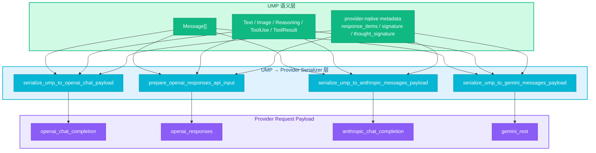

# RFC-0014: UMP 到 Provider Payload 的统一序列化分层

- **状态**: implemented
- **优先级**: P1
- **标签**: `architecture`, `api`, `dx`, `compatibility`
- **影响服务**: `nexau/core/serializers/`, `nexau/core/adapters/`, `nexau/archs/main_sub/execution/`, `tests/`
- **创建日期**: 2026-03-24
- **更新日期**: 2026-03-25

## 摘要

NexAU 已有 `Message` / block 形式的 UMP（Unified Message Protocol）作为对话历史主表示，但 **UMP → provider payload** 的转换逻辑此前分散在多个 adapter 与调用点中：OpenAI Chat 走 `legacy.py`，Anthropic 走 `anthropic_messages.py`，Gemini 走 `gemini_messages.py`，OpenAI Responses 部分逻辑嵌在 `llm_caller.py`。本 RFC 将 "UMP 到各 provider 请求 payload 的转换" 正式抽象为统一 serializer 边界层（`nexau/core/serializers/`），以 UMP 为唯一上游真源，为四类 provider 定义清晰的接口契约、降级规则、replay artifact 保留策略与测试矩阵。

实现要点：

1. 新建 `nexau/core/serializers/` 模块，包含四个 provider payload serializer；
2. 原有 adapter wrapper 退化为 thin delegate，直接委托 serializer；
3. 删除 `legacy.py` 中的出站 `messages_to_legacy_openai_chat()` helper，消除 bridge format 扩散；
4. 定义 ReasoningBlock 跨 provider 安全降级策略，核心规则：**无合法 Anthropic signature 的 reasoning 绝不发为 `thinking` block**。

## 动机

### 当前问题

#### 1. UMP 已经存在，但请求侧仍不是统一分层

当前仓库已有：

- `nexau/core/messages.py`：定义 `Message`、`TextBlock`、`ReasoningBlock`、`ToolUseBlock`、`ToolResultBlock`、`ImageBlock`
- `nexau/core/adapters/openai_chat.py` / `legacy.py`：UMP → OpenAI Chat 形状
- `nexau/core/adapters/anthropic_messages.py`：UMP → Anthropic Messages
- `nexau/core/adapters/gemini_messages.py`：UMP → Gemini REST
- `nexau/archs/main_sub/execution/llm_caller.py::_prepare_responses_api_input`：legacy/UMP → Responses input

这些路径都已能工作，但存在三个结构性问题：

1. **入口分散**：不同 provider 的请求组装不在同一抽象层；
2. **语义不对称**：Responses 的 reasoning replay、Anthropic 的 thinking 签名规则、Gemini 的 `thoughtSignature` 传播，各自由不同文件维护；
3. **测试与文档难以收敛**：需要跨多个模块才能说明 "UMP 到目标 provider 时到底会保留什么，降级什么"。

#### 2. reasoning / thinking 并不是天然无损可跨 provider

真实 API 调研和两轮矩阵测试表明：

- OpenAI Chat Completion 的 reasoning 暴露为 `reasoning_content` 文本；
- OpenAI Responses 支持 typed `reasoning` item，并可携带 `encrypted_content`；
- Anthropic `thinking` block **必须带合法 `signature`**，否则请求报错；
- Gemini `thought` 以 `parts[*].thought == true` 表达，可附带 `thoughtSignature`。

因此 serializer 的职责不是 "强行无损互转"，而是：能保真的地方尽量保真，不能保真的地方做**显式、可测试的安全降级**。

#### 3. `messages_to_legacy_openai_chat()` 造成 bridge format 扩散

旧代码中 UMP → provider 需要先经过 `messages_to_legacy_openai_chat()` 转为 OpenAI Chat dict，再由各 provider 分别从 dict 做二次转换。这条 bridge 路径导致非标准字段（`reasoning_signature`、`thought_signature`、`response_items`）被注入到中间 dict 中，下游不同 provider 各自挑选，维护成本高且容易漂移。

### 不做会怎样

- 新增 provider 时仍把转换逻辑散落到 caller / adapter / legacy shim 中；
- reasoning / tool / image 的保真规则持续出现隐式分歧；
- UMP 作为唯一上游真源停留在 "部分实现"，无法成为稳定架构；
- 文档、测试、实现之间更容易出现 "文档说 A，代码做 B，测试锁 C" 的漂移。

## 设计

### 概述

核心目标：**把 UMP → provider payload 视为一组正式的 serializer 契约，而不是若干历史兼容转换函数。**

总体分层：

1. **UMP 语义层**：`Message` + typed blocks 作为唯一上游真源；
2. **Serializer 边界层**：按目标 provider 把 UMP 转为 wire payload；
3. **Provider 请求层**：最终发送给 `openai_chat_completion` / `openai_responses` / `anthropic_chat_completion` / `gemini_rest`。



### 非目标

为避免 scope 膨胀，本 RFC **不**包含以下目标：

1. 不重写 UMP persistence schema，也不引入历史数据迁移；
2. 不承诺跨 provider 的 opaque reasoning artifact 语义等价；
3. 不在第一阶段引入新的 provider-neutral reasoning artifact 数据模型；
4. 不要求第一阶段就统一所有 multimodal tool-result 细节与跨 provider parity；
5. 不保留 `legacy projection` 作为正式架构层；任何历史 helper 仅作为待迁移/待删除对象处理。

### 关键设计决策

#### 决策 1：UMP 是唯一上游真源，provider payload 不再作为内部 canonical 形状

理由：

- 当前历史持久化和多 provider 切换已经围绕 `Message[]` 工作；
- provider payload 混入内部状态会让 "哪家 schema 是 canonical" 重新变得模糊；
- 这与 RFC-0006 的 "provider 延迟适配" 方向一致。

#### 决策 2：serializer 的目标是 "保真优先 + 安全降级"，不是承诺跨 provider 无损互转

理由：

- Anthropic `thinking.signature`、Responses `encrypted_content`、Gemini `thoughtSignature` 都是 provider-native artifact；
- 这些字段的语义和可验证性不相同，无法伪造、也不应跨 provider 误用；
- 显式声明降级规则，比隐式丢失或错误复用更安全。

#### 决策 3：每个 provider serializer 需要对 "可见文本" 和 "隐藏 reasoning 语义" 分别定义规则

理由：

- 一个 assistant turn 往往同时包含对用户可见的答案文本和对 provider 可 replay 的 reasoning / thinking；
- 若不把两者区分，容易在 replay 时只保留文本、或错误把隐藏 reasoning 发成普通 text。

#### 决策 4：测试矩阵以 "源 provider → 目标 provider" 的行为契约为主

理由：

- 用户真正关心的是 "completion → responses 会怎样"、"gemini → claude 会怎样"；
- 以 pair-wise behavior 定义测试，更能覆盖真实多轮切 provider 场景；
- 已有 `test_two_turn_payload_matrix.py` 验证这种组织方式可行。

#### 决策 5：删除 `messages_to_legacy_openai_chat()`，serializer 直接从 UMP 生成 provider payload

理由：

- 该函数将 UMP 转为 OpenAI Chat dict 后再由各 provider 二次转换，是多余的中间层；
- 它注入的桥接字段（`reasoning_signature`、`thought_signature`、`response_items`）应由各 serializer 自行从 UMP 提取；
- 保留 `messages_from_legacy_openai_chat()` 仅供入站兼容（legacy dict → UMP）。

### UMP 语义模型

本 RFC 不重写 `Message` 基础类型，但为 serializer 设计明确以下语义层约束。

#### 1. UMP 的稳定语义对象

| UMP 元素 | 语义 | 说明 |
|---|---|---|
| `TextBlock` | 用户/模型可见文本 | 始终可跨 provider 保留 |
| `ImageBlock` | 用户可见图像输入 | 仅在目标 provider 支持时原生表达，否则需已有兼容策略 |
| `ToolUseBlock` | 模型发起的工具调用 | 转换为目标 provider 的 function/tool call 形状 |
| `ToolResultBlock` | 工具返回结果 | 转换为目标 provider 的 tool result / function response 形状 |
| `ReasoningBlock.text` | 隐藏 reasoning 的可读文本 | 跨 provider reasoning replay 的最小公共语义 |
| `ReasoningBlock.signature` | Anthropic thinking 签名 | 仅对 Anthropic serializer 有原生意义 |
| `ReasoningBlock.redacted_data` | opaque reasoning artifact | 用于 Anthropic `redacted_thinking` 或 Responses `encrypted_content` 的兼容来源 |
| `message.metadata["response_items"]` | Responses output items | 仅 Responses serializer 能完整复用 |
| `message.metadata["reasoning"]` | Responses reasoning items | 仅 Responses serializer 能完整复用 |
| `message.metadata["thought_signature"]` | Gemini `thoughtSignature` | 仅 Gemini serializer 有原生意义 |

#### 2. UMP 不新增 provider-neutral "通用签名" 抽象

本 RFC 明确**不**引入例如 `reasoning_artifact.kind = anthropic|responses|gemini` 之类的新统一数据结构。现有字段已足够表达首批四类 provider 的 replay 需求；第一阶段重点是统一 serializer 分层与规则，不是发明新 persistence schema。

### Provider serializer 契约

#### 1. OpenAI Chat Serializer

**模块**: `nexau/core/serializers/openai_chat.py`

**接口签名**:

```python
def serialize_ump_to_openai_chat_payload(
    messages: list[Message],
    *,
    tool_image_policy: ToolImagePolicy = "inject_user_message",
) -> list[dict[str, Any]]
```

**入参**:
- `messages`: UMP `Message[]`
- `tool_image_policy`: 工具结果中图片的处理策略
  - `"inject_user_message"`: tool-role 消息只含文本，图片拆为额外 user 消息（Chat Completions 兼容）
  - `"embed_in_tool_message"`: 图片保留在 tool 消息的 content parts 中（供 Responses 下游使用）

**Block 转换规则**:

| UMP Block | → OpenAI Chat 表达 |
|---|---|
| `TextBlock` | 纯文本 → `content` 字符串；有图片时 → `{"type": "text", "text": ...}` content part |
| `ImageBlock` | `{"type": "image_url", "image_url": {"url": ...}}` content part |
| `ReasoningBlock` | `block.text` → `reasoning_content` 字段；`block.signature` → `reasoning_signature` 字段；`block.redacted_data` → `reasoning_redacted_data` 字段 |
| `ToolUseBlock` | `{"id": ..., "type": "function", "function": {"name": ..., "arguments": ...}}` |
| `ToolResultBlock` | `role=tool` 消息；图片按 `tool_image_policy` 处理 |

**保真规则**:
- reasoning 全量保留为 assistant 消息附加字段（`reasoning_content`、`reasoning_signature`、`reasoning_redacted_data`），不丢弃任何维度
- `response_items` / `reasoning` / `thought_signature` 从 metadata 透传到 dict，供 Responses 下游 round-trip 使用

**降级规则**:
- 不把 typed Responses reasoning item 变成 Chat 原生 typed object
- 若目标 chat-compatible provider 不接受额外 reasoning 字段，仅保留可见 assistant 文本与标准 tool/image 结构

#### 2. OpenAI Responses Serializer

**模块**: `nexau/core/serializers/openai_responses.py`

**核心接口签名**:

```python
def prepare_openai_responses_api_input(
    messages: list[dict[str, Any]],
) -> tuple[list[dict[str, Any]], str | None]

def normalize_openai_responses_api_tools(
    tools: list[Any],
) -> list[dict[str, Any]]
```

**注**: Responses serializer 的入参为 OpenAI Chat dict（由 `serialize_ump_to_openai_chat_payload` 生成），而非直接 UMP Message。这是因为 Responses API 的 input 格式本身基于 Chat Completions 的消息 shape 做扩展，两步串联更清晰。

**转换规则**:

| 来源 | → Responses 表达 |
|---|---|
| `response_items` 存在 | 直接 sanitize 后复用（`sanitize_openai_responses_items_for_input`） |
| `reasoning` items 存在 | 直接 sanitize 后复用 |
| `reasoning_content` + `reasoning_redacted_data` | 重建 `reasoning` item（`reconstruct_openai_responses_reasoning_items_from_message`） |
| `role=system` 消息 | 收敛到 `instructions` 字符串 |
| `role=tool` 消息 | → `function_call_output` item |
| `role=user/assistant` | → `message` item，含 `input_text` / `output_text` content parts |
| `tool_calls` | → `function_call` items |
| `image_url` parts | → `input_image` parts |

**辅助函数**:

| 函数 | 职责 |
|---|---|
| `sanitize_openai_responses_items_for_input()` | 去除 `status`、处理 `function_call_output` 多模态降级、确保 `reasoning` summary |
| `ensure_openai_responses_reasoning_summary()` | 保证 reasoning item 包含 Responses 兼容的 summary list |
| `coerce_openai_responses_tool_output_text()` | 将任意 tool output 降级为 Responses 兼容字符串 |
| `collapse_openai_responses_message_content_to_text()` | 将结构化 content 折叠为 plain text |
| `parse_openai_responses_image_part()` | 将 legacy `image_url` 转为 Responses `input_image` |
| `normalize_openai_responses_api_tools()` | 将 Chat Completions 格式的 tool 定义转为 Responses 格式 |

**保真规则**:
- `response_items` 存在时优先原样复用（去除 response-only 字段后）
- `encrypted_content` 在 sanitize 时保留

**降级规则**:
- Anthropic `signature` 不转成 Responses provider-native replay token
- Gemini `thoughtSignature` 不直接映射成 Responses opaque artifact
- 非 Responses 来源只能得到 **plaintext replay**，不能伪造 provider-native encrypted replay
- 多模态 tool output 降级：`output_text` → `input_text`，`image_url` → `input_image`

#### 3. Anthropic Serializer

**模块**: `nexau/core/serializers/anthropic_messages.py`

**接口签名**:

```python
def serialize_ump_to_anthropic_messages_payload(
    messages: list[Message],
) -> tuple[list[dict[str, Any]], list[dict[str, Any]]]
```

**返回值**: `(system_blocks, conversation_messages)`

**Block 转换规则**:

| UMP Block | → Anthropic 表达 |
|---|---|
| `TextBlock` | `{"type": "text", "text": ...}` |
| `ImageBlock` (base64) | `{"type": "image", "source": {"type": "base64", ...}}` |
| `ImageBlock` (url) | `{"type": "image", "source": {"type": "url", "url": ...}}` |
| `ToolUseBlock` | `{"type": "tool_use", "id": ..., "name": ..., "input": ...}` |
| `ToolResultBlock` (str) | `{"type": "tool_result", "tool_use_id": ..., "content": ..., "is_error": ...}` |
| `ToolResultBlock` (list) | `{"type": "tool_result", ...}` + sibling image blocks（图片提到 tool_result 外） |

**ReasoningBlock 降级决策树**（本 RFC 核心规则）:

```
ReasoningBlock
├─ redacted_data 存在？
│  └─ YES → {"type": "redacted_thinking", "data": block.redacted_data}
│           （不看 text 和 signature，redacted_data 优先）
├─ signature 存在？
│  └─ YES → {"type": "thinking", "thinking": block.text, "signature": block.signature}
│           （合法签名的 thinking block，原样保留）
├─ text 非空？
│  └─ YES → {"type": "text", "text": block.text}
│           （⚠️ 安全降级：无签名的 reasoning 降级为普通可见文本）
└─ 否则：跳过，不输出任何 block
```

**硬性安全规则**:
- **无合法 Anthropic `signature` 的 reasoning 绝不能发为 `type="thinking"`**
- 这确保跨 provider 来源（Gemini thought、OpenAI reasoning_content）的 reasoning 在发往 Anthropic 时不会因缺少签名导致 API 400 错误

**角色映射**:
- `Role.SYSTEM` → 收敛到 `system_blocks`（不进 `messages`）
- `Role.TOOL` → 合并到前一个 user 消息的 content blocks 中（多个 tool_result 合并为一条 user 消息）
- `Role.FRAMEWORK` → 映射为 `user`
- `msg.metadata["cache"]` → 透传为 `sys_block["_cache"]`（供上层 cache_control 使用）

**辅助函数**:

```python
def apply_anthropic_last_user_cache_control(
    convo: list[dict[str, Any]],
    *,
    system_cache_control_ttl: str | None = None,
) -> list[dict[str, Any]]
```

用于在最后一个 user 消息的首个 text block 上附加 `cache_control`，兼容旧的 `system_cache_control_ttl` 语义。

#### 4. Gemini Serializer

**模块**: `nexau/core/serializers/gemini_messages.py`

**接口签名**:

```python
def serialize_ump_to_gemini_messages_payload(
    messages: list[Message],
) -> tuple[list[dict[str, Any]], dict[str, Any] | None]
```

**返回值**: `(gemini_contents, system_instruction)`

**Block 转换规则**:

| UMP Block | → Gemini 表达 |
|---|---|
| `TextBlock` | `{"text": ...}` |
| `ReasoningBlock` | `{"text": ..., "thought": True}` |
| `ToolUseBlock` | `{"functionCall": {"name": ..., "args": ...}}` |
| `ToolResultBlock` | `{"functionResponse": {"name": ..., "response": {"result": ...}}}` |

**`thoughtSignature` 附加策略**:

Gemini 的 `thoughtSignature` 来自 `message.metadata["thought_signature"]`（不是 `ReasoningBlock.signature`），需附加到某个 model part 上：

```
附加优先级：
1. 有 tool_use 时 → 不附加到 reasoning part（因为 tool 调用的 part 需要 signature）
   └─ 附加到第一个 functionCall part
2. 无 tool_use 时 → 附加到第一个 reasoning part
3. 以上都没命中 → 附加到 assistant_parts[0]（fallback）
```

**角色映射**:
- `Role.SYSTEM` → 收敛到 `systemInstruction.parts`
- `Role.USER` / `Role.FRAMEWORK` → `role: "user"`
- `Role.ASSISTANT` → `role: "model"`
- `Role.TOOL` → functionResponse 合并到 `role: "user"` parts

**Tool result name 解析优先级**:
1. `last_tool_call_id_to_name[block.tool_use_id]` — 精确 ID 匹配
2. `last_model_function_names[tool_result_index]` — 位置索引匹配
3. `message.metadata["tool_name"]` — metadata fallback
4. 以上都没命中 → 抛出 `ValueError`

### Replay artifact 保留策略

| Artifact | 来源 | 可原样保留到哪些目标 | 其他目标的处理 |
|---|---|---|---|
| `response_items` / `encrypted_content` | OpenAI Responses | `openai_responses` | 降级为 plaintext reasoning / summary，或仅保留可见文本 |
| `ReasoningBlock.signature` | Anthropic thinking | `anthropic_chat_completion` | 不跨 provider 复用；对其他目标仅保留 reasoning 文本 |
| `metadata["thought_signature"]` | Gemini thought | `gemini_rest` | 不跨 provider 复用；对其他目标仅保留 reasoning 文本 |
| `reasoning_content` | OpenAI Chat / 通用 plaintext reasoning | 所有目标（形式因目标而异） | 作为最小公共 reasoning 语义 |

### 四源四目标行为总表

| Source \ Target | `openai_chat` | `openai_responses` | `anthropic` | `gemini` |
|---|---|---|---|---|
| `openai_chat` | 保留 `reasoning_content` | 重建 plaintext `reasoning` item | **强制降级为 `text`** | 转为 `thought` part |
| `openai_responses` | 保留可见文本 | 原生保留 `reasoning` / `encrypted_content` | **强制降级为 `text`**（有合法 opaque artifact 时可 `redacted_thinking`） | 转为 `thought` part |
| `anthropic` | 保留 `reasoning_content` | 重建 plaintext `reasoning` item | 原生保留 signed `thinking` | 转为 `thought` part |
| `gemini` | 保留 `reasoning_content` | 重建 plaintext `reasoning` item | **强制降级为 `text`** | 原生保留 `thought` / `thoughtSignature` |

对角线为 **native artifact preservation**；→ Anthropic 列为 **forced downgrade**（除 Anthropic 自身外）；→ Responses 列为 **plaintext reasoning replay**；→ Gemini 列为 **thought part replay**。

### Adapter wrapper 委托关系

实现后各 adapter 退化为单行委托：

```python
# AnthropicMessagesAdapter.to_vendor_format()
def to_vendor_format(self, messages: list[Message]) -> tuple[...]:
    return serialize_ump_to_anthropic_messages_payload(messages)

# GeminiMessagesAdapter.to_vendor_format()
def to_vendor_format(self, messages: list[Message]) -> tuple[...]:
    return serialize_ump_to_gemini_messages_payload(messages)
```

`LLMCaller._call_with_retry()` 中 OpenAI Chat / Responses 路径直接调用 serializer，不再经过 adapter wrapper。

### 已删除的 legacy 路径

| 删除项 | 原位置 | 替代方案 |
|---|---|---|
| `messages_to_legacy_openai_chat()` | `nexau/core/adapters/legacy.py` | `serialize_ump_to_openai_chat_payload()` |
| `anthropic_payload_from_legacy_openai_chat()` | `nexau/core/adapters/anthropic_messages.py` | `serialize_ump_to_anthropic_messages_payload()` |
| `gemini_payload_from_legacy_openai_chat()` | `nexau/core/adapters/gemini_messages.py` | `serialize_ump_to_gemini_messages_payload()` |
| `openai_to_anthropic_message()` | `nexau/archs/main_sub/execution/llm_caller.py` | `AnthropicMessagesAdapter` + serializer |

保留 `messages_from_legacy_openai_chat()` 仅供入站兼容（legacy dict → UMP）。

### 与 RFC-0006 的关系

- RFC-0006 解决 **structured tool calling 的 provider 延迟适配**；
- RFC-0014 解决 **UMP history 到 provider payload 的统一 serializer 设计**；
- 共同原则：中性内部表示为真源，provider wire format 延迟到边界生成。

本 RFC 不取代 RFC-0006，而是补齐 reasoning / image / tool result / replay artifact 在消息序列化层面的正式契约。

## 权衡取舍

### 考虑过的替代方案

| 方案 | 优点 | 缺点 | 决定 |
|------|------|------|------|
| 维持现状 | 改动最小 | 规则分散、难以统一测试与文档 | 否 |
| 引入 provider-neutral reasoning artifact 模型，一次性重构 | 理论上更统一 | 范围过大，涉及 persistence / migration | 否 |
| 仅对 Responses 做补丁 | 快速补掉最明显缺口 | 无法支撑完整架构 | 否 |
| 定义统一 serializer 层，迁移后删除 legacy helper | 目标架构清晰，边界单一 | 迁移阶段同时修改多个调用点 | **采用** |
| Responses serializer 直接接收 UMP Message | 避免两步串联 | Responses input 格式本身基于 Chat dict 扩展，强行直接从 UMP 转会重复 Chat serializer 逻辑 | 否 |

### 缺点

1. 迁移阶段需同时修改多个调用点，短期改动面较大；
2. provider 能力差异导致矩阵结果不完全对称；
3. 未引入新的 provider-neutral replay artifact 模型，未来支持更多 provider 可能需进一步抽象；
4. OpenAI Chat serializer 仍透传 `reasoning_signature` / `thought_signature` 等桥接字段供 Responses 下游使用——这是实用主义的妥协，但不应继续扩散到其他 serializer。

## 实现计划

### 实现状态

所有阶段均已完成。

### 模块布局

```
nexau/core/serializers/
├── __init__.py                    # "Provider payload serializers from UMP messages."
├── openai_chat.py                 # serialize_ump_to_openai_chat_payload()
├── openai_responses.py            # prepare_openai_responses_api_input() + helpers
├── anthropic_messages.py          # serialize_ump_to_anthropic_messages_payload() + cache helper
└── gemini_messages.py             # serialize_ump_to_gemini_messages_payload()
```

### 子任务完成状态

| ID | 标题 | 依赖 | 状态 | Ref |
|----|------|------|------|-----|
| T1 | 定义 UMP serializer 接口与目录布局 | - | implemented | `nexau/core/serializers/__init__.py` |
| T2 | 迁移 OpenAI Chat / Responses 到 payload serializer | T1 | implemented | `openai_chat.py`, `openai_responses.py` |
| T3 | 迁移 Anthropic / Gemini 到 payload serializer | T1 | implemented | `anthropic_messages.py`, `gemini_messages.py` |
| T4 | 统一 source → target 测试矩阵与调用点验证 | T2, T3 | implemented | `test_two_turn_payload_matrix.py` |
| T5 | 删除 legacy helper 并更新调用点 | T4 | implemented | `legacy.py`, `llm_caller.py` |

### 影响范围

| 文件 | 变更内容 |
|------|----------|
| `nexau/core/serializers/*.py` | 新增四个 provider payload serializer |
| `nexau/core/adapters/anthropic_messages.py` | 退化为 thin delegate |
| `nexau/core/adapters/gemini_messages.py` | 退化为 thin delegate |
| `nexau/core/adapters/legacy.py` | 删除 `messages_to_legacy_openai_chat()` |
| `nexau/archs/main_sub/execution/llm_caller.py` | 改用 serializer 构造 payload |
| `tests/unit/test_anthropic_gemini_serializers.py` | serializer 单元测试 |
| `tests/unit/test_openai_chat_serializer.py` | OpenAI Chat serializer 单元测试 |
| `tests/unit/test_openai_responses_serializer.py` | Responses serializer 单元测试 |
| `tests/unit/test_two_turn_payload_matrix.py` | 16 对 source → target 契约矩阵 |

## 测试方案

### 已完成的测试

#### A. Serializer 单元测试

每个 serializer 有独立单元测试文件：

- `test_openai_chat_serializer.py` — 验证 reasoning/tool/image 的 Chat dict 表达
- `test_openai_responses_serializer.py` — 验证 response_items 复用、reasoning 重建、tool output 降级
- `test_anthropic_gemini_serializers.py` — 验证 Anthropic 降级决策树与 Gemini thoughtSignature 附加

**关键回归测试**:

```python
def test_anthropic_serializer_downgrades_unsigned_reasoning_and_keeps_signed_thinking():
    """无 signature 的 ReasoningBlock 必须降级为 text，有 signature 的保留 thinking。"""

def test_gemini_serializer_emits_thought_signature_and_function_response():
    """Gemini thoughtSignature 正确附加到 model parts。"""
```

#### B. 16 对 source → target 矩阵测试

`test_two_turn_payload_matrix.py` 覆盖：

- 4 个 source × 4 个 target 的全组合
- 对每对的保真/降级策略做显式断言
- 验证 reasoning text 可见性、signature 保留/丢弃、tool call round-trip

#### C. 调用点回归测试

- `test_llm_caller.py` — 验证 `LLMCaller` 对不同 `api_type` 构造正确 payload
- `test_anthropic_stream_else_branch.py` — 验证 Anthropic 流式与非流式路径
- `test_gemini_rest.py` — 验证 Gemini REST 调用路径
- `test_legacy_tool_image_policy.py` — 验证 tool image 策略

### 集成测试

- `test_two_turn_payload_live.py` — 真实 provider 两轮 payload 捕获
- `test_thinking_cross_validation_langfuse.py` — 跨 provider thinking 验证

### 手动验证 checklist

1. 使用同一两轮算术任务，在四种 `api_type` 间切换第二轮目标
2. 抓取最终请求 payload，确认 reasoning / thinking / thought 的目标表达符合 RFC
3. 重点检查：
   - Anthropic 目标下，无签名 reasoning 没有被发成 `thinking`
   - Responses 目标下，非 Responses 来源的 reasoning 已重建为 plaintext `reasoning` item
   - Gemini 目标下，Gemini 来源能保留 `thoughtSignature`
   - OpenAI Chat 目标下，出站 payload 由 serializer 直接构造

## 示例

### 示例 1：Claude thinking → Anthropic（原生保留）

UMP message 含有 `ReasoningBlock(text="claude thinking", signature="claude_sig")` + `TextBlock(text="Final A: 34")`

Anthropic serializer 输出：

```json
{
  "role": "assistant",
  "content": [
    {"type": "thinking", "thinking": "claude thinking", "signature": "claude_sig"},
    {"type": "text", "text": "Final A: 34"}
  ]
}
```

### 示例 2：Gemini thought → Anthropic（强制降级）

UMP message 含有 `ReasoningBlock(text="gemini thought")` + `metadata["thought_signature"] = "gemini_sig"`

Anthropic serializer **不得发出 `thinking`**，输出：

```json
{
  "role": "assistant",
  "content": [
    {"type": "text", "text": "gemini thought"},
    {"type": "text", "text": "Final A: 34"}
  ]
}
```

### 示例 3：OpenAI reasoning → Responses（plaintext replay）

UMP message 含有 `ReasoningBlock(text="completion reasoning")` + `TextBlock(text="Final A: 34")`

经 OpenAI Chat serializer 后再经 Responses serializer，输出：

```json
[
  {
    "type": "message",
    "role": "assistant",
    "content": [{"type": "output_text", "text": "Final A: 34"}]
  },
  {
    "type": "reasoning",
    "summary": [{"type": "summary_text", "text": "completion reasoning"}]
  }
]
```

### 示例 4：Claude redacted thinking → Anthropic（opaque 保留）

UMP message 含有 `ReasoningBlock(text="", redacted_data="encrypted_blob")`

Anthropic serializer 输出：

```json
{
  "role": "assistant",
  "content": [
    {"type": "redacted_thinking", "data": "encrypted_blob"}
  ]
}
```

### 示例 5：Anthropic thinking → Gemini（plaintext replay）

UMP message 含有 `ReasoningBlock(text="claude thinking", signature="claude_sig")`

Gemini serializer 输出（Anthropic signature 被丢弃，仅保留文本）：

```json
{
  "role": "model",
  "parts": [
    {"text": "claude thinking", "thought": true}
  ]
}
```

### 示例 6：Tool result with images → OpenAI Chat（inject_user_message 策略）

UMP message 含有 `ToolResultBlock(tool_use_id="tc_1", content=[TextBlock(text="result"), ImageBlock(url="https://img.png")])`

OpenAI Chat serializer（`tool_image_policy="inject_user_message"`）输出：

```json
[
  {"role": "tool", "tool_call_id": "tc_1", "content": "result<image>"},
  {
    "role": "user",
    "content": [
      {"type": "text", "text": "Images returned by tool call tc_1:"},
      {"type": "image_url", "image_url": {"url": "https://img.png"}}
    ]
  }
]
```

## 未解决的问题

1. ~~是否需要引入 `nexau/core/serializers/` 新目录？~~ **已决定**：采用新目录。
2. `ReasoningBlock.redacted_data` 是否应继续作为宽泛的 opaque reasoning artifact 槽位，还是未来需要更正式的通用 opaque artifact model？
3. OpenAI Chat serializer 仍透传桥接字段（`reasoning_signature`、`thought_signature`、`response_items`）——长期应考虑让 Responses serializer 直接从 UMP 读取这些 metadata，彻底消除桥接字段。
4. tool result 中的图片跨 provider 表达待后续单独扩展。

## 参考资料

- `rfcs/0006-neutral-structured-tool-calling.md` — 中性 structured tool calling 与 provider 延迟适配
- `docs/advanced-guides/api-type-thinking-survey.md` — 四类 API 的真实 thinking/reasoning 调研与矩阵总结
- `nexau/core/messages.py` — UMP 数据模型
- `nexau/core/serializers/` — 统一 serializer 实现
- `nexau/core/adapters/legacy.py` — 入站兼容 helper（`messages_from_legacy_openai_chat`）
- `tests/unit/test_two_turn_payload_matrix.py` — 16 对 source → target 契约矩阵
