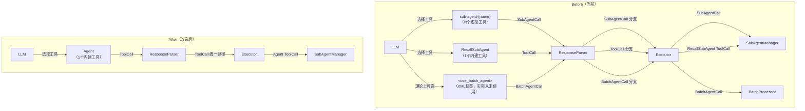
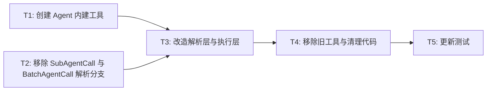

# RFC-0015: 合并 Sub-agent 工具为统一 Agent 工具

## 摘要

将当前 Sub-agent 系统中分裂的两个工具——`sub-agent-{name}`（动态虚拟工具，用于创建子代理）和 `RecallSubAgent`（内建工具，用于恢复子代理）——合并为一个统一的 `Agent` 内建工具，对齐 Claude Code 的命名。新工具通过参数区分「创建新子代理」和「恢复已有子代理」两种语义，保持最小化参数变更。同时移除无人使用的 Batch Sub-agent 功能（`BatchAgentCall`、`BatchProcessor` 等），消除死代码和解析分支。

## 动机

当前 Sub-agent 工具体系存在以下问题：

1. **工具分裂**：LLM 需要理解两个完全不同的工具来操作子代理——`sub-agent-{name}`（每个子代理一个虚拟工具）和 `RecallSubAgent`（单独的恢复工具）。这增加了 LLM 的认知负担，导致工具选择错误率升高。

2. **虚拟工具膨胀**：每配置一个子代理就生成一个 `sub-agent-{name}` 虚拟工具定义，当子代理数量较多时，工具列表膨胀，消耗大量 token，且与普通工具混杂，增加 LLM 选错工具的概率。

3. **语义割裂**：「创建」和「恢复」是同一实体的两个生命周期阶段，却被拆到两个独立工具中，LLM 需要额外记住「恢复时必须切换到另一个工具」，违反最小惊讶原则。

4. **命名不一致**：`sub-agent-{name}` 的前缀格式 `sub-agent-` 是内部实现细节，暴露给 LLM 不直观；`RecallSubAgent` 又用不同的命名风格。

5. **重复代码**：`_build_sub_agent_tool_definition` 在 `Agent` 和 `Executor` 中各有一份完全相同的实现；`SubAgentCall` 作为独立解析类型需要单独的解析/执行分支，增加维护成本。

6. **Batch Sub-agent 死代码**：`BatchAgentCall` / `BatchProcessor` 功能从未被实际使用，LLM 也不会生成 `<use_batch_agent>` XML 标签。它占据了 `ExecutableCall` 联合类型、`ParsedResponse`、`response_parser`、`executor`、`llm_caller`（stop sequences）、`xml_utils`（tag pairs）等多个模块的代码路径和测试用例，增加了系统复杂度和维护负担，应当一并移除。

Claude Code 的参考实现证明：单一 `Agent` 工具 + 参数驱动的模式可以清晰覆盖创建和恢复两种语义，显著降低 LLM 的工具选择复杂度。

## 设计

### 概述

用一个内建工具 `Agent` 替代现有的 `sub-agent-{name}` 虚拟工具 + `RecallSubAgent` 工具，对齐 Claude Code 的工具命名。子代理的名称从工具名变为参数 `sub_agent_name`，恢复通过可选参数 `sub_agent_id` 驱动。Sub-agent 调用不再走独立的 `SubAgentCall` 解析路径，而是统一为普通 `ToolCall`，由工具执行层路由到 `SubAgentManager`。同时彻底移除 `BatchAgentCall` / `BatchProcessor` 相关的全部代码，简化 `ExecutableCall` 联合类型和 `ParsedResponse` 数据结构。

### 关键设计决策

1. **工具名对齐 Claude Code 为 `Agent`**：新工具命名为 `Agent`，与 Claude Code 的 `Agent` 工具保持一致。理由：统一命名降低跨框架理解的认知成本，便于参考 Claude Code 的最佳实践和 prompt 工程经验。

2. **单工具参数驱动**：`Agent` 工具通过 `sub_agent_name`（必填）+ `sub_agent_id`（可选）区分创建和恢复。当 `sub_agent_id` 为空时创建新子代理，非空时恢复已有子代理。理由：Claude Code 的 `Agent` 工具验证了这一模式的可行性，且最小化参数变更符合用户要求。

3. **Sub-agent 调用统一为 ToolCall**：移除 `SubAgentCall` 数据类和 `CallType.SUB_AGENT` 枚举，sub-agent 调用统一走 `ToolCall` 解析路径。理由：减少解析分支和重复代码，`Agent` 就是一个普通工具，只是执行时路由到 `SubAgentManager`。

4. **工具执行层路由**：在工具执行层（而非解析层）识别 `Agent` 工具调用，将执行委托给 `SubAgentManager`。理由：保持解析层职责单一，执行层根据工具名路由是最自然的方式。

5. **直接替换，无过渡期**：移除 `sub-agent-{name}` 虚拟工具和 `RecallSubAgent`，不保留兼容别名。理由：这是框架内部变更，不涉及外部 API，直接替换更干净。

6. **保留 SubAgentManager 核心不变**：`SubAgentManager.call_sub_agent()` 和 `call_sub_agent_async()` 的签名和实现保持不变，仍然是子代理生命周期管理的核心引擎。理由：它的 `sub_agent_id` 参数已经支持创建/恢复两种模式，无需修改。

7. **移除 Batch Sub-agent 全部代码**：删除 `BatchAgentCall`、`CallType.BATCH_AGENT`、`BatchProcessor` 及所有引用。理由：该功能从未被使用，LLM 不会主动生成 `<use_batch_agent>` XML 标签，属于纯粹的死代码。移除后 `ExecutableCall` 联合类型简化为仅 `ToolCall`，`ParsedResponse` 移除 `batch_agent_calls` 和 `sub_agent_calls` 字段，系统复杂度显著降低。

### 接口契约

#### Agent 工具定义

```yaml
type: tool
name: Agent
description: >-
  Use `Agent` for delegating work to sub-agents.

  - To create a new sub-agent: provide `sub_agent_name` and `message`.
  - To resume a previously finished sub-agent: provide `sub_agent_name`,
    `sub_agent_id`, and `message`.

  Available sub-agent names are listed in the tool description for your context.
  `sub_agent_name` must match one of the parent agent's configured sub_agents.
input_schema:
  type: object
  properties:
    sub_agent_name:
      type: string
      description: >-
        Name of the sub-agent to call. Must match one of the parent agent's
        configured sub_agents.
    message:
      type: string
      description: Task or question for the sub-agent.
    sub_agent_id:
      type: string
      description: >-
        Optional. Identifier of a previously finished sub-agent run to resume.
        When provided, the sub-agent will restore its prior history and continue
        from where it left off.
  required:
    - sub_agent_name
    - message
  additionalProperties: false
```

#### Agent 工具 Python 实现

```python
def call_sub_agent(
    sub_agent_name: str,
    message: str,
    sub_agent_id: str | None = None,
    agent_state: AgentState | None = None,
) -> dict[str, Any]:
    """Delegate work to a sub-agent.

    When sub_agent_id is provided, resumes a previously finished sub-agent.
    Otherwise, creates a new sub-agent instance.
    """
    # 路由到 SubAgentManager.call_sub_agent()
    # 返回统一格式的结果
```

#### Agent 工具动态描述

由于不同 Agent 配置的子代理不同，`Agent` 工具的 description 需要在运行时动态注入可用子代理列表，类似当前 `_build_sub_agent_tool_definition` 中读取 `sub_agent_config.description` 的方式。具体策略：

- 工具 YAML 中定义基础描述模板
- 在 `AgentConfig._finalize()` 注册 `Agent` 工具时，将可用子代理名称和描述拼接进 `description` 字段
- 或：在工具执行层通过 `agent_state` 获取子代理配置，无需动态修改描述（推荐，保持工具定义不可变）

#### 返回格式

创建和恢复两种场景的返回格式统一：

```python
{
    "status": "success",
    "sub_agent_name": "researcher",
    "sub_agent_id": "abc123",       # 新创建或恢复的子代理 ID
    "message": "任务描述",
    "result": "子代理的执行结果..."
}
```

### 架构图



核心变化：
- 工具数量从 `N+1` 降为 `1`
- 解析路径从三条合并为一条
- 执行路由从解析层移到工具执行层
- Batch Sub-agent 死代码完全移除
- 工具命名对齐 Claude Code 的 `Agent`

## 权衡取舍

### 考虑过的替代方案

1. **在 `sub-agent-{name}` 上增加 `sub_agent_id` 参数**：保留 N 个虚拟工具，仅合并 RecallSubAgent 的功能。被否决，因为：
   - 虚拟工具膨胀问题未解决
   - 工具命名不直观的问题未解决
   - 仍需维护 `SubAgentCall` 解析分支

2. **完全对齐 Claude Code 的 Agent + SendMessage 模式**：一个 Agent 工具负责创建，一个 SendMessage 工具负责恢复通信。被否决，因为：
   - 增加了工具数量（两个 vs 一个）
   - SendMessage 暗示双向持续通信，但我们的子代理是单次调用-返回模式
   - 最小化变更原则

3. **工具命名为 `Agent` 而非 `SubAgent`**：直接对齐 Claude Code 的 `Agent` 工具命名。选择该方案是为了降低跨框架理解成本，并让提示词与参考实现保持一致。
   - 对齐 Claude Code 命名是用户明确要求
   - `Agent` 作为工具名（LLM 可调用的工具）与 `Agent` 作为 Python 类名（框架内部实现）处于不同命名空间，不会混淆
   - Claude Code 的实践已证明 `Agent` 作为工具名的清晰性

4. **保持现状，仅优化描述**：不改工具结构，仅优化工具描述让 LLM 更好地区分。被否决，因为：
   - 治标不治本，核心问题是架构分裂
   - token 浪费问题无法解决

### 缺点

1. **子代理名称从隐式变为显式参数**：LLM 需要在参数中指定 `sub_agent_name`，而非通过选择不同的工具隐式指定。但 Claude Code 的实践证明 LLM 能很好地处理这种参数化。

2. **工具描述需要动态注入子代理列表**：由于子代理名称不再是工具名，需要在工具描述中列出可用子代理，否则 LLM 不知道有哪些子代理可用。

3. **对现有配置和 system prompt 的破坏性变更**：所有引用 `sub-agent-{name}` 或 `RecallSubAgent` 的配置文件、示例和文档都需要更新。

4. **`Agent` 工具名与 `Agent` Python 类名重名**：代码中需注意区分 `Agent` 工具（tool definition）和 `Agent` 类（Python class），避免在代码阅读和维护时产生歧义。

## 实现计划

### 阶段划分

- [ ] Phase 1: 创建 Agent 内建工具定义和实现
- [ ] Phase 2: 改造解析层和执行层，统一 Sub-agent 调用为 ToolCall 路径
- [ ] Phase 3: 移除旧工具和相关代码，更新测试和文档

### 子任务分解

#### 依赖关系图



#### 子任务列表

| ID | 标题 | 依赖 | Ref |
|----|------|------|-----|
| T1 | 创建 Agent 内建工具（YAML + Python 实现） | - | - |
| T2 | 移除 SubAgentCall 与 BatchAgentCall 解析分支 | - | - |
| T3 | 改造解析层与执行层 | T1, T2 | - |
| T4 | 移除旧工具与清理代码 | T3 | - |
| T5 | 更新测试 | T4 | - |

#### 子任务定义

**T1: 创建 Agent 内建工具（YAML + Python 实现）**
- **范围**:
  - 新建 `nexau/archs/tool/builtin/description/agent_tool.yaml`（`Agent` 工具定义，`name: Agent`）
  - 新建 `nexau/archs/tool/builtin/agent_tool.py`（`Agent` 工具实现，路由到 `SubAgentManager.call_sub_agent()`）
  - 在 `AgentConfig._finalize()` 中将 `Agent` 工具替换原来的 `RecallSubAgent` 自动注入逻辑：当 `sub_agents` 非空时注入 `Agent` 工具，并在描述中拼接可用子代理列表
- **验收标准**:
  - `Agent` 工具可通过 YAML 加载，`name` 为 `Agent`，参数包含 `sub_agent_name`、`message`、`sub_agent_id`
  - 工具实现能正确路由到 `SubAgentManager.call_sub_agent()`
  - 当 `sub_agent_id` 为空时创建新子代理，非空时恢复子代理

**T2: 移除 SubAgentCall 与 BatchAgentCall 解析分支**
- **范围**:
  - 从 `parse_structures.py` 中移除 `SubAgentCall` 数据类、`BatchAgentCall` 数据类、`CallType.SUB_AGENT` 和 `CallType.BATCH_AGENT` 枚举值
  - 从 `ExecutableCall` 联合类型中移除 `SubAgentCall` 和 `BatchAgentCall`（简化为仅 `ToolCall`）
  - 移除 `CallType` 枚举整体（仅剩 `TOOL` 一项，已无存在必要）
  - 从 `ParsedResponse` 中移除 `sub_agent_calls`、`batch_agent_calls`、`is_parallel_sub_agents` 字段
  - 更新 `response_parser.py`：移除 `SubAgentCall`/`BatchAgentCall` 的生成代码，移除 `is_sub_agent_tool_name()`/`extract_sub_agent_name()` 调用，移除 `<use_batch_agent>` 正则匹配和 `_parse_batch_agent_call` 方法
  - 删除 `nexau/archs/main_sub/execution/batch_processor.py` 整个文件
  - 从 `nexau/archs/main_sub/execution/__init__.py` 中移除 `BatchProcessor` 导出
  - 从 `nexau/archs/main_sub/utils/xml_utils.py` 中移除 `<use_batch_agent>` tag pair
  - 从 `nexau/archs/main_sub/execution/llm_caller.py` 中移除 `</use_batch_agent>` stop sequences（2处）
  - 从 `nexau/archs/main_sub/execution/hooks.py` 中移除 batch agent 日志行
- **验收标准**:
  - `parse_structures.py` 中不再存在 `SubAgentCall`、`BatchAgentCall`、`CallType`
  - `ExecutableCall` 简化为仅 `ToolCall`
  - `ParsedResponse` 中不再有 `sub_agent_calls` 和 `batch_agent_calls` 字段
  - `response_parser.py` 中不再有 sub-agent/batch-agent 特殊解析逻辑
  - `batch_processor.py` 已删除
  - 项目中不再有 `<use_batch_agent>` 相关的 XML 解析和 stop sequence

**T3: 改造解析层与执行层**
- **范围**:
  - 更新 `response_parser.py`：移除对 `sub-agent-{name}` 的特殊解析逻辑，Sub-agent 调用作为普通 ToolCall 处理
  - 更新 `executor.py`：移除 `SubAgentCall` 的执行分支（`_execute_sub_agent_call_safe`、`_run_sub_agent` 等），移除 `BatchAgentCall` 的执行分支（async/sync batch 执行块、`_execute_batch_call` 方法），移除 `BatchProcessor` 的初始化和引用，Sub-agent 调用走普通工具执行路径
  - 删除 `Agent._build_sub_agent_tool_definition()` 和 `Executor._build_sub_agent_tool_definition()` 两个重复方法
  - 更新 `_build_tool_call_payload()` / `_snapshot_structured_tool_definitions()`：不再为子代理生成虚拟工具定义
  - 更新 `tool_payloads.py`：移除 `build_sub_agent_tool_name()` 调用
  - 更新 `nexau/cli/cli_subagent_adapter.py`：移除 `batch_processor` hasattr/injection 逻辑（4行）
- **验收标准**:
  - Executor 中不再有 `SubAgentCall`/`BatchAgentCall` 相关的执行分支
  - `BatchProcessor` 不再被初始化和引用
  - LLM 收到的工具列表中只有 `Agent` 而非 `sub-agent-{name}` 系列
  - Sub-agent 调用通过工具执行层正确路由到 `SubAgentManager`

**T4: 移除旧工具与清理代码**
- **范围**:
  - 删除 `recall_sub_agent_tool.yaml` 和 `recall_sub_agent_tool.py`
  - 删除或精简 `sub_agent_naming.py`（如完全不再需要则删除）
  - 更新 `AgentConfig._finalize()`：移除 `RecallSubAgent` 注入逻辑，替换为 `Agent` 工具注入
  - 更新 `agent_state.py` 中 `subagent_manager` 属性的注释
  - 更新示例配置和 system prompt（`examples/` 下的 YAML 和 README）
  - 更新文档（`docs/advanced-guides/async.md` 等）
- **验收标准**:
  - 项目中不再有 `RecallSubAgent` 和 `sub-agent-{name}` 的引用
  - 所有示例和文档引用更新为 `Agent` 工具

**T5: 更新测试**
- **范围**:
  - 更新 `tests/unit/test_response_parser.py`：移除 `SubAgentCall`/`BatchAgentCall` 相关断言，移除 `<use_batch_agent>` XML 测试用例，更新 sub-agent 调用的测试为 `ToolCall`
  - 更新 `tests/unit/test_executor.py`：移除 `SubAgentCall`/`BatchAgentCall` 构造和断言，移除 `batch_agent_calls=[]` 和 `sub_agent_calls=[]` 的 `ParsedResponse` 构造参数，移除 `batch_processor` mock 测试
  - 更新 `tests/unit/test_agent.py`：将 `sub-agent-child` 断言改为 `Agent`
  - 删除 `tests/unit/test_builtin_tools/test_recall_sub_agent_tool.py`，新增 `test_agent_tool.py`
  - 删除 `tests/unit/test_batch_processor.py` 整个文件
  - 删除 `tests/unit/test_batch_processor_summary.md`
  - 更新 `tests/unit/test_hooks.py`：移除 `SubAgentCall`/`BatchAgentCall` 构造
  - 更新 `tests/unit/test_context_compaction.py`：移除 `batch_agent_calls=[]` / `sub_agent_calls=[]` 的 `ParsedResponse` 构造参数（7+ 处）
  - 更新 `tests/unit/test_executor_coverage3.py`：移除 `batch_agent_calls=[]` / `sub_agent_calls=[]` 的 `ParsedResponse` 构造参数（8处）
  - 更新 `tests/unit/test_hooks_coverage2.py`：移除 `batch_agent_calls=[]` 的 `ParsedResponse` 构造参数
  - 更新 `tests/unit/test_llm_caller.py`：移除 `</use_batch_agent>` stop sequence 断言
  - 更新 `tests/unit/test_cli_subagent_adapter.py`：移除 `batch_processor` mock/None 赋值和相关测试方法
- **验收标准**:
  - 全部测试通过
  - 测试覆盖 `Agent` 工具的创建和恢复两种模式
  - 项目中不再有 `BatchAgentCall`/`BatchProcessor` 相关测试

### 影响范围

- `nexau/archs/tool/builtin/` — 新增 `Agent` 工具，删除 RecallSubAgent 工具
- `nexau/archs/tool/builtin/description/` — 新增 `agent_tool.yaml`，删除 `recall_sub_agent_tool.yaml`
- `nexau/archs/main_sub/execution/parse_structures.py` — 移除 `SubAgentCall`、`BatchAgentCall`、`CallType` 整体
- `nexau/archs/main_sub/execution/response_parser.py` — 移除 sub-agent/batch-agent 特殊解析逻辑
- `nexau/archs/main_sub/execution/executor.py` — 移除 `SubAgentCall`/`BatchAgentCall` 执行分支和 `_build_sub_agent_tool_definition`，移除 `BatchProcessor` 引用
- `nexau/archs/main_sub/execution/batch_processor.py` — **删除整个文件**
- `nexau/archs/main_sub/execution/__init__.py` — 移除 `BatchProcessor` 导出
- `nexau/archs/main_sub/execution/hooks.py` — 移除 batch agent 日志行
- `nexau/archs/main_sub/execution/llm_caller.py` — 移除 `</use_batch_agent>` stop sequences
- `nexau/archs/main_sub/utils/xml_utils.py` — 移除 `<use_batch_agent>` tag pair
- `nexau/archs/main_sub/agent.py` — 移除 `_build_sub_agent_tool_definition`，更新工具构建逻辑
- `nexau/archs/main_sub/config/config.py` — 更新工具注入逻辑
- `nexau/archs/main_sub/sub_agent_naming.py` — 删除或精简
- `nexau/archs/main_sub/tool_payloads.py` — 移除虚拟工具名生成
- `nexau/archs/main_sub/agent_state.py` — 更新注释
- `nexau/cli/cli_subagent_adapter.py` — 移除 `batch_processor` 引用
- `examples/` — 更新配置和文档
- `tests/` — 更新测试，删除 batch processor 测试文件

## 测试方案

### 单元测试

1. **Agent 工具单元测试**：验证 `call_sub_agent()` 函数在 `sub_agent_id` 为空/非空时的行为
2. **解析层测试**：验证 LLM 返回的 `Agent` 工具调用被正确解析为 `ToolCall`
3. **执行层测试**：验证 `Agent` ToolCall 被正确路由到 `SubAgentManager`
4. **配置注入测试**：验证 `AgentConfig._finalize()` 在 `sub_agents` 非空时注入 `Agent` 工具

### 集成测试

1. **端到端 sub-agent 创建**：配置含子代理的 Agent，验证 LLM 能正确调用 `Agent` 工具创建子代理
2. **端到端 sub-agent 恢复**：验证通过 `sub_agent_id` 参数恢复已完成子代理的完整流程
3. **多子代理场景**：配置多个子代理，验证 LLM 能正确选择 `sub_agent_name` 参数

### 手动验证

1. 运行 `examples/simple_research/` 示例，验证子代理调用正常
2. 运行 `examples/deep_research/` 示例，验证子代理恢复功能正常
3. 检查 LLM 工具列表中不再包含 `sub-agent-*` 虚拟工具

## 未解决的问题

1. **Agent 工具描述的动态化策略**：是在注册时将子代理列表硬编码进 description，还是在工具执行时动态读取？前者更简单但需要重启才能更新，后者更灵活但增加运行时开销。

2. **Batch Sub-agent 重新引入方式**：如果未来需要批量子代理能力，不应恢复 `<use_batch_agent>` XML 解析路径，而应通过 `Agent` 工具的参数扩展或独立工具实现。

## 参考资料

- Claude Code `Agent` 工具实现：`tools/AgentTool/AgentTool.tsx`
- Claude Code `SendMessage` 工具实现：`tools/SendMessageTool/SendMessageTool.ts`
- 当前 SubAgentManager 实现：`nexau/archs/main_sub/execution/subagent_manager.py`
- 当前 RecallSubAgent 工具：`nexau/archs/tool/builtin/recall_sub_agent_tool.py`
- RFC-0006: 中性 Structured Tool Definitions
