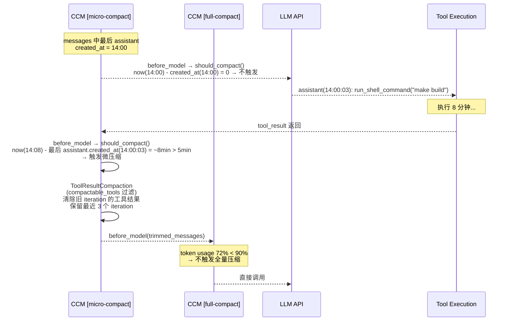
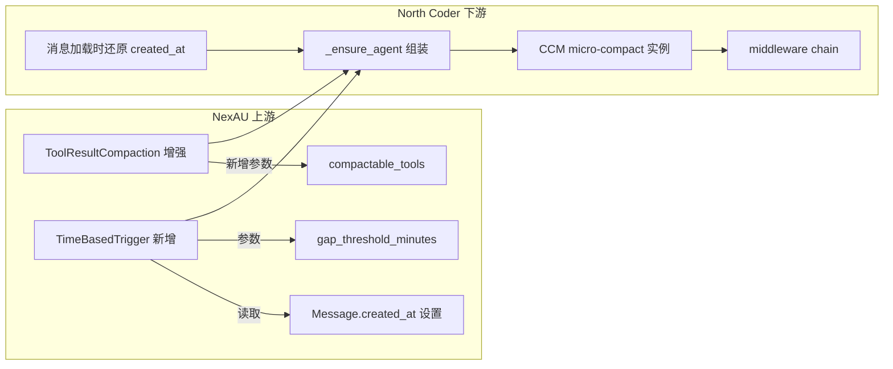
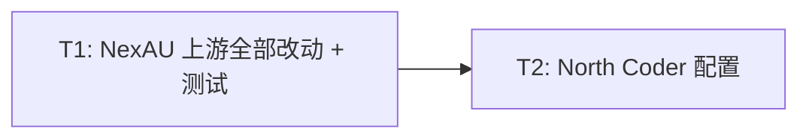

# RFC-0016: Micro-compact — 缓存过期后自动修剪旧工具调用结果

## 摘要

复用 NexAU 已有的 `ContextCompactionMiddleware` 策略架构，新增 `TimeBasedTrigger`（基于 Message 时间戳触发）并增强上游 `ToolResultCompaction`（支持工具类型过滤），在 prompt cache 过期后自动将过时的工具调用结果替换为占位文本，减少 token 消耗，更高效地利用上下文窗口。

## 动机

Anthropic API 的 prompt cache 标准 TTL 为 5 分钟。两次 LLM 调用间隔超过 5 分钟后，API 端已经清除了缓存前缀——此时保持上文完整对 cache 命中毫无意义，整个 prefix 都要按 input token 重新计费写入。

对话历史中积累的大量工具调用结果（grep 输出、文件内容、命令日志等）往往占据数千 token。在 cache 还活着的时候，这些内容作为缓存前缀的一部分是"免费"的；但 cache 过期后，它们变成了纯粹的 token 浪费——既不提供新信息（文件可能已修改、搜索结果已过时），又白白增加每次请求的 input token 消耗。

**核心逻辑：cache 已经没了，那就趁机把旧工具结果压缩掉。** 反正下一次请求的 prefix 要全部重写，不如在重写前先裁剪掉这些陈旧内容，减少 input token、腾出上下文窗口空间。

现有的 RFC-0035 上下文压缩（`ContextCompactionMiddleware` + `SlidingWindowCompaction`）采用 LLM 摘要策略解决 context 接近上限的问题，但它是一个**重量级操作**——需要额外的 LLM 调用，耗时数秒到数十秒。微压缩作为**轻量级 tier-1 防线**，通过简单的规则替换即可在毫秒级别完成，减少全量压缩的触发频率，降低 token 消耗。

### 参考设计

Claude Code v2.1.88 实现了三层微压缩策略：

1. **时间 based 微压缩**：距上次 assistant 消息超过 60 分钟（对齐服务端 1h cache TTL），客户端直接替换旧 `tool_result.content` 为占位文本，保留最近 N 个。
2. **缓存微压缩**：通过 `cache_edits` 内部 API 在服务端删除，保持缓存前缀完整。
3. **API Context Management**：通过 `context_management` 请求参数声明式告知 API 自动清理。

其中第 2、3 层依赖 Anthropic 内部/半公开 API，无法在第三方应用中实现。**本 RFC 实现第 1 层——时间 based 微压缩**，第 2、3 层作为 Future Work。

## 非目标

1. 不实现 `cache_edits` 缓存编辑（Anthropic 内部 API，不可用）；
2. 不实现 `context_management` 声明式策略（API 层工具清理策略尚未对外开放）；
3. 不实现实时增量微压缩（Phase 2，无法保持缓存命中，等 API 公开后再做）；
4. 不修改前端显示历史（data.db blocks 保留原始内容，微压缩对用户完全透明）；
5. 不新增前端 UI 组件或设置面板；
6. 不新增独立的 middleware 类——复用现有 `ContextCompactionMiddleware`。

## 设计

### 概述

NexAU 的 `ContextCompactionMiddleware` 已经将**触发策略**（`TriggerStrategy`）和**压缩策略**（`CompactionStrategy`）解耦为两个独立的 Protocol：

```text
ContextCompactionMiddleware
  ├── TriggerStrategy (Protocol)  → 决定「何时」压缩
  │     ├── TokenThresholdTrigger   ← 现有：token 超阈值时触发
  │     └── TimeBasedTrigger        ← 新增：时间间隔超阈值时触发
  └── CompactionStrategy (Protocol) → 决定「如何」压缩
        ├── ToolResultCompaction     ← 现有 + 增强：替换旧工具结果（新增工具类型过滤）
        └── SlidingWindowCompaction  ← 现有：LLM 摘要
```

本 RFC 的做法：

1. **上游（NexAU）**：
   - 增强 `ToolResultCompaction`，新增 `compactable_tools`（工具类型过滤）参数。`compactable_tools=None` 时行为不变（向后兼容）。
   - 新增 `TimeBasedTrigger`，与 `TokenThresholdTrigger` 并列，直接读取 messages 中最后一条 assistant 消息的 `created_at` 时间戳判断是否超过阈值。
   - 确保 `Message.created_at` 在创建时被正确设置（当前始终为 `None`），且存储/加载时保持不丢失。
2. **下游（North Coder）**：组装第二个 `ContextCompactionMiddleware` 实例，插入现有实例之前。

```text
Middleware Chain:
  ... → CCM [micro-compact] → CCM [full-compact] → ...
        (TimeBasedTrigger +     (TokenThresholdTrigger +
         ToolResultCompaction     SlidingWindowCompaction
         with tool filtering)     LLM 摘要)
```

### 关键设计决策

1. **增强上游 `ToolResultCompaction`——仅加 `compactable_tools` 参数**
   - `ToolResultCompaction` 已实现消息遍历、`ToolResultBlock` 内容替换、`model_copy` 不可变更新、按 iteration 保留等核心逻辑
   - 只需新增一个 `compactable_tools` 参数即可支持选择性压缩，保留机制继续用现有的 `keep_iterations`
   - 一条 assistant 消息可能包含多个并行工具调用，按 iteration 保留能确保同一轮的工具结果要么全保留、要么全清理，不会出现同一轮内部分清理的情况
   - `compactable_tools=None` 时行为完全不变，向后兼容

2. **`compactable_tools` 参数设计——工具类型过滤**
   - 类型：`frozenset[str] | None`，`None` 表示不过滤（压缩所有工具，兼容现有行为）
   - 过滤逻辑：遍历 assistant 消息中的 `ToolUseBlock`，仅当 `block.name` 在 `compactable_tools` 中时，其对应的 `ToolResultBlock` 才参与压缩
   - 默认可压缩工具（North Coder 侧配置）：`read_file`、`search_file_content`、`list_directory`、`run_shell_command`、`read_only_shell_command`、`web_search`、`web_read`、`background_task_manage`
   - 不可压缩：写操作（`write_file`/`replace`/`apply_patch`）、交互工具（`ask_user`）、状态工具（`write_todos`、RFC/Plan 工具）、子 Agent（`explore`/`worker`）

3. **时间感知方案——Message 级时间戳 + 无状态触发**
   - NexAU 的 `Message` 已有 `created_at: datetime | None` 字段，但当前始终为 `None`。上游改动：在创建 Message 时设置 `created_at = datetime.now(UTC)`，存储/加载时保持不丢失
   - `TimeBasedTrigger.should_compact()` 接收 `messages` 列表，找到最后一条 assistant 消息的 `created_at`，计算 `now - created_at`，超过阈值即触发
   - Trigger 本身无状态——不维护任何内部变量，判断完全基于 messages 数据，纯函数
   - 新会话（无 assistant 消息）→ 不触发（安全默认）

4. **时间阈值对齐 Anthropic prompt cache 标准 TTL（5 分钟）**
   - Anthropic 的 prompt cache 标准 TTL 为 5 分钟，超时后缓存前缀失效
   - 触发场景包括：用户离开后恢复会话、run 中某个工具执行超过 5 分钟（如长时间 shell 命令）
   - 在 cache 已过期的情况下，清除旧工具结果不会导致额外的 cache miss，反而减少重写 token
   - 对 OpenAI 等其他 provider 同样有效——减少 input tokens 总是有益的

5. **两个 `ContextCompactionMiddleware` 实例形成两层防线**
   - 微压缩实例（tier-1）：`TimeBasedTrigger` + `ToolResultCompaction`（with filtering），轻量、毫秒级
   - 全量压缩实例（tier-2）：`TokenThresholdTrigger` + `SlidingWindowCompaction`（LLM 摘要），重量、秒级
   - 微压缩先跑，降低 token → 全量压缩可能因此不再触发，避免昂贵的 LLM 调用
   - 两个实例完全独立，各自有自己的 trigger + strategy

### 接口契约

#### 上游：ToolResultCompaction 增强参数

```python
class ToolResultCompaction:
    def __init__(
        self,
        *,
        keep_system: bool = True,
        keep_iterations: int = 3,
        keep_user_rounds: int = 0,
        # --- 新增参数 ---
        compactable_tools: frozenset[str] | None = None,  # None = 全部工具（兼容）
    ): ...
```

- `compactable_tools=None`：压缩所有工具（现有行为，向后兼容）
- `compactable_tools={"read_file", ...}`：仅压缩指定工具，其余工具的 `ToolResultBlock` 不受影响
- `keep_iterations` 继续沿用，按 iteration 保留最近 N 轮的全部工具结果

#### 上游：TimeBasedTrigger

新增 `TriggerStrategy` 实现，与 `TokenThresholdTrigger` 并列：

```python
class TimeBasedTrigger:
    """基于最后一条 assistant 消息的时间戳判断是否触发压缩。无状态。"""

    def __init__(
        self,
        *,
        gap_threshold_minutes: int = 5,
    ): ...

    def should_compact(
        self,
        messages: list[Message],
        current_tokens: int,
        max_context_tokens: int,
    ) -> tuple[bool, str]:
        """找到 messages 中最后一条 assistant 消息的 created_at，比较 now - created_at 与阈值。"""
        ...
```

核心机制：
- `should_compact()` 从 `messages` 列表中找到最后一条 `role=assistant` 的消息，读取其 `created_at` 时间戳
- 计算 `now - created_at`，超过 `gap_threshold_minutes`（默认 5 分钟）→ 返回 `(True, reason)`
- Trigger 无内部状态，纯函数——同样的 messages + 同样的 now 永远返回同样的结果
- 无 assistant 消息（新会话）→ 不触发

#### 上游：Message.created_at 设置

确保 NexAU 在创建 Message 时设置 `created_at = datetime.now(UTC)`：
- Agent loop 中创建 assistant Message 时设置
- 创建 user Message（包括 tool_result）时设置
- 已有 `created_at` 的 Message（如从存储加载）不覆盖
- 存储层序列化/反序列化时保持 `created_at` 不丢失

#### 上游：CompactionConfig 扩展

现有 `CompactionConfig`（`extra="forbid"`）不支持新字段。上游扩展以支持 `TimeBasedTrigger` 和 `compactable_tools`：

```python
class CompactionConfig(BaseModel):
    model_config = ConfigDict(extra="forbid")

    # 现有字段
    trigger: Literal["token_threshold"] = "token_threshold"
    threshold_ratio: float = 0.9
    strategy: Literal["sliding_window", "tool_result"] = "sliding_window"
    keep_iterations: int = 3
    keep_user_rounds: int = 0

    # --- 新增字段 ---
    trigger: Literal["token_threshold", "time_based"] = "token_threshold"
    gap_threshold_minutes: int = 5              # time_based trigger 专用
    compactable_tools: list[str] | None = None  # tool_result strategy 专用
```

#### YAML 配置

微压缩作为第二个 `context_compaction` middleware 条目声明在现有 `middlewares` 列表中：

```yaml
middlewares:
  # tier-1: 微压缩（时间触发 + 工具结果替换 + 类型过滤）
  - type: context_compaction
    config:
      trigger: time_based
      gap_threshold_minutes: 5
      strategy: tool_result
      keep_iterations: 3
      compactable_tools:
        - read_file
        - search_file_content
        - list_directory
        - run_shell_command
        - read_only_shell_command
        - web_search
        - web_read
        - background_task_manage

  # tier-2: 全量压缩（token 阈值触发 + LLM 摘要）
  - type: context_compaction
    config:
      trigger: token_threshold
      threshold_ratio: 0.9
      strategy: sliding_window
```

两个 CCM 实例都走标准 middleware 声明，NexAU 框架按 YAML 顺序初始化和执行。无需 `_ensure_agent()` 中手动组装。

#### 会话级覆盖（复用 RFC-0051 机制）

```json
{
  "agent_config": {
    "middlewares": {
      "micro_compact": {
        "gap_threshold_minutes": 10,
        "keep_iterations": 5
      }
    }
  }
}
```

### 架构图

#### Middleware Chain 中的位置

```text
PathGuardMiddleware
  → FileLockMiddleware
    → AgentEventsMiddleware
      → ContextCompactionMiddleware [micro-compact]    ← 新增实例（tier-1）
        → ContextCompactionMiddleware [full-compact]   ← 现有实例（tier-2）
          → TokenUsageMiddleware
            → LongToolOutputMiddleware
              → EmptyContentRetryMiddleware
```

#### 两层防线交互



#### 上游改动范围



## 权衡取舍

### 考虑过的替代方案

1. **下游新建 `SelectiveToolResultCompaction` 策略类**
   - 优点：不依赖上游改动，可立即实现
   - 缺点：与 `ToolResultCompaction` 有大量逻辑重复（消息遍历、ToolResultBlock 替换、model_copy 等）
   - 缺点：上游和下游分别维护两套类似逻辑，长期维护成本高
   - 决定：不采用。增强上游更干净

2. **新建独立的 `MicroCompactMiddleware`**
   - 优点：完全自主控制，不依赖 `ContextCompactionMiddleware`
   - 缺点：需要自己实现 `before_model` hook、`HookResult` 返回等逻辑，与现有 middleware 大量重复
   - 决定：不采用。复用现有 middleware 实例 + 新 trigger/strategy 更简洁

3. **Trigger 内部维护 `_last_call_time` + blocks DB 冷启动查询**
   - 优点：不需要上游修改 `Message.created_at`
   - 缺点：Trigger 有内部可变状态，不是纯函数，测试和推理更复杂
   - 缺点：进程重启后内部状态丢失，必须额外从 blocks DB 查询兜底
   - 缺点：blocks DB 的 timestamp 是 INSERT 时间而非消息完成时间，作为兜底精度有限
   - 决定：不采用。直接在 Message 上设置 `created_at` 更干净——数据在消息本身，无状态、无兜底、冷启动自然解决

4. **同时实现 Phase 2 数量 based 增量微压缩**
   - 优点：覆盖更多场景（活跃会话中的持续清理）
   - 缺点：没有 `cache_edits` API，客户端修改消息会导致 prompt cache 失效
   - 决定：Phase 2 作为 Future Work，待相关 API 公开后再做

### 缺点

- 5 分钟阈值对齐 Anthropic 标准 cache TTL，对 OpenAI 等无 prompt cache 的 provider 缺少理论依据（但减少 input tokens 仍然有益）
- 清除后的占位文本无法恢复，模型如需旧工具结果的内容只能重新调用工具
- 两个 `ContextCompactionMiddleware` 实例会各自发出 `compaction_started`/`compaction_finished` 事件，前端需要能通过 `triggerReason` 字段区分微压缩和全量压缩
- 需要上游 NexAU 修改 `Message` 创建逻辑以填充 `created_at`，属于行为变更（但字段本身已存在，只是从 None 变为有值）

## 实现计划

### 阶段划分

- [ ] Phase 1: 上游 NexAU 全部改动 + 测试
- [ ] Phase 2: 下游 North Coder YAML 配置（trivial）

### 子任务分解

#### 依赖关系图



#### 子任务列表

| ID | 标题 | 依赖 | Ref |
|----|------|------|-----|
| T1 | NexAU 上游全部改动 + 测试 | - | - |
| T2 | North Coder YAML 配置 | T1 | - |

#### 子任务定义

**T1: NexAU 上游全部改动 + 测试（NexAU 仓库）**
- **范围**:
  - **增强 `ToolResultCompaction`**（`compact_stratigies/compact_tool_result.py`）：新增构造参数 `compactable_tools: frozenset[str] | None = None`。`compact()` 中当 `compactable_tools` 非 None 时，仅压缩指定工具的 `ToolResultBlock`（通过关联 `ToolUseBlock.name` 判断），其余工具的结果不受影响。保留机制继续用现有的 `keep_iterations`。参数为 None 时行为完全不变（向后兼容）。
  - **新增 `TimeBasedTrigger`**（`trigger_strategies/time_based.py`）：实现 `TriggerStrategy` Protocol。无内部状态，从 `messages` 列表中读取最后一条 assistant 消息的 `created_at`，与 `now` 比较超过 `gap_threshold_minutes`（默认 5 分钟）即触发。无 assistant 消息时不触发。
  - **设置 `Message.created_at`**：在 Agent loop 创建 Message 时设置 `created_at = datetime.now(UTC)`。已有 `created_at` 的 Message（如从存储加载）不覆盖。存储层序列化/反序列化时保持不丢失。
  - **扩展 `CompactionConfig`**：新增 `trigger: Literal["token_threshold", "time_based"]`、`gap_threshold_minutes: int`、`compactable_tools: list[str] | None` 字段，使微压缩 CCM 实例可通过 YAML `middlewares` 声明。
  - **测试**：`TimeBasedTrigger` 单测（基于 message 时间戳判断、无 assistant 消息时不触发、无状态验证）；增强后 `ToolResultCompaction` 单测（工具类型过滤、向后兼容）；`Message.created_at` 持久化测试；`CompactionConfig` 新字段解析测试；两个 CCM 实例 chain 集成测试。
- **验收标准**: NexAU 现有测试全部通过；新增测试全部通过；向后兼容验证通过

**T2: North Coder YAML 配置**
- **范围**: 各 agent YAML（`code_agent.yaml` 等）的 `middlewares` 列表中新增一条 `context_compaction` 条目（`trigger: time_based`），排在现有全量压缩条目之前
- **验收标准**: YAML 中两个 CCM 条目按序加载

### 影响范围

**NexAU 上游**:
- `nexau/.../compact_stratigies/compact_tool_result.py` — 增强 `ToolResultCompaction`
- `nexau/.../trigger_strategies/time_based.py` — **新增** `TimeBasedTrigger`
- `nexau/.../config/compaction_config.py` — 扩展 `CompactionConfig`（新增 trigger 类型、`gap_threshold_minutes`、`compactable_tools`）
- `nexau/.../core/message.py` 或 Agent loop 相关模块 — 设置 `Message.created_at`
- `nexau/.../tests/` — 新增测试

**North Coder 下游**:
- `backend/north_coder/agent/code_agent.yaml` — `middlewares` 新增微压缩 CCM 条目
- `backend/north_coder/agent/code_agent_codex.yaml` — 同上
- `backend/north_coder/agent/rfc_agent.yaml` — 同上
- `backend/north_coder/agent/plan_agent.yaml` — 同上
- `backend/tests/` — 新增测试文件

## 测试方案

### 单元测试

- `TimeBasedTrigger.should_compact()`：
  - 最后 assistant 消息 `created_at` 为 8 分钟前 → 返回 `(True, reason)`
  - 最后 assistant 消息 `created_at` 为 2 分钟前 → 返回 `(False, "")`
  - 无 assistant 消息（新会话）→ 返回 `(False, "")`
  - 同一 messages 列表多次调用 → 返回相同结果（无状态验证）
  - assistant 消息 `created_at` 为 `None` → 不触发（安全默认）
- `ToolResultCompaction.compact()`（上游增强后）：
  - `compactable_tools=None` → 压缩所有工具（向后兼容）
  - `compactable_tools={"read_file", "search_file_content"}` → 仅压缩指定工具
  - 不可压缩工具（`write_file`、`ask_user`）的结果不受影响
  - `keep_iterations=3` 保留最近 3 个 iteration 的全部工具结果
  - 已清除的工具结果不重复处理
- Message `created_at` 持久化：
  - 新创建的 Message `created_at` 不为 `None`
  - 存储后再加载的 Message `created_at` 保持一致（NexAU 上游测试）

### 集成测试

- middleware chain 中微压缩 CCM 位于全量压缩 CCM 之前
- 微压缩清除工具结果后，全量压缩因 token 使用率降低而不触发

### 手动验证

1. 开启一个会话，进行多轮工具调用（`read_file`、`search_file_content`、`run_shell_command` 等）
2. 离开会话超过 5 分钟（或触发一个耗时较长的工具调用，如 `run_shell_command("sleep 360")` 模拟 6 分钟执行）
3. 恢复会话发送新消息（或等待长工具执行完成后观察下一次 LLM 调用）
4. 检查 LLM 收到的消息中，旧工具结果已被替换为占位文本
5. 确认最近几轮 iteration 的工具结果保留完整
6. 确认不可压缩工具（write_file 等）的结果不受影响
7. 确认前端显示的聊天历史不受影响（blocks 保留原始内容）
8. 确认模型仍然能正常工作

## 未解决的问题

1. **两个 CCM 实例的事件区分**：微压缩和全量压缩都会发出 `compaction_started`/`compaction_finished` 事件。前端目前只有一个 `CompactionState`，需确认是否能通过 `triggerReason` 字段区分。
2. **非 Anthropic provider 的阈值选择**：5 分钟对齐 Anthropic 标准 cache TTL，但 OpenAI 等 provider 无类似机制。是否需要 per-provider 的阈值策略？
3. **子 Agent 内部的微压缩**：当前只处理主 Agent 的消息历史。子 Agent（explore/worker）有独立的消息历史，是否需要也启用？

## Future Work

### Phase 2: 实时增量微压缩（缓存感知）

当 Anthropic 公开 `cache_edits` API 或 `context_management.clear_tool_uses` 策略后：

- **触发条件**：实时会话中可压缩工具结果数量超过阈值
- **执行方式**：通过 `cache_edits` 在服务端删除旧工具结果，保持缓存前缀完整
- **优势**：不破坏已有 prompt cache，增量修剪

### Phase 3: API 声明式上下文管理

如果 `context_management.clear_tool_uses_20250919` 策略对外开放：

- **执行方式**：在 API 请求中声明清理策略，由 API 层自动执行
- **触发条件**：`input_tokens` 超过阈值
- **优势**：无需客户端修改消息，API 层最优清理

## 参考资料

- RFC-0035: 上下文压缩（Context Compaction）— 全量 LLM 摘要压缩，tier-2 防线
- RFC-0040: Block 级对话历史持久化 — 前端显示历史不受影响
- RFC-0051: 会话级 Agent 配置统一存储 — 配置覆盖机制
- Claude Code v2.1.88 源码：`services/compact/microCompact.ts`、`timeBasedMCConfig.ts`、`apiMicrocompact.ts`
- NexAU `ToolResultCompaction`：`compact_stratigies/compact_tool_result.py` — 增强目标
- NexAU `TriggerStrategy` / `CompactionStrategy` Protocol — 可插拔策略架构
- 《驾驭工程》第 11 章：微压缩详解 — https://zhanghandong.github.io/harness-engineering-from-cc-to-ai-coding/part3/ch11.html
- Issue #359: Micro-compact — 缓存过期后自动修剪旧工具调用结果
