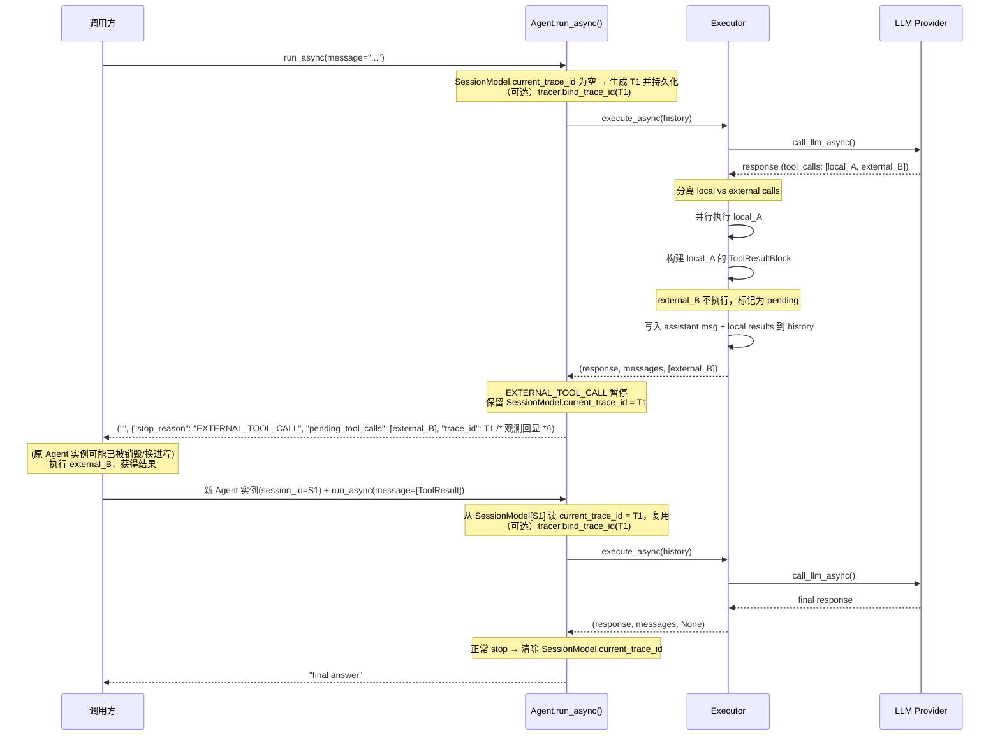
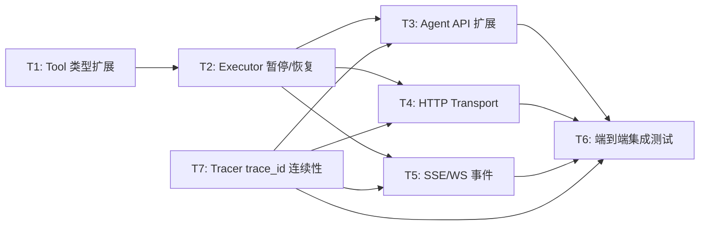

# RFC-0018: External Tool（无绑定工具）

## 摘要

在 nexau 中新增 **External Tool** 类型——只有工具描述（name、description）和 JSON Schema（input_schema），没有本地 `binding`/implementation。当模型调用 external tool 时，Agent Loop 自动暂停并将 pending tool calls 返回给调用方；调用方提供 tool results 后通过再次调用 `run_async()` 恢复执行。这使得 nexau 能够作为「LLM tool-use 代理」，将工具执行权委托给外部系统。

## 动机

当前 nexau 的所有工具都必须绑定一个本地实现（Python callable 或 import path）。这在以下场景中成为限制：

1. **远程工具执行**：调用方自身拥有工具实现（如 IDE 插件、桌面应用），希望 nexau 只负责 LLM 交互和对话管理，工具执行由调用方完成。
2. **跨语言集成**：工具实现在非 Python 环境（Rust、TypeScript 等），无法直接作为 Python callable 注入。
3. **安全隔离**：某些高权限操作（文件系统写入、代码执行）需要在调用方的安全沙箱中执行，不应由 agent 进程直接执行。
4. **LLM API 透传**：类似 OpenAI / Anthropic API 的 tool-use 模式，调用方定义工具 schema，LLM 返回 tool calls，调用方自行处理后继续对话。

这些场景的共同模式是：**工具 schema 由调用方注册，工具执行由调用方完成，nexau 负责 LLM 对话循环管理**。

## 设计

### 概述

External Tool 是一种特殊的 Tool，它只注册工具元信息（name、description、input_schema）到 LLM 的 tool definitions 中，但**不绑定本地实现**。当模型在响应中调用 external tool 时：

1. Executor 先执行所有本地工具（bound tools）
2. 识别出 external tool calls，暂停循环
3. 将 assistant 消息（含 tool_use blocks）写入 history
4. 返回 `EXTERNAL_TOOL_CALL` stop reason + pending tool calls 给调用方
5. 调用方处理工具调用，构造 tool result messages
6. 调用方再次调用 `run_async(message=[tool_result_messages])` 恢复执行
7. Executor 在新 iteration 中看到 history 以 tool results 结尾，继续 LLM 调用

### 关键设计决策

1. **先执行本地、再暂停远程**：当模型在同一 turn 返回混合调用（local + external）时，先并行执行所有 local tools 并将结果写入 history，然后暂停等待 external tool results。这避免了二次 LLM 调用来重新生成本地工具调用，最大化单次 LLM 调用的效率。

2. **无状态恢复设计**：Agent 是有状态的（history 通过 HistoryList 自动持久化），恢复时调用方只需传入 `message=[ToolResult messages]`，无需传回整个 history。这复用了现有的 `run_async()` 入口和 history 管理机制，无需引入新的"恢复"API。

3. **扩展 tuple 返回值而非引入新类型**：`run_async()` 现有返回类型 `str | tuple[str, dict]` 不变，在 dict 中新增 `stop_reason` 和 `pending_tool_calls` 字段。这是最小破坏性变更，现有调用方不受影响。

4. **External tool 对 LLM 完全透明**：External tool 发送给 LLM 的 tool definition 与普通工具完全一致（都是 `StructuredToolDefinition`），LLM 无法区分。差异仅在 executor 侧的执行路径。

5. **YAML 和 Python API 双通道定义**：YAML 中 `kind: external`（无 `binding`）或 Python API `Tool(..., implementation=None, kind="external")` 均可创建 external tool。

6. **Trace ID 在暂停/恢复间保持一致（跨 Agent 实例销毁）**：`trace_id` 是 **Session 层的概念而非 Tracer 层的概念** —— 一个 Session 内可以产生多条 trace，**每次用户触发的消息 = 一条 trace**。因此由 **Agent**（而非 Tracer）拥有和管理 `trace_id` 生命周期，使能力**不依赖 Tracer 是否配置**：即使开发者完全没启用 Tracer，`trace_id` 仍可作为"逻辑对话单元"的唯一标识贯穿暂停/恢复。设计要点：
   - **生成时机**：Agent 在新一次 user message 进入 loop 时（非 external-tool resume 场景）生成新的 `trace_id`，记为"当前 run 的 trace_id"；external-tool resume 场景则复用 Session 中持久化的 `trace_id`，不生成新的。
   - **存储位置**：`SessionModel.current_trace_id`（键为 `session_id`）。EXTERNAL_TOOL_CALL 暂停时保持不变；正常 stop reason 结束时清除（下一轮用户消息再生成新 id）。
   - **与 Tracer 的关系**：Tracer 是一个**可选观测者**。若注入了 Tracer，Agent 在进入 `TraceContext` 之前调用 `tracer.bind_trace_id(trace_id)`（一个已有的可选钩子，默认 no-op），使 Tracer 后续写出的 span 挂在同一个 `trace_id` 下。即使 tracer 未配置，`trace_id` 仍被 Agent 生成、持久化、并通过 response / event 回显给调用方。
   - **恢复入口唯一**：`session_id` 是唯一的恢复标识；不在 `AgentRequest` 中暴露 `trace_id` 字段，避免客户端需要维护/回传 trace_id 的额外协议负担，也避免客户端伪造 trace_id 带来的观测数据错乱。
   - **可移植**：不依赖任何 vendor 具体的 trace 对象或 OTel context 跨进程序列化，只依赖 Agent 自己生成的字符串 ID 在 SessionModel 中存取。
   - `AgentResponse` / `ExternalToolCallEvent` 中的 `trace_id` 字段仅作**只读观测回显**（方便客户端在自己的日志里关联到 Langfuse URL），非协议必填项。

### 接口契约

#### Tool 定义层

```
StructuredToolKind 扩展:
  现有: "tool" | "sub_agent"
  新增: "external"

ToolYamlSchema 新增字段:
  kind: Literal["tool", "external"] | None = None  # 默认 "tool"

Tool.__init__ 新增参数:
  kind: StructuredToolKind = "tool"  # 显式指定工具类型

Tool.is_external 属性:
  → bool  # kind == "external"
```

#### Agent 层（trace_id ownership）

```
Agent 新增职责:
  - 每次 user-triggered run 开始时，若 SessionModel.current_trace_id
    为空（正常新对话）或非 EXTERNAL_TOOL_CALL resume 场景，生成一个
    新的 trace_id (e.g. uuid4 hex)。
  - 若 SessionModel.current_trace_id 已存在（上次 EXTERNAL_TOOL_CALL
    暂停遗留），直接复用，不生成新的。
  - 将当前 trace_id 持久化到 SessionModel.current_trace_id。
  - 将当前 trace_id 传给 tracer（可选；见 Tracer 层 bind）。
  - Run 结束：
      * stop_reason == EXTERNAL_TOOL_CALL: 保留 current_trace_id
      * 其他 stop_reason: 清除 current_trace_id（下一轮新 trace）

Agent.run_async 返回 dict 新增:
  trace_id: str  # 总是有值（Agent 生成），与 tracer 是否启用无关

SessionModel 新增字段:
  current_trace_id: str | None  # 仅在 EXTERNAL_TOOL_CALL 暂停期间
                                 # 持久化非 None 值；恢复时由 Agent 读回
```

#### Tracer 层（可选观测者）

```
BaseTracer 现有 API 不变。
LangfuseTracer 现有 set_trace_id() 保持；Agent 在进入 TraceContext 前
调用 tracer.bind_trace_id(trace_id)（如果方法存在），否则降级为"tracer
自己生成 trace_id"的既有行为（此时 Session 的 trace_id 与 tracer 的
可能不一致，但这不影响 trace_id 作为逻辑会话标识的语义）。

注：tracer 是否支持 bind_trace_id 不影响 Agent 的 trace_id 连续性，
只影响观测后端（Langfuse 等）中的 span 是否真正挂在同一条 trace 下。
```

#### Executor 层

```
AgentStopReason 新增:
  EXTERNAL_TOOL_CALL = auto()  # Agent loop 暂停等待 external tool results

executor.execute_async() 返回值扩展:
  现有: tuple[str, list[Message]]
  新增: tuple[str, list[Message], list[ToolUseBlock] | None]
  # 第三个元素: pending external tool calls (None 表示正常结束)
```

#### Agent API 层

```
agent.run_async() 返回值 dict 扩展:
  现有 dict keys: state 相关字段
  新增 keys:
    "stop_reason": str              # AgentStopReason 枚举名
    "pending_tool_calls": list[dict] | None  # ToolUseBlock 序列化后的 list
    "trace_id": str                 # 总是有值（Agent 自己生成）

Agent 管理 trace_id 的规则:
  - run 开始前：若 SessionModel.current_trace_id 存在 → 复用；否则生成新的
    (uuid4 hex) 并持久化到 SessionModel。
  - 若已注入 tracer 且其支持 trace_id 绑定，调用 tracer.bind_trace_id(trace_id)
    使 tracer 后续 span 挂在同一条 trace 下。否则不影响 trace_id 回显。
  - run 正常结束：清除 SessionModel.current_trace_id。
  - run 在 EXTERNAL_TOOL_CALL 暂停：保留 current_trace_id，下次 resume 时复用。

恢复调用:
  agent.run_async(message=[
    Message(role=Role.TOOL, content=[
      ToolResultBlock(tool_use_id="call_xxx", content="result", is_error=False)
    ])
  ])
```

#### Transport 层

```
AgentResponse 扩展:
  新增字段:
    stop_reason: str | None = None
    pending_tool_calls: list[dict] | None = None
    trace_id: str | None = None   # 只读观测回显：当 stop_reason ==
                                  # EXTERNAL_TOOL_CALL 时带出当前 trace_id，
                                  # 方便客户端在自己的日志里关联。
                                  # 非协议必填项，客户端无需回传。

AgentRequest 不变:
  resume 所需的所有状态都由 session_id 定位，服务端内部从
  SessionModel.current_trace_id 恢复。客户端只需保持
  session_id 不变即可；无需也不应携带 trace_id。

恢复调用 (复用 /query 或 /stream):
  POST /query (或 /stream)
    请求体: AgentRequest
      messages: list[Message]  # 包含 ToolResultBlock 的 TOOL 角色消息
      user_id: str             # 与初始请求相同
      session_id: str          # 与初始请求相同(服务端据此恢复 trace_id)
    响应体: AgentResponse (与正常 /query 相同)

  无需新增端点：/query 已接受 list[Message]，调用方只需将
  ToolResult messages 作为 messages 传入，复用相同的 user_id 和 session_id；
  服务端新 Agent 实例读 SessionModel.current_trace_id 并（可选）
  bind 到 tracer，让新实例后续 span 挂在同一条 trace 上。

SSE 新增事件类型:
  ExternalToolCallEvent:
    type: "external_tool_call"
    tool_calls: list[dict]  # ToolUseBlock 序列化
    trace_id: str | None    # 只读观测回显，与 AgentResponse 对称；
                            # 客户端无需回传（resume 凭 session_id 即可）
```

### 架构图



## 权衡取舍

### 考虑过的替代方案

1. **专用 resume API**：增加 `agent.resume(tool_results=[...])` 方法，内部维护暂停的 coroutine。
   - 优势：语义更清晰，调用方不需要了解 Message/ToolResultBlock 结构。
   - 劣势：引入复杂的协程暂停/恢复生命周期管理；与现有 agent lock 机制冲突（一个 run 锁住 session，resume 需要不同的锁语义）；serverless 场景下无法跨进程恢复协程状态。
   - **放弃原因**：复杂度过高，且 history-based 恢复已能满足所有场景。

2. **Callback/Event 模式**：不改变 `run_async()` 返回类型，而是通过中间件 event 通知调用方 external tool call，调用方通过 `enqueue_message()` 注入结果。
   - 优势：不改变公共 API 签名。
   - 劣势：调用方必须维护 event listener + message injection 的双向通道，编程模型复杂；无法在非 streaming 场景使用；`enqueue_message` 目前只支持 TextBlock，不支持 ToolResultBlock。
   - **放弃原因**：同步调用方（`/query` 端点、SDK 用户）无法使用此模式。

3. **暂停整个 turn**：模型返回混合调用时，不执行任何工具，全部返回给调用方处理。
   - 优势：逻辑简单，无需区分 local/external。
   - 劣势：调用方被迫处理它不关心的 local tools；如果调用方没有 local tool 的实现，则无法工作；违反了"调用方只关心 external tools"的原则。
   - **放弃原因**：增加调用方负担，且与 local tool 的设计意图矛盾。

4. **专用 `/tool-result` 端点**：新增一个专用 HTTP 端点接收 tool results。
   - 优势：语义明确，请求体可针对 tool results 做专门校验。
   - 劣势：`/query` 已接受 `list[Message]`，天然支持传入 `Role.TOOL` 消息；新增端点增加了 API 表面积，调用方需要区分两个端点；与 Agent API 层的统一 `run_async(message=...)` 入口不对称。
   - **放弃原因**：复用 `/query` 更简洁统一，调用方用相同的 `user_id` + `session_id` + `messages` 模式即可恢复执行。

### 缺点

- `run_async()` 返回值语义更复杂，dict 中字段增多，虽然向后兼容但增加了理解成本。
- 混合调用场景下，local tool 的结果被写入 history 但 external tool 结果缺失，LLM 在恢复时看到的是"部分完成"的 tool results，这对少数 LLM provider 可能导致异常（UMP 层面应能正确处理，但需在实现阶段做 provider 覆盖测试确认）。

## 实现计划

### 阶段划分

- [ ] Phase 1: 核心机制（T1 → T2 → T3）—— Tool 类型扩展 + Executor 暂停/恢复 + Agent API 扩展
- [ ] Phase 2: Transport 集成（T4, T5 并行）—— HTTP 响应扩展 + SSE/WS 事件

### 子任务分解

#### 依赖关系图



#### 子任务列表

| ID | 标题 | 依赖 | Ref |
|----|------|------|-----|
| T1 | Tool 类型扩展：支持 external kind | - | - |
| T2 | Executor 暂停/恢复逻辑 | T1 | - |
| T3 | Agent API 返回值扩展 | T2, T7 | - |
| T4 | HTTP Transport 响应扩展 | T2, T7 | - |
| T5 | SSE/WS 流式事件支持 | T2, T7 | - |
| T7 | Tracer trace_id 连续性（BaseTracer API + Session 持久化） | - | - |
| T6 | 端到端集成测试 | T3, T4, T5, T7 | - |

#### 子任务定义

**T1: Tool 类型扩展：支持 external kind**
- **范围**：
  - `StructuredToolKind` 新增 `"external"` 字面量
  - `ToolYamlSchema` 新增 `kind` 字段（默认 `"tool"`）
  - `Tool.__init__` 新增 `kind` 参数，存储为实例属性
  - `Tool.is_external` 属性：`kind == "external"`
  - `Tool.execute()` 在 `is_external` 时 raise `ExternalToolError`（而非 "no implementation"）
  - `Tool.from_yaml()` 识别 `kind: external` + 无 `binding` 的组合
  - `Tool.to_structured_definition()` 对 external tool 返回 `kind: "tool"`（LLM 侧不感知 external 概念，统一为 tool）
- **验收标准**：
  - 可通过 YAML 和 Python API 创建 external tool
  - `tool.is_external == True`
  - `tool.execute()` 抛出 `ExternalToolError`
  - `tool.to_structured_definition()` 返回的 kind 为 `"tool"`
  - 现有工具行为不受影响

**T2: Executor 暂停/恢复逻辑**
- **范围**：
  - `AgentStopReason` 新增 `EXTERNAL_TOOL_CALL`
  - `_AsyncIterationState` 新增 `pending_external_calls: list[ToolUseBlock]` 字段
  - `_execute_iteration_async` 步骤 8（工具执行）中：通过 `ToolRegistry` 识别 external tool calls，分离为 local/external 两组
  - Local calls 正常并行执行（现有逻辑不变）
  - External calls 跳过执行，收集为 pending list
  - `_append_tool_result_messages` 只为 local calls 构建 ToolResultBlock
  - 步骤 10（停止条件）：若存在 pending external calls，设置 `force_stop_reason = EXTERNAL_TOOL_CALL`，break
  - `execute_async()` 返回值扩展为三元组 `(response, messages, pending_external_calls)`
- **验收标准**：
  - 纯 local calls 行为不变
  - 纯 external calls 时 loop 立即暂停，返回 pending list
  - 混合调用时先执行 local、再暂停返回 external pending list
  - History 包含 assistant 消息（含所有 tool_use blocks）+ local tool result 消息
  - 恢复时（history 末尾为 tool results）能正常继续 LLM 调用

**T3: Agent API 返回值扩展**
- **范围**：
  - `agent._run_inner()` 适配 executor 三元组返回值，传递 pending_external_calls
  - `agent.run_async()` 返回的 dict 新增 `stop_reason`、`pending_tool_calls`、`trace_id` 字段
  - `pending_tool_calls` 为 `list[dict]`（ToolUseBlock 序列化后），包含 `id`、`name`、`input` 字段
  - `trace_id` 由 Agent 自己生成和管理（见 T7），总是有值（不依赖 tracer）
  - 当 `stop_reason == "EXTERNAL_TOOL_CALL"` 时 response 为空字符串（因为模型尚未给出最终回复）
  - 文档：更新 `run_async()` docstring 说明 external tool 恢复流程与 trace_id 回显
- **验收标准**：
  - `run_async()` 在 external tool 场景返回 `("", {"stop_reason": "EXTERNAL_TOOL_CALL", "pending_tool_calls": [...], "trace_id": "..."})`
  - 即使完全没有注入 tracer，`trace_id` 仍然有值（Agent 自己生成）
  - 调用方可通过 `run_async(message=[ToolResult messages])` 恢复
  - 非 external 场景返回值保持对原有字段完全向后兼容（新增字段为可选/None）

**T4: HTTP Transport 响应扩展**
- **范围**：
  - `AgentResponse` 新增 `stop_reason`、`pending_tool_calls`、`trace_id` 字段（`trace_id` 仅为只读观测回显）
  - `AgentRequest` **不引入** `trace_id` 字段 —— resume 凭 `session_id` 恢复，服务端内部处理（见 T7）
  - `/query` 端点在 external tool 暂停时返回扩展的 `AgentResponse`（含 `trace_id`）
  - 无需新增端点：恢复时调用方使用相同的 `/query`，传入包含 `ToolResultBlock` 的 `messages`，复用相同的 `user_id` 和 `session_id`
  - SSE Server 的 `handle_request` 方法适配 `run_async()` 扩展后的返回值，提取 `stop_reason`、`pending_tool_calls`、`trace_id` 填入 `AgentResponse`
- **验收标准**：
  - `/query` 在 external tool 暂停时返回 `stop_reason: "EXTERNAL_TOOL_CALL"`、`pending_tool_calls`、`trace_id`
  - `/query` 接受包含 `ToolResultBlock` 的 `messages`（只需 `session_id`，无需 `trace_id`），能正确恢复 agent 执行并返回最终 `AgentResponse`
  - 即使服务端 Agent 实例在暂停期间被销毁并在另一进程重建，只要 `session_id` 一致，resume 后新 Agent 写出的 LLM/Tool spans 应挂在同一条 trace 上（T7 集成验证）
  - 非 external 场景 `/query` 行为不变（向后兼容）

**T5: SSE/WS 流式事件支持**
- **范围**：
  - 新增 `ExternalToolCallEvent` 事件类型（payload 包含 pending tool calls + 只读 `trace_id`）
  - `/stream` 端点在 external tool 暂停时发出 `ExternalToolCallEvent`
  - `/stream` 入站**不**读取客户端传入的 trace_id；服务端凭 `session_id` 从 SessionModel 恢复（见 T7）
  - WebSocket transport 支持相同的事件类型
  - 恢复时调用方使用 `/stream` 传入包含 `ToolResultBlock` 的 `messages`（只需 `session_id`），继续接收流式事件（复用现有端点）
- **验收标准**：
  - SSE 流中能正确发出 `ExternalToolCallEvent`，其中 `trace_id` 非空（前提：tracer 已启用）
  - WS 连接能接收 `ExternalToolCallEvent`
  - 调用方通过 `/stream` 喂回 tool results（只需 `session_id`）继续接收流式响应，后续所有 span 都挂在同一 trace 上

**T7: Agent 侧 trace_id 生命周期管理（Session-level，Tracer 无关）**

关键决策：`trace_id` 是 **Session 层概念**，属于 Agent，不属于 Tracer。一个 Session 可以产生多条 trace；每次用户触发的消息 = 一条 trace。Tracer 是一个可选的观测者，不是 trace_id 的所有者 —— 即使开发者不注入任何 Tracer，`trace_id` 也能被正常生成/持久化/回显。

- **范围**：
  - `SessionModel` 新增 `current_trace_id: str | None` 字段（默认 None）
  - `SessionManager` 提供 `update_session_current_trace_id(user_id, session_id, trace_id)` 读写该字段
  - Agent 层在 `run_async` 中管理 trace_id 生命周期：
    1. **run 开始前**（进入 `TraceContext` 之前）：
       - 从 SessionModel 读 `current_trace_id`
       - 若为 None（新对话或上一轮正常结束后）：生成新的 `trace_id` (uuid4 hex)，持久化到 SessionModel
       - 若非 None（上一次 EXTERNAL_TOOL_CALL 暂停遗留）：直接复用
       - 若 `tracer` 已注入且其支持 `bind_trace_id(...)`（方法存在检查，不要求实现 — 保持可选），调用它；否则跳过（tracer 自己决定如何生成 trace_id，与 Agent 的 trace_id 语义解耦）
    2. **run 结束后**：
       - `stop_reason == EXTERNAL_TOOL_CALL`：保留 `current_trace_id`
       - 其他 stop reason：清除（置 None）
    3. **run_async 返回 dict**：`trace_id` 字段**总是**带出当前 run 的 trace_id，无论 tracer 是否配置
  - 关于 Tracer "绑定"：**不新增** `BaseTracer` 抽象方法。若未来需要让 Langfuse 等 tracer 跟随 Agent 的 trace_id，可以在 `LangfuseTracer` 上保留/暴露现有的 `set_trace_id()`，Agent 侧以 `hasattr(tracer, "bind_trace_id")` 或类似方式软绑定；tracer API 本身在本 RFC 中保持不变。

- **验收标准**：
  - 单元测试：不注入 tracer 时，`run_async()` 返回的 dict 中 `trace_id` 仍有值（由 Agent 生成）
  - 单元测试：EXTERNAL_TOOL_CALL 暂停后 `SessionModel.current_trace_id` 保留；resume 时 Agent 读取并复用同一 `trace_id`；整条"用户消息 → 外部工具 → 最终回复"逻辑会话在回显字段里看到的 trace_id 是同一个
  - 单元测试：正常 stop reason 结束后 `SessionModel.current_trace_id` 被清空；下一次 user message 生成新 trace_id
  - 集成测试：销毁 Agent 实例后用同一 `session_id` 构造新 Agent 并 resume，`run_async()` 返回的 `trace_id` 与暂停前相同
  - 集成测试（带 Langfuse/mock tracer）：跨销毁/重建的 EXTERNAL_TOOL_CALL 会话，所有 span 在 tracer 后端挂同一条 trace（前提：tracer 实现了对应的绑定钩子）
  - 非 external 场景行为不变；未启用 tracer 时整条链路不报错

**T6: 端到端集成测试**
- **范围**：
  - 纯 external tool 场景：定义 external tool → LLM 调用 → 暂停 → 喂回结果 → 完成
  - 混合调用场景：local + external 工具混合 → local 先执行 → external 暂停 → 喂回 → 完成
  - Transport 场景：通过 HTTP `/query` 完成完整流程（初始请求 → 收到 pending_tool_calls → 再次 `/query` 喂回 ToolResult messages → 收到最终响应）
  - **Trace 连续性场景**：初始 `/query` 得到 EXTERNAL_TOOL_CALL 响应（含 trace_id=T1）→ **销毁服务端 Agent 实例**（模拟进程重启）→ 再次 `/query` 喂回 ToolResult（仅带 session_id，不带 trace_id）→ 校验最终响应 + 校验 Langfuse（或注入的 mock tracer）中所有 span 都挂在 trace_id=T1 下
  - 边界场景：错误的 tool_call_id、多轮 external tool 调用、external tool 返回 is_error=True
- **验收标准**：
  - 所有测试场景通过
  - 覆盖率 >= 80% 的变更文件

### 影响范围

- `nexau/archs/tool/tool.py` — StructuredToolKind、ToolYamlSchema、Tool 类扩展
- `nexau/archs/main_sub/execution/stop_reason.py` — 新增 EXTERNAL_TOOL_CALL
- `nexau/archs/main_sub/execution/executor.py` — 主循环暂停/恢复逻辑、_AsyncIterationState 扩展
- `nexau/archs/main_sub/execution/tool_executor.py` — external tool 识别与跳过
- `nexau/archs/main_sub/agent.py` — run_async / _run_inner 返回值扩展 + trace_id 生命周期管理（生成 / 复用 / 清除）
- `nexau/archs/transports/http/models.py` — AgentResponse 扩展（含 trace_id 回显）
- `nexau/archs/transports/http/sse_server.py` — /query 响应扩展
- `nexau/archs/transports/websocket/` — WS 事件扩展
- `nexau/archs/llm/llm_aggregators/events.py` — ExternalToolCallEvent（含 trace_id 回显）
- `nexau/archs/session/models/session.py` — `SessionModel.current_trace_id` 字段
- `nexau/archs/session/session_manager.py` — `update_session_current_trace_id` 读写 API
- （可选）`nexau/archs/tracer/adapters/langfuse.py` — 若希望 Langfuse 后端 span 跟随 Agent trace_id，Agent 侧软绑定；tracer 抽象 API 不变

## 测试方案

### 单元测试

- **Tool 类型测试**：验证 external tool 创建（YAML + Python API）、is_external 属性、execute() 抛出 ExternalToolError、to_structured_definition() 返回 kind="tool"
- **Executor 测试**：Mock LLM 返回 external tool calls，验证 loop 暂停行为、stop_reason 正确、pending_tool_calls 内容正确
- **混合调用测试**：Mock LLM 返回 local + external calls，验证 local 先执行、history 正确、external pending 正确
- **恢复测试**：验证 history 拼接 tool results 后 executor 能继续正常调用 LLM

### 集成测试

- **Agent API 端到端**：通过 `agent.run_async()` 完成完整的 external tool 流程（定义 → 调用 → 暂停 → 恢复 → 完成）
- **HTTP Transport 端到端**：通过 `/query` 完成完整流程（发请求 → 收到 pending_tool_calls → 再次 `/query` 喂 ToolResult → 收到最终响应）
- **多轮 external tool**：连续多个 turn 都有 external tool calls 的场景

### 手动验证

1. 启动 nexau agent，配置一个 external tool（via YAML）
2. 发送消息触发 LLM 调用该工具
3. 验证 `/query` 返回 `stop_reason: "EXTERNAL_TOOL_CALL"` 和 `pending_tool_calls`
4. 再次调用 `/query`，传入包含 `ToolResultBlock` 的 `messages`（复用相同 user_id、session_id）
5. 验证最终响应正确

## 未解决的问题

无。以下问题在设计阶段已明确：

- **超时机制**：不需要。遇到 external tool 时 agent 正常 stop（本地工具执行完毕、结果写入 history 后），通过 SessionManager 持久化（如果存在）。Agent 实例是否销毁由外部调用方决定，框架不管理。
- **并发安全**：无竞争条件。External tool 暂停时 agent lock 已释放，恢复时 `run_async()` 重新获取 lock，history 已通过 HistoryList 持久化，lock 保证串行执行。
- **Provider 兼容性**：UMP（Unified Message Protocol）本身就是为处理跨 provider 的消息格式差异而设计的，"部分 tool results"场景（local 已返回、external 在下次 `run_async` 时补齐）在 UMP 层面能正确组装为各 provider 所需的格式。

## 参考资料

- RFC-0006: Neutral Structured Tools — 工具定义的 vendor-neutral 架构
- RFC-0017: Flatten Tool Output — 工具输出格式化
- OpenAI API Tool Use: https://platform.openai.com/docs/guides/function-calling
- Anthropic API Tool Use: https://docs.anthropic.com/en/docs/build-with-claude/tool-use
