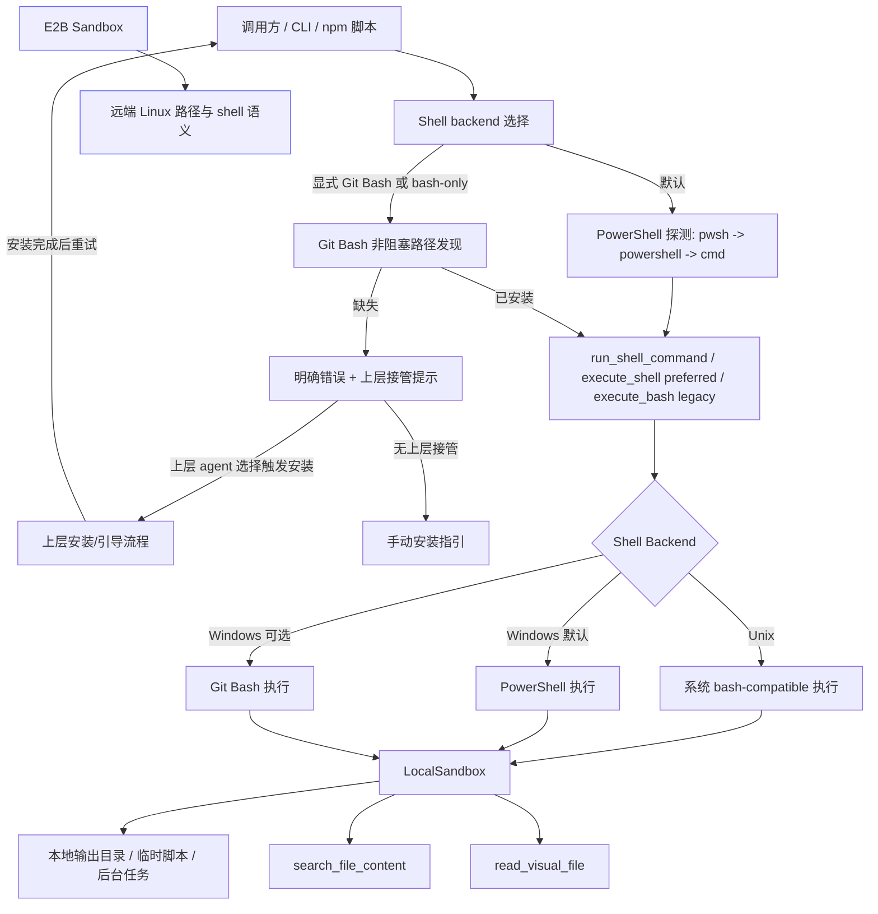
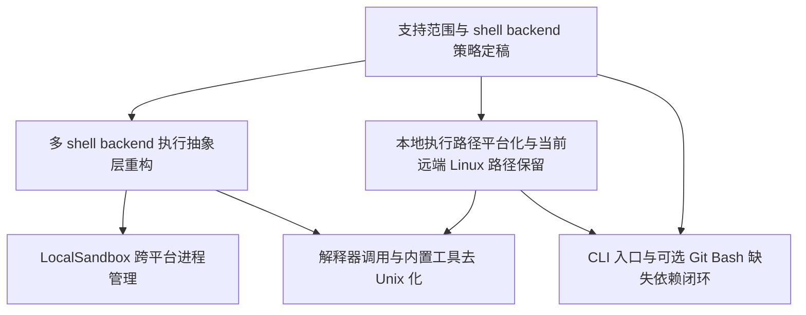

# RFC-0019: NexAU Windows 正式支持（默认 PowerShell，Git Bash 可选）

## 摘要

本 RFC 为 NexAU 引入 **Windows 正式支持（默认 PowerShell，Git Bash 可选）** 的核心运行时方案，目标覆盖 **Windows 10 / Windows 11**。RFC-0019 聚焦于本地执行面的可运行闭环：将 Windows 默认 shell backend 定义为 PowerShell（优先 `pwsh.exe`，降级到 `powershell.exe`，最后兜底 `cmd.exe`），同时长期保留 Git Bash 作为可选 bash-compatible backend；统一 shell 执行抽象、适配 LocalSandbox 的进程生命周期、平台化本地输出路径与临时目录、消除关键内置工具中的 Unix-only 假设与 Windows 差异风险，并让现有 CLI / npm / 脚本入口在未安装 Git Bash 的普通 Windows 环境中仍可进入默认 PowerShell 执行路径。

本 RFC 明确采用以下边界：

- Windows 官方支持前提为：**Windows 10 / 11 自带或已安装的 PowerShell 能力可用**；不再要求用户预装 Git Bash。
- Windows 默认 shell backend 选择顺序为：`pwsh.exe` → `powershell.exe` → `cmd.exe`。其中 `cmd.exe` 仅作为最后兜底路径，用于基础命令执行与诊断，不扩展为完整推荐 shell 语义。
- Git Bash 作为可选 bash-compatible backend 长期支持；只有当用户显式选择 Git Bash backend，或命令/工具明确需要 bash-only 语义时，才进行 Git Bash 路径发现、缺失提示与上层接管。该发现链路不得执行 `bash --version` 等可能阻塞的外部健康检查。
- NexAU 核心运行时不在本 RFC 中承担 Git Bash 自动下载安装职责；缺失 Git Bash 只影响 bash-compatible backend，不应阻断默认 PowerShell 路径启动。
- 对外新增 `execute_shell` 作为首选中性接口；仍保留 `execute_bash` 作为 deprecated / legacy alias，以最小化 breaking change。
- Windows 用户路径以 **Local 优先**；E2B / Remote Sandbox 为可选补充路径。
- 官方支持路径保证 **PowerShell 默认 backend + 常见简单命令** 可用；Git Bash backend 保证 bash-compatible 基础能力可用。PowerShell 默认路径通过 runtime guidance / tool description 引导模型使用 PowerShell here-string 编写多行文本；运行时仅对少数常见、可安全识别的 Bash heredoc 形式做 best-effort 兼容，不承诺所有 bash 专有语法、复杂 heredoc、或全部高级管道写法在 Windows 上与 Linux 完全等价。
- **E2B 远端 Linux 语义保持不变**，不将其 `/tmp`、`/home/user` 等路径错误地“Windows 化”。

## 动机

当前项目在 Linux / macOS 上有较强的一等公民假设，但在 Windows 下存在系统性兼容缺口，导致“可安装”不等于“可正式运行”。主要问题包括：

1. **shell 语义默认指向 bash，但 Windows 默认环境并不保证有 bash**：`execute_bash`、heredoc scriptify、`run_shell_command`、`shlex.quote` 均以 POSIX shell 为中心设计。
2. **LocalSandbox 依赖 POSIX 进程语义**：`os.killpg()`、`os.getpgid()`、`SIGTERM` / `SIGKILL`、`start_new_session=True` 等行为在 Windows 下不成立或不等价。
3. **本地路径硬编码 Unix 目录**：`/tmp`、Unix site-packages 路径、bash 输出目录等会直接阻断 Windows 本地运行。
4. **关键内置工具直接拼接 Unix 命令**：如 `read_visual_file.py` 使用 `mkdir -m`、`ls | sort`、`rm -rf`；`search_file_content.py` 通过 shell 拼接 ripgrep 命令。
5. **启动入口与工具执行链隐含 bash 语义，但 Windows 默认用户环境是 PowerShell**：`run-agent` 与 `package.json` 的脚本路径不能把“未预装 Git Bash”的 Windows 机器视为不可运行环境；只有显式 bash-compatible backend 才应触发 Git Bash 缺失提示。

### 主要问题与解决方案对应表

| 主要问题 | 现有风险 | 解决方案 | 验收重点 |
| --- | --- | --- | --- |
| Windows 默认环境不是 bash，但当前执行链隐含 POSIX / bash 语义 | 未安装 Git Bash 的普通 Windows 用户无法顺利启动；模型或工具生成的 bash 命令可能被错误交给 Windows 默认 shell | Windows 默认 shell backend 改为 PowerShell，选择顺序为 `pwsh.exe` → `powershell.exe` → `cmd.exe`；Git Bash 降级为可选 bash-compatible backend | 未安装 Git Bash 时，`nexau` / npm / 脚本入口仍可走默认 PowerShell 路径启动 |
| Git Bash 被当作 Windows 前置依赖 | 非开发者和企业环境用户需要额外安装 Git for Windows，产品门槛过高 | 仅在显式选择 Git Bash backend，或命令/工具明确需要 bash-only 语义时才探测 Git Bash | 默认路径不得因缺失 Git Bash 失败；显式 Git Bash 缺失时必须给出清晰错误与上层接管提示 |
| `execute_bash` 名称与未来多 shell backend 语义冲突 | 如果 Windows 默认改为 PowerShell，API 名称会误导调用方，也会让后续实现难以表达 shell dialect | 新增 `execute_shell` 作为首选中性 API，语义定义为执行 active shell backend；NexAU 内部调用统一迁移到 `execute_shell`；保留 `execute_bash` 作为第三方过渡用 deprecated / legacy alias 并委托到 `execute_shell` | 现有外部调用点不破坏；NexAU 内部不继续传播 `execute_bash` 心智；新文档明确 `execute_bash` 在 Windows 下不再等同于 Git Bash |
| `shlex.quote()`、heredoc、重定向等 command building 规则是 POSIX 风格 | PowerShell 下参数、路径、可执行文件调用、环境变量和 heredoc 语义不同，继续复用 POSIX quoting 会导致命令失败或安全风险 | 将 quoting / command building 下沉到 shell backend：Unix / Git Bash 使用 POSIX quoting；PowerShell 使用 PowerShell quoting 与 executable invocation；LLM-facing 描述优先引导 PowerShell here-string，多数场景避免 Bash heredoc；运行时仅 best-effort 兼容常见 Bash heredoc 写文件/输出格式，复杂形式明确报错让 agent 重写或切换 Git Bash | 路径含空格、反斜杠、引号时可被正确传入；PowerShell 默认路径不误承诺完整 bash 语义；常见多行文件写入有兼容兜底，复杂 bash-only 语法有清晰错误 |
| 本地路径策略围绕 Git Bash POSIX 路径 | PowerShell 默认路径不应把 `C:\...` 转成 `/c/...`；Python 文件 API 与 shell 字符串路径格式混用会导致读写失败 | 路径 helper 按 backend 分流：Python 层保留原生路径；PowerShell / `cmd.exe` 使用 Windows 原生路径；Git Bash 使用 `/c/...` 等可消费格式 | `cwd`、临时目录、输出目录、脚本路径在 Python 层和 shell 层边界清晰，不再依赖 `/tmp` 或隐式转换 |
| LocalSandbox 依赖 POSIX 进程语义 | `killpg()`、`getpgid()`、`SIGTERM` / `SIGKILL`、`start_new_session=True` 在 Windows 不成立或不等价 | 引入 process compat 层，按平台定义启动、后台任务、轮询、超时终止和强制终止策略 | Windows 下长命令可超时结束，后台任务可查询/终止，清理逻辑不依赖 POSIX-only API |
| 内置工具直接拼接 Unix 命令或依赖 Unix 文件管理 | `mkdir`、`ls | sort`、`rm -rf`、bash 风格 `rg` 命令在 PowerShell 默认路径下不可靠 | 优先使用 Python / sandbox 文件 API；必要 shell 命令通过 backend-aware quoting 构建；`rg` / `ffmpeg` 缺失时采用明确 fallback / 降级 | `search_file_content`、`read_visual_file` 在 Windows 默认 PowerShell 路径可用；缺失外部依赖时有可诊断降级 |
| CI / 文档仍以“Git Bash 必需”为口径 | 文档承诺、测试矩阵和实际产品定位不一致，后续实现容易回退到 Git Bash-only | RFC-0020 与 Windows baseline 改为验证默认 PowerShell backend + 可选 Git Bash backend | required checks 覆盖 PowerShell 默认路径；Git Bash 缺失只在显式 backend / bash-only 场景验证 fail-fast |

与强制 Git Bash 相比，PowerShell 更符合 Windows 10 / 11 的默认用户环境，也更符合 NexAU 不局限于专业开发者的产品定位。将 Windows 正式支持定义为“默认 PowerShell，Git Bash 可选”可以降低非开发者和企业环境用户的使用门槛，同时保留开发者场景下对 bash-compatible 命令的长期支持。

因此需要一个聚焦 RFC，明确：

- Windows 的官方支持边界是“**Windows + 默认 PowerShell backend**”，而不是“Windows + Git Bash 前置依赖”；
- Git Bash 是可选 bash-compatible backend，缺失时不阻断默认启动；只有显式选择 Git Bash 或遇到 bash-only 语义时才进入清晰提示与上层接管契约；
- LocalSandbox、工具执行链和 CLI 入口仍需完成 Windows 特有的 shell、路径、quoting、进程和发现逻辑适配。

## 设计

### 概述

本 RFC 将 Windows 支持拆成两个执行面：

1. **本地执行面（Windows + PowerShell 默认，Git Bash 可选，需要适配）**
   - LocalSandbox
   - `run_shell_command` / `execute_shell`（首选）/ `execute_bash`（legacy alias）
- PowerShell / Git Bash backend 选择、探测、路径发现与缺失提示
   - 本地输出目录、临时文件、脚本生成路径
   - 本地内置工具调用链（如 `search_file_content`、`read_visual_file`）
   - Python / npm / 脚本启动入口

2. **远端执行面（本 RFC 当前仅覆盖 Linux 语义）**
   - 当前远端实现以 E2B / Remote Sandbox 的 Linux 语义为准
   - `/tmp`、`/home/user` 等既有 Linux 路径在当前远端实现中保持不变
   - 未来若引入 Windows RemoteSandbox，应复用统一兼容边界按平台能力分流，而不是把 `remote` 与 `linux` 绑定成隐含前提

核心思路不是把“Windows 默认 shell 语义”强行改造成与 Linux 对齐，而是：**承认 PowerShell 是 Windows 默认 shell 现实，将其作为默认 backend；同时通过统一 shell backend 抽象保留 Git Bash 作为可选 bash-compatible backend。** 缺失 Git Bash 不阻断普通 Windows 用户启动；只有显式 bash 模式或 bash-only 命令场景才给出明确提示，并把安装/引导流程留给依赖 NexAU 的上层 agent。

本 RFC 当前正式定义的组合仅包括：

- `Local + Windows`
- `Remote + Linux`

这属于当前支持范围收敛，而不是长期架构上将 `Windows` 与 `Local`、`Linux` 与 `Remote` 永久绑定。

### 非目标

- 不把 Git Bash 作为 Windows 默认启动前置依赖。
- 不承诺 PowerShell 自动兼容所有 bash-only 命令、复杂 bash heredoc 或 POSIX 专有语法；Windows 默认路径应优先提示模型使用 PowerShell here-string。运行时可对常见、安全可识别的 Bash heredoc 写文件/输出形式做 best-effort 兼容；超出范围的复杂形式应返回清晰错误，提示改写为 PowerShell 语法或切换 Git Bash backend。
- 不保证所有 bash 专有语法在 Windows 上与 Linux 完全等价。
- 不改变当前 E2B / Remote 远端 Linux 的路径与 shell 语义。
- 不在本 RFC 中移除 `execute_bash`，也不强制第三方调用方立即迁移；NexAU 内部调用应统一迁移到中性 `execute_shell` API，并保留 `execute_bash` 兼容 alias 作为外部过渡入口。
- 不在本 RFC 中实现或验证 Windows RemoteSandbox；但相关抽象边界不得以“Remote 永远是 Linux”为长期前提。
- 不包含 Windows CI、全面测试参数化、文档与 DX 完善（属于 RFC-0020 范围）。

### 关键设计决策

1. **Windows 默认 shell backend 是 PowerShell**
   - Windows 10 / 11 纳入正式支持矩阵，默认走 LocalSandbox / 本地执行路径。
   - 默认 backend 选择顺序为 `pwsh.exe` → `powershell.exe` → `cmd.exe`；`cmd.exe` 只作为最低兜底，不承诺完整 PowerShell 语义。

2. **Git Bash 是可选 bash-compatible backend**
   - 缺失 Git Bash 不阻断默认启动。
   - 只有显式选择 Git Bash backend，或命令/工具明确需要 bash-only 语义时，才探测 Git Bash；缺失时返回明确错误与上层接管提示。

3. **新增 `execute_shell`，保留 `execute_bash` 作为 legacy alias**
   - `execute_shell(...)` 是新的首选中性 API，语义定义为通过当前 sandbox 的 active shell backend 执行命令。
   - NexAU 内部代码应统一调用 `execute_shell(...)`，避免继续传播 `execute_bash` 等同于 bash 的错误心智。
   - 为避免 breaking change，`execute_bash(...)` 继续保留相同签名，但标注为 deprecated / legacy name，并委托到 `execute_shell(...)`，作为第三方调用方和旧 subclass 的过渡入口。
   - Windows 默认执行 PowerShell backend，显式选择时执行 Git Bash backend；仅兼容 wrapper、兼容测试、历史文档证据和第三方过渡场景继续保留 `execute_bash`。

4. **平台适配集中到统一兼容边界**
   - `Local / Remote` 与 `Windows / Linux` 是正交维度；本 RFC 当前只正式定义 `Local + Windows` 与 `Remote + Linux`。
   - 兼容边界至少承载 shell backend、process compat、path helpers、PowerShell / Git Bash 探测与可选依赖提示。
   - 业务模块通过统一接口调用平台能力，不再散落 `sys.platform` 判断。

5. **路径、quoting、工具降级都必须 backend-aware**
   - Python 层保留原生路径；PowerShell / `cmd.exe` 使用 Windows 原生路径；Git Bash 使用 `/c/...` 等可消费格式。
   - Unix / Git Bash 使用 POSIX quoting；PowerShell 使用 PowerShell quoting 与 executable invocation；Windows PowerShell guidance / tool description 应明确多行文本优先使用 PowerShell here-string。运行时不承诺完整 Bash heredoc 语义，但可 best-effort 兼容常见、安全可识别的 Bash heredoc 写文件/输出形式；复杂 Bash heredoc、管道、变量展开或命令替换等场景应清晰报错，让 agent 改写或切换 Git Bash。
   - `search_file_content`、`read_visual_file` 等关键工具纳入本 RFC，并遵循“可用则执行、有 fallback 则降级、无等价语义则明确拒绝”的原则。

6. **Runtime 环境事实通过 middleware 注入，而不是 PromptBuilder 强制契约**
   - Agent runtime 负责统一生成 `working_directory`、`operating_system`、`shell_tool_backend` 等模板上下文；该能力不应只存在于 CLI 入口。
   - LLM-facing 的默认环境提示由 `RuntimeEnvironmentMiddleware.before_agent` 注入到第一条 system prompt，默认只暴露当前目录、操作系统、active shell backend 三类事实。
   - 不采用 `PromptBuilder` 强制追加 `Runtime Platform Contract` 的方式，避免把平台事实升级成所有 agent 都必须接受的强行为契约。
   - 示例 agent 可显式启用该 middleware；agent 自己的 `system_prompt` 仍可通过模板变量使用这些环境事实。

### 接口契约

#### 1. shell 执行契约

新增并优先使用 `BaseSandbox.execute_shell(...)`，其语义为通过当前 sandbox 的 active shell backend 执行命令。保留 `BaseSandbox.execute_bash(...)` 现有签名作为 deprecated / legacy alias，以兼容既有调用方和第三方 sandbox 实现。

接口层契约为：

- NexAU 内部新旧代码均应调用 `execute_shell(...)`；`execute_bash(...)` 不应继续作为内部业务调用入口。
- `execute_bash(...)` 不再表示“必然通过 bash 执行”，只表示 legacy shell execution entrypoint。
- 核心 sandbox 实现应以 `execute_shell(...)` 作为真实实现入口，`execute_bash(...)` 委托到 `execute_shell(...)`。
- 为兼容只实现旧接口的第三方 subclass，`BaseSandbox.execute_shell(...)` 可以在兼容期内回退委托到 `execute_bash(...)`。

`execute_shell(...)` 的具体 backend 语义为：

- **Unix / Linux / macOS**：继续执行系统 bash-compatible 路径。
- **Windows Local 默认**：执行已探测到的 PowerShell 路径，优先 `pwsh.exe`，其次 `powershell.exe`，最后 `cmd.exe` 兜底。
- **Windows Local 可选 Git Bash**：当用户显式选择 Git Bash backend 或需要 bash-only 语义时，执行已探测到的 Git for Windows shell 可执行文件路径（通常为 `bash.exe` 或等效非 GUI shell binary），而不是终端启动器。
- **当前 Remote / E2B Linux 实现**：保持既有远端 Linux bash 语义，不引入 Git Bash 路径发现或 Windows 本地 shell 行为。
- 若未来出现 Windows RemoteSandbox，应通过同一兼容边界为其定义独立 shell 契约，而不是复用“remote = Linux”的隐含前提。
- 对调用方承诺以下跨平台稳定语义：
  - 可指定 `cwd`
  - 可注入 `envs`
  - 可前台执行或后台执行
  - 返回 `CommandResult` 结构不变
  - 支持输出文件落盘、状态轮询、超时与终止

若 Windows 默认 PowerShell backend 可用但未探测到 Git Bash：

- 默认启动与普通 PowerShell 命令执行不得失败
- 只有显式选择 Git Bash backend 或 bash-only 命令场景才返回明确的缺失依赖错误
- 提供可被上层 agent 消费的缺失依赖说明与接管提示，以便上层按自身产品流程决定是否触发安装或引导
- 若不存在上层接管流程，则直接回退到明确的手动安装指引

Windows Local 执行路径还必须满足：

- 不得依赖 `shell=True` 的宿主默认 shell 行为
- 必须显式调用选定 shell backend 的可执行文件；PowerShell 默认路径使用 `pwsh.exe` / `powershell.exe` / `cmd.exe` 的显式 argv，Git Bash 可选路径使用 `[git_bash_path, "-c", command]` 或等效方式
- 所有 LocalSandbox 命令执行路径都必须统一经过 active shell backend，而不是绕过抽象混用宿主默认 shell

#### 2. backend-aware 命令预处理契约

新增 `BaseSandbox.prepare_shell_command(command, script_dir=None)` 作为首选命令预处理接口。其语义为：在命令进入 `execute_shell(...)` 之前，依据当前 active shell backend 对必要的 shell dialect 差异做最小、可解释的预处理。

`BaseSandbox.scriptify_heredoc(command, script_dir=None)` 保留为兼容过渡接口，不在本 RFC 中移除；外部 executor、第三方 sandbox 或历史调用方仍可继续调用该方法。新实现中它应委托到 `prepare_shell_command(...)` 或等价后端感知逻辑，并在文档中标注为 compatibility wrapper / legacy helper，避免继续把所有命令预处理都误称为 heredoc scriptify。

命令预处理契约如下：

- **Unix / Git Bash backend**：继续保留 Bash heredoc 的原有 scriptification 语义；检测到 Bash heredoc 时，将原始命令写入临时 `.sh` 脚本，并返回 `bash <script_path>` 或等价 backend-safe 调用，以避免外层 wrapper 破坏 heredoc delimiter。
- **PowerShell backend**：LLM-facing runtime guidance 与 `run_shell_command` 工具描述应明确要求使用 PowerShell 语法；多行文本可使用 PowerShell here-string，但当内容可能包含以 `'@` 开头的行时应避免依赖 single-quoted here-string；需要精确无 BOM UTF-8 文件内容时，应优先使用 `.NET WriteAllText` + `UTF8Encoding($false)` 等更稳定方式。同时，读取端对 Windows 工具或编辑器已生成的 UTF-8 with BOM 文本资产（例如 `SKILL.md`）应做最小兼容，避免 BOM 破坏 frontmatter 检测。当模型仍生成 Bash heredoc 时，运行时仅 best-effort 兼容以下常见、安全可识别模式：
  - `cat > file <<'EOF' ... EOF`
  - `cat <<'EOF' > file ... EOF`
  - `cat >> file <<'EOF' ... EOF`
  - `cat <<'EOF' >> file ... EOF`
  - `cat <<'EOF' ... EOF`（输出到 stdout）
- PowerShell heredoc 兼容实现不应直接把 body inline 成 here-string；应优先将 heredoc body 写入 sandbox 临时 payload 文件，再生成 PowerShell 命令读取 payload 并写入目标文件或 stdout，从而避免 body 中包含 quotes、反引号、`'@` / `"@` 等内容破坏命令字符串。
- 对 unquoted Bash heredoc（如 `<<EOF`）不承诺模拟 Bash 变量展开、命令替换或反斜杠规则；首版可按 literal best-effort 处理或返回清晰错误，但不得宣称与 Bash 完全等价。
- **cmd.exe backend**：不承诺 Bash heredoc 兼容；遇到 Bash heredoc 时返回清晰错误，提示改写为 PowerShell here-string 或显式选择 Git Bash backend。
- **复杂 Bash heredoc**（例如 heredoc 接 pipeline、`python - <<'PY'`、前置变量赋值、命令替换目标路径、多个 heredoc、依赖 Bash expansion 的内容）不在首版兼容范围内；应抛出清晰错误让 agent 重写或切换 Git Bash backend，而不是静默伪装为 PowerShell 等价执行。

stdout/stderr 输出文件语义保持为 `execute_shell(...)` 的执行阶段能力，主要用于大输出、后台任务和后续 agentic 读取完整输出；命令预处理阶段的 validation error、unsupported heredoc error 或 shell dialect error 不需要为了生成 `stdout_file` / `stderr_file` 而强行包装成 shell command。

#### 3. Shell backend 发现与可选 Git Bash 契约

Windows 侧至少需要定义以下能力：

- `detect_powershell_backend()`：按 `pwsh.exe` → `powershell.exe` → `cmd.exe` 顺序检测默认 backend，返回可执行路径、backend 类型与版本信息（若可得）
- `ensure_default_windows_shell()`：保证默认 Windows shell backend 可用；若 PowerShell 不可用且只能退到 `cmd.exe`，应明确标记能力受限，避免误承诺完整 PowerShell 语义
- `detect_git_bash()`：检测 Git Bash 是否已安装，返回可执行路径；该 hot path 只做非阻塞路径发现，不执行 `bash --version` 等外部健康检查
- `ensure_git_bash()`：以路径发现、缺失提示与可上层接管的 fail-fast 错误为主，仅在显式选择 Git Bash backend 或 bash-only 命令场景触发
- `explain_git_bash_requirement()`：在需要 Git Bash 但缺失时提供清晰说明与人工安装指引
- `handoff_git_bash_install()`：向依赖 NexAU 的上层 agent 暴露“需要安装/引导 Git Bash”的可消费错误或结构化提示，由上层自行决定是否触发安装流程

RFC 不要求具体函数名必须固定，但要求具备等效能力。

缺失依赖处理流程必须满足：

- 默认 PowerShell backend 可用时，不因缺失 Git for Windows / Git Bash 阻断 `nexau`、npm/脚本入口或普通 shell 命令执行
- 当用户显式选择 Git Bash backend 或命令被判定为 bash-only 时，明确告知当前缺失 Git for Windows / Git Bash
- 明确告知 NexAU 核心运行时不会在底层静默安装 Git Bash
- Git Bash 探测顺序遵循：显式配置 > PATH > 常见安装目录
- Git Bash 缺失或配置路径无效时必须 fail-fast；但 discovery 阶段不通过运行 `bash --version` 判断可执行性，避免在 shell backend 创建 hot path 上卡住。若文件存在但运行时不可执行，应在实际命令执行路径返回可诊断错误。
- 缺失依赖错误可被上层 agent 捕获并据此触发安装/引导流程
- 若没有上层接管流程，则必须退化为清晰、可理解的手动安装说明

#### 4. 本地路径契约

本地执行面路径规则：

- 临时目录、输出目录、scriptify 路径均应通过平台感知 helper 决定
- Windows Local 场景下必须先生成 **Python 原生本地路径**，再由 active shell backend 决定是否转换：PowerShell / `cmd.exe` 默认保留 Windows 原生路径，Git Bash 转换为其可消费路径格式；不允许把多种格式混用成隐式约定
- 不允许在 Local 路径中把 POSIX 风格 `/tmp` 当作跨 Python 与 shell backend 的共享稳定路径
- 不允许在本地安装资源定位逻辑中硬编码 Unix site-packages 路径作为主要路径
- Git Bash 可执行文件路径需要通过探测逻辑确定，不能写死单一路径

Windows Local 路径转换还必须满足：

- 需要传给 PowerShell / `cmd.exe` 命令字符串的路径，应保留 Windows 原生路径并使用 backend-aware quoting；需要传给 Git Bash 命令字符串的路径，应通过统一 path helper 转为 Git Bash 可消费格式（如 `/c/...` 语义或等效稳定格式）
- 需要传给 Python 标准库文件 API 的路径，应始终保留为 Python 原生本地路径，不依赖 shell 输出结果反向推断
- `subprocess.Popen` / `cwd` 等 Python 进程参数应使用 Python 原生路径；只有进入特定 shell backend 命令语义的路径才做显式转换
- 环境变量、解释器路径、脚本路径、输出文件路径若同时跨越 Python 层与 shell 层，必须通过统一 helper 明确声明“原生路径”“PowerShell 路径”“Git Bash 路径”等边界
- quoting / command building 需要在路径转换之后统一处理，避免把 Windows 驱动器路径或反斜杠语义误交给现有 POSIX quoting 规则；PowerShell backend 必须使用 PowerShell quoting 与 executable invocation 规则

远端执行路径规则（当前仅定义 Linux 语义）：

- 当前远端实现中，E2B 的 `/tmp`、`/home/user` 等语义保持不变
- 本 RFC 不要求将当前远端 Linux 沙箱路径映射成 Windows 风格路径
- 未来若引入 Windows RemoteSandbox，应通过同一套兼容边界重新定义其远端 Windows 路径契约，而不是默认套用当前远端 Linux 规则

#### 5. CLI / 启动入口契约

RFC-0019 完成后，Windows 上至少应满足：

- 现有 `nexau` / Python 入口可启动
- 现有 npm / 脚本入口（如 `npm run agent` 等）具备 Windows 可用路径
- 未安装 Git Bash 时，默认 PowerShell 路径仍可启动；只有显式 Git Bash backend 或 bash-only 命令场景才返回明确错误，并为依赖 NexAU 的上层 agent 预留接管安装/引导流程的契约；若无上层接管，则提供清晰手动安装指引
- 不要求用户手工先装 WSL 或自行寻找 bash.exe 后才能开始使用

### 架构图

## 权衡取舍

### 考虑过的替代方案

1. **只正式支持 WSL，不支持本地 Windows 路径**
   - 优势：实现成本最低，最大限度复用现有 Linux 语义。
   - 劣势：用户门槛高；企业环境中不一定允许；不符合“Windows 正式支持”的产品目标。
   - **放弃原因**：不满足当前产品方向。

2. **继续要求 Git Bash 作为 Windows 唯一官方 shell 路径**
   - 优势：最大程度复用现有 bash / POSIX 语义，模型生成命令的短期兼容成本较低。
   - 劣势：会把普通 Windows 用户和企业环境用户挡在额外安装门槛之外，与 NexAU 不局限于开发者的产品定位不匹配。
   - **放弃原因**：当前决策改为 PowerShell 默认、Git Bash 可选。

3. **直接将 `execute_bash` 重命名为 `execute_shell` / `execute_command` 并一次性替换所有调用点**
   - 优势：接口语义更中性、更准确。
   - 劣势：会影响大量现有调用点、文档和用户心智；迁移成本高；与本 RFC 的“先建立正式支持闭环”目标不匹配。
   - **放弃原因**：当前采用“新增中性 API + 保留 legacy alias”的兼容路径；NexAU 内部统一收敛到 `execute_shell`，第三方旧调用点通过 `execute_bash` alias 分批过渡。

4. **让 NexAU 核心运行时直接承担 Git Bash 自动安装职责**
   - 优势：理论上可把缺依赖到恢复可用的路径全部包在底层，首屏体验更顺滑。
   - 劣势：会把下载源、权限、安装器兼容、企业环境限制与产品交互复杂度固化进 NexAU 核心运行时，边界过重。
   - **放弃原因**：Git Bash 已从默认前置依赖降级为可选 backend；当显式 Git Bash 场景缺失依赖时，仍由上层 agent 负责触发安装/引导流程。

5. **只修复 LocalSandbox，不纳入内置工具兼容**
   - 优势：RFC 范围更小，落地更快。
   - 劣势：搜索、视觉文件处理等核心工具仍会在 Windows 上失败，无法形成真正可用的 Windows 正式支持体验。
   - **放弃原因**：不满足验收标准。

### 缺点

1. **PowerShell 默认路径会增加 shell dialect 差异治理成本**，尤其是 quoting、环境变量、heredoc、重定向与模型提示语义。
2. **Git Bash optional 会扩大测试矩阵**，需要同时验证默认 PowerShell backend 与可选 bash-compatible backend。
3. **`cmd.exe` 兜底能力有限**，只能作为基础诊断与最低可用路径，不能被文档或测试误扩张为完整推荐 backend。
4. **保留 `execute_bash` legacy alias 会继续留下一定语义历史包袱**，需通过内部统一迁移、文档更新、deprecation 标记和第三方过渡期管理逐步消化。

## 实现计划

### 阶段划分

- **阶段 1：策略与 shell backend 定稿**
  - 明确支持矩阵、PowerShell 默认 backend、Git Bash 可选 backend、bash-only 命令处理契约、兼容边界、本地/远端路径分离原则。
- **阶段 2：本地运行时改造**
  - 完成多 shell backend 抽象、LocalSandbox 生命周期、路径 / quoting helper、本地工具执行链适配。
- **阶段 3：入口与可选 Git Bash 闭环验证**
  - 完成 CLI / npm / 脚本入口适配，验证默认 PowerShell 路径可启动，以及显式 Git Bash / bash-only 场景缺失时的“明确错误 + 上层接管提示 / 手动安装指引”流程。

### 子任务分解

#### 依赖关系图

#### 子任务列表

| ID | 标题 | 依赖 | Ref |
| --- | --- | --- | --- |
| T1 | 支持范围与 shell backend 策略定稿 | - | - |
| T2 | 多 shell backend 执行抽象层重构 | T1 | - |
| T3 | LocalSandbox 跨平台进程管理 | T2 | - |
| T4 | 本地执行路径平台化与当前远端 Linux 路径保留 | T1 | - |
| T5 | 解释器调用与内置工具去 Unix 化 | T2, T4 | - |
| T6 | CLI 入口与可选 Git Bash 缺失依赖闭环 | T1, T4 | - |

#### 子任务定义

##### T1：支持范围与 shell backend 策略定稿

**范围**
- 将 Windows（Win10 / Win11）纳入“默认 PowerShell backend，Git Bash 可选”的正式支持矩阵
- 固化 Local 优先、E2B 可选的支持策略
- 固化 `execute_shell` / `execute_bash` 兼容策略：新增 `execute_shell` 作为 NexAU 内部首选中性 API 执行 active shell backend，保留 `execute_bash` 作为 deprecated / legacy alias 供第三方过渡
- 固化 Windows 默认 backend 选择顺序：`pwsh.exe` → `powershell.exe` → `cmd.exe`，并明确 `cmd.exe` 只作为最低兜底
- 明确 Git Bash 可选 backend、bash-only 命令处理、上层 agent 接管安装流程、无上层时回退手动指引的产品边界
- 明确非目标与排除项

**验收标准**
- RFC 中的支持边界、非目标、兼容边界无歧义
- 明确说明 PowerShell 是 Windows 默认支持路径，Git Bash 不是启动前置依赖
- 明确说明显式 Git Bash backend 或 bash-only 命令场景下缺失 Git Bash 的 fail-fast、上层接管与手动指引策略
- 明确说明当前远端 Linux 语义保持不变，但不被永久抽象为所有 Remote 的固定语义

##### T2：多 shell backend 执行抽象层重构

**范围**
- 引入 PowerShell、Git Bash、Unix bash backend / profile 的发现与调用抽象
- 将 Windows Local 执行路径收敛为显式 active shell backend 调用模型，避免 `shell=True` 默认落到宿主 shell
- 明确 Windows 下 `subprocess.Popen` 的启动参数策略，包括 `shell=False`、`start_new_session` / `creationflags` 或等效参数组合的取舍边界，并说明其对 T3 进程终止策略的影响
- 统一 `shlex.quote()` 及相关 quoting 处理到 backend-aware command building 中：Unix / Git Bash 使用 POSIX quoting，PowerShell 使用 PowerShell quoting 与 executable invocation 规则，`cmd.exe` 兜底只覆盖基础能力
- 统一 `run_shell_command` 的 cwd、env、前后台执行构建
- 清理 `run_shell_command` 及相关代码文档/契约中残留的“Git Bash 必需”表述，确保实现文档与“PowerShell 默认、Git Bash 可选”的 RFC 决策一致
- 同步清理 agent 示例与技能包中的 LLM-facing tool YAML / schema 描述，尤其是 `run_shell_command.tool.yaml` / `run_shell_command_sync.tool.yaml` 中固定 `bash -c <command>` 或“Exact bash command”的表述，避免模型虽调用了已平台化的实现，却被过期 schema 误导为必须使用 bash 语法
- 为命令进入 `execute_shell(...)` 前的 backend-aware 预处理新增更准确的 `prepare_shell_command(...)` 接口；保留 `scriptify_heredoc(...)` 作为外部过渡兼容 wrapper。Unix / Git Bash 继续使用 Bash heredoc scriptification；PowerShell 默认路径优先通过 runtime guidance / tool description 引导模型使用 PowerShell here-string，并对常见 `cat > file <<'EOF'` / `cat <<'EOF' > file` / append / stdout 形式做 best-effort 兼容；复杂 heredoc 继续返回清晰错误让 agent 重写或切换 Git Bash。

**NexAU 内部 `execute_shell` 统一迁移清单**
- 核心工具执行链必须迁移：`nexau/archs/tool/builtin/shell_tools/run_shell_command.py`、`nexau/archs/tool/builtin/file_tools/search_file_content.py`、`nexau/archs/tool/builtin/file_tools/read_visual_file.py` 中直接调用 `sandbox.execute_bash(...)` 的位置应改为 `sandbox.execute_shell(...)`，对应 mock / 单元测试同步更新。
- Sandbox 内部自调用必须迁移：`LocalSandbox`、`E2BSandbox` 内部用于代码执行、临时文件清理等非兼容 wrapper 场景的 `self.execute_bash(...)` 应改为 `self.execute_shell(...)`；仅 `execute_bash(...)` wrapper 本身继续保留作为兼容入口。
- 测试与 acceptance 脚本按语义拆分：表达“当前 active shell backend”的用例应改用 `execute_shell(...)`；仅验证 legacy alias、第三方旧 subclass 兼容性、或历史行为兼容性的用例继续保留 `execute_bash(...)`。
- 公共文档与技能包迁移：`docs/advanced-guides/sandbox.md`、`docs/core-concepts/tools.md`、`docs/cross-platform-guidelines.md`、`examples/nexau_building_team/**/docs/advanced-guides/sandbox.md` 应把首选 API 更新为 `execute_shell(...)`，并将 `execute_bash(...)` 标记为 legacy alias。
- 历史手工验收记录已归档出当前文档树，不作为后续 API 迁移目标；新增或重新生成的验收文档应直接使用 `execute_shell(...)` 作为首选 API 表述。
- 第三方过渡不阻塞内部收敛：外部插件、用户代码或第三方 sandbox subclass 可继续通过 `execute_bash(...)` 过渡；这不应成为 NexAU 内部继续调用 `execute_bash(...)` 的理由。

**验收标准**
- Windows 下基础命令可通过默认 PowerShell backend 执行；显式 Git Bash backend 可执行 bash-compatible 基础命令
- 所有 LocalSandbox 命令执行路径都统一经过 active shell backend，不残留 `shell=True` 宿主默认 shell 路径
- Windows Local 的 `Popen` 启动参数策略清晰，T2 的启动模型与 T3 的终止模型之间不存在未定义空档
- `run_shell_command` 不再依赖无法定位 bash 时的脆弱假设，且实现文档/说明明确 Windows 默认 PowerShell、Git Bash 可选
- `examples/code_agent`、`examples/nexau_building_team` 及技能包内暴露给模型的 shell tool schema / description 不再声明固定 `bash -c` 或要求 “bash command”，而应描述为 active shell backend，并与实际 Python binding 保持一致
- `execute_shell(...)` 成为 NexAU 内部代码和新文档的唯一首选 shell execution API；`execute_bash(...)` 仅作为 legacy alias、第三方过渡入口、兼容测试和历史文档引用保留
- 多行脚本执行策略清晰：`prepare_shell_command(...)` 成为新的 backend-aware 命令预处理接口；`scriptify_heredoc(...)` 作为 legacy compatibility wrapper 保留；PowerShell 默认路径的 tool/runtime guidance 明确推荐 here-string；常见 Bash heredoc 写文件/输出形式可 best-effort 兼容，复杂 bash heredoc 不被误承诺为 PowerShell 默认路径可自动兼容，并返回可理解错误。

##### T3：LocalSandbox 跨平台进程管理

**范围**
- 在 Python `subprocess` / `os` / `signal` 层为 Windows 定义进程创建、后台运行、轮询、超时终止、强制终止策略
- 重构 `_graceful_kill()` 中的 POSIX process group 依赖，并明确 Unix 与 Windows 的终止语义边界
- Unix Local 保持既有 process group 语义；Windows 首版采用标准库优先策略：`terminate()` → wait → `kill()` 或等效可维护流程，而不假设 `killpg()` / `getpgid()` 可用
- 适配 `cleanup_manager.py` 的 signal / cleanup 逻辑，明确 Windows 下的信号注册、终止与回退行为
- 明确该任务与具体 shell backend 选择正交，依赖 T2 主要是为了复用最终确定的进程启动参数形态
- Windows 终止策略优先采用标准库可维护方案，仅在其不足时再评估更强的平台专用机制

**验收标准**
- Windows 下长命令可超时结束
- Windows 下后台任务可启动、查询、终止
- LocalSandbox 清理逻辑不依赖 `killpg()`、`getpgid()` 等 POSIX-only API
- `cleanup_manager.py` 在 Windows 下的信号注册与终止路径有明确定义，不依赖 Unix `SIGTERM` / `kill(os.getpid(), signum)` 语义才能正确收敛
- 首版实现不以更复杂的 Windows 专用强终止机制作为前置条件

##### T4：本地执行路径平台化与当前远端 Linux 路径保留

**范围**
- 为 Local 执行面引入 temp/output/script path helper
- Windows Local 场景统一先生成 Python 原生路径，再通过统一 helper 在进入 active shell backend 命令语义时转换为对应 backend 可消费路径
- 明确 `cwd`、环境变量、解释器路径、脚本路径、输出路径在 Python 层与 PowerShell / Git Bash / `cmd.exe` 层之间的格式边界
- 移除本地 `/tmp` 与 Unix 安装路径的硬编码主路径依赖
- 增加 PowerShell 与 Git Bash 可执行文件探测路径策略
- 保留当前 E2B / Remote Linux 实现中的 `/tmp`、`/home/user` 等路径语义
- 路径 helper 与兼容边界不得将 `Remote` 永久等同于 `Linux`；未来若出现 Windows RemoteSandbox，应能在同一抽象下扩展其远端 Windows 路径契约
- 重构 `cli_wrapper.py` 的资源 / 安装路径发现逻辑，移除对 Unix site-packages 与固定 Python 版本路径的主前提依赖

**验收标准**
- Windows 本地输出目录、临时脚本、工具输出路径合法可用
- Local 不再把 POSIX `/tmp` 当作 Python 与 shell backend 的共享稳定路径
- `prepare_shell_command` / `scriptify_heredoc` 的缺省脚本目录、payload 目录和临时路径不能在 Windows Local 上静默回退到硬编码 `/tmp`
- Python 原生路径与各 shell backend 路径的转换边界清晰，命令字符串中使用的路径不再依赖隐式兼容
- PowerShell 与 Git Bash 探测不依赖单一固定安装路径
- 当前 E2B / Remote Linux 路径行为保持不变，且其语义未被错误抽象为“所有 Remote 都等于 Linux”
- 本地资源定位不再以 Unix site-packages 路径作为主前提

##### T5：解释器调用与内置工具去 Unix 化

**范围**
- 将 `python3` 调用改为可移植解释器调用，优先通过 `sys.executable` 或平台 helper 注册的解释器路径完成，而不是依赖 shell PATH 中固定存在 `python3`
- `search_file_content` 在 Windows 下采用 backend-aware 执行策略；PowerShell quoting 未完整覆盖前可优先 Python fallback，Git Bash backend 可继续 `rg` 优先、Python fallback 兜底
- `search_file_content` 的 grep 输出解析需正确处理 Windows 驱动器路径（如 `C:\path:42:content`），避免把盘符后的 `:` 误判为字段分隔符
- `read_visual_file` 移除对本地 Unix-only 文件管理与清理方式的依赖，并以 Python 原生目录创建、遍历、排序与清理能力替代 `mkdir` / `ls | sort` / `rm -rf` 等 shell 链
- `read_visual_file` 在缺失 `ffmpeg` 时降级为仅图片支持，并返回清晰提示
- 对需要把 shell 输出路径再交回 Python 文件 API 的链路，优先改用 Python 原生列表/遍历能力，避免 shell backend 路径格式与 Windows 原生路径格式不一致

**验收标准**
- Windows 下 Python helper 能稳定执行，且不依赖 shell PATH 中固定存在 `python3`
- `search_file_content` 在 Windows 默认 PowerShell 下可稳定执行；Git Bash backend 下优先使用 `rg`，缺失时可降级到 Python fallback
- `search_file_content` 能正确解析 Windows 驱动器路径输出，不静默丢失 `C:\...:line:content` 形式的匹配结果
- `read_visual_file` 在 Windows 下的核心处理链路可运行；缺失 `ffmpeg` 时仍可处理图片并明确提示视频能力受限
- 不再依赖 `ls` 等 shell 输出路径直接驱动 Python 文件读取的脆弱链路

##### T6：CLI 入口与可选 Git Bash 缺失依赖闭环

**范围**
- 以 `nexau` / Python CLI 为主入口，补齐默认 PowerShell backend 探测 + 调用链
- 保持现有 npm / 脚本入口在 Windows 下有兼容可用路径
- Windows 下的 `run-agent` 替代机制需在实现时选型（如 Python 脚本、`.bat/.cmd` 包装器或直接引导到 Python CLI）
- 设计显式 Git Bash backend 或 bash-only 命令场景缺失 Git Bash 时的 fail-fast 流程：底层立即报错，并向依赖 NexAU 的上层 agent 暴露可消费的接管提示；若无上层接管，则回退到手动安装指引
- 保持 Python 入口与 CLI 包装的可用性

**验收标准**
- Windows 在未安装 Git Bash 的情况下，默认主入口仍可通过 PowerShell backend 启动，而不是立即失败
- 显式 Git Bash backend 或 bash-only 命令场景会返回明确的缺失依赖错误，而不是在底层静默伪装执行或尝试自动安装
- 依赖 NexAU 的上层 agent 可根据缺失依赖错误/提示决定是否触发安装或引导流程
- 若没有上层接管流程，用户能获得清晰错误与手动安装指引
- 显式 Git Bash 链路保留轻量复检，避免安装后环境变化导致静默失败
- 现有 npm / 脚本入口具备 Windows 兼容可用路径

##### T7：Windows 文本编码边界与 UTF-8 契约

**范围**
- 将 Windows 下的文本编码差异纳入 RFC-0019 的正式兼容边界，不再依赖系统默认代码页（如 GBK）读取仓库文本资产或进程间协议文本
- `SKILL.md`、YAML frontmatter、Markdown 技能说明等仓库/技能包文本资产按 UTF-8 读取；格式错误或非法 UTF-8 应尽早暴露为配置/资产错误，而不是被系统本地代码页静默误解码
- Node CLI 与 Python `agent_runner` 之间的 JSON lines stdin/stdout 协议固定为 UTF-8。Node 侧启动 Python runner 时应显式设置 `PYTHONUTF8=1` / `PYTHONIOENCODING=utf-8`，Python runner 入口应在支持时将 `stdin` / `stdout` / `stderr` reconfigure 为 UTF-8
- 用户输入、工具事件、session snapshot、history fingerprint、LLM 请求 payload 进入 JSON 序列化前不得包含 surrogate 字符；编码修复应发生在输入边界，而不是在 history 或 LLM serializer 层事后清洗
- shell 命令 stdout/stderr 的文件读取继续使用显式编码与 `errors="replace"` 等降级策略；这属于外部命令输出容错，和仓库文本资产的严格 UTF-8 契约分开处理

**验收标准**
- Windows 中文环境中加载包含非 ASCII 内容的 `SKILL.md` 不再触发 `'gbk' codec can't decode ...`
- Windows 下通过 Node CLI 输入中文消息后，Python agent runner 接收到的消息可正常进入 history、session snapshot 与 LLM 请求构造，不出现 `surrogates not allowed` 或 `\udcxx` 类 surrogate 编码错误
- 直接运行 `uv run python -m nexau.cli.agent_runner <agent.yaml>` 时，stdin/stdout JSON lines 仍按 UTF-8 工作，不依赖 Node CLI 作为唯一修复点
- Linux / macOS 现有 UTF-8 行为保持不变

### 影响范围

- `nexau/archs/sandbox/base_sandbox.py`
- `nexau/archs/sandbox/local_sandbox.py`
- `nexau/archs/sandbox/e2b_sandbox.py`
- `nexau/archs/tool/builtin/shell_tools/run_shell_command.py`
- `nexau/archs/tool/builtin/file_tools/search_file_content.py`
- `nexau/archs/tool/builtin/file_tools/read_visual_file.py`
- `nexau/archs/main_sub/utils/cleanup_manager.py`
- `nexau/archs/main_sub/execution/middleware/long_tool_output.py`
- `nexau/archs/main_sub/skill.py`
- `nexau/cli/agent_runner.py`
- `cli/source/app.js`
- `examples/code_agent/tools/run_shell_command*.tool.yaml`
- `examples/nexau_building_team/**/run_shell_command*.tool.yaml`
- `nexau/cli_wrapper.py`
- `run-agent`
- `package.json`
- `pyproject.toml`
- 新增或集中化的平台兼容边界模块（承载 shell backend / process compat / path helpers / PowerShell 与 Git Bash discovery / validation / handoff 等职责）

## 测试方案

### 自动化验证

1. **单元测试**
   - PowerShell backend 探测、默认选择与 `cmd.exe` 兜底能力标记
   - Git Bash 探测、缺失判断、缺失依赖错误与上层接管提示生成（仅显式 Git Bash / bash-only 场景）
   - shell backend / quoting / command building
   - `prepare_shell_command(...)` backend-aware 命令预处理：Unix / Git Bash heredoc 仍写 `.sh` 并通过 bash 执行；PowerShell 常见 `cat > file <<'EOF'` / append / stdout heredoc 形式可 best-effort rewrite；复杂 heredoc 返回清晰错误；`scriptify_heredoc(...)` 作为 legacy wrapper 保持签名与可调用性
   - PowerShell heredoc rewrite 的 payload-file 策略需覆盖 body 中包含 `$HOME`、引号、反引号、`'@` / `"@` 等特殊内容时不会被 inline 到 PowerShell command 破坏
   - Windows PowerShell backend 的 runtime guidance / tool description 明确推荐 PowerShell here-string，而不是继续提示 Bash heredoc
   - 暴露给模型的 shell tool YAML schema / description 不含固定 `bash -c` / “bash command” 旧契约，并与 active shell backend 实现一致
   - LocalSandbox 进程启动、超时、后台任务、终止
   - 路径 helper（Local 与 E2B 分流，以及 Python 原生路径 / PowerShell / Git Bash 路径转换）
   - `search_file_content` Windows 默认 PowerShell 与可选 Git Bash 执行路径、Windows 驱动器路径解析
   - `read_visual_file` Windows 下文件管理、排序与清理逻辑（Python 原生替代 shell 链）
   - `cleanup_manager.py` Windows 下 signal / cleanup 回退逻辑
   - `Skill.from_folder` / `SKILL.md` UTF-8 读取行为
   - `agent_runner` stdio UTF-8 reconfigure 行为

2. **集成测试**
   - Windows 下最小 agent 启动
   - `run_shell_command` 执行基础命令、cwd 切换、环境变量注入
   - 默认 PowerShell backend 下，模型偶发生成的常见 Bash heredoc 写文件/输出命令可通过 `prepare_shell_command(...)` best-effort rewrite 后完成执行；复杂 Bash heredoc 返回清晰错误，提示使用 PowerShell here-string 或切换 Git Bash
   - 后台任务状态轮询与 kill
   - 默认 PowerShell 路径启动闭环，以及显式 Git Bash 缺失时的“明确错误 + 上层接管提示 / 手动安装指引”闭环
   - 搜索工具与视觉文件工具的最小可运行链路
   - Windows Local 执行链中 PowerShell / Git Bash 路径与 Python 原生路径协同工作，不回退到宿主默认 shell 或 `/tmp` 假设
   - Windows 中文输入通过 Node CLI → Python `agent_runner` → history / LLM payload 链路时不产生 surrogate 编码错误

3. **回归验证**
   - Linux / macOS 现有 bash 路径不回退
   - E2B 远端 Linux 依旧保留 `/tmp` 与 `/home/user` 等既有语义

### 人工验证

- Windows 10 / 11 上未安装 Git Bash 时，启动最小 agent 并验证默认 PowerShell backend 可运行常见简单命令、路径输出、后台任务与关键工具
- Windows 10 / 11 上已安装 Git Bash 时，显式选择 Git Bash backend 并验证 bash-compatible 简单命令、路径输出、后台任务与关键工具可运行
- Windows 10 / 11 上未安装 Git Bash 且显式选择 Git Bash backend 或执行 bash-only 命令时，验证 NexAU 返回明确错误与接管提示，而不是静默交给 PowerShell 伪装执行
- 若存在依赖 NexAU 的上层 agent，验证其可基于显式 Git Bash 缺失依赖错误触发安装/引导流程，并在安装完成后重新进入 Git Bash backend 路径
- 若不存在上层接管流程，验证用户能获得清晰、可执行的手动安装说明
- Linux / macOS 现有行为不受影响，E2B 远端 Linux 路径与 shell 语义不被 Windows 适配误改

## 未解决的问题

1. PowerShell here-string guidance 已纳入默认路径；是否还需要更强的 prompt / tool schema 约束来进一步降低模型生成 bash-only 命令的概率？
2. Git Bash 的官方下载源、版本策略和安装参数应由依赖 NexAU 的上层 agent 如何固定与维护？
3. 若上层 agent 负责触发 Git Bash 安装流程，其权限提升、企业环境兼容与失败降级体验应如何定义？
4. Windows 的 MAX_PATH 限制是否需要在路径 helper 设计中主动缓解？

## 参考资料

- `docs/rfcs/0018-external-tool.md`
- `docs/rfcs/meta/0018-external-tool.json`
- `nexau/archs/sandbox/base_sandbox.py`
- `nexau/archs/sandbox/local_sandbox.py`
- `nexau/archs/sandbox/e2b_sandbox.py`
- `nexau/archs/tool/builtin/shell_tools/run_shell_command.py`
- `nexau/archs/tool/builtin/file_tools/search_file_content.py`
- `nexau/archs/tool/builtin/file_tools/read_visual_file.py`
- `nexau/archs/main_sub/utils/cleanup_manager.py`
- `nexau/archs/main_sub/skill.py`
- `nexau/cli/agent_runner.py`
- `cli/source/app.js`
- `nexau/cli_wrapper.py`
- `nexau/archs/tool/builtin/file_tools/apply_patch.py`
- `run-agent`
- `package.json`
