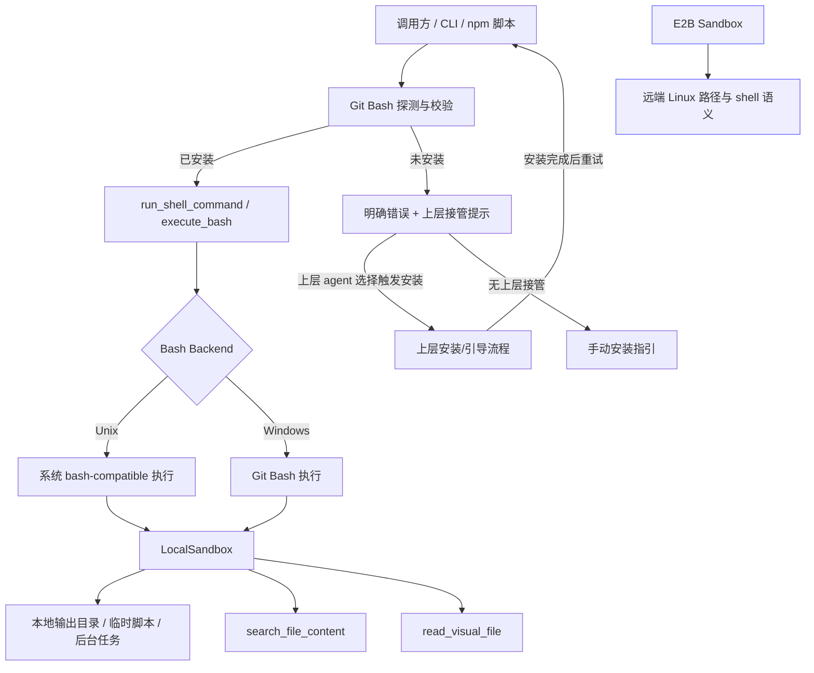
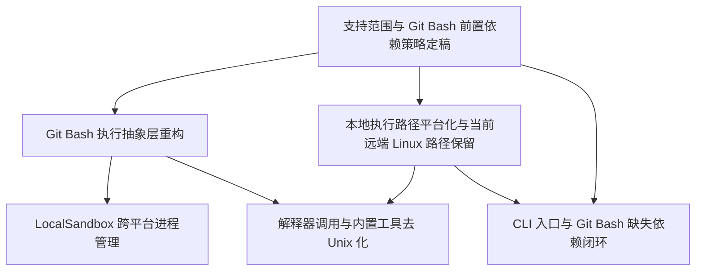

# RFC-0019: NexAU Windows 正式支持（依赖 Git Bash）

## 摘要

本 RFC 为 NexAU 引入 **Windows 正式支持（依赖 Git Bash）** 的核心运行时方案，目标覆盖 **Windows 10 / Windows 11**。RFC-0019 聚焦于本地执行面的可运行闭环：将 Git Bash 设为 Windows 上唯一官方 shell 路径，统一 shell 执行抽象、适配 LocalSandbox 的进程生命周期、平台化本地输出路径与临时目录、消除关键内置工具中的 Unix-only 假设与 Windows 差异风险，并让现有 CLI / npm / 脚本入口在检测到未安装 Git Bash 时，能够**立即返回明确的缺失依赖错误与上层接管提示**；若有安装/引导流程需求，应由依赖 NexAU 的上层 agent 自行处理并触发安装流程。

本 RFC 明确采用以下边界：

- Windows 官方支持前提为：**已安装 Git Bash（Git for Windows）**。
- NexAU 核心运行时仅负责 Git Bash 的探测、校验、失败快速返回与上层接管提示；**不在本 RFC 中承担自动下载安装职责**。
- 若启动或运行过程中检测到未安装 Git Bash，系统应立即返回明确错误，并告知应由依赖 NexAU 的上层 agent 或外部引导流程负责触发安装；若不存在上层引导，则回退到明确的手动安装指引。
- Windows 上唯一官方 shell 路径为 **Git Bash**；PowerShell 不作为 RFC-0019 的官方主路径。
- 对外仍保留 `execute_bash` 接口名，以最小化 breaking change。
- Windows 用户路径以 **Local 优先**；E2B / Remote Sandbox 为可选补充路径。
- 官方支持路径保证 **Git Bash + 常见简单命令** 可用，不承诺所有 bash 专有语法、复杂 heredoc、或全部高级管道写法在 Windows 上与 Linux 完全等价。
- **E2B 远端 Linux 语义保持不变**，不将其 `/tmp`、`/home/user` 等路径错误地“Windows 化”。

## 动机

当前项目在 Linux / macOS 上有较强的一等公民假设，但在 Windows 下存在系统性兼容缺口，导致“可安装”不等于“可正式运行”。主要问题包括：

1. **shell 语义默认指向 bash，但 Windows 默认环境并不保证有 bash**：`execute_bash`、heredoc scriptify、`run_shell_command`、`shlex.quote` 均以 POSIX shell 为中心设计。
2. **LocalSandbox 依赖 POSIX 进程语义**：`os.killpg()`、`os.getpgid()`、`SIGTERM` / `SIGKILL`、`start_new_session=True` 等行为在 Windows 下不成立或不等价。
3. **本地路径硬编码 Unix 目录**：`/tmp`、Unix site-packages 路径、bash 输出目录等会直接阻断 Windows 本地运行。
4. **关键内置工具直接拼接 Unix 命令**：如 `read_visual_file.py` 使用 `mkdir -m`、`ls | sort`、`rm -rf`；`search_file_content.py` 通过 shell 拼接 ripgrep 命令。
5. **启动入口依赖 bash，但当前缺少 Windows 侧的 Git Bash 探测、失败快速返回与上层接管契约**：`run-agent` 与 `package.json` 的脚本路径无法保证在“未预装 Git Bash”的 Windows 机器上形成清晰一致的缺失依赖体验。

与完全转向 PowerShell 相比，Git Bash 更符合项目现有的 bash / POSIX 世界观，也更符合模型生成 shell 命令时的先验模式。将 Windows 正式支持定义为“依赖 Git Bash”可以显著降低 shell 语义迁移成本，同时避免将 WSL 作为必选前置条件。

因此需要一个聚焦 RFC，明确：

- Windows 的官方支持边界不是“纯原生 shell”，而是“**Windows + Git Bash 前置依赖**”；
- 当缺失 Git Bash 时，NexAU 核心运行时必须 fail-fast 并输出清晰的缺失依赖错误，同时为依赖 NexAU 的上层 agent 预留接管安装/引导流程的契约；
- LocalSandbox、工具执行链和 CLI 入口仍需完成 Windows 特有的路径、进程和发现逻辑适配。

## 设计

### 概述

本 RFC 将 Windows 支持拆成两个执行面：

1. **本地执行面（Windows + Git Bash，需要适配）**
   - LocalSandbox
   - `run_shell_command` / `execute_bash`
   - Git Bash 探测、校验、缺失依赖错误与上层接管提示
   - 本地输出目录、临时文件、脚本生成路径
   - 本地内置工具调用链（如 `search_file_content`、`read_visual_file`）
   - Python / npm / 脚本启动入口

2. **远端执行面（本 RFC 当前仅覆盖 Linux 语义）**
   - 当前远端实现以 E2B / Remote Sandbox 的 Linux 语义为准
   - `/tmp`、`/home/user` 等既有 Linux 路径在当前远端实现中保持不变
   - 未来若引入 Windows RemoteSandbox，应复用统一兼容边界按平台能力分流，而不是把 `remote` 与 `linux` 绑定成隐含前提

核心思路不是把“Windows 默认 shell 语义”改造成与 Linux 对齐，而是：**将 Git Bash 作为 Windows 的官方 shell 基座，在此基础上补齐发现、路径、进程管理与入口体验，使 Windows 成为一个带前置依赖的正式支持平台；当依赖缺失时，NexAU 核心运行时 fail-fast，并把安装/引导流程留给依赖 NexAU 的上层 agent。**

本 RFC 当前正式定义的组合仅包括：

- `Local + Windows`
- `Remote + Linux`

这属于当前支持范围收敛，而不是长期架构上将 `Windows` 与 `Local`、`Linux` 与 `Remote` 永久绑定。

### 非目标

- 不将 PowerShell 作为 Windows 官方 shell 路径。
- 不保证所有 bash 专有语法在 Windows 上与 Linux 完全等价。
- 不改变当前 E2B / Remote 远端 Linux 的路径与 shell 语义。
- 不在本 RFC 中完成 `execute_bash` 的 API 重命名。
- 不在本 RFC 中实现或验证 Windows RemoteSandbox；但相关抽象边界不得以“Remote 永远是 Linux”为长期前提。
- 不包含 Windows CI、全面测试参数化、文档与 DX 完善（属于 RFC-B 范围）。

### 关键设计决策

1. **Windows 正式支持以 Git Bash 为前提，且 Local 优先**
   - Windows 10 / 11 纳入正式支持矩阵。
   - Windows 官方支持前提为已安装 Git Bash（Git for Windows）。
   - Windows 用户默认优先使用 LocalSandbox / 本地执行路径。
   - E2B 不是 Windows 的默认替代方案，而是补充能力。

2. **缺失 Git Bash 时，NexAU 核心运行时 fail-fast，由上层 agent 负责触发安装流程**
   - Git Bash 的探测与校验应优先由启动前检查或依赖 NexAU 的上层产品流程承载，但 NexAU 核心运行时本身不承担自动下载安装职责。
   - 启动时或进入需要 shell 能力的关键路径前，可进行轻量复检。
   - 若未检测到 Git Bash，系统必须立即返回明确提示与缺失依赖错误，不回退到 PowerShell，也不在底层静默触发安装。
   - 若存在依赖 NexAU 的上层 agent，应由上层 agent 根据该错误/提示自行决定是否触发安装或引导流程；若不存在上层引导，则回退到明确的手动安装指引。
   - 这样可以把安装器、权限、下载源、企业环境限制等复杂度留在更贴近产品交互层的上层系统，而不是固化到 NexAU 核心运行时。

3. **保留 `execute_bash` 名称，内部语义继续以 bash-compatible shell 为核心**
   - 现有 API 名称暂不重命名，以避免大面积 breaking change。
   - 在 Windows 上，`execute_bash` 的官方含义是“通过 Git Bash 执行 bash-compatible 命令”。
   - 后续若需要更中性的公共 API，可在后续 RFC 中评估渐进式别名，而不是在本 RFC 内完成重命名。

4. **Git Bash 是 Windows 唯一官方 shell 路径**
   - RFC-0019 不再以 PowerShell 作为官方默认路径。
   - PowerShell 可作为人工排障或未来扩展方向，但不纳入本 RFC 的官方契约。
   - 这样可以最大程度复用现有 bash 风格提示、文档与工具行为。

5. **shell 抽象仍然需要，但目标改为“统一 bash backend 发现与构建”**
   - 即使官方 shell 改为 Git Bash，仍不能继续把 `run_shell_command`、`scriptify_heredoc()`、`shlex.quote()`、`cd && command` 包装方式散落修补。
   - 需要定义统一的 bash backend 发现、调用、参数引用、前后台执行、输出重定向规则。

6. **当前支持矩阵下的路径策略分离**
   - Local 执行面的路径策略必须平台感知，如 temp dir、输出目录、脚本文件目录、Git Bash 可执行文件定位。
   - 当前远端实现以 Linux 语义为准，保留 `/tmp`、`/home/user` 等既有行为。
   - 该分离是基于“当前远端实现为 Linux”的支持范围收敛，而不是将 `Remote` 永久等同于 `Linux`。
   - 共享常量若同时被 Local 与 Remote 使用，必须拆为“按 sandbox 类型/平台解析”的策略，而不是简单全局替换。

7. **关键内置工具一并纳入 RFC-0019**
   - `search_file_content` 与 `read_visual_file` 属于核心工具链，而不是可无限后置的外围 DX。
   - 即使 Windows 上有 Git Bash，这些工具仍涉及本地路径、Python 调用、文件发现、清理行为和第三方工具探测，不能假设“装了 Git Bash 就自动解决”。

8. **平台适配逻辑必须集中到统一兼容边界，且平台能力与 sandbox 类型解耦**
   - 必须存在明确的跨平台兼容边界模块（如 `nexau/archs/platform/` 或同级集中组织），而不是在各业务模块中零散堆叠 `sys.platform` 判断。
   - `Local / Remote` 与 `Windows / Linux` 属于两个正交维度；本 RFC 当前只正式定义 `Local + Windows` 与 `Remote + Linux` 两类组合。
   - 该兼容边界至少要承载四类职责：bash backend 发现与调用、进程兼容语义、路径 helper / 路径格式转换、Git Bash 探测 / 校验 / 上层接管提示。
   - `local_sandbox.py`、`run_shell_command.py` 与内置工具优先调用统一接口，而不是各自重复实现平台分支。
   - 未来若出现 Windows RemoteSandbox，应继续通过统一兼容边界按平台能力分流，而不是在代码中把 `remote` 等同于 `linux`。
   - RFC 不强制具体文件名，但要求职责边界清晰、调用入口统一、当前支持范围与未来扩展边界都能从该兼容层显式表达。

9. **平台依赖遵循统一降级与拒绝原则**
   - 能力可用则正常执行。
   - 能力缺失但有 fallback，则降级执行并明确告知用户。
   - 能力缺失且无 fallback，则明确报错并提供安装指引。
   - 语义无法等价保证时，明确拒绝，不偷偷弱化承诺。
   - Windows 下 `search_file_content` 采用 `rg` 优先、Python fallback 兜底的官方策略。
   - Windows 下 `read_visual_file` 在缺失 `ffmpeg` 时降级为仅图片支持，并返回清晰提示。
   - Windows 进程终止优先采用标准库可维护方案，更强的平台专用机制留待必要时再引入。

### 接口契约

#### 1. shell 执行契约

保持 `BaseSandbox.execute_bash(...)` 现有签名不变，但实现语义调整为：

- **Unix / Linux / macOS**：继续执行系统 bash-compatible 路径。
- **Windows Local**：执行已探测到的 Git for Windows shell 可执行文件路径（通常为 `bash.exe` 或等效非 GUI shell binary），而不是终端启动器。
- **当前 Remote / E2B Linux 实现**：保持既有远端 Linux bash 语义，不引入 Git Bash 路径发现或 Windows 本地 shell 行为。
- 若未来出现 Windows RemoteSandbox，应通过同一兼容边界为其定义独立 shell 契约，而不是复用“remote = Linux”的隐含前提。
- 对调用方承诺以下跨平台稳定语义：
  - 可指定 `cwd`
  - 可注入 `envs`
  - 可前台执行或后台执行
  - 返回 `CommandResult` 结构不变
  - 支持输出文件落盘、状态轮询、超时与终止

若 Windows 未探测到 Git Bash：

- 立即返回明确的缺失依赖错误，不回退到 PowerShell 官方路径
- 提供可被上层 agent 消费的缺失依赖说明与接管提示，以便上层按自身产品流程决定是否触发安装或引导
- 若不存在上层接管流程，则直接回退到明确的手动安装指引

Windows Local 执行路径还必须满足：

- 不得依赖 `shell=True` 的默认 shell 行为，不得残留 `cmd.exe` 执行路径
- 必须显式调用探测到的 Git Bash shell 可执行文件，例如以 `shell=False` + `[git_bash_path, "-c", command]` 或等效方式执行；这里的 `git_bash_path` 指向 `bash.exe` 或等效 shell binary，而不是终端启动器
- 所有 LocalSandbox 命令执行路径都必须统一经过 Git Bash backend，而不是混用 `cmd.exe` 与 Git Bash

#### 2. Git Bash 发现与缺失依赖契约

Windows 侧至少需要定义以下能力：

- `detect_git_bash()`：检测 Git Bash 是否已安装，返回可执行路径与版本信息（若可得）
- `ensure_git_bash()`：以探测与校验为主；实现上可由启动前检查、显式 doctor/check 流程或上层 agent 编排承载；运行时仅在启动或 shell 关键路径做轻量复检与提示
- `explain_git_bash_requirement()`：在缺失 Git Bash 时提供清晰说明与人工安装指引
- `handoff_git_bash_install()`：向依赖 NexAU 的上层 agent 暴露“需要安装/引导 Git Bash”的可消费错误或结构化提示，由上层自行决定是否触发安装流程

RFC 不要求具体函数名必须固定，但要求具备等效能力。

缺失依赖处理流程必须满足：

- 明确告知当前缺失 Git for Windows / Git Bash
- 明确告知 NexAU 核心运行时不会在底层静默安装 Git Bash
- Git Bash 探测顺序遵循：显式配置 > PATH > 常见安装目录
- 缺失依赖错误可被上层 agent 捕获并据此触发安装/引导流程
- 若没有上层接管流程，则必须退化为清晰、可理解的手动安装说明

#### 3. 本地路径契约

本地执行面路径规则：

- 临时目录、输出目录、scriptify 路径均应通过平台感知 helper 决定
- Windows Local 场景下必须先生成 **Python 原生本地路径**，再按需要显式转换为 Git Bash 可消费的路径格式；不允许把两种格式混用成隐式约定
- 不允许在 Local 路径中把 POSIX 风格 `/tmp` 当作跨 Python 与 Git Bash 的共享稳定路径
- 不允许在本地安装资源定位逻辑中硬编码 Unix site-packages 路径作为主要路径
- Git Bash 可执行文件路径需要通过探测逻辑确定，不能写死单一路径

Windows Local 路径转换还必须满足：

- 需要传给 Git Bash 命令字符串的路径，应通过统一 path helper 转为 Git Bash 可消费格式（如 `/c/...` 语义或等效稳定格式），而不是直接拼接 Python 的 `C:\...` 路径字符串
- 需要传给 Python 标准库文件 API 的路径，应始终保留为 Python 原生本地路径，不依赖 shell 输出结果反向推断
- `subprocess.Popen` / `cwd` 等 Python 进程参数应使用 Python 原生路径；只有进入 Git Bash 命令语义的路径才做显式转换
- 环境变量、解释器路径、脚本路径、输出文件路径若同时跨越 Python 层与 Git Bash 层，必须通过统一 helper 明确声明“原生路径”与“Git Bash 路径”的边界
- quoting / command building 需要在路径转换之后统一处理，避免把 Windows 驱动器路径或反斜杠语义误交给现有 POSIX quoting 规则

远端执行路径规则（当前仅定义 Linux 语义）：

- 当前远端实现中，E2B 的 `/tmp`、`/home/user` 等语义保持不变
- 本 RFC 不要求将当前远端 Linux 沙箱路径映射成 Windows 风格路径
- 未来若引入 Windows RemoteSandbox，应通过同一套兼容边界重新定义其远端 Windows 路径契约，而不是默认套用当前远端 Linux 规则

#### 4. CLI / 启动入口契约

RFC-0019 完成后，Windows 上至少应满足：

- 现有 `nexau` / Python 入口可启动
- 现有 npm / 脚本入口（如 `npm run agent` 等）具备 Windows 可用路径
- 若未安装 Git Bash，启动链路会立即返回明确错误，并为依赖 NexAU 的上层 agent 预留接管安装/引导流程的契约；若无上层接管，则提供清晰手动安装指引
- 不要求用户手工先装 WSL 或自行寻找 bash.exe 后才能开始使用

### 架构图

## 权衡取舍

### 考虑过的替代方案

1. **只正式支持 WSL，不支持本地 Windows 路径**
   - 优势：实现成本最低，最大限度复用现有 Linux 语义。
   - 劣势：用户门槛高；企业环境中不一定允许；不符合“Windows 正式支持”的产品目标。
   - **放弃原因**：不满足当前产品方向。

2. **Windows 默认改用 PowerShell，而不要求 Git Bash**
   - 优势：更接近“纯原生 Windows”。
   - 劣势：需要显著重写 shell 语义、提示、文档、模型行为预期；bash 风格命令兼容成本高。
   - **放弃原因**：与现有项目和模型的 bash 世界观偏差过大，短期收益低于成本。

3. **直接将 `execute_bash` 重命名为 `execute_shell` / `execute_command`**
   - 优势：接口语义更中性、更准确。
   - 劣势：会影响大量现有调用点、文档和用户心智；迁移成本高；与本 RFC 的“先建立正式支持闭环”目标不匹配。
   - **放弃原因**：当前优先兼容而非强制 API 迁移。

4. **让 NexAU 核心运行时直接承担 Git Bash 自动安装职责**
   - 优势：理论上可把缺依赖到恢复可用的路径全部包在底层，首屏体验更顺滑。
   - 劣势：会把下载源、权限、安装器兼容、企业环境限制与产品交互复杂度固化进 NexAU 核心运行时，边界过重。
   - **放弃原因**：当前决策改为“缺失 Git Bash 时由 NexAU fail-fast，并由依赖 NexAU 的上层 agent 负责触发安装/引导流程”。

5. **只修复 LocalSandbox，不纳入内置工具兼容**
   - 优势：RFC 范围更小，落地更快。
   - 劣势：搜索、视觉文件处理等核心工具仍会在 Windows 上失败，无法形成真正可用的 Windows 正式支持体验。
   - **放弃原因**：不满足验收标准。

### 缺点

1. **“Windows 正式支持”将带有显式前置依赖，不再是零依赖纯 Native 路径**。
2. **缺失 Git Bash 时，NexAU 核心运行时只能 fail-fast 并交由上层 agent 或人工流程处理，这会引入跨层协调复杂度**。
3. **Git Bash 能大幅降低 shell 语义迁移成本，但并不能自动消除 Windows 进程管理与本地路径差异问题**。
4. **保留 `execute_bash` 命名会继续留下一定语义历史包袱，不过与 Git Bash 方案相比该问题显著减轻**。

## 实现计划

### 阶段划分

- **阶段 1：策略与前置依赖定稿**
  - 明确支持矩阵、Git Bash 前置依赖、缺失依赖处理契约、兼容边界、本地/远端路径分离原则。
- **阶段 2：本地运行时改造**
  - 完成 Git Bash backend 抽象、LocalSandbox 生命周期、路径 helper、本地工具执行链适配。
- **阶段 3：入口与缺失依赖闭环验证**
  - 完成 CLI / npm / 脚本入口适配，以及 Git Bash 缺失时的“明确错误 + 上层接管提示 / 手动安装指引”流程。

### 子任务分解

#### 依赖关系图

#### 子任务列表

| ID | 标题 | 依赖 | Ref |
| --- | --- | --- | --- |
| T1 | 支持范围与 Git Bash 前置依赖策略定稿 | - | - |
| T2 | Git Bash 执行抽象层重构 | T1 | - |
| T3 | LocalSandbox 跨平台进程管理 | T2 | - |
| T4 | 本地执行路径平台化与当前远端 Linux 路径保留 | T1 | - |
| T5 | 解释器调用与内置工具去 Unix 化 | T2, T4 | - |
| T6 | CLI 入口与 Git Bash 缺失依赖闭环 | T1, T4 | - |

#### 子任务定义

##### T1：支持范围与 Git Bash 前置依赖策略定稿

**范围**
- 将 Windows（Win10 / Win11）纳入“依赖 Git Bash”的正式支持矩阵
- 固化 Local 优先、E2B 可选的支持策略
- 固化 `execute_bash` 命名兼容策略与 Git Bash 唯一官方 shell 策略
- 明确缺失 Git Bash 时 fail-fast、上层 agent 接管安装流程、无上层时回退手动指引的产品边界
- 明确非目标与排除项

**验收标准**
- RFC 中的支持边界、非目标、兼容边界无歧义
- 明确说明 Git Bash 是 Windows 官方支持前提
- 明确说明缺失 Git Bash 时的 fail-fast、上层接管与手动指引策略
- 明确说明当前远端 Linux 语义保持不变，但不被永久抽象为所有 Remote 的固定语义

##### T2：Git Bash 执行抽象层重构

**范围**
- 引入 Git Bash backend / profile 的发现与调用抽象
- 将 Windows Local 执行路径收敛为显式 Git Bash 调用模型，避免 `shell=True` 默认落到 `cmd.exe`
- 明确 Windows 下 `subprocess.Popen` 的启动参数策略，包括 `shell=False`、`start_new_session` / `creationflags` 或等效参数组合的取舍边界，并说明其对 T3 进程终止策略的影响
- 统一 `shlex.quote()` 及相关 quoting 处理到 bash-compatible command building 中
- 统一 `run_shell_command` 的 cwd、env、前后台执行构建
- 清理 `run_shell_command` 及相关代码文档/契约中残留的 PowerShell 官方路径表述，确保实现文档与“Git Bash 是 Windows 唯一官方 shell 路径”的 RFC 决策一致
- 为 heredoc / 多行脚本定义在 Git Bash 路径下的官方支持边界

**验收标准**
- Windows 下基础命令可通过 Git Bash 官方路径执行
- 所有 LocalSandbox 命令执行路径都统一经过 Git Bash backend，不残留 `shell=True -> cmd.exe` 路径
- Windows Local 的 `Popen` 启动参数策略清晰，T2 的启动模型与 T3 的终止模型之间不存在未定义空档
- `run_shell_command` 不再依赖无法定位 bash 时的脆弱假设，且实现文档/说明不再宣称 PowerShell 是 Windows 官方执行路径
- 多行脚本执行策略清晰，复杂 bash heredoc 不被误承诺为完全等价 Linux 行为

##### T3：LocalSandbox 跨平台进程管理

**范围**
- 在 Python `subprocess` / `os` / `signal` 层为 Windows 定义进程创建、后台运行、轮询、超时终止、强制终止策略
- 重构 `_graceful_kill()` 中的 POSIX process group 依赖，并明确 Unix 与 Windows 的终止语义边界
- Unix Local 保持既有 process group 语义；Windows 首版采用标准库优先策略：`terminate()` → wait → `kill()` 或等效可维护流程，而不假设 `killpg()` / `getpgid()` 可用
- 适配 `cleanup_manager.py` 的 signal / cleanup 逻辑，明确 Windows 下的信号注册、终止与回退行为
- 明确该任务与 Git Bash shell 选择正交，依赖 T2 主要是为了复用最终确定的进程启动参数形态
- Windows 终止策略优先采用标准库可维护方案，仅在其不足时再评估更强的平台专用机制

**验收标准**
- Windows 下长命令可超时结束
- Windows 下后台任务可启动、查询、终止
- LocalSandbox 清理逻辑不依赖 `killpg()`、`getpgid()` 等 POSIX-only API
- `cleanup_manager.py` 在 Windows 下的信号注册与终止路径有明确定义，不依赖 Unix `SIGTERM` / `kill(os.getpid(), signum)` 语义才能正确收敛
- 首版实现不以更复杂的 Windows 专用强终止机制作为前置条件

##### T4：本地执行路径平台化与当前远端 Linux 路径保留

**范围**
- 为 Local 执行面引入 temp/output/script path helper
- Windows Local 场景统一先生成 Python 原生路径，再通过统一 helper 在进入 Git Bash 命令语义时转换为 Git Bash 可消费路径
- 明确 `cwd`、环境变量、解释器路径、脚本路径、输出路径在 Python 层与 Git Bash 层之间的格式边界
- 移除本地 `/tmp` 与 Unix 安装路径的硬编码主路径依赖
- 增加 Git Bash 可执行文件探测路径策略
- 保留当前 E2B / Remote Linux 实现中的 `/tmp`、`/home/user` 等路径语义
- 路径 helper 与兼容边界不得将 `Remote` 永久等同于 `Linux`；未来若出现 Windows RemoteSandbox，应能在同一抽象下扩展其远端 Windows 路径契约
- 重构 `cli_wrapper.py` 的资源 / 安装路径发现逻辑，移除对 Unix site-packages 与固定 Python 版本路径的主前提依赖

**验收标准**
- Windows 本地输出目录、临时脚本、工具输出路径合法可用
- Local 不再把 POSIX `/tmp` 当作 Python 与 Git Bash 的共享稳定路径
- `scriptify_heredoc` 的缺省脚本目录不能在 Windows Local 上静默回退到硬编码 `/tmp`
- Python 原生路径与 Git Bash 路径的转换边界清晰，命令字符串中使用的路径不再依赖隐式兼容或偶然可用的 `C:\...` 表达
- Git Bash 探测不依赖单一固定安装路径
- 当前 E2B / Remote Linux 路径行为保持不变，且其语义未被错误抽象为“所有 Remote 都等于 Linux”
- 本地资源定位不再以 Unix site-packages 路径作为主前提

##### T5：解释器调用与内置工具去 Unix 化

**范围**
- 将 `python3` 调用改为可移植解释器调用，优先通过 `sys.executable` 或平台 helper 注册的解释器路径完成，而不是依赖 shell PATH 中固定存在 `python3`
- `search_file_content` 在 Windows 下采用 `rg` 优先、Python fallback 兜底的执行策略
- `search_file_content` 的 grep 输出解析需正确处理 Windows 驱动器路径（如 `C:\path:42:content`），避免把盘符后的 `:` 误判为字段分隔符
- `read_visual_file` 移除对本地 Unix-only 文件管理与清理方式的依赖，并以 Python 原生目录创建、遍历、排序与清理能力替代 `mkdir` / `ls | sort` / `rm -rf` 等 shell 链
- `read_visual_file` 在缺失 `ffmpeg` 时降级为仅图片支持，并返回清晰提示
- 对需要把 shell 输出路径再交回 Python 文件 API 的链路，优先改用 Python 原生列表/遍历能力，避免 Git Bash 路径格式与 Windows 路径格式不一致

**验收标准**
- Windows 下 Python helper 能稳定执行，且不依赖 shell PATH 中固定存在 `python3`
- `search_file_content` 在 Windows + Git Bash 下优先使用 `rg`，缺失时可降级到 Python fallback
- `search_file_content` 能正确解析 Windows 驱动器路径输出，不静默丢失 `C:\...:line:content` 形式的匹配结果
- `read_visual_file` 在 Windows 下的核心处理链路可运行；缺失 `ffmpeg` 时仍可处理图片并明确提示视频能力受限
- 不再依赖 `ls` 等 shell 输出路径直接驱动 Python 文件读取的脆弱链路

##### T6：CLI 入口与 Git Bash 缺失依赖闭环

**范围**
- 以 `nexau` / Python CLI 为主入口，补齐 Git Bash 探测 + 调用链
- 保持现有 npm / 脚本入口在 Windows 下有兼容可用路径
- Windows 下的 `run-agent` 替代机制需在实现时选型（如 Python 脚本、`.bat/.cmd` 包装器或直接引导到 Python CLI）
- 设计缺失 Git Bash 时的 fail-fast 流程：底层立即报错，并向依赖 NexAU 的上层 agent 暴露可消费的接管提示；若无上层接管，则回退到手动安装指引
- 保持 Python 入口与 CLI 包装的可用性

**验收标准**
- Windows 在未安装 Git Bash 的情况下，主触发入口会立即返回明确的缺失依赖错误，而不是在底层静默回退或尝试自动安装
- 依赖 NexAU 的上层 agent 可根据缺失依赖错误/提示决定是否触发安装或引导流程
- 若没有上层接管流程，用户能获得清晰错误与手动安装指引
- 启动链路保留轻量复检，避免安装后环境变化导致静默失败
- 现有 npm / 脚本入口具备 Windows 兼容可用路径

### 影响范围

- `nexau/archs/sandbox/base_sandbox.py`
- `nexau/archs/sandbox/local_sandbox.py`
- `nexau/archs/sandbox/e2b_sandbox.py`
- `nexau/archs/tool/builtin/shell_tools/run_shell_command.py`
- `nexau/archs/tool/builtin/file_tools/search_file_content.py`
- `nexau/archs/tool/builtin/file_tools/read_visual_file.py`
- `nexau/archs/main_sub/utils/cleanup_manager.py`
- `nexau/archs/main_sub/execution/middleware/long_tool_output.py`
- `nexau/cli_wrapper.py`
- `run-agent`
- `package.json`
- `pyproject.toml`
- 新增或集中化的平台兼容边界模块（承载 shell backend / process compat / path helpers / Git Bash discovery / validation / handoff 等职责）

## 测试方案

### 自动化验证

1. **单元测试**
   - Git Bash 探测、缺失判断、缺失依赖错误与上层接管提示生成
   - bash backend / quoting / command building
   - LocalSandbox 进程启动、超时、后台任务、终止
   - 路径 helper（Local 与 E2B 分流，以及 Python 原生路径 / Git Bash 路径转换）
   - `search_file_content` Windows + Git Bash 执行路径与 Windows 驱动器路径解析
   - `read_visual_file` Windows 下文件管理、排序与清理逻辑（Python 原生替代 shell 链）
   - `cleanup_manager.py` Windows 下 signal / cleanup 回退逻辑

2. **集成测试**
   - Windows 下最小 agent 启动
   - `run_shell_command` 执行基础命令、cwd 切换、环境变量注入
   - 后台任务状态轮询与 kill
   - 缺失 Git Bash 时的“明确错误 + 上层接管提示 / 手动安装指引”闭环
   - 搜索工具与视觉文件工具的最小可运行链路
   - Windows Local 执行链中 Git Bash 路径与 Python 原生路径协同工作，不回退到 `cmd.exe` 或 `/tmp` 假设

3. **回归验证**
   - Linux / macOS 现有 bash 路径不回退
   - E2B 远端 Linux 依旧保留 `/tmp` 与 `/home/user` 等既有语义

### 人工验证

- Windows 10 / 11 上已安装 Git Bash 时，启动最小 agent 并验证常见简单命令、路径输出、后台任务与关键工具可运行
- Windows 10 / 11 上未安装 Git Bash 时，启动最小 agent 并验证 NexAU 会立即返回明确错误与接管提示，而不是静默回退到其他 shell
- 若存在依赖 NexAU 的上层 agent，验证其可基于缺失依赖错误触发安装/引导流程，并在安装完成后重新进入正常启动路径
- 若不存在上层接管流程，验证用户能获得清晰、可执行的手动安装说明
- Linux / macOS 现有行为不受影响，E2B 远端 Linux 路径与 shell 语义不被 Windows 适配误改

## 未解决的问题

1. Git Bash 的官方下载源、版本策略和安装参数应由依赖 NexAU 的上层 agent 如何固定与维护？
2. 若上层 agent 负责触发 Git Bash 安装流程，其权限提升、企业环境兼容与失败降级体验应如何定义？
3. Windows 的 MAX_PATH 限制是否需要在路径 helper 设计中主动缓解？

## 参考资料

- `docs/rfcs/0018-external-tool.md`
- `docs/rfcs/meta/0018-external-tool.json`
- `nexau/archs/sandbox/base_sandbox.py`
- `nexau/archs/sandbox/local_sandbox.py`
- `nexau/archs/sandbox/e2b_sandbox.py`
- `nexau/archs/tool/builtin/shell_tools/run_shell_command.py`
- `nexau/archs/tool/builtin/file_tools/search_file_content.py`
- `nexau/archs/tool/builtin/file_tools/read_visual_file.py`
- `nexau/archs/main_sub/utils/cleanup_manager.py`
- `nexau/cli_wrapper.py`
- `nexau/archs/tool/builtin/file_tools/apply_patch.py`
- `run-agent`
- `package.json`
