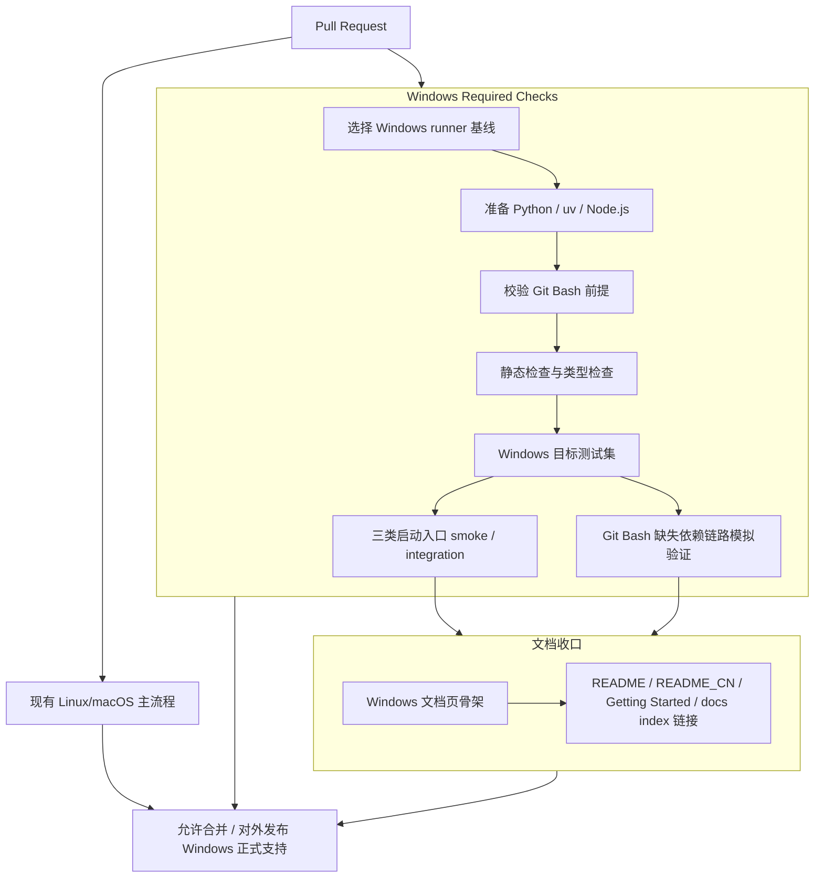
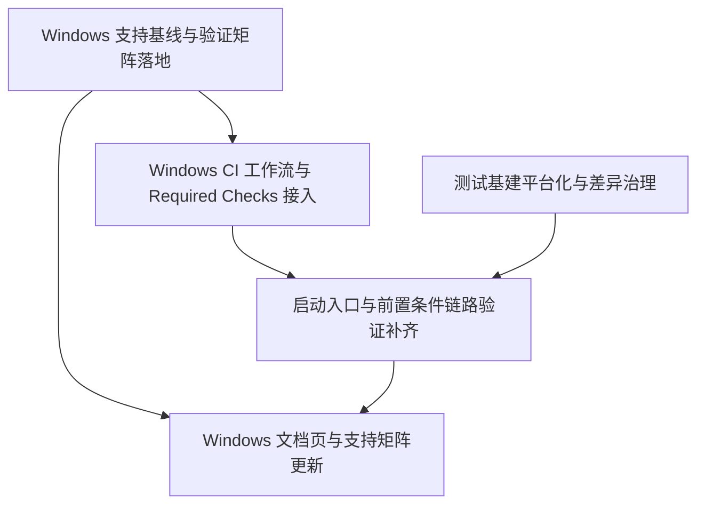

# RFC-0020: NexAU Windows 验证、CI 与文档交付

## 摘要

在 RFC-0019 已确定“Windows 正式支持（依赖 Git Bash）”的前提下，RFC-0020 负责把该支持能力补齐为可交付状态：为 Windows 建立接近主流程且**必须通过**的 CI 校验，补齐测试基建与**三类启动入口 + 一类前置条件链路**的验证（Python CLI、npm/脚本入口、Git Bash 缺失依赖处理链路、legacy wrapper），并新增独立 Windows 文档页，对外明确声明仅支持 **Windows 10 / Windows 11 + Git Bash**。

## 动机

RFC-0019 解决的是“Windows 如何跑起来”的运行时与入口设计问题，但“正式支持”不能只停留在设计层面，还必须满足以下交付条件：

1. **可验证**：没有 Windows CI 和稳定测试覆盖，就无法证明提交没有破坏 Windows 支持。
2. **可阻塞**：既然要对外宣称正式支持，Windows 校验就不能只是观察性 job，而应进入合并阻塞面。
3. **可说明**：README / Getting Started / 文档站如果不明确写明“依赖 Git Bash”，用户会误解为纯 Native Windows shell 直接支持。
4. **可维护**：若三类启动入口与一类前置条件链路缺乏持续验证，后续改动容易只保住某一条主路径，却悄悄破坏兼容入口。

当前仓库的 `.github/workflows/ci.yml` 仅包含 Ubuntu 维度的 lint / typecheck / test job，`docs/` 与 README 也尚未形成 Windows 支持的独立说明页面，因此仍不足以支撑“Windows 正式支持”的发布语义。

## 设计

### 概述

RFC-0020 将 Windows 支持的交付要求收敛为四个方面：

1. **Windows CI 成为 required checks**：Windows 校验强度尽量接近主流程，但不要求机械复制所有 Linux-only job；凡与 Windows 正式支持直接相关的检查必须成为阻塞项。
2. **测试覆盖尽量全面**：在单元测试、集成测试和入口 smoke test 三层补齐 Windows 适配，重点治理平台分支、路径差异、Git Bash 依赖和入口链路。
3. **验证对象分层明确**：持续验证对象分为 **三类启动入口**（`nexau` Python CLI、npm/脚本入口、legacy `nexau-cli` wrapper）与 **一类前置条件链路**（Git Bash 探测 / fail-fast 缺失依赖错误 / 上层接管提示 / 重探测）。
4. **文档与支持声明统一收口**：新增独立 Windows 文档页；README / README_CN / Getting Started / docs index 仅明确写明“Windows 10 / 11，依赖 Git Bash”，不扩展为复杂能力矩阵。

### 关键设计决策

1. **Windows 必过，但不要求逐项复制 Linux-only 验证面**
   - Windows CI 要接近主流程，意味着它应覆盖依赖安装、静态检查、类型检查、目标测试集和入口 smoke test。
   - 但像 E2B SaaS / Self-host 这类与远端 Linux 语义强绑定、且本身不等价于本地 Windows 支持的 job，可以继续保留在 Linux runner；RFC-0020 不要求把它们原样搬到 Windows runner。
   - 最终原则是：**与“Windows 本地正式支持”直接相关的校验必须在 Windows runner 上阻塞合并**。

2. **Windows CI 使用 Windows 原生命令编排，不把 Makefile 可移植性纳入范围**
   - 用户已明确“开发工具链跨平台化暂不处理”。
   - 因此 Windows CI 不以 `make lint` / `make test` 能否直接跑通为前提，而是允许在 Windows job 中直接调用等价的 `uv` / `python` / `npm` / Git Bash 命令。
   - 这样可以在不扩张范围到 Makefile 可移植性的前提下，仍然实现接近主流程的验证强度。

3. **Windows CI 采用“固定 runner 基线 + 非交互环境准备 + 缺失依赖链路模拟验证”**
   - 默认以 GitHub-hosted `windows-latest` 作为首选 runner 基线；若后续 image 漂移引发稳定性问题，再收敛到固定的 Windows image 版本。
   - Python / `uv` / Node.js 的准备应使用 Windows 原生可重复的安装方式或官方 setup action，而不是沿用 Linux 风格的 `curl | sh`。
   - Git Bash 在 CI 中优先复用 runner 已提供的 Git for Windows / Git Bash；若环境不满足前提，应 fail-fast 或进行非交互式准备，而不是依赖交互式安装流程。
   - Git Bash 缺失依赖链路在 CI 中以**可控模拟**为主，验证提示、错误、上层接管提示、重探测等分支，而不把 required check 建立在真实交互安装流程之上。

4. **测试基建采用“集中承载平台差异 + 显式注入关键缺失/降级分支”**
   - 平台相关 fixture、helper、marker 与环境注入逻辑应集中承载，避免在测试用例中散落 `if platform` 风格判断。
   - 测试层需建立统一的标记与注入约定，至少覆盖：Windows / POSIX 差异、Git Bash 缺失/存在、`rg` 缺失 fallback、`ffmpeg` 缺失降级、解释器调用差异。
   - 对路径生成、shell 选择、换行与进程行为等平台敏感点，应优先通过 helper 与专用断言验证，而不是依赖偶然跑通的端到端行为。

5. **验证粒度以“启动入口 + 前置条件链路稳定性”优先于“全量测试复制”**
   - Windows 支持的高风险点主要集中在：启动入口发现、Git Bash 缺失依赖处理、路径/进程差异、兼容 wrapper，以及 RFC-0019 中定义的关键降级路径。
   - 因此 RFC-0020 优先要求在 Windows 上对这些链路建立稳定可重复的 smoke / integration 验证，再逐步扩展到更广的单元与回归覆盖。
   - 这比简单追求“把 Linux 下所有测试原样全跑一遍”更符合平台风险结构。

6. **文档单独成页，但公开支持表述保持克制**
   - 用户已选择“单独 Windows 文档页”。
   - 该页面重点讲 Git Bash 依赖、缺失依赖报错、自检与常见问题；README 与支持矩阵只做最小必要说明，不展开 `rg` / `ffmpeg` / 开发工具链的细粒度能力表。
   - 对外表述统一为：**Windows 正式支持范围 = Windows 10 / Windows 11，且依赖 Git Bash**。

7. **legacy 入口继续验证，直到有明确弃用 RFC 为止**
   - 尽管 `nexau` Python CLI 是主入口，当前仓库仍存在 `package.json` 脚本入口和 `nexau-cli` legacy wrapper。
   - 在未另行规划弃用策略前，这些入口既然仍对用户可见，就必须继续处于可验证状态，而不能默认“只保主路径即可”。

### 与 RFC-0019 的实施时序

- **RFC-0019 提供运行时能力，RFC-0020 负责交付闭环**：`requires: ["0019"]` 表示 Windows CI、测试与文档的最终闭环建立在 RFC-0019 的运行时抽象已落地之上。
- **可先行推进的工作**：T1（支持基线与验证矩阵）可在 RFC-0020 被接受后立即开始；T3 也可先搭建 marker、fixture、helper 与模拟注入框架。
- **依赖 RFC-0019 关键子任务的工作**：T2 的 required checks 最终收口，以及 T4 的启动入口 / 前置条件链路完整验证，需至少等待 RFC-0019 中与 Git Bash 执行抽象、路径平台化和 CLI 入口闭环相关的关键子任务落地。
- **更精确的跨 RFC 依赖**：其中，Windows 本地执行路径与 `cmd.exe` 回退消除主要依赖 RFC-0019 T2；`cli_wrapper.py` 与 legacy `nexau-cli` wrapper 的可验证性主要依赖 RFC-0019 T4；缺失 Git Bash 时的 fail-fast、上层接管提示与入口闭环验证主要依赖 RFC-0019 T6。
- **文档可先搭骨架、后做最终收口**：T5 可先创建 Windows 文档骨架和入口链接，但面对外发布的最终文案应以 T4 已跑通的验证结果为准。

### 接口契约

RFC-0020 不新增用户态 API，但会固定以下交付契约：

#### 公开支持声明

对外文案必须明确满足以下语义：

- **Supported OS**: Windows 10, Windows 11
- **Required shell dependency**: Git Bash
- **Primary entrypoint**: `nexau`
- **Compatible entrypoints to keep validated**:
  - `npm run run-agent` / `npm run agent` 等 npm/脚本入口
  - legacy `nexau-cli`
- **Prerequisite chain to keep validated**:
  - Git Bash 探测 / fail-fast 缺失依赖错误 / 上层接管提示 / 重探测

#### CI 契约

- Windows 相关 required checks 必须进入 PR / merge 阻塞面。
- Windows job 不允许只是“失败可忽略”的观察性校验。
- Windows job 需显式验证 Git Bash 前提满足或按设计模拟缺失依赖 / 上层接管提示分支。
- 任何新增的平台条件跳过或 `posix_only` 标记都必须显式标注原因，并能在 CI 日志中诊断；不允许通过大面积条件跳过静默削弱现有 Linux/macOS 主流程。

#### 文档契约

- 新增独立 Windows 文档页（建议路径：`docs/windows.md`）。
- `README.md`、`README_CN.md`、`docs/getting-started.md`、`docs/index.md` 至少要有一处清晰的 Windows 支持入口说明，并链接到该独立页面。
- 支持矩阵粒度只到 **Win10 / Win11 + Git Bash**，不在本 RFC 中引入更细的外部依赖能力矩阵。

### 架构图

### 非目标

本 RFC 明确不包含以下内容：

1. **Makefile / 开发工具链的完整 Windows 可移植化**。
2. **重新设计 RFC-0019 的运行时抽象、路径抽象或 Git Bash 缺失依赖处理机制**。
3. **把 `rg`、`ffmpeg`、Node.js 等外部依赖扩展为复杂能力矩阵文档**。
4. **为 PowerShell 或其他非 Git Bash shell 提供新的官方支持路径**。
5. **为所有 Linux-only job 在 Windows 上构建完全等价替身**。

## 权衡取舍

### 考虑过的替代方案

#### 方案 A：Windows CI 先只做观察性 job，稳定后再阻塞

- **优点**：短期更容易落地，减少初始红灯对主流程的冲击。
- **缺点**：与“Windows 正式支持”的外部承诺不一致，且容易长期停留在“可见但不负责”的状态。
- **放弃原因**：用户已明确要求“Windows 必过”，因此不能把 Windows 校验设计成非阻塞辅助项。

#### 方案 B：只保 `nexau` Python CLI，其他入口不纳入验证

- **优点**：测试面更小，实施成本更低。
- **缺点**：会让 npm/脚本入口和 legacy wrapper 在持续迭代中失去保护，用户可见入口与验证面脱节。
- **放弃原因**：用户已明确要求三类启动入口与一类前置条件链路都要覆盖；在未弃用前，这些用户可见路径和前置条件仍属于支持面。

#### 方案 C：把 Windows 说明只合并进现有 Getting Started，不新增独立页面

- **优点**：文档改动更少，维护点更集中。
- **缺点**：Windows 前置依赖、缺失依赖报错与上层接管说明会挤占通用安装说明，且不利于后续单独迭代。
- **放弃原因**：用户已明确选择“单独 Windows 文档页”。

#### 方案 D：顺手把 Make / 全开发工具链 Windows 化

- **优点**：理论上可以让 CI、开发者本地与文档命令完全统一。
- **缺点**：范围显著扩大，且与当前交付目标“先把正式支持验证闭环建立起来”不匹配。
- **放弃原因**：用户已明确“暂不处理开发工具链跨平台化”。

### 缺点

1. **Windows required checks 会增加 CI 运行时长与维护成本**。
2. **Windows runner 与真实用户环境仍有差异，无法完全替代 Win10 / Win11 真实机器手工验收**。
3. **继续维护 legacy wrapper 验证会带来额外成本，但在未弃用前这是必要支出**。
4. **文档只聚焦 Git Bash，意味着其他依赖能力说明仍需依靠工具报错与上下文文档补充，而不是在本 RFC 中一次性解决**。

## 实现计划

### 阶段划分

- **阶段 1：Windows 支持基线与验证矩阵落地**
  - 在仓库中落地 Windows 支持范围、required checks 边界与三类启动入口 / 一类前置条件链路责任矩阵的基线产物，为后续 CI / 测试 / 文档提供统一引用。
- **阶段 2：CI 与测试基建补齐**
  - 建立 Windows runner 校验链，并并行治理 marker、fixture、skip 与平台差异注入框架；其中 required checks 的最终收口需与 RFC-0019 的运行时落地保持一致。
- **阶段 3：入口验证与文档收口**
  - 在 RFC-0019 关键运行时能力落地后，补齐三类启动入口与一类前置条件链路的持续验证，并基于真实验证结果完成 Windows 文档页与 README / Getting Started 的最终对外表述。

### 子任务分解

#### 依赖关系图

#### 子任务列表

| ID | 标题 | 依赖 | Ref |
| --- | --- | --- | --- |
| T1 | Windows 支持基线与验证矩阵落地 | - | - |
| T2 | Windows CI 工作流与 Required Checks 接入 | T1 | - |
| T3 | 测试基建平台化与差异治理 | - | - |
| T4 | 启动入口与前置条件链路验证补齐 | T2, T3 | - |
| T5 | Windows 文档页与支持矩阵更新 | T1, T4 | - |

#### 子任务定义

##### T1：Windows 支持基线与验证矩阵落地

**范围**
- 在仓库中落地一份可被 CI、测试与文档共同引用的 Windows 支持基线清单。
- 明确并固化以下内容：支持范围文案（Win10 / Win11 + Git Bash）、required checks 命名与边界、三类启动入口与一类前置条件链路各自的验证归属。
- 允许该基线以文档骨架、校验矩阵说明或等效的仓库内配置说明承载，但不能只停留在 RFC 文本中。

**验收标准**
- 仓库中存在可被后续任务直接引用的基线产物，而不是仅依赖口头约定或 RFC 描述。
- Windows 支持范围、required checks 边界与三类启动入口 / 一类前置条件链路的责任矩阵已明确且无冲突。
- T2 与 T5 可直接复用该基线，避免在 CI 与文档中再次发散出多套表述。

##### T2：Windows CI 工作流与 Required Checks 接入

**范围**
- 在 GitHub Actions 中增加或拆分 Windows runner job，使其进入 required checks。
- 默认以 GitHub-hosted `windows-latest` 作为首选 runner 基线；若后续 image 漂移导致不稳定，再收敛到固定 image 版本。
- 采用 Windows 原生命令与官方 setup action 组织 Python / `uv` / Node.js 的准备、lint / format-check / typecheck / pytest / smoke 校验，不以 `make` 可移植为前提。
- 明确 Git Bash 在 CI 中的准备、发现或 fail-fast 步骤；真实 required checks 不依赖交互式安装流程，而以环境校验和非交互准备为主。
- 为 Git Bash 缺失依赖错误、上层接管提示与重探测场景预留可控模拟验证入口，供 T4 在测试层完成分支覆盖。

**验收标准**
- PR 上存在明确可见且阻塞合并的 Windows required checks。
- Windows job 可稳定完成依赖安装、Git Bash 前提校验以及主流程等价的静态检查、类型检查和目标测试集。
- Windows job 的日志足以区分“环境准备失败”“Git Bash 不满足前提”“测试回归”等主要类别。
- CI 方案未把 required check 建立在真实交互式安装流程之上。
- Windows CI 的接入不得通过大面积平台条件跳过静默削弱现有 Linux/macOS 主流程；新增平台 skip/marker 需可在 CI 日志中诊断原因。

##### T3：测试基建平台化与差异治理

**范围**
- 为 Windows 引入或整理测试 marker、fixture、helper 与 skip 策略，并集中承载平台差异注入逻辑，避免在测试内散落平台判断。
- 建立统一的测试约定，至少覆盖：Windows / POSIX 差异、Git Bash 缺失/存在、`rg` 缺失 fallback、`ffmpeg` 缺失降级、解释器调用差异。
- 治理测试中对 POSIX 路径、shell、换行、进程行为的隐式假设。
- 让单元测试与集成测试可在 Windows runner 上稳定执行，而不是依赖偶然兼容。
- 为路径 helper、临时目录 / 输出目录 / script 目录生成逻辑提供专门单元测试，验证其不再回退到 `/tmp` 硬编码。

**验收标准**
- Windows 相关测试不再依赖大量临时 `xfail` 或脆弱环境假设。
- 核心平台差异（路径、换行、shell、进程）有明确 fixture / helper / marker 承载，而非散落在测试内硬编码。
- RFC-0019 设计的关键降级路径（Git Bash、`rg`、`ffmpeg`、解释器调用差异）均有可重复注入的验证方式。
- 平台路径 helper 具备专门单元测试，覆盖 Windows 下 temp/output/script dir 的生成逻辑，并确认不会回退到 `/tmp` 硬编码。
- Windows runner 上的目标测试集具备可重复性和可诊断性。

##### T4：启动入口与前置条件链路验证补齐

**范围**
- 为三类启动入口建立 Windows smoke / integration 验证：`nexau` Python CLI、npm/脚本入口、legacy `nexau-cli` wrapper。
- 为一类前置条件链路建立自动化或可控模拟验证：Git Bash 缺失、fail-fast 报错、上层接管提示、重探测。
- 验证 Windows 本地执行路径实际走 Git Bash，而不是残留 `shell=True` → `cmd.exe` 的默认回退。
- 结合 T3 提供的注入能力，验证入口与前置条件链路在关键降级 / 缺失分支下的可诊断行为。

**验收标准**
- 三类启动入口与一类前置条件链路均有明确的自动化验证归属，不存在“仅人工记忆保证”的链路。
- Git Bash 缺失依赖链路至少覆盖 fail-fast、上层接管提示与重探测等关键分支，且 CI 中的自动化路径以模拟验证为主。
- Windows 本地命令执行路径可验证实际使用 Git Bash，不残留 `shell=True` → `cmd.exe` 的默认退路。
- Windows 入口 smoke test 与集成测试失败时，可定位到具体入口、前置条件阶段或降级分支。

##### T5：Windows 文档页与支持矩阵更新

**范围**
- 新增独立 Windows 文档页，重点说明 Git Bash 前置依赖、缺失依赖报错、自检与常见问题。
- 在 README / README_CN / Getting Started / docs index 中补充 Windows 支持入口与链接。
- 将对外支持矩阵统一为“Win10 / Win11 + Git Bash”，避免模糊描述。
- 文档不扩展为 `rg` / `ffmpeg` / Node.js 等复杂能力矩阵。
- 允许先提交文档骨架，但最终对外表述需以 T4 已验证通过的入口与行为为准。

**验收标准**
- 用户从 README、README_CN 或 docs 首页能明确找到 Windows 指引入口。
- Windows 文档页显式写明 Git Bash 是前置依赖。
- 对外表述只声明 Win10 / Win11，不超范围承诺其他 Windows 版本。
- 文档内容与实际已验证入口一致，不出现“文档承诺大于 CI/测试覆盖”的情况。

### 影响范围

- `.github/workflows/ci.yml`
- `pyproject.toml`
- `package.json`
- `pytest.ini`
- `tests/conftest.py`
- `tests/unit/**`
- `tests/integration/**`
- `tests/e2e/**`（如需补充入口 smoke / 平台回归）
- `nexau/cli/main.py`
- `nexau/cli_wrapper.py`
- `run-agent`（或 RFC-0019 落地后的等效 Windows 脚本入口）
- `README.md`
- `README_CN.md`
- `docs/index.md`
- `docs/getting-started.md`
- 新增：`docs/windows.md`

## 测试方案

### 自动化验证

1. **Windows required checks**
   - 依赖安装与基础环境准备。
   - Git Bash 可用性校验与前置条件链路模拟验证。
   - 等价 lint / format-check / typecheck。
   - Windows 目标 pytest 集合。
   - 三类启动入口的 smoke / integration 验证。
   - 关键降级路径验证：`rg` 缺失 fallback、`ffmpeg` 缺失降级、解释器调用差异。

2. **测试分层**
   - **单元测试**：平台 helper、集中式 fixture/marker、路径生成逻辑、换行/进程分支、Git Bash 探测与入口选择。
   - **集成测试**：CLI 启动、入口参数透传、Git Bash 缺失依赖报错 / 上层接管提示 / 重探测关键分支、legacy wrapper 最小运行链路、实际走 Git Bash 而非 `cmd.exe` 的执行路径验证。
   - **回归验证**：Linux / macOS 现有主流程不因 Windows 校验接入而静默弱化；新增平台 skip / `posix_only` 需带原因并可在 CI 日志中诊断。

3. **失败分类**
   - 环境准备失败
   - Git Bash 前提失败
   - 平台差异测试失败
   - 启动入口 / 前置条件链路失败
   - 关键降级分支失败
   - 文档引用或帮助文本不一致

### 人工验证

- 在 Windows 10 与 Windows 11 真实环境上各执行至少一轮发布前手工验收。
- 验证 Git Bash 缺失时的 fail-fast 提示、上层接管说明与手动处理路径。
- 验证 `nexau` 主入口、npm/脚本入口、legacy wrapper 的最小可运行链路。
- 验证 README / docs / Windows 文档页中的关键命令与路径说明可实际复现。

## 未解决的问题

1. Windows required checks 最终应拆成多个独立 job，还是先以一个聚合 job 落地，再逐步细分？
2. Win10 / Win11 的真实机器人工验收应依赖团队现有设备，还是后续引入额外的托管/自托管 runner？
3. legacy `nexau-cli` wrapper 计划继续支持多久，何时应另起 RFC 讨论弃用时间表？

## 参考资料

- `docs/rfcs/0019-windows-support-with-git-bash.md`
- `docs/rfcs/meta/0019-windows-support-with-git-bash.json`
- `docs/cross-platform-guidelines.md`
- `.github/workflows/ci.yml`
- `pyproject.toml`
- `package.json`
- `run-agent`
- `nexau/cli/main.py`
- `nexau/cli_wrapper.py`
- `tests/conftest.py`
- `docs/index.md`
- `docs/getting-started.md`
- `README.md`
- `README_CN.md`
