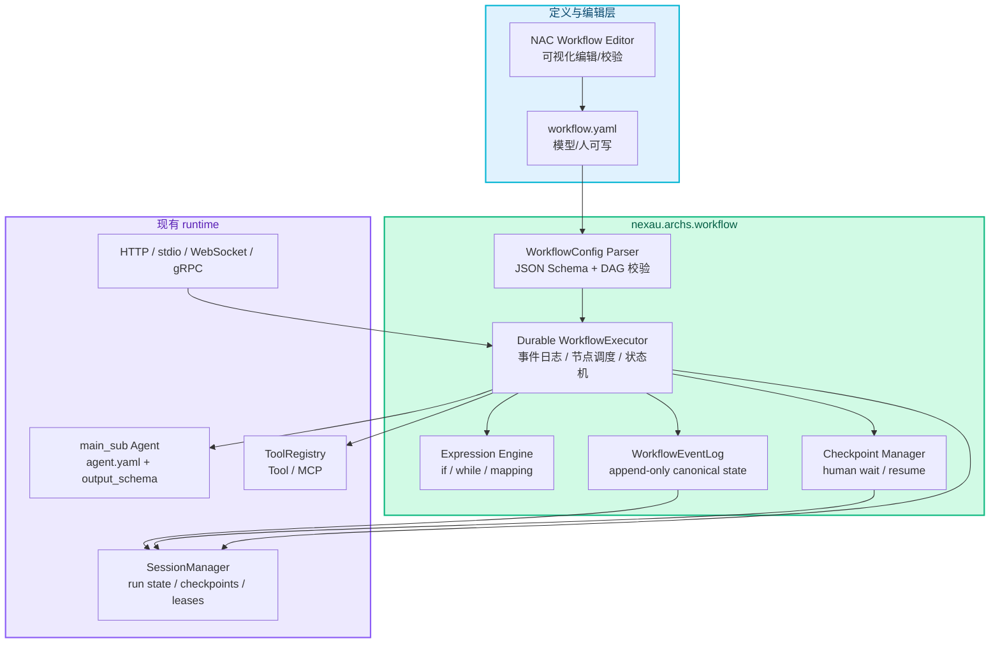
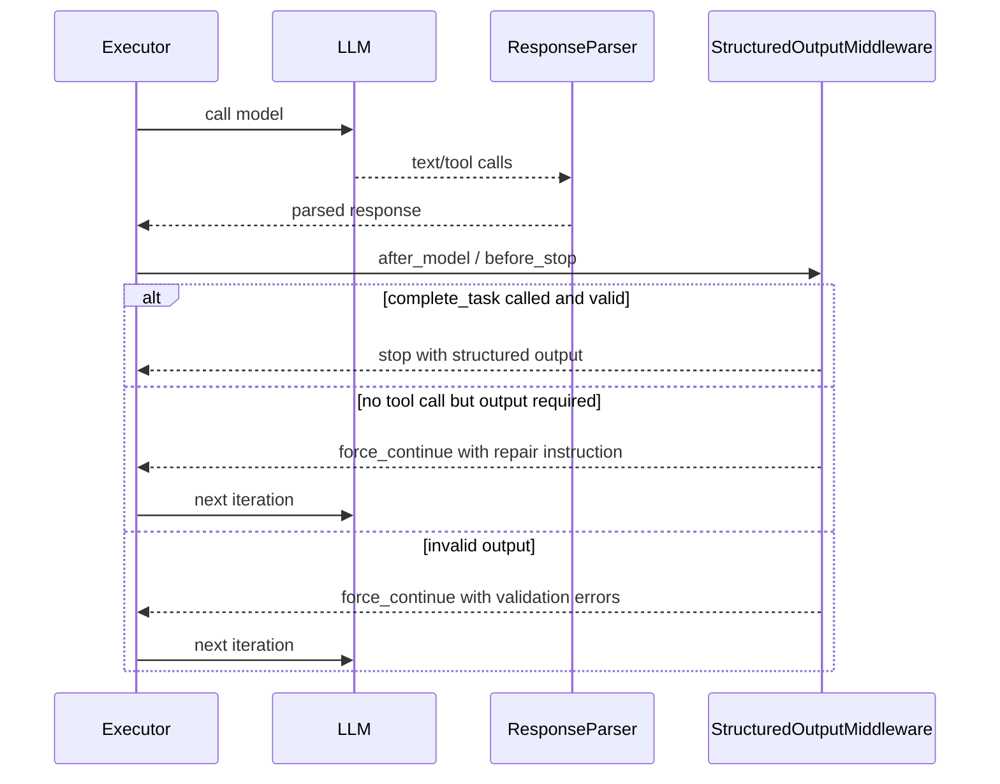
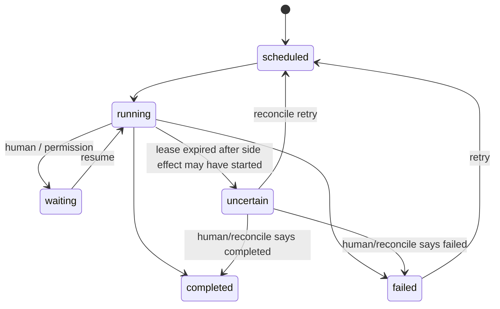
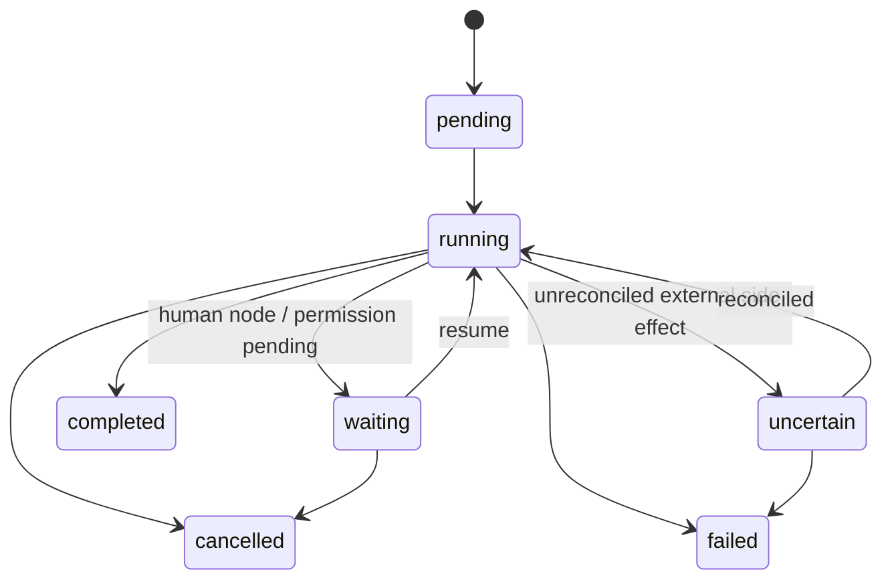
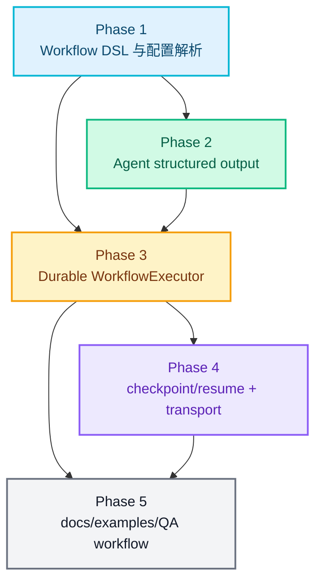

# RFC-0027: Agent Workflow 编排与结构化输出

- **状态**: implemented
- **优先级**: P1
- **标签**: `architecture`, `workflow`, `agent`, `dx`, `persistence`
- **影响服务**: `nexau/archs/workflow/`, `nexau/archs/main_sub/`, `nexau/archs/tool/`, `nexau/archs/session/`, `nexau/archs/transports/`, `docs/`, `examples/`
- **创建日期**: 2026-05-24
- **更新日期**: 2026-05-24

## 摘要

NexAU 需要在现有 `main_sub` Agent 执行框架之外，新增一等 `workflow` 架构层，用 YAML 编排多个 Agent、Tool/MCP 调用、条件分支、循环和 Human checkpoint。Workflow runtime 必须是 **durable execution**：以 append-only event log 为真源，在 node boundary 落盘，进程崩溃/重启/部署后可以从最后一个 durable 状态继续。Agent 节点必须支持 `output_schema`，并通过 provider 原生 structured output、动态 `complete_task` tool、JSON code block 解析 + retry 三层策略兼容不同推理引擎。NAC 可以作为 Workflow 编辑器，但 Workflow 定义、运行、checkpoint/resume、durable recovery 和结构化结果校验应由 NexAU runtime 承担。

## 动机

### 1. Agent 节点天然需要 structured output

当前 NexAU Agent 更偏向“完成一个任务并返回文本”，而 workflow 中的 Agent 节点通常要把输出交给下游节点消费。例如 QA workflow 里，测试用例生成 Agent 需要产出 `cases[]`，执行 Agent 需要产出 `pass/fail/evidence`，汇总 Agent 需要产出结构化报告。如果只返回自由文本，下游节点只能做脆弱解析，workflow 也无法可靠恢复或重放。

### 2. 低代码不是核心，模型可写 YAML 才是核心

OpenAI Agent Builder 展示了 Start/Agent/Tool/Logic/Data 等节点思路；Taskfile 展示了易写、易读、变量化、可 include 的 YAML workflow 体验。NexAU 不应该先做一个只能在 UI 中编辑的低代码运行时，而应该先定义“模型和人都能写”的 Workflow YAML。NAC 可以编辑它、可视化它、校验它，但不是 runtime 的唯一入口。

### 3. QA 自动化需要 Agent + Workflow 的混合形态

“生成一批 test case，校验后让 QA 机器人自己去操作”不是单 Agent 或 AgentTeam 能舒服表达的场景：

- 需要先生成/评审 test case；
- 需要 human node 审批或修正；
- 需要 while node 批量执行测试；
- 需要 Tool/MCP node 驱动浏览器、业务系统或外部服务；
- 需要 checkpoint/resume，避免人类审批期间占用运行中的 Agent；
- 需要最终 QA 结果可被机器读取。

### 4. AgentTeam 与 Workflow 分工不同

`AgentTeam` 解决并行协作、任务领取、队内消息；Workflow 解决确定性编排、数据流、分支/循环、人审和 resume。两者应该互补：workflow 的某个 Agent 节点可以启动一个 AgentTeam，AgentTeam 的 leader 也可以调用一个 workflow，但二者不应互相替代。

### 5. Human node 要求 workflow 是 durable execution

一旦引入 human node，workflow 不能再依赖内存中的 Python 调用栈：审批可能持续数小时或数天，worker 进程可能重启，部署可能发生，外部 Tool/MCP 调用也可能卡在未知状态。因此 WorkflowExecutor 必须像一个 durable state machine：节点开始、完成、失败、等待人类输入、resume、取消等状态都先写入持久化日志，再推进后续调度。

## 非目标

1. **不把 NAC 作为首要 runtime**：本 RFC 只要求 NAC 能编辑/可视化同一份 Workflow YAML；不要求 workflow 依赖 NAC 才能运行。
2. **不实现完整低代码平台**：权限、版本发布、多人协作编辑、节点市场等属于后续产品层能力。
3. **不强依赖 provider 原生 structured output**：原生能力只是优化路径，兼容路径必须能在 XML tool calling 或普通文本输出模型上工作。
4. **不在首版实现 OpenAI Agents SDK Python/TS export**：本 RFC 会保留 IR 设计空间，但首要目标是 NexAU runtime 可运行。
5. **不替代 Python 编排**：复杂工程逻辑仍可用 Python；Workflow YAML 面向可视化、可恢复、可由模型生成的常见编排。
6. **不改变已有 Agent `.run()` 默认返回文本的兼容语义**：结构化输出通过新增配置和新增 API 暴露。
7. **不实现完整 deterministic replay 引擎**：首版不做 Temporal 风格的 Python 调用栈重放，也不要求 workflow 代码重放后逐步产出相同副作用。
8. **不承诺外部副作用 exactly-once**：Tool/MCP/Agent 里的邮件发送、浏览器操作、数据库写入只能通过 idempotency key、side-effect policy 和 `uncertain` 状态管理。

## 设计

### 概述

新增 `nexau.archs.workflow`，作为 `main_sub` Agent runtime 之上的确定性编排层：



Workflow Runtime 只负责“确定性控制流 + 数据流 + durable 持久化”。具体智能行为仍由 Agent YAML 定义，外部动作仍通过 Tool/MCP 执行。恢复时不重放已完成节点，而是 fold event log 得到当前 state、node outputs、ready queue 和 checkpoint，再从下一个可执行 boundary 继续。

### 1. Workflow YAML 格式

首版文件命名建议为 `workflow.yaml` 或 `*.workflow.yaml`：

```yaml
type: workflow
version: "1"
name: qa_regression
description: "Generate, review, execute, and summarize QA test cases."

inputs:
  requirement:
    type: string
    description: "Feature or change to test."

vars:
  max_cases: 20

durable:
  mode: node_boundary
  default_retry_policy:
    max_attempts: 2
    backoff: exponential
    on_uncertain: human_review

includes:
  agents:
    qa_planner: ./agents/qa_planner.yaml
    qa_runner: ./agents/qa_runner.yaml
  tools:
    browser_click: ./tools/browser_click.tool.yaml

nodes:
  start:
    type: start
    output:
      requirement: "{{ inputs.requirement }}"

  generate_cases:
    type: agent
    agent: qa_planner
    input:
      requirement: "{{ nodes.start.output.requirement }}"
      max_cases: "{{ vars.max_cases }}"
    output_schema:
      type: object
      properties:
        cases:
          type: array
          items:
            type: object
            properties:
              id: { type: string }
              title: { type: string }
              steps:
                type: array
                items: { type: string }
              expected: { type: string }
            required: [id, title, steps, expected]
      required: [cases]
      additionalProperties: false

  review_cases:
    type: human
    prompt: "Review generated QA cases."
    input:
      cases: "{{ nodes.generate_cases.output.cases }}"
    output_schema:
      type: object
      properties:
        approved: { type: boolean }
        cases:
          type: array
          items: { type: object }
      required: [approved, cases]

  route_review:
    type: if_else
    branches:
      - if: "nodes.review_cases.output.approved == true"
        next: run_cases
    else: generate_cases

  run_cases:
    type: while
    condition: "state.remaining_cases.length > 0"
    max_iterations: 50
    scope_key: "case-{{ state.remaining_cases[0].id }}"
    body: run_one_case
    init:
      remaining_cases: "{{ nodes.review_cases.output.cases }}"
      results: []

  run_one_case:
    type: agent
    agent: qa_runner
    side_effect: external_write
    idempotency_key: "{{ run.id }}:{{ node.scope_path }}"
    input:
      case: "{{ state.remaining_cases[0] }}"
    output_schema:
      type: object
      properties:
        case_id: { type: string }
        status: { type: string, enum: [passed, failed, blocked] }
        evidence: { type: string }
      required: [case_id, status, evidence]
    update:
      remaining_cases: "{{ state.remaining_cases[1:] }}"
      results: "{{ state.results + [nodes.run_one_case.output] }}"

  summarize:
    type: transform
    input:
      results: "{{ state.results }}"

edges:
  start: generate_cases
  generate_cases: review_cases
  review_cases: route_review
  run_cases: summarize
```

设计原则：

1. 顶层结构类似 Taskfile：`version`、`vars`、`includes`、命名节点 map，便于模型生成和人 review。
2. 节点不要求 UI 坐标；NAC 的布局信息只能放在可选 `ui` 字段中。
3. `nodes.<id>.output` 是节点间数据传递的唯一稳定引用。
4. `state` 是 workflow run 内的可持久化全局状态，适合 loop accumulator。
5. 所有表达式必须是 side-effect-free，不能直接执行 Python。
6. durable 配置只表达恢复、重试和副作用策略，不改变节点业务输入输出。

### 2. 节点类型

首版支持以下节点：

| 节点 | 作用 | 首版要求 |
|------|------|----------|
| `start` | 定义 workflow 输入归一化 | 必须唯一 |
| `agent` | 运行一个 NexAU Agent YAML | 支持 `output_schema` |
| `tool` | 调用一个 NexAU Tool | 复用 Tool YAML 和 ToolRegistry，支持 side-effect policy |
| `mcp` | 调用 MCP server/tool | 复用现有 MCP client，支持 idempotency key |
| `if_else` | 条件分支 | 表达式必须只读 `inputs/state/nodes` |
| `while` | 条件循环 | 必须有 `max_iterations`，每次迭代必须有 durable scope |
| `human` | 等待人类审批/输入 | 必须创建 durable checkpoint |
| `transform` | 数据 reshape / projection | 不调用 LLM |
| `set_state` | 写入 workflow state | 不调用 LLM |
| `end` | 显式结束并产出结果 | 可选 |
| `note` | 注释节点 | 不参与执行 |

与 OpenAI Agent Builder 的映射：

| OpenAI 节点分类 | OpenAI 节点 | NexAU 对应 |
|----------------|------------|------------|
| Core | Start / Agent / Note | `start` / `agent` / `note` |
| Tool | File search / Guardrails / MCP | `tool` / 后续 `guardrail` / `mcp` |
| Logic | If/else / While / Human approval | `if_else` / `while` / `human` |
| Data | Transform / Set state | `transform` / `set_state` |

NexAU 不照搬 OpenAI 的 visual schema，而是保留同类语义，并以本地 Agent YAML、Tool YAML、MCP 配置和 SessionManager 为核心。

### 3. Agent YAML `output_schema`

Agent 配置新增结构化输出配置：

```yaml
type: agent
name: qa_runner
tool_call_mode: structured

output_schema:
  type: object
  properties:
    status:
      type: string
      enum: [passed, failed, blocked]
    evidence:
      type: string
  required: [status, evidence]
  additionalProperties: false

output_mode: auto
output_retries: 3
```

字段语义：

| 字段 | 说明 |
|------|------|
| `output_schema` | JSON Schema，定义 Agent 最终机器可读输出 |
| `output_mode` | `auto` / `native` / `complete_task` / `json_block` |
| `output_retries` | 输出不合法时最多修复次数 |
| `output_name` | 可选，生成 `complete_task` tool 时用于描述输出对象 |

兼容策略：

1. 未配置 `output_schema` 的 Agent 行为不变，`Agent.run()` 继续返回文本。
2. Workflow 内的 `agent` node 可以覆盖 Agent YAML 中的 `output_schema`，但覆盖结果只对该节点生效。
3. Python API 新增 `run_structured()` 或 `WorkflowExecutor` 内部专用调用，避免破坏现有 `run()` 返回类型。

### 4. Structured Output 三层执行策略

不同推理引擎能力不一致，因此 `output_mode: auto` 按以下顺序选择：

#### 4.1 Provider 原生 structured output

当 provider adapter 明确声明支持原生 JSON Schema structured output，且当前 Agent 不需要与复杂 tool loop 冲突时，可走原生模式。该模式适合简单抽取、分类、规划节点。

#### 4.2 动态 `complete_task` tool

默认兼容路径是生成一个 stop tool：

```yaml
type: tool
name: complete_task
description: "Submit the final structured output and finish this agent node."
input_schema: "{{ output_schema }}"
```

执行规则：

1. `StructuredOutputMiddleware.before_agent` 注入动态 `complete_task` tool；
2. `complete_task` 的 `input_schema` 就是 Agent/node 的 `output_schema`；
3. 模型调用 `complete_task` 后，ToolExecutor 校验入参；
4. 校验通过则以 tool arguments 作为结构化输出，并触发 `STOP_TOOL_TRIGGERED`；
5. 校验失败则把 JSON Schema 错误作为 tool result 返回给模型，让模型重试。

这个策略可以同时兼容 NexAU 的 `structured` tool calling 和 `xml` tool calling，因为“最终输出”本质上被建模为一次工具调用，而不是依赖 provider 的专用 response format。

#### 4.3 JSON code block fallback

当工具调用不可用时，退化为 fenced JSON：

````markdown
```json
{ "...": "..." }
```
````

执行规则：

1. Prompt 明确要求最终只输出一个 `json` code block；
2. parser 只接受一个顶层 JSON object；
3. JSON parse 或 schema validation 失败时，追加 repair message 并重试；
4. 超过 `output_retries` 后，Agent node 失败，Workflow 根据 `on_error` 策略处理。

### 5. Force-continue 输出收敛

为避免模型忘记调用 `complete_task`，新增 `StructuredOutputMiddleware`：



需要新增一个明确的 executor 控制信号，表达“本轮看起来可以停止，但输出契约尚未满足，需要继续一轮”。这比把错误伪装成普通 tool result 更清晰，也能被 tracing 和 workflow events 观测。

### 6. Durable Execution 语义

WorkflowExecutor 采用 **durable state machine**，不采用首版 deterministic replay。也就是说，恢复时不会重新执行 Python 调用栈，也不会重新请求已完成的 LLM/Tool/MCP 节点；runtime 会 fold append-only event log 得到当前 run state，然后只调度尚未完成且可安全继续的节点。

首版 durable execution 承诺：

| 语义 | 承诺 |
|------|------|
| Run definition snapshot | workflow run 启动时保存 workflow YAML/展开后的 IR 摘要，运行中修改 YAML 不影响已有 run |
| Node boundary durability | 节点 scheduled / started / completed / failed / waiting / uncertain 都先写日志，再推进状态 |
| Completed node skip | 已有 `node_completed` 事件的节点恢复时不重复执行，直接复用持久化 output |
| Human wait durability | human node 写入 checkpoint 后 worker 可退出，resume 后从 checkpoint 后继继续 |
| At-least-once attempts | 未确认完成的 node attempt 可能被重试，因此节点必须声明副作用策略 |
| No exactly-once side effects | 外部写操作不承诺 exactly-once，必须通过 idempotency key 或 `uncertain` 状态处理 |

节点状态机：



Durable boundary：

1. 调度节点前写 `node_scheduled`；
2. 获取 lease 后写 `node_started`，包含 `attempt`、`scope_path`、输入快照和 `idempotency_key`；
3. 节点执行成功后写 `node_completed`，包含 schema 校验后的 output 和 raw output 摘要；
4. 节点执行失败后写 `node_failed`，根据 retry policy 决定是否写 `node_retry_scheduled`；
5. human node 写 `checkpoint_created` 后进入 `waiting`，不占用 worker；
6. worker 重启时扫描 running 且 lease 过期的 node attempt，按 `side_effect` 策略转为 retry 或 `uncertain`。

`while`、未来 parallel/fan-out 都必须使用 durable scope。节点实例的唯一键不是单纯 `node_id`，而是：

```text
(run_id, node_id, scope_path, attempt)
```

示例：

```text
run_cases[case-C001].run_one_case
run_cases[case-C002].run_one_case
run_cases[case-C003].run_one_case
```

### 7. 持久化模型与 checkpoint/resume

新增持久化模型，沿用 `session` 模块的 Repository pattern，但以 event log 为 canonical source of truth：

| 模型 | 作用 |
|------|------|
| `WorkflowEventModel` | append-only canonical event log，恢复/fold 的真源 |
| `WorkflowRunModel` | materialized run summary，方便查询 run 状态、输入、最终输出 |
| `WorkflowNodeRunModel` | materialized node status/output，方便 UI、调试和恢复快速索引 |
| `WorkflowCheckpointModel` | human/permission 等暂停点，保存 resume 所需快照 |
| `WorkflowLeaseModel` | worker lease / heartbeat，用于崩溃检测和接管 |
| `WorkflowStateModel` | 可选，保存大 state snapshot 或分片 state |

`WorkflowEventModel` 首版事件类型：

- `workflow_run_started`
- `node_scheduled`
- `node_started`
- `node_completed`
- `node_failed`
- `node_retry_scheduled`
- `node_uncertain`
- `checkpoint_created`
- `checkpoint_resumed`
- `state_patched`
- `workflow_run_completed`
- `workflow_run_failed`
- `workflow_run_cancelled`

Run 状态机：



Human node 执行流程：

1. WorkflowExecutor 到达 `human` node；
2. 校验并渲染 `prompt`、`input`、`output_schema`；
3. 写入 `checkpoint_created` 和 `WorkflowCheckpointModel`，run 状态置为 `waiting`；
4. transport 发出 `WorkflowWaitingEvent`，返回 `checkpoint_id`；
5. worker 可以安全退出；
6. 外部调用 resume API 提交 human output；
7. runtime 校验 output schema，写入 `checkpoint_resumed`；
8. fold event log 恢复 workflow state，从 checkpoint 后继节点继续执行。

Resume 必须满足：

- `checkpoint_id` 幂等；
- 已完成/已取消 checkpoint 不可重复 resume；
- resume payload 必须通过 `output_schema`；
- 恢复后从暂停节点的后继节点继续，不重复执行已完成节点；
- human output 和原始 prompt/input 进入 event log 与 trace，便于审计。

恢复算法：

1. 读取 run snapshot 和 `WorkflowEventModel`；
2. fold event log 得到 `state`、`nodes.<id>.output`、`scope_path`、checkpoint 和 ready queue；
3. 跳过所有已完成节点；
4. 对 `waiting` run 等待 resume；
5. 对 lease 过期的 `running` attempt，根据 `side_effect` 和 retry policy 转为 retry / `uncertain` / failed；
6. 继续调度 ready queue。

### 8. Tool/MCP node

`tool` node 复用现有 Tool YAML、ToolRegistry、formatter 和 middleware：

```yaml
fetch_issue:
  type: tool
  tool: github_get_issue
  side_effect: read_only
  input:
    repo: "{{ inputs.repo }}"
    number: "{{ inputs.issue_number }}"
  output_schema:
    type: object
```

`mcp` node 复用现有 MCP client：

```yaml
send_email:
  type: mcp
  server: gmail
  tool: send_email
  side_effect: external_write
  idempotency_key: "{{ run.id }}:{{ node.scope_path }}"
  retry_policy:
    max_attempts: 1
    on_uncertain: human_review
  input:
    to: "{{ state.recipient }}"
    subject: "{{ nodes.draft_email.output.subject }}"
    body: "{{ nodes.draft_email.output.body }}"
```

副作用策略：

| `side_effect` | 语义 | 恢复策略 |
|---------------|------|----------|
| `read_only` | 只读查询、搜索、读取文件 | lease 过期后可自动 retry |
| `idempotent_write` | 外部写入但支持 idempotency key | 使用同一 `idempotency_key` retry |
| `external_write` | 外部写入且无法确认 exactly-once | 不自动 retry，lease 过期后进入 `uncertain` |
| `local_write` | 写本地 workflow state 或临时文件 | 由 NexAU 按 node boundary 控制，可 retry |

约束：

1. Tool/MCP 入参先经过表达式渲染，再经过对应 tool schema 校验；
2. 原始输出写入 `WorkflowNodeRunModel.raw_output`；
3. LLM-facing formatter 输出只在 Agent 节点上下文需要时使用；
4. Tool/MCP node 默认不让模型参与，保证确定性和可重放；
5. 任何 `idempotent_write` / `external_write` 节点都必须显式声明 `idempotency_key` 或 `on_uncertain` 处理策略；
6. workflow runtime 不推断外部系统是否执行成功，未知结果必须进入 `uncertain`，由 human 或 reconcile node 处理。

### 9. 条件、循环与表达式

`if_else` 和 `while` 使用一个 side-effect-free 表达式子集。首版建议采用 CEL-compatible 语义子集，原因是 OpenAI Agent Builder 也使用 CEL 表达条件，团队迁移心智成本低。

表达式可访问：

| 名称 | 说明 |
|------|------|
| `inputs` | workflow 输入 |
| `vars` | workflow 静态变量 |
| `state` | workflow run state |
| `nodes.<id>.output` | 已完成节点输出 |
| `nodes.<id>.status` | 节点状态 |

安全规则：

- 不允许文件/网络/进程访问；
- 不允许动态 import；
- 不允许调用 Python 任意函数；
- 表达式求值失败默认让节点失败，除非配置 `on_error`；
- `while` 必须设置 `max_iterations`，防止无限循环。

### 10. Python API 与 Transport API

Python API：

```python
workflow = Workflow.from_yaml("qa.workflow.yaml")
result = await workflow.run_async(
    inputs={"requirement": "Test checkout retry behavior"},
    session_manager=session_manager,
    user_id="u1",
    session_id="s1",
)
```

Transport API 首版建议：

| API | 作用 |
|-----|------|
| `POST /workflows/{workflow_name}/runs` | 创建并启动 workflow run |
| `GET /workflow-runs/{run_id}` | 查询 run 状态 |
| `GET /workflow-runs/{run_id}/events` | SSE 订阅 workflow events |
| `POST /workflow-runs/{run_id}/resume` | resume human checkpoint |
| `POST /workflow-runs/{run_id}/cancel` | 取消 run |
| `POST /workflow-runs/{run_id}/reconcile` | 处理 `uncertain` 节点，标记 completed / failed / retry |

事件类型首版建议：

- `WorkflowRunStartedEvent`
- `WorkflowNodeStartedEvent`
- `WorkflowNodeFinishedEvent`
- `WorkflowNodeFailedEvent`
- `WorkflowNodeUncertainEvent`
- `WorkflowWaitingEvent`
- `WorkflowResumedEvent`
- `WorkflowRunFinishedEvent`
- `WorkflowRunFailedEvent`

### 11. 与现有模块的关系

| 模块 | 关系 |
|------|------|
| `main_sub` | Agent node 复用 Agent/Executor；新增 structured output 控制能力 |
| `tool` | Tool node 和动态 `complete_task` tool 复用 Tool schema / validation |
| `session` | 新增 workflow event log、run summary、node run、checkpoint、lease 持久化 |
| `transports` | 暴露 workflow run / resume / reconcile / events API |
| `tracer` | workflow run、node attempt、structured output retry、recovery/reconcile 需要 span |
| `AgentTeam` | 可作为 Agent node 内部能力，不是 workflow 的替代品 |

## 权衡取舍

### 考虑过的替代方案

| 方案 | 优点 | 缺点 | 决定 |
|------|------|------|------|
| 只用 Python 编排 | 灵活、无 DSL 成本 | 难可视化、难 checkpoint/resume、模型生成成本高 | 不采用为唯一方案 |
| 只在 NAC 做低代码 | 产品体验直观 | runtime 被 UI 绑死，CLI/SDK/模型不可直接使用 | 不采用 |
| 直接照搬 OpenAI Agent Builder schema | 迁移概念简单 | 与 NexAU Agent YAML/Tool YAML/Session 模型不贴合 | 不采用 |
| 只支持 provider 原生 structured output | 实现轻 | 不兼容大量推理引擎和 XML tool calling | 不采用 |
| 用动态 `complete_task` tool 作为默认结构化输出 | 兼容好，复用 Tool schema 和 stop_tools | 需要 middleware 强制收敛，模型可能多一轮 | 采用 |
| 直接引入外部 durable engine | 成熟的 lease/retry/timer 语义 | 依赖重、与 Agent/Session/Tool 现有模型耦合成本高 | 首版不采用，保留 adapter 空间 |

### 缺点

1. 新增 `workflow` 架构层会扩大 runtime 复杂度，需要清晰划分 WorkflowExecutor 与 Agent Executor 的责任。
2. JSON Schema 在 Python 类型系统中容易退化为动态结构，具体实现必须使用 `JsonValue` / Pydantic model / TypeGuard，避免 `Any` 扩散。
3. `while`、human checkpoint、resume 会引入更多边界状态，需要较完整的集成测试。
4. `complete_task` tool 默认策略会增加一次工具调用和可能的 repair 轮次，延迟略高于原生 structured output。
5. 表达式语言若选型不慎，会带来安全风险或跨语言迁移困难。
6. event log + materialized summary 是两套读写路径，必须保证 fold 逻辑和 summary 更新一致。
7. 外部副作用进入 `uncertain` 后需要 human/reconcile 介入，首版用户体验会比“自动重试到底”更保守。

## 实现计划

### 阶段划分

- [ ] Phase 1: Workflow DSL 与配置解析
  - 定义 `WorkflowConfig`、节点 discriminated union、durable 配置、表达式引用规则、graph 校验。
  - 支持 `start`、`agent`、`tool`、`mcp`、`if_else`、`while`、`human`、`transform`、`set_state`、`end`、`note` 的 schema。
  - 支持 `side_effect`、`idempotency_key`、`retry_policy`、`scope_key` 的静态校验。

- [ ] Phase 2: Agent structured output
  - 在 Agent YAML 中支持 `output_schema` / `output_mode` / `output_retries`。
  - 实现动态 `complete_task` tool、JSON code block parser、validation retry、force-continue middleware。
  - 新增 structured run result，不破坏现有 `run()` 返回文本。

- [ ] Phase 3: Durable WorkflowExecutor 核心运行时
  - 实现 append-only event log、fold/recovery、节点调度、数据映射、表达式求值、node output/state 管理。
  - 接入 Agent/Tool/MCP 执行路径。
  - 实现 node attempt、lease 过期接管、`uncertain` 状态和 workflow events/tracing spans。

- [ ] Phase 4: checkpoint/resume 持久化与 transport
  - 新增 workflow event / run / node run / checkpoint / lease 模型和 repository service。
  - 实现 human node wait/resume/cancel。
  - 暴露 HTTP/SSE run/resume/reconcile API；stdio/WebSocket/gRPC 后续按 transport 能力补齐。

- [ ] Phase 5: 文档、示例与 QA workflow
  - 添加 `examples/workflows/qa_regression/`。
  - 编写 workflow YAML reference、structured output guide、human checkpoint guide。
  - 补充 NAC 所需的 UI metadata 约定，但不要求 runtime 依赖 UI metadata。

### 子任务 DAG



### 相关文件

| 文件 | 说明 |
|------|------|
| `nexau/archs/workflow/` | 新增 workflow config、durable executor、expression、events、services |
| `nexau/archs/main_sub/config/base.py` | Agent config 增加 structured output 字段 |
| `nexau/archs/main_sub/execution/executor.py` | 增加 output contract force-continue 控制信号 |
| `nexau/archs/main_sub/execution/middleware/` | 新增 `StructuredOutputMiddleware` |
| `nexau/archs/tool/builtin/session_tools/complete_task.py` | 抽象为可由 output schema 动态生成/绑定的 stop tool |
| `nexau/archs/session/models/` | 新增 workflow event / run / node run / checkpoint / lease models |
| `nexau/archs/transports/http/` | 新增 workflow run/resume/reconcile/events API |
| `docs/advanced-guides/` | 新增 workflow、structured output、checkpoint resume 文档 |
| `examples/workflows/` | 新增 QA workflow 示例 |

## 测试方案

### 单元测试

- Workflow YAML parser：合法/非法节点、未知边、环、重复 start、缺失 max_iterations。
- Durable config parser：`external_write` 缺少 `idempotency_key` / `on_uncertain` 时 fail fast。
- Expression engine：只读上下文、条件分支、数组/对象访问、错误表达式。
- Structured output：动态 `complete_task` schema、JSON block 抽取、schema validation error、retry 上限。
- Agent config：未配置 `output_schema` 时兼容旧行为；配置后输出字段被正确加载。
- Human checkpoint：resume schema 校验、重复 resume 拒绝、cancel 后不可 resume。
- Event log fold：从事件日志恢复 run state、node outputs、ready queue、while scope。

### 集成测试

- 使用 fake LLM 跑完整 QA workflow：generate cases -> human approve -> while run cases -> summarize。
- Tool node 调用真实 ToolRegistry 中的简单 builtin tool。
- MCP node 使用本地 fake MCP server。
- Agent node 在 `structured` 和 `xml` tool_call_mode 下都能通过 `complete_task` 产出结构化结果。
- Workflow run 中断后从 `WorkflowEventModel` fold + `WorkflowCheckpointModel` resume，不重复执行已完成节点。
- running node lease 过期后，`read_only` 自动 retry，`external_write` 进入 `uncertain` 并等待 reconcile。
- while node 多次迭代生成不同 `scope_path`，恢复后不会覆盖或重复已完成迭代。

### 手动验证

1. 运行 `examples/workflows/qa_regression/qa.workflow.yaml`。
2. 在 human node 暂停，确认 SSE 收到 `WorkflowWaitingEvent`。
3. 调用 resume API 提交修改后的 test cases。
4. 确认 while node 执行每个 case，并把结果累积到 `state.results`。
5. 在 run 中途 kill worker，重启后确认已完成节点被跳过，ready queue 正确恢复。
6. 人工构造一个 `external_write` lease expired 场景，确认 run 进入 `uncertain` 并可通过 reconcile API 继续。
7. 确认最终 output 是通过 schema 校验的 JSON object。

## 未解决的问题

1. 表达式语言最终选择：采用 CEL 子集、JMESPath、JSONata，还是 NexAU 自定义极小表达式。
2. event log snapshot cadence：是否每 N 个事件生成一次 folded state snapshot，避免超长 workflow 恢复过慢。
3. Workflow 是否需要首版支持 parallel/fan-out，还是留到后续 RFC。
4. 原生 structured output 与 tool loop 同时存在时，各 provider adapter 的最佳策略如何统一。
5. NAC 的 UI metadata 是否需要标准化到 workflow YAML，还是单独保存为 NAC project metadata。
6. OpenAI Agents SDK Python/TS export 是否应基于 Workflow IR 单独出 adapter RFC。
7. 是否需要为外部 durable execution 引擎提供 adapter，使 NexAU Workflow IR 可落到第三方 durable runtime。

## 参考资料

- [OpenAI Agent Builder Node reference](https://developers.openai.com/api/docs/guides/node-reference) - 节点分类与 Agent/Tool/Logic/Data workflow 语义参考。
- [Taskfile Guide](https://taskfile.dev/docs/guide) - YAML-first workflow、变量、include、循环和交互式输入体验参考。
- [RFC-0002: AgentTeam 多 Agent 协作框架](./0002-agent-team.md) - Workflow 与 AgentTeam 的能力边界。
- [RFC-0006: 中性 Structured Tool Calling 与 Provider 延迟适配](./0006-neutral-structured-tool-calling.md) - 动态 `complete_task` tool 和 provider 兼容路径的基础。
- [RFC-0017: 工具输出扁平化](./0017-flatten-tool-output.md) - Tool/MCP node raw output 与 LLM-facing output 双通道。
- [RFC-0022: Agent Run Action 生命周期与 typed blocks](./0022-agent-run-action-lifecycle-and-typed-blocks.md) - Workflow checkpoint/resume 与 run event 持久化的设计参照。
