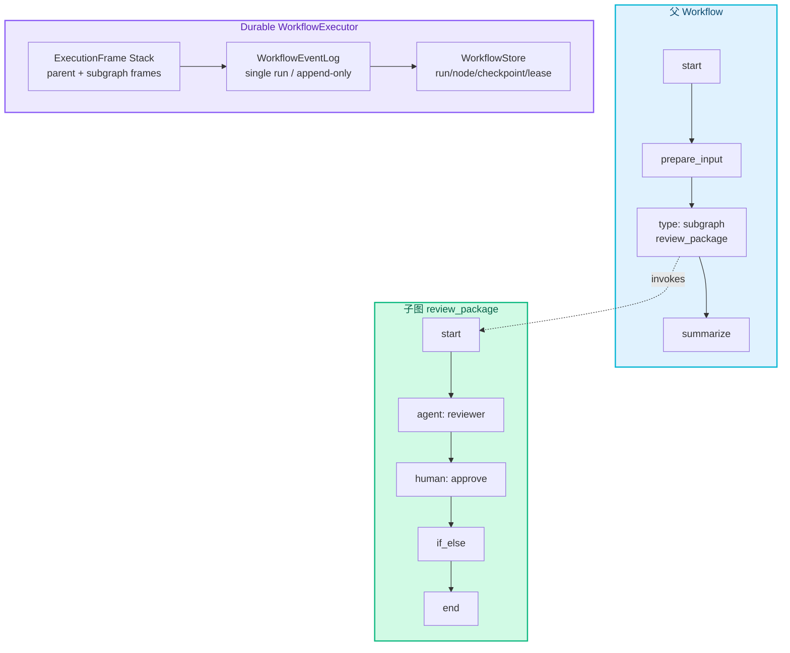
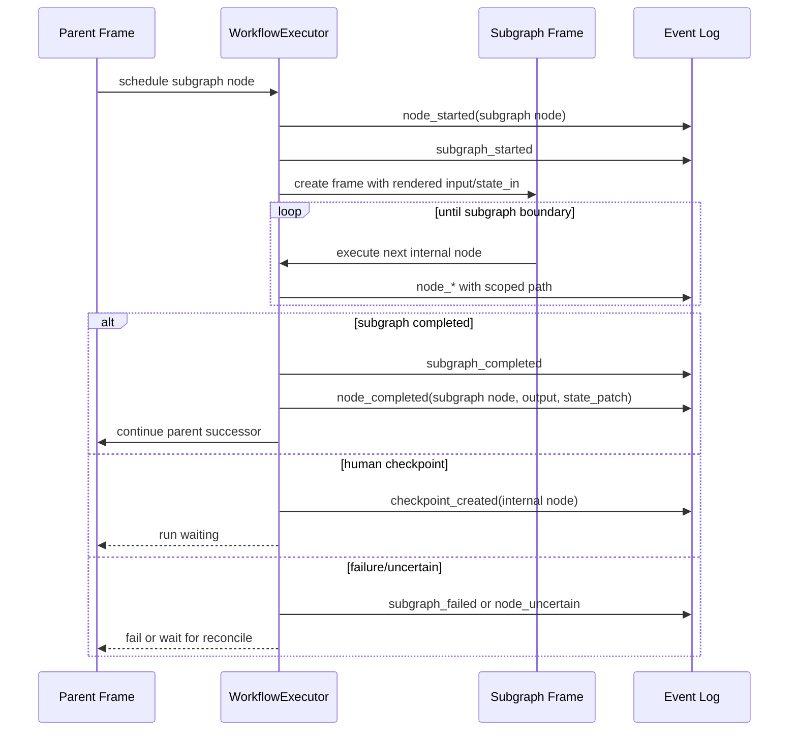
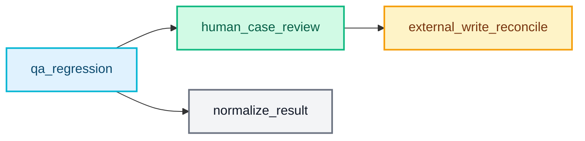
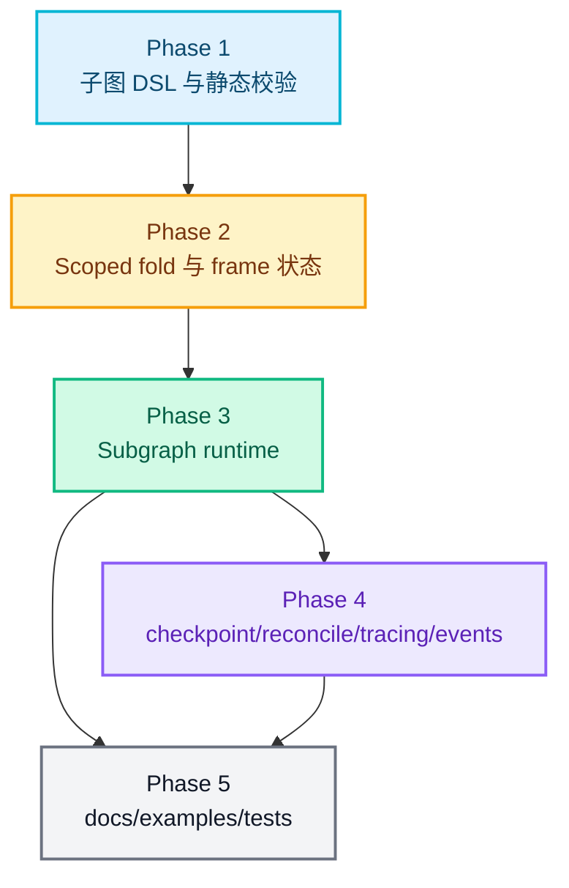

# RFC-0028: Workflow 子图支持

- **状态**: implemented
- **优先级**: P1
- **标签**: `architecture`, `workflow`, `agent`, `dx`, `persistence`
- **影响服务**: `nexau/archs/workflow/`, `nexau/archs/session/`, `nexau/archs/transports/`, `docs/`, `examples/`
- **创建日期**: 2026-05-24
- **更新日期**: 2026-05-24

## 摘要

RFC-0027 已经为 NexAU 引入 YAML-first Workflow、durable execution、结构化输出、human checkpoint 和 Tool/MCP/Agent 节点。随着 workflow 规模增长，单个 YAML 文件会迅速变得难以维护，也无法把常见流程复用为可折叠、可测试、可由模型生成的模块。本 RFC 在 RFC-0027 之上新增 **Workflow 子图**：约定 **每个 YAML 文件都是一个独立图文件**，父 workflow 通过 `type: subgraph` 节点调用 `includes.graphs` 中声明的外部图文件。子图默认以内联执行帧运行在同一个 workflow run 和 event log 中，拥有隔离的 inputs/state/nodes 上下文，并通过显式 output contract 把结果返回给父节点。

## 动机

### 1. 单层 Workflow 难以表达复杂流程

RFC-0027 的首版节点可以覆盖 QA workflow 这类线性加循环场景。但真实业务流程通常会继续膨胀：例如“生成测试用例 -> 人审 -> 执行 -> 失败复核 -> 修复建议 -> 汇总”中，失败复核本身又可能包含多个 Agent、Tool、Human 和条件节点。如果所有节点都铺在父图里，YAML 会变长，NAC 可视化也会失去层次。

### 2. 常见流程需要复用

团队会反复使用类似流程：

- 安全扫描前置检查；
- QA case review；
- 文档生成与 human approval；
- Tool 结果归一化；
- 外部写操作后的 reconcile；
- AgentTeam 启动与结果收敛。

这些流程应该能被封装成子图，在多个 workflow 或多个节点中复用，而不是复制粘贴节点和 edges。

### 3. 子图必须继承 durable execution 语义

Workflow 子图中仍然可能包含 Agent、Tool/MCP、while、human checkpoint 和 external_write 节点。它不能只是一个内存函数调用；否则父 workflow 恢复时无法知道子图内部已经完成到哪一步，也无法在子图 human node 上安全暂停和 resume。子图需要复用 RFC-0027 的 append-only event log 和 node boundary durability。

### 4. 可视化编辑需要折叠/展开边界

NAC 或其他编辑器需要把复杂 workflow 折叠成层次结构：父图只显示一个 `subgraph` 节点，需要时再展开内部节点。这要求 runtime 的 YAML 语义天然支持子图边界，而不是只在 UI metadata 中保存分组信息。

## 非目标

1. **不实现跨 workflow run 的分布式编排**：首版子图默认内联在同一个 run 内执行，不创建独立 run，也不提供跨 run join。
2. **不引入 parallel/fan-out**：子图可以被 while 多次调用，但并发执行、fan-out/fan-in 属于后续 RFC。
3. **不允许隐式读写父 state**：子图默认隔离，只能通过显式 input/output/state mapping 与父图交换数据。
4. **不支持递归子图**：首版禁止直接或间接递归调用，避免恢复、可视化和资源上限复杂化。
5. **不替代 AgentTeam**：子图负责确定性编排；AgentTeam 仍负责多 Agent 协作。子图内部可以调用 AgentTeam 型 Agent，但不把 team 消息模型展开到子图语义中。
6. **不要求 NAC 必须实现完整子图编辑器**：本 RFC 只定义 runtime/YAML/事件语义，UI 可以逐步支持折叠、展开和跳转。
7. **不提供 exactly-once 外部副作用**：子图内 Tool/MCP/Agent 节点继续沿用 RFC-0027 的 side_effect、idempotency_key 和 `uncertain` 语义。
8. **不支持内联子图定义**：首版不在父 workflow YAML 顶层定义 `subgraphs`，避免单文件继续膨胀；子图必须是独立 YAML 文件。

## 设计

### 概述

在 `nexau.archs.workflow` 中新增子图定义和调用能力：



关键决策：

1. 每个 workflow/subgraph YAML 文件都表示一个 `WorkflowGraphConfig`，文件边界就是图边界。
2. 父 workflow 通过 `includes.graphs` 引入外部图文件，并用 `type: subgraph` + `graph` 调用。
3. 子图默认使用 `execution: inline`，不创建独立 `WorkflowRunModel`，而是在同一个 `run_id` 下写入带 scope 的 node events。
4. 子图内部拥有独立 `inputs`、`vars`、`state`、`nodes` expression context。
5. 子图输出必须是 JSON object，并作为父 `subgraph` node 的 output 暴露给后继节点。
6. 子图内部 human checkpoint 会让整个 run 进入 `waiting`，resume 后从子图内部节点继续，不重复父图已完成节点。

### 1. YAML 格式

父 workflow 只保留当前图的节点和边，通过 `includes.graphs` 引用独立子图 YAML：

```yaml
type: workflow
version: "1"
name: qa_regression

includes:
  graphs:
    human_case_review: ./graphs/human_case_review.workflow.yaml

inputs:
  requirement:
    type: string

nodes:
  start:
    type: start
    output:
      requirement: "{{ inputs.requirement }}"

  generate_cases:
    type: agent
    agent: qa_planner
    input:
      requirement: "{{ nodes.start.output.requirement }}"
    output_schema:
      type: object
      properties:
        cases: { type: array }
      required: [cases]

  review_cases:
    type: subgraph
    graph: human_case_review
    input:
      cases: "{{ nodes.generate_cases.output.cases }}"
      reviewer_hint: "QA lead review"
    output_schema:
      type: object
      properties:
        approved: { type: boolean }
        cases: { type: array }
      required: [approved, cases]

  summarize:
    type: transform
    output:
      reviewed_cases: "{{ nodes.review_cases.output.cases }}"

edges:
  start: generate_cases
  generate_cases: review_cases
  review_cases: summarize
```

被引用的子图是一个独立 YAML 文件，例如 `./graphs/human_case_review.workflow.yaml`：

```yaml
type: workflow
version: "1"
name: human_case_review
description: "Review generated QA cases before execution."

inputs:
  cases:
    type: array
  reviewer_hint:
    type: string

nodes:
  start:
    type: start
    output:
      cases: "{{ inputs.cases }}"
      reviewer_hint: "{{ inputs.reviewer_hint }}"

  review:
    type: human
    prompt: "{{ nodes.start.output.reviewer_hint }}"
    input:
      cases: "{{ nodes.start.output.cases }}"
    output_schema:
      type: object
      properties:
        approved: { type: boolean }
        cases: { type: array }
      required: [approved, cases]

  end:
    type: end
    output:
      approved: "{{ nodes.review.output.approved }}"
      cases: "{{ nodes.review.output.cases }}"

edges:
  start: review
  review: end
```

首版字段：

| 字段 | 位置 | 说明 |
|------|------|------|
| `includes.graphs` | workflow 顶层 | 外部图 YAML include map，key 为本文件内引用名 |
| `type: subgraph` | node | 调用一个外部图文件 |
| `graph` | node | 引用 `includes.graphs.<name>` |
| `input` | node | 父图到子图的输入映射 |
| `output_schema` | node | 父节点可见的子图输出契约 |
| `execution` | node | 首版只支持 `inline`，默认值为 `inline` |
| `state_in` | node | 可选，显式把父 state 片段复制到子图初始 state |
| `state_out` | node | 可选，显式把子图 state/output 映射回父 state |
| `max_subgraph_depth` | durable | 可选，限制跨文件子图嵌套深度，默认 5 |

首版不提供 `subgraphs` 内联定义，也不提供 `workflow` / `subgraph` 二选一引用字段。父图只通过 `graph` 引用 `includes.graphs`，从语义上保证“一个 YAML 文件就是一个图”。

### 2. 子图定义模型

子图文件使用与顶层 workflow 相同的 YAML 图格式。解析时，顶层 workflow 和子图文件都会被归一化为 `WorkflowGraphConfig`：

| 能力 | 子图支持 | 说明 |
|------|----------|------|
| `nodes` / `edges` | 支持 | 与父 workflow 相同 |
| `inputs` / `vars` | 支持 | 独立于父图 |
| `durable` | 部分支持 | 默认继承父图，只允许覆盖 retry policy 等局部策略 |
| `includes.graphs` | 支持 | 相对路径以当前 YAML 文件位置解析 |
| `type: workflow` | 支持 | 所有图文件统一使用现有 `type: workflow`，启动方式决定它是根图还是子图 |
| transport metadata | 不支持 | 子图不单独暴露 run API |

解析后的内部表示建议引入 `WorkflowGraphConfig`：

| 类型 | 作用 |
|------|------|
| `WorkflowConfig` | 顶层 workflow，可启动 run |
| `WorkflowGraphConfig` | 可执行图定义，父图和子图共用 |
| `GraphRef` | 解析后的外部图引用，包含 include 名、文件路径和展开后的 graph snapshot |
| `SubgraphNode` | `WorkflowNode` union 中的新节点类型 |

这样可以避免把“可执行图”和“可启动 workflow run”强行绑定。每个 YAML 文件都是一个 `WorkflowGraphConfig`；当用户直接启动该文件时它是根 workflow，当它被 `type: subgraph` 节点引用时它是子图。

### 3. 表达式上下文隔离

子图 frame 中表达式上下文为：

| 名称 | 来源 |
|------|------|
| `inputs` | 父 `subgraph` node 的 `input` 渲染结果 |
| `vars` | 子图自身 `vars`，可显式继承父 vars |
| `state` | 子图局部 state，初始为空或来自 `state_in` |
| `nodes` | 子图内部节点状态和输出 |
| `parent` | 只读父图最小上下文，默认关闭 |
| `run` | 同一个 workflow run id |
| `node` | 当前内部节点 id 和 scoped path |

默认规则：

1. 子图不能直接访问父图 `nodes` 和 `state`。
2. 父图只能通过 `nodes.<subgraph_node>.output` 读取子图结果。
3. 如确实需要访问父上下文，必须在 `input` 中显式传入。
4. `state_in` 是复制，不是引用；子图修改不会自动影响父 state。
5. `state_out` 是显式 patch，只有子图成功完成后才写入父 state。

示例：

```yaml
review_cases:
  type: subgraph
  graph: human_case_review
  input:
    cases: "{{ nodes.generate_cases.output.cases }}"
  state_in:
    reviewer_policy: "{{ state.reviewer_policy }}"
  state_out:
    reviewed_case_count: "{{ nodes.end.output.cases.length }}"
```

`state_out` 在子图 frame 完成后，以父 `subgraph` node 的 `state_patch` 写入 event log。若子图失败、取消或等待 human，则不写入父 state patch。

### 4. Durable scope 与事件模型

子图不创建新的 `run_id`。内部节点通过 `scope_path` 标识所属调用栈。下面是逻辑 scope 前缀示例，实际根 scope 在现有实现中仍可保存为空字符串：

```text
$
review_cases
review_cases/start
review_cases/review
review_cases/end
run_cases[case-C001]/review_case/review
```

其中：

- `$` 表示父图根 scope；
- `review_cases` 是父图中的 subgraph node；
- `review_cases/review` 是该子图调用中的内部节点；
- while 内调用子图时，scope 保留 while 的 durable scope 前缀。

节点实例 key 仍沿用 RFC-0027：

```text
(run_id, node_id, scope_path, attempt)
```

但在子图内部，`node_id` 只保存当前图内节点名，`scope_path` 保存完整调用上下文。例如：

```text
node_id = "review"
scope_path = "review_cases/review"
```

首版可以复用 `node_scheduled`、`node_started`、`node_completed`、`checkpoint_created` 等事件，并建议新增可选事件用于 UI 和调试：

| 事件 | 作用 |
|------|------|
| `subgraph_started` | 父 `subgraph` node 开始进入子图 frame |
| `subgraph_completed` | 子图 frame 成功完成，父 node 获得 output |
| `subgraph_failed` | 子图内部节点失败导致父 node 失败 |
| `subgraph_waiting` | 子图内部 human checkpoint 导致 run waiting |

这些事件不作为恢复的唯一真源；恢复仍以 node events 和 checkpoint events fold 为准。`subgraph_*` 事件主要服务 SSE、tracing、NAC 折叠视图。

### 5. 执行帧模型

WorkflowExecutor 增加 `ExecutionFrame`：

| 字段 | 说明 |
|------|------|
| `graph_id` | 当前图 id，父图可为 workflow name，子图为 subgraph name |
| `call_node_id` | 父图中的 subgraph node id；父图 root frame 为空 |
| `scope_prefix` | 当前 frame 的 durable scope 前缀 |
| `inputs` | 当前 frame 的输入 |
| `state` | 当前 frame 的局部 state |
| `node_outputs` | 当前 frame 内部节点输出 |
| `last_completed_node_id` | 当前 frame 的本地图进度 |
| `parent_frame` | 恢复时由 scope 推导或由调度栈持有 |

执行流程：



恢复算法扩展：

1. fold event log 得到所有 scoped node runs；
2. 根据 `scope_path` 重建 root frame 和 active subgraph frame；
3. 如果存在 open checkpoint，定位 checkpoint 所在 frame 和内部 node；
4. resume 后完成 checkpoint node，并继续该 frame；
5. 子图 frame 完成后，生成父 subgraph node 的 output；
6. 父 frame 从 subgraph node 的后继继续执行；
7. 已有 `node_completed` 的 scoped internal node 不重复执行。

### 6. 子图输出契约

子图输出来源按优先级确定：

1. 子图显式 `end` node 的 output；
2. 子图定义中的 `output` 映射；
3. 最后完成节点的 output。

建议首版要求子图有唯一 `end` node 或顶层 `output`，避免“最后节点”在多分支下不稳定：

```yaml
type: workflow
version: "1"
name: normalize_tool_result

inputs:
  raw:
    type: object

nodes:
  start:
    type: start
  normalize:
    type: transform
    output:
      title: "{{ inputs.raw.title }}"
      url: "{{ inputs.raw.url }}"
  end:
    type: end
    output:
      item: "{{ nodes.normalize.output }}"

edges:
  start: normalize
  normalize: end
```

父 `subgraph` node 的 `output_schema` 用于校验最终输出。若子图定义本身也声明 output schema，两者都需要通过：

- 子图 schema 校验失败：视为子图内部失败；
- 父 node schema 校验失败：视为父调用契约失败；
- 两者不一致时，配置解析阶段尽量给出 warning，运行时以实际 schema validation 为准。

### 7. 子图调用图校验

配置解析需要新增校验：

1. `subgraph` node 必须配置 `graph`；
2. `graph` 必须引用存在的 `includes.graphs.<name>`；
3. `includes.graphs` 路径必须解析到一个独立 YAML 图文件；
4. 被引用图内部必须有且只有一个 `start` node；
5. 被引用图内部 edges 只允许引用本图 nodes；
6. 父图 edges 只把 `subgraph` node 当作单个节点；
7. 跨文件子图调用图不能直接或间接递归；
8. 嵌套深度不能超过 `durable.max_subgraph_depth`；
9. 所有 include graph 在 run 启动时必须展开进 definition snapshot；
10. 子图内 `external_write` 等副作用节点继续执行 RFC-0027 的 idempotency 校验。

调用图示例：



如果调用图出现 `Review -> Root` 或 `Review -> Review`，配置解析应 fail fast。

### 8. 与 while / human / uncertain 的关系

#### while 中调用子图

`while.body` 可以引用一个 `subgraph` node。每次迭代生成独立 scope：

```text
run_cases[case-C001]/case_review/review
run_cases[case-C002]/case_review/review
```

子图局部 state 不跨迭代共享。需要跨迭代累计结果时，仍通过父 while body 的 `update` 或父 state 显式写入。

#### 子图内 human checkpoint

子图内部 human node 创建 checkpoint 后：

1. `WorkflowCheckpointModel.node_id` 保存内部 human node id；
2. `scope_path` 保存完整子图调用路径；
3. `WorkflowRunModel.status` 变为 `waiting`；
4. 父 `subgraph` node 保持 `running` 或 materialized `waiting`；
5. resume 后先完成内部 human node，再继续子图 frame；
6. 子图完成后再完成父 `subgraph` node。

#### 子图内 uncertain

如果子图内部 `external_write` lease 过期：

1. 内部节点进入 `uncertain`；
2. 整个 run 进入 `uncertain`；
3. 父 `subgraph` node 对 UI 表现为 `uncertain`；
4. reconcile API 需要接受 `scope_path`，定位内部节点；
5. reconcile 后继续子图 frame，而不是从父 node 重跑整个子图。

### 9. Transport 与事件输出

首版不需要新增创建 run 的 API。现有 workflow run API 继续工作，但事件 payload 需要包含 scope 信息：

| 字段 | 说明 |
|------|------|
| `graph_id` | 当前节点所属图，父图为 workflow name |
| `node_id` | 当前图内节点 id |
| `scope_path` | 完整 durable scope |
| `parent_node_id` | 若在子图内，指向父 `subgraph` node |
| `subgraph` | 子图名，父图节点为空 |
| `depth` | 子图嵌套深度 |

SSE 示例：

```json
{
  "type": "workflow_node_started",
  "run_id": "wf_run_123",
  "graph_id": "human_case_review",
  "node_id": "review",
  "scope_path": "review_cases/review",
  "parent_node_id": "review_cases",
  "depth": 1
}
```

NAC 可以用这些字段把事件挂到折叠后的父 `subgraph` 节点，或展开显示内部节点。

### 10. Tracing

Tracing 需要体现子图层级：

| Span | 说明 |
|------|------|
| `WORKFLOW` | 顶层 run |
| `WORKFLOW_NODE` | 父图 `subgraph` node |
| `WORKFLOW_SUBGRAPH` | 子图 frame |
| `WORKFLOW_NODE` | 子图内部节点 |
| `AGENT` / `TOOL` | 内部节点调用的现有 span |

建议新增 attributes：

- `workflow.graph_id`
- `workflow.subgraph`
- `workflow.parent_node_id`
- `workflow.scope_path`
- `workflow.depth`

这样可以在 trace UI 中看到“父 workflow -> subgraph frame -> internal node -> Agent/Tool”的完整层级。

### 11. 与 RFC-0027 的兼容关系

| RFC-0027 能力 | 子图语义 |
|---------------|----------|
| Workflow YAML | 增加 `includes.graphs` 和 `type: subgraph` + `graph` |
| Durable event log | 继续作为 canonical source，子图内部节点写 scoped events |
| Structured output | 子图最终 output 也使用 JSON Schema 校验 |
| Human checkpoint | 子图内部 checkpoint 暂停整个 run |
| while scope | 子图 scope 叠加到 while scope 之后 |
| Tool/MCP side_effect | 子图内部节点复用同一 side-effect policy |
| Definition snapshot | 外部图文件在 run 启动时展开并固化 |
| Transport API | 继续使用 run/resume/reconcile/events，payload 增加 scope metadata |

## 权衡取舍

### 考虑过的替代方案

| 方案 | 优点 | 缺点 | 决定 |
|------|------|------|------|
| 只用 UI group，不改 runtime | 实现轻，NAC 可快速折叠节点 | runtime 不知道子图边界，无法复用、校验、恢复和独立测试 | 不采用 |
| 子图创建独立 workflow run | 隔离强，run 查询清晰 | checkpoint/resume、父子事务、事件订阅和 output join 复杂，首版成本高 | 首版不采用 |
| 子图完全共享父 state/nodes | 写法短，上下文访问方便 | 隐式耦合强，复用差，恢复和测试困难 | 不采用 |
| 子图默认内联同一 run + 隔离 context | 复用 durable runtime，恢复语义清晰，父图把子图当普通节点 | scope/fold/trace 复杂度增加 | 采用 |
| 允许递归子图 | 表达能力强 | 容易造成无限递归、恢复栈膨胀、UI 难展示 | 首版不采用 |
| 支持父 YAML 内联 `subgraphs` | 小型子图写法短，单文件 demo 方便 | 会让父文件继续膨胀，和“每个 YAML 是一个图”的编辑模型冲突 | 不采用 |
| 只支持外部图文件 include | 文件边界清晰，复用明确，适合可视化按图编辑 | 小型子图也需要新文件 | 采用 |

### 缺点

1. `scope_path` 会变成恢复、事件、UI、trace 的关键字段，必须保持稳定和可读。
2. `WorkflowStore.fold()` 需要理解 scoped node outputs，否则内部节点同名会互相覆盖。
3. 子图 context 隔离会让简单场景多写一些 input mapping，但这是复用和可测试性的必要代价。
4. 外部图文件需要在 definition snapshot 中展开，否则运行中修改文件会影响未完成 run。
5. 子图 human checkpoint 会让父节点处于“内部等待”的中间状态，UI 和 materialized summary 需要明确表达。
6. 不支持递归和并发意味着某些高级编排仍需后续 RFC。

## 实现计划

### 阶段划分

- [x] Phase 1: 子图 DSL 与静态校验
  - 扩展 `WorkflowNodeType` 增加 `subgraph`。
  - 新增 `WorkflowGraphConfig` / `GraphRef` / `SubgraphNode` 相关模型。
  - 支持 `includes.graphs`、`graph`、`execution`、`state_in`、`state_out`、`max_subgraph_depth`。
  - 校验外部图文件解析、父子引用、调用图递归、嵌套深度和 side-effect policy。

- [x] Phase 2: Scoped fold 与 frame 状态
  - 扩展 `FoldedWorkflowState`，按 `scope_path` 保存 scoped node outputs/status。
  - 避免子图内部同名节点覆盖父图或其他子图调用输出。
  - 定义 `ExecutionFrame`，支持从 event log 重建 active frame。
  - 确保 existing root workflow 行为保持兼容。

- [x] Phase 3: Subgraph runtime
  - 在 `WorkflowExecutor` 中实现 `type: subgraph` 节点。
  - 渲染 input/state_in，创建子图 frame，执行内部节点。
  - 子图完成后生成父 node output 和可选 state_out patch。
  - 支持 while 内调用子图，并保持 scope_path 稳定。

- [x] Phase 4: Checkpoint/reconcile/tracing/events
  - 支持子图内部 human checkpoint resume。
  - 支持子图内部 uncertain node reconcile。
  - SSE event payload 增加 `graph_id`、`parent_node_id`、`subgraph`、`depth`。
  - tracing 增加 `WORKFLOW_SUBGRAPH` span 或等价 attributes。

- [x] Phase 5: 文档、示例与测试
  - 添加子图 YAML reference。
  - 将 `examples/workflows/qa_release_check/` 改写为父 workflow + `graphs/human_case_review.workflow.yaml` 子图示例。
  - 补充 unit/integration tests，覆盖 parser、runtime、recovery、checkpoint、while scope。
  - 更新 RFC-0027 workflow 文档，指向 RFC-0028 子图能力。

### 子任务 DAG



### 相关文件

| 文件 | 说明 |
|------|------|
| `nexau/archs/workflow/config.py` | 增加子图 DSL、include graph、静态校验 |
| `nexau/archs/workflow/executor.py` | 增加 ExecutionFrame、subgraph node runtime、resume/recovery 调度 |
| `nexau/archs/workflow/store.py` | 扩展 fold 逻辑，支持 scoped node outputs/status |
| `nexau/archs/workflow/types.py` | 继续维护 JSON-safe 类型边界 |
| `nexau/archs/session/models/workflow.py` | 必要时补充 materialized node summary 字段 |
| `nexau/archs/transports/http/` | workflow events payload 增加 scope/subgraph metadata |
| `tests/unit/test_workflow_config.py` | 子图 parser 和调用图校验 |
| `tests/integration/test_workflow_executor.py` | 子图 runtime、checkpoint/resume、recovery |
| `docs/advanced-guides/` | 子图使用文档 |
| `examples/workflows/` | 子图示例 workflow |

## 测试方案

### 单元测试

- 子图 DSL：`includes.graphs`、`type: subgraph`、`graph` 引用和独立 YAML 图文件解析。
- 子图图校验：未知节点、未知边、重复 start、缺失 end/output、内部 cycle。
- 调用图校验：直接递归、间接递归、超过 `max_subgraph_depth`。
- context 隔离：子图不能隐式访问父 `nodes/state`，只能通过 input/state_in。
- output schema：子图 schema 和父 subgraph node schema 都能校验失败。
- scoped fold：同名内部节点在不同子图调用和 while scope 中不会覆盖。
- state_out：子图成功完成才 patch 父 state，失败/waiting 不 patch。

### 集成测试

- 父 workflow 调用外部图文件作为子图：start -> subgraph -> transform，最终 output 正确。
- run snapshot 固化展开后的外部图定义，运行中修改 YAML 不影响已启动 run。
- 子图内部 human node 暂停，resume 后继续子图并完成父 workflow。
- 子图内部 while + agent/tool 节点使用稳定 scope_path，恢复后不重复执行已完成迭代。
- while 内多次调用同一个子图，每次局部 state 和 node output 隔离。
- 子图内部 `external_write` lease expired 后进入 `uncertain`，reconcile 后从内部节点继续。
- tracing 中包含 parent workflow、subgraph frame、internal node、Agent/Tool span 层级。

### 手动验证

1. 运行 `examples/workflows/qa_release_check/qa_release.workflow.yaml`。
2. 确认父图事件中能看到 `review_cases` subgraph node started。
3. 展开事件流，确认子图内部 `review` human node 进入 waiting。
4. 调用 resume API，确认 checkpoint 的 `scope_path` 指向子图内部节点。
5. 确认 resume 后先完成子图，再完成父 `review_cases` node。
6. 在子图内部节点完成后 kill worker，重启后确认已完成内部节点不重复执行。
7. 在 while 内跑多个子图调用，确认每个 scope 的输出互不覆盖。

## 未解决的问题

1. 是否为图文件增加 `type: graph` 别名，还是所有可执行图继续统一使用 `type: workflow`。
2. `scope_path` 的最终编码格式是否需要 URL-safe / JSON Pointer-compatible，以便 HTTP API 和 UI 路由直接使用。
3. `WorkflowStore.fold()` 是否需要引入 snapshot index 来避免深层子图和长循环恢复过慢。
4. 父节点 materialized status 是否需要新增 `waiting_inside` / `uncertain_inside`，还是复用现有 `waiting` / `uncertain`。
5. 子图 schema 与父 node `output_schema` 是否要做静态兼容性检查，还是只做运行时校验。
6. 后续 `execution: child_run` 是否应该由本 RFC 扩展，还是单独 RFC 设计跨 run 编排。
7. NAC 的子图布局 metadata 是嵌入每个子图的 `ui` 字段，还是保存为独立 project metadata。

## 参考资料

- [RFC-0027: Agent Workflow 编排与结构化输出](./0027-agent-workflow-orchestration.md) - 本 RFC 的基础 Workflow runtime、durable execution 和 structured output 设计。
- [RFC-0002: AgentTeam 多 Agent 协作框架](./0002-agent-team.md) - 子图与 AgentTeam 的能力边界参考。
- [RFC-0022: Agent Run Action 生命周期与 typed blocks](./0022-agent-run-action-lifecycle-and-typed-blocks.md) - run event 和 checkpoint/resume 的设计参照。
- [Taskfile Guide](https://taskfile.dev/docs/guide) - YAML include、命名 task 和复用体验参考。
