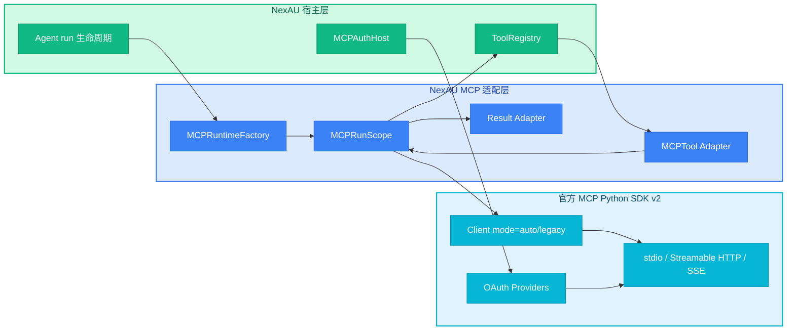
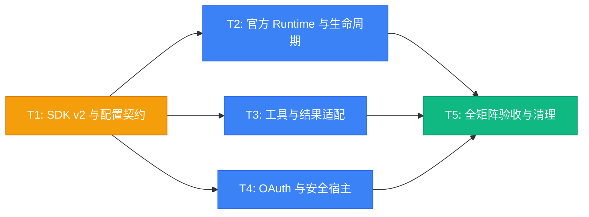

# RFC-0029: 基于官方 Python SDK 的 MCP Client 与 OAuth

## 摘要

本 RFC 将 NexAU MCP client 的协议与传输实现完整迁移到官方 Model Context Protocol Python SDK v2。NexAU 不再自行实现 JSON-RPC、stdio 子进程通信、Streamable HTTP、SSE、session ID、协议握手或 OAuth 流程，只保留 Agent 生命周期、配置解析、工具命名、权限检查以及 MCP 结果到 NexAU 工具结果的适配。迁移后必须通过覆盖全部现有 MCP 接入方式与新增 OAuth 模式的本地自动化测试。

## 动机

当前 `nexau/archs/tool/builtin/mcp_client.py` 虽然依赖官方 `mcp` 包，但连接主链路仍由 NexAU 自行实现：

- Streamable HTTP、旧 HTTP+SSE、session ID 和 SSE 事件解析由 `HTTPMCPSession` 手写；
- stdio 子进程、JSON-RPC framing、request ID 和 initialize handshake 由两份 `DirectMCPSession` 手写；
- 协议版本固定为 `2024-11-05`，无法自动跟进 MCP 新版本；
- 进程全局 manager 会在不同 Agent 之间共享和覆盖 server/session 状态；
- 连接发现、工具调用和关闭不在同一明确生命周期内，存在 HTTP client、SSE task 与 stdio 子进程泄漏风险；
- MCP 工具结果只拼接文本，丢失 `structuredContent`、`isError`、图片、音频和资源内容；
- HTTP 只能透传静态 header，不支持 OAuth discovery、PKCE、token exchange 与 refresh；
- 配置接受 `type: sse`，但当前连接实现没有对应分支。

官方 Python SDK v2 已覆盖当前稳定协议、历史协议协商、全部标准 transport、完整 OAuth client 以及跨平台 stdio 生命周期。继续维护自研协议层会重复造轮，并使 NexAU 的兼容节奏取决于自身协议实现更新。

不实施本 RFC 将产生以下后果：

1. MCP 新协议版本和 wire-format 变化需要在 NexAU 中重复实现；
2. OAuth MCP server 无法作为一等接入方式；
3. 新 content block、错误语义和分页能力可能静默丢失；
4. sync/async 混合入口继续承担跨 event loop session 和资源泄漏风险；
5. 测试继续验证自研 parser 的内部细节，而不是验证 NexAU 与官方 SDK 的真实互操作。

## 设计

### 概述

每个 Agent 持有一个不绑定 event loop 的 MCP runtime factory。每次 Agent run 在持有 Agent lock 后创建一个独立的 `MCPRunScope`，由该 scope 使用官方 SDK 连接全部 server、完成协议协商和工具发现，并在同一 event loop、同一生命周期内执行工具和关闭连接。

`MCPTool` 不再持有 session，也不参与任何协议或 transport 工作。它只保存稳定的工具描述符，并将调用路由到当前 run scope。

为了保持现有“Agent 构造后即可枚举 MCP 工具”的行为，Agent 构造阶段仍执行一次 bootstrap discovery，但 discovery scope 必须完整进入和退出，只缓存工具元数据，不保存 SDK Client/session。正式 run 开始时重新连接并刷新工具列表。

### 架构图



### 关键设计决策

1. **直接采用官方 SDK v2 稳定线**：依赖约束使用 `mcp>=2,<3`，由 SDK 完成新旧协议协商；NexAU 不再固定或选择具体 wire protocol version。
2. **连接为 run-scoped，工厂为 Agent-scoped**：SDK Client、HTTP client、SSE task 和 stdio 子进程只存在于一次 run 内，禁止跨 event loop 保存；认证 token storage 可以跨 run。
3. **移除进程全局 MCP manager**：server、session、tool 和用户认证状态均不得在不同 Agent 之间隐式共享。
4. **所有 transport 使用官方实现**：`stdio` 使用官方 `stdio_client`，`http` 使用 Streamable HTTP，`sse` 使用官方 legacy SSE client。NexAU 不对 SDK transport 打补丁，也不保留 fallback parser。
5. **HTTP/stdio 默认自动协议协商**：高层 Client 使用 `mode="auto"`；旧 SSE 使用 SDK 要求的 legacy 模式。协议协商失败作为 server 初始化失败处理。
6. **工具发现完整处理分页**：持续读取 `next_cursor`，直到其为空；cursor 被视为 opaque value，不做解析或构造。
7. **工具列表按 run 原子刷新**：`ToolRegistry` 提供 replace-source 语义，一次替换当前成功连接 server 的全部 MCP 工具；删除已下线工具并避免重复注册，同时同步刷新 structured tool payload。
8. **多 server 默认 fail-soft**：单个 MCP server 连接或发现失败不阻断其他 server；失败 server 的工具不进入当次 run。不同 Agent 和同名 server 必须完全隔离。
9. **结果适配保真优先**：raw output 保存完整 content block、`structured_content`、`is_error` 及未知字段；LLM-facing 通道原生映射 text/image，其余 block 采用稳定降级文本，但不得从 raw output 丢失。
10. **认证流程完全委托官方 SDK**：NexAU 只解析认证策略、解析 secret、提供 TokenStorage 和宿主交互 callback；不得复制 discovery、PKCE、state/issuer 校验、token exchange 或 refresh 逻辑。
11. **显式 secret 边界**：YAML 只允许 secret reference，不允许新 auth 配置内出现明文 token/client secret。旧 `headers.Authorization` 保留兼容但标为 legacy；同时配置 `auth` 与 Authorization header 时 fail-fast。
12. **显式清理契约**：run 的正常完成、异常、取消、timeout 和 stop 都必须在 loop 关闭前退出 MCP scope。Agent 增加幂等异步关闭入口，transport 在 `finally` 中调用；同步 cleanup 仅作兼容兜底。

### 接口契约

#### MCP server 配置

现有字段保持兼容：

| 字段 | 适用范围 | 契约 |
|---|---|---|
| `name` | 全部 | Agent 内 server 唯一名，也是工具命名前缀 |
| `type` | 全部 | `stdio`、`http` 或 `sse` |
| `command` / `args` / `env` | stdio | 传给官方 `StdioServerParameters` |
| `url` / `headers` | HTTP/SSE | 传给官方 HTTP client/transport |
| `timeout` | 全部 | 连接与请求的上层时间预算 |
| `disable_parallel` | 全部 | 现有 NexAU 工具串行语义 |
| `permissions` / `tool_permissions` | 全部 | 现有 MCP 工具权限语义 |
| `source_id` | 全部 | 来源追踪，不暴露给模型 |
| `auth` | HTTP/SSE | 新增严格认证联合类型 |

stdio 环境采用官方 SDK 契约：继承 SDK 的安全允许列表并叠加配置中的 `env`，不再复制完整父进程环境。依赖其他环境变量的 MCP server 必须显式配置。

HTTP `headers` 继续支持非认证 header，原有 `Authorization` header 继续工作，但新配置优先使用 `auth`。

#### 认证配置

`auth` 是以下三种模式之一：

| 类型 | 必要信息 | 行为 |
|---|---|---|
| `bearer` | token secret reference | 为每个请求附加固定 Bearer token，不启动 OAuth flow |
| `authorization_code` | client name、scopes、可选预注册 client 信息 | 使用官方 `OAuthClientProvider` 完成 discovery、DCR/CIMD、PKCE、授权、exchange 和 refresh |
| `client_credentials` | client ID、client secret reference、可选 scopes | 使用官方 `ClientCredentialsOAuthProvider`，不得调用 redirect/callback |

首版 secret reference 仅保证支持环境变量来源。Python 宿主可以通过 resolver 扩展到 keyring、Vault 或其他 secret manager，而无需改变 MCP 配置模型。

插件可以声明 auth 非秘密元数据和 secret reference，但不能通过普通 plugin `${config.*}` 参数或 literal 写入 token/client secret。

#### 认证宿主

NexAU core 定义可注入的 `MCPAuthHost` 边界，职责包括：

- 按 secret reference 和当前 Agent/用户上下文解析 secret；
- 为 authorization-code flow 提供 redirect URI；
- 将 authorization URL 交给 CLI、浏览器或 Web 前端；
- 等待并返回 OAuth callback 参数；
- 为官方 SDK 提供 TokenStorage。

TokenStorage 的隔离键至少包含宿主身份、MCP source/server、canonical URL、client ID 和 scopes。token、client registration 和 refresh token 不得进入 `GlobalStorage`、LLM history、trace attributes 或普通配置快照。

core 可以提供仅适合测试和短生命周期进程的内存 storage；生产宿主应注入加密持久化 storage。

#### Runtime 生命周期

`MCPRuntimeFactory` 是纯配置对象，可以跨 run 和 event loop 保存。`MCPRunScope` 是 async context manager，只能在创建它的 run/event loop 中使用：

1. 进入 scope；
2. 使用官方 SDK 连接 server 并协商协议；
3. 分页发现全部工具；
4. 原子替换 registry 的 MCP source 并更新 structured payload；
5. Agent 执行期间由 MCPTool 路由调用；
6. 在 run 的 `finally` 中关闭全部 SDK Client 和 transport。

官方 SDK context 的 enter、使用和 exit 必须由同一生命周期 owner 管理。若验证发现 AnyIO context 存在 task affinity，则连接并行化只能通过每个 server 独立 owner task 实现，不能在子 task enter 后交给父 task exit。

bootstrap discovery 复用相同 scope 契约，但退出后仅留下不可执行的工具元数据；正式工具调用只允许发生在 active run scope 内。

#### MCPTool 与结果契约

公开给模型的工具名继续是 `mcp__{server}__{raw_tool}`。wire request 始终使用原始 tool name。权限优先级保持：

1. `tool_permissions[raw_tool]`；
2. server `permissions`；
3. 未配置时延续当前 auto-allow 行为。

MCPTool 过滤 NexAU 注入的 `agent_state`、`global_storage`、`sandbox` 和 `ctx`，再调用当前 scope。SDK 的 `CallToolResult` 映射为稳定 raw output：

- `content`：所有 block 以 JSON-compatible 结构保序保存；
- `structured_content`：原样保存；
- `is_error`：映射到 NexAU executor/tool-result 的错误语义；
- 未识别的未来 block：通过 SDK model dump 或兼容映射保留，适配器不得崩溃。

当前 UMP 的 LLM-facing block 只原生支持 text/image。Audio、ResourceLink、EmbeddedResource 和未来 block 在本 RFC 中至少必须保存在 raw output，并生成不含二进制正文的稳定摘要；扩展 UMP 原生 block 类型不作为迁移 SDK 的前置条件。

#### 兼容与弃用

保持以下行为：

- Python/YAML/plugin 的既有 server 字段；
- stdio、HTTP 和 SSE 类型；
- 静态 headers，包括旧 Authorization header；
- `mcp__server__tool` 命名、source ID、权限和 `disable_parallel`；
- `config.tools` 不因 MCP discovery 而被修改；
- `Agent(...).run()` 与 `await Agent.create(...).run_async()`；
- 同一个 Agent 连续执行多次 sync 或 async run。

进程全局 `get_mcp_manager()`、`MCPManager`、`MCPClient` 及面向独立初始化的旧 helper 标记为 deprecated，不再作为 Agent 主路径。兼容期内如保留调用能力，每次调用必须创建和完整关闭官方 SDK scope，不得恢复全局 session。

### 安全要求

1. 日志、异常、trace 和配置 repr 必须集中脱敏大小写不敏感的 Authorization、Proxy-Authorization、token、client secret 和 refresh token。
2. URL 日志默认隐藏 query 中的 `key`、`token` 和 `access_token` 等敏感参数。
3. 非 loopback 的 OAuth redirect URI 和远程 MCP URL 默认要求 HTTPS；测试环境可以显式使用 loopback HTTP。
4. authorization-code flow 的并发授权必须隔离，不得共享固定全局 state 或 callback 队列。
5. client-credentials flow 不得自动 fallback 到需要用户交互的 authorization-code flow。
6. stdio server 仅获得官方 SDK 允许列表和显式配置的环境变量。
7. 示例、测试 fixture 和文档不得包含真实 token 或看似真实的 API key；仓库中现有 AMap 示例 key 应删除并建议轮换。

### 范围边界

本 RFC 覆盖 NexAU 现有的 MCP tool 能力及其标准 transport、认证、结果和生命周期。MCP resources、prompts、sampling、roots、elicitation 等能力仍由官方 Client 正确协商，但将它们新增为 NexAU 面向 Agent 的一等 API 不在本 RFC 范围内。后续增加这些能力时必须直接复用本 RFC 建立的官方 Client/session，不能新增协议实现。

## 权衡取舍

### 考虑过的替代方案

| 方案 | 优点 | 缺点 | 决定 |
|---|---|---|---|
| 继续维护自研 client 并逐步补协议 | 短期改动小 | 永久追赶协议；继续承担 OAuth、transport 和互操作成本 | 否 |
| 只把 HTTP 切到官方 SDK | 迁移范围较小 | stdio/SSE 仍有两套语义和生命周期，无法彻底消除协议代码 | 否 |
| 使用官方 v1 `ClientSession` | 与当前 lock 接近 | 仍停留在旧稳定线，无法获得 v2 自动协商和新 OAuth/协议能力 | 否 |
| 使用 `ClientSessionGroup` 管理全部 server | 内置聚合 | 走 classic initialize handshake；命名与生命周期不符合 NexAU 现有契约 | 否 |
| Agent 生命周期长连接 | 减少重复握手 | sync `run()` 每次新 event loop，容易跨 loop；需要更大范围生命周期 API 重构 | 否 |
| **官方 SDK v2 + run-scoped Client + NexAU 薄适配层** | 协议由官方维护；sync/async 边界清晰；OAuth 完整 | 每次 run 重新连接和发现，增加启动成本 | **采用** |

### 缺点

1. 每次 run 都会重新连接和发现工具，长连接 server 的启动成本高于 Agent 级 session；后续可在纯 async 宿主上另行设计长生命周期模式。
2. stdio 不再继承完整父进程环境，依赖隐式环境变量的旧配置需要迁移。
3. 官方 SDK v2 引入 `httpx2`，它与项目现有 `httpx` 可以共存但类型不可互换，测试与异常分类必须明确区分。
4. OAuth authorization-code 需要宿主提供交互和安全 token storage，core 无法提供适合所有部署形态的默认实现。
5. 当前 UMP 不能原生把所有 MCP content block 发送给模型，因此非 text/image block 首阶段采用 raw 保真、LLM 摘要的降级策略。

## 实现计划

### 阶段划分

- [x] Phase 1: 建立 SDK v2、配置、认证宿主与安全契约
- [x] Phase 2: 替换 runtime/transport/lifecycle 并接入 ToolRegistry
- [x] Phase 3: 完成结果适配、OAuth provider 与兼容 API
- [x] Phase 4: 删除自研协议实现，完成黑盒集成矩阵和文档迁移

### 子任务分解

#### 依赖关系图



#### 子任务列表

| ID | 标题 | 依赖 | Ref |
|---|---|---|---|
| T1 | SDK v2 与配置契约 | - | - |
| T2 | 官方 Runtime 与 Agent 生命周期 | T1 | - |
| T3 | MCP 工具、分页和结果适配 | T1 | - |
| T4 | OAuth、secret 与宿主集成 | T1 | - |
| T5 | 全矩阵验收、自研实现删除与文档迁移 | T2, T3, T4 | - |

> T2、T3、T4 在 T1 完成后可并行实现。

#### 子任务定义

**T1: SDK v2 与配置契约**

- **范围**: 升级并约束官方 SDK v2；建立 typed MCP server/auth/SecretRef 配置；保持旧 transport 配置兼容；补齐 plugin 展开限制与脱敏契约。
- **验收标准**: lock 解析到同一稳定 v2 系列；新旧配置单元测试通过；非法 transport/auth 组合、明文新 secret 和认证 header 冲突均 fail-fast；配置与异常快照不含 secret。

**T2: 官方 Runtime 与 Agent 生命周期**

- **范围**: 用官方 Client/transport 建立 run scope；移除 global manager 主路径；实现 bootstrap discovery、每 run refresh、异常安全 cleanup、Agent 异步关闭与 transport finally 接入。
- **验收标准**: stdio、Streamable HTTP、legacy SSE 均使用官方公开 API；同一 Agent 连续 sync/async run 不跨 loop；正常、异常、取消和 stop 后无遗留进程、HTTP/SSE 或 pending task；两个 Agent 不串台。

**T3: MCP 工具、分页和结果适配**

- **范围**: 将 MCPTool 缩为路由适配器；实现 tools/list 全分页、replace-source、命名/权限/串行语义，以及完整 CallToolResult raw 保真和 LLM-facing 投影。
- **验收标准**: 多页工具完整发现且无重复/残留；同名 server tool 正确隔离；text、image、audio、resource link、embedded resource、structured output、tool error、protocol error 和未知未来 block 均通过适配测试；权限 ask/allow/deny/resume 不回归。

**T4: OAuth、secret 与宿主集成**

- **范围**: 接入 static bearer、官方 authorization-code provider、官方 client-credentials provider；定义 SecretResolver、TokenStorage 和 CLI/Web redirect/callback 宿主边界；实现 storage 命名空间与集中脱敏。
- **验收标准**: 本地授权服务器测试覆盖 discovery、动态/预注册 client、PKCE、state/issuer、token exchange、跨 run token 复用、refresh 和 client credentials；client credentials 不触发交互；不同用户/server/client/scope 的 token 隔离；失败和日志不泄密。

**T5: 全矩阵验收、自研实现删除与文档迁移**

- **范围**: 建立官方 SDK 本地测试 server/authorization server fixtures；替换私有 parser 测试；覆盖跨平台、并发、partial failure、cleanup 与插件；删除所有自研协议/transport 代码；更新文档和示例。
- **验收标准**: 本 RFC 测试矩阵全部进入 CI；测试不依赖公网、真实账号或真实密钥；源码中不再存在手写 JSON-RPC/SSE/session-id/protocolVersion；旧配置示例与新 OAuth 示例均可运行；现有测试套件、lint 和类型检查通过。

### 影响范围

- `pyproject.toml` / `uv.lock` - MCP v2 与 `httpx2` 依赖边界
- `nexau/archs/tool/builtin/mcp_client.py` - 重写为官方 SDK runtime 与薄工具适配层
- `nexau/archs/tool/builtin/mcp_auth.py` - 新增认证宿主、secret 和 storage 适配边界
- `nexau/archs/tool/builtin/__init__.py` / `nexau/__init__.py` - 新 API 导出与旧 API 弃用
- `nexau/archs/main_sub/agent.py` - bootstrap discovery、run scope 和异步清理
- `nexau/archs/main_sub/config/schema.py` / `config.py` - typed transport/auth 配置
- `nexau/archs/main_sub/plugin/manifest.py` / `adapter.py` - auth 复用和 secret 渲染限制
- `nexau/archs/tool/tool_registry.py` - 原子 replace-source
- `nexau/archs/main_sub/execution/tool_executor.py` / `nexau/core/messages.py` - MCP 错误与多模态结果适配
- `nexau/archs/transports/` / `nexau/cli/` - auth host 注入与 Agent cleanup
- `tests/unit/test_mcp_*` / `tests/integration/test_mcp_*` - 契约与黑盒集成测试
- `docs/advanced-guides/mcp.md` / `examples/mcp/` - 配置、认证和迁移说明

## 测试方案

### 测试原则

所有 PR gate 测试使用官方 SDK 构建的本地 MCP server 和本地 OAuth authorization server。不得依赖 AMap、GitHub、npm server、公网或真实凭据。公网 server 只允许作为非阻塞 nightly smoke test。

测试必须断言 NexAU 自身的公开契约，不 mock 或复制官方 SDK 的 parser、request ID、session ID、Windows process flags 等内部实现。

### 单元测试

1. **配置与安全**
   - 旧 stdio/http/sse 配置 round-trip；
   - auth discriminated union、SecretRef、非法组合和 header 冲突；
   - plugin auth 展开、source ID 与 secret 渲染限制；
   - URL/header/token/client-secret/refresh-token 脱敏。
2. **Runtime 选择与生命周期**
   - transport factory 只选择官方 stdio/Streamable HTTP/SSE；
   - HTTP 自有 `httpx2.AsyncClient` 与 auth provider 的 enter/exit；
   - 多 server partial failure、shutdown 幂等、中途初始化失败 unwind；
   - ToolRegistry replace-source 与 structured payload 同步。
3. **工具和结果适配**
   - 官方 Tool 的 snake_case schema 映射；
   - 参数过滤、raw tool name 路由、命名空间和权限优先级；
   - 所有标准 content block、structured content、tool error 和未知 block；
   - tools/list 多页与 opaque cursor。

### 集成测试

#### Transport 矩阵

| Transport | Discover | Call | 并发 | Cleanup | 特殊断言 |
|---|---:|---:|---:|---:|---|
| stdio | 必须 | 必须 | 必须 | 必须 | env 显式传递、退出后 PID 不存在、跨平台 smoke |
| Streamable HTTP stateful | 必须 | 必须 | 必须 | 必须 | `mode=auto`、session 正常关闭 |
| Streamable HTTP stateless | 必须 | 必须 | smoke | 必须 | 无 session 依赖 |
| legacy SSE | 必须 | 必须 | smoke | 必须 | 官方 SSE client、legacy mode |

#### Auth 矩阵

| 模式 | 必测流程 |
|---|---|
| arbitrary headers | header 到达 server 且不被 auth 覆盖 |
| legacy Authorization header | 兼容固定 Bearer token |
| bearer auth | secret resolution、每请求附加、401 不误启动 OAuth |
| authorization code | PRM/AS discovery、DCR/CIMD 或预注册、S256 PKCE、state/issuer、exchange、Bearer retry |
| refresh | 过期后 refresh、storage 更新、无重复授权/注册 |
| client credentials | token grant、scope/resource、无 redirect/callback、缓存与刷新 |

#### Result 矩阵

- TextContent；
- ImageContent；
- AudioContent；
- ResourceLink；
- EmbeddedResource text/blob；
- mixed content 顺序；
- structured content；
- `is_error=true` 的工具错误；
- JSON-RPC/MCP protocol error；
- SDK 后续新增的未知 content block。

#### Agent 与可靠性矩阵

- `Agent(...)` + `run()`，同一实例连续执行两次；
- `await Agent.create(...)` + `run_async()`，同一实例连续执行两次；
- 正常完成、工具异常、连接异常、取消、timeout、graceful stop、force stop；
- 两个 Agent 并发且配置同名 server，不共享 client、tool 或 token；
- 单轮多个 MCP call 真并发，`disable_parallel` 时保持串行；
- server 连接 partial failure 不影响其他 server；
- 每 run 工具新增、删除或 schema 变化后 registry 准确刷新；
- 权限 ask、allow-once、allow、deny 和恢复执行。

### CI 与验收命令

实现阶段的最终 gate 至少包括：

```text
uv run pytest tests/unit/test_mcp_config.py tests/unit/test_mcp_adapter.py tests/unit/test_mcp_runtime.py tests/unit/archs/permissions/test_helpers.py
uv run pytest tests/integration/test_mcp_transports.py
uv run pytest tests/integration/test_mcp_oauth.py
uv run pytest tests/integration/test_mcp_agent_lifecycle.py
uv run pytest tests/unit/test_agent.py tests/unit/test_config.py tests/unit/test_plugin_adapter.py tests/unit/test_plugin_adapter_quickstart.py
uv run ruff check nexau tests
uv run mypy --config-file pyproject.toml nexau
uv run pyright
make test
```

每个 integration test 使用 OS 分配的 loopback port、明确 readiness、短超时和 `finally` 清理。cleanup 断言在测试体内完成，不能依赖进程退出或 pytest session 的强制结束掩盖泄漏。

最终静态检查必须确认 MCP client 源码中不存在 NexAU 自行实现的：

- JSON-RPC request/response framing；
- request ID 生成和匹配；
- initialize/initialized 消息；
- `protocolVersion` 常量；
- SSE 行解析和 endpoint event；
- `mcp-session-id` 管理；
- stdio 子进程创建和终止。

### 实现验收结果

RFC-0029 已于 2026-08-12 实现并完成本地验收：

- MCP 专项与相邻回归矩阵共 `182 passed`，覆盖 stdio、Streamable HTTP（stateful/stateless）、legacy SSE、任意 header、旧 Authorization header、静态 Bearer、authorization code、refresh、client credentials、分页、结果保真、partial failure、并发、重复 sync/async run、取消和进程清理；
- `ruff check`、`ruff format --check`、mypy（240 个源文件）、pyright（0 errors / 0 warnings）、`uv lock --check` 和 `git diff --check` 均通过；
- MCP client 静态扫描确认不含自研 JSON-RPC framing、协议版本、session ID、SSE parser 或 subprocess 实现；
- Windows CI 增加 stdio discover/call/cleanup 和同一 Agent 跨 event-loop 重复执行 smoke；其余平台由完整 MCP 本地 fixture 矩阵覆盖；
- 仓库全量测试曾执行至 `4378 passed`；剩余两个失败是需要真实外部模型、当前返回 HTTP 404 的 session-id E2E，与 MCP 路径及本 RFC 改动无关。

### 手动验证

1. 用 sync CLI 分别连接本地 stdio、Streamable HTTP 和旧 SSE server 并执行工具；
2. 用异步 HTTP transport 重复两轮对话并在中途取消一次；
3. 完成一次浏览器 authorization-code 登录，重启或重连后确认 token storage 复用；
4. 运行 client-credentials server，确认全程没有用户交互；
5. 检查日志、trace、事件和配置输出不存在 token、secret 或完整敏感 URL；
6. 在 Linux、macOS 和 Windows 至少执行 stdio discover/call/cleanup smoke。

## 未解决的问题

无阻塞性问题。以下扩展明确留待后续 RFC：

1. 在纯 async 宿主中提供跨多次 run 的长连接 MCP session；
2. 将 MCP AudioContent、ResourceLink 和 EmbeddedResource 扩展为 UMP 原生 block；
3. 将 resources、prompts、sampling、roots 和 elicitation 暴露为 NexAU 面向 Agent 的一等能力；
4. 提供内置生产级 keyring/Vault TokenStorage，而不是由宿主注入。

## 参考资料

- [MCP Python SDK v2.0.0](https://github.com/modelcontextprotocol/python-sdk/releases/tag/v2.0.0)
- [官方 Python SDK Client](https://py.sdk.modelcontextprotocol.io/client/)
- [官方 Client Transports](https://py.sdk.modelcontextprotocol.io/client/transports/)
- [官方 OAuth Clients](https://py.sdk.modelcontextprotocol.io/client/oauth-clients/)
- [官方 v1 → v2 Migration Guide](https://py.sdk.modelcontextprotocol.io/migration/)
- [MCP Specification 2026-07-28](https://modelcontextprotocol.io/specification/2026-07-28)
- [RFC-0005: Tool Search](./0005-tool-search.md)
- [RFC-0017: 工具输出扁平化](./0017-flatten-tool-output.md)
- [RFC-0024: Agent Plugin 适配层](./0024-agent-plugin-adapter.md)
