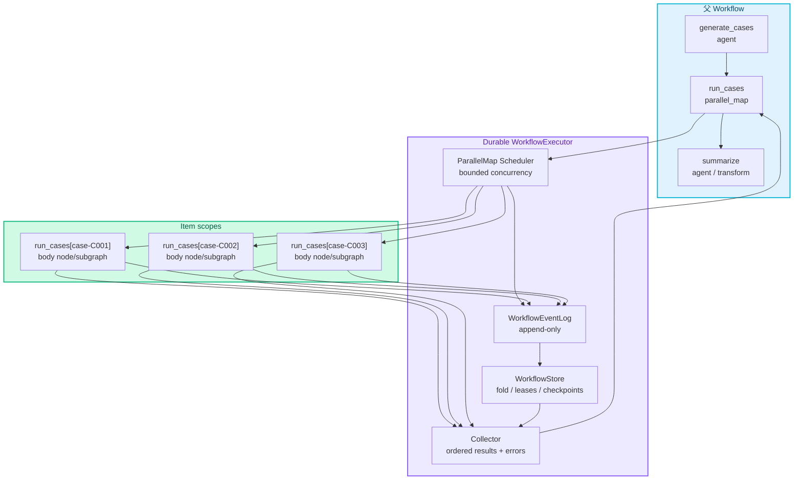
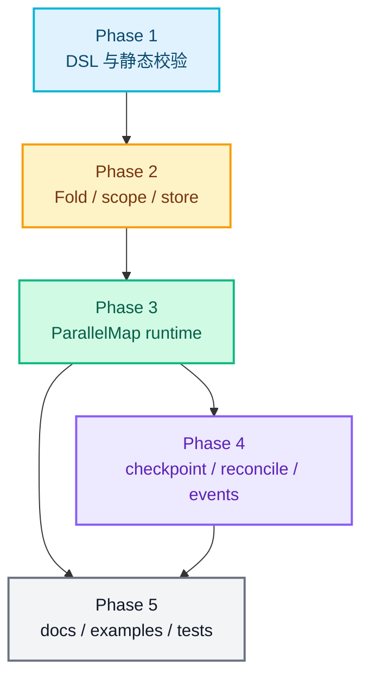

# RFC-0029: Workflow 并行 Map 与结果收集

- **状态**: draft
- **优先级**: P1
- **标签**: `architecture`, `workflow`, `agent`, `performance`, `dx`, `persistence`
- **影响服务**: `nexau/archs/workflow/`, `nexau/archs/session/`, `nexau/archs/transports/`, `nexau/archs/tracer/`, `docs/`, `examples/`
- **创建日期**: 2026-05-24
- **更新日期**: 2026-05-24

## 摘要

RFC-0027 已经定义了 durable Workflow runtime、结构化输出和 while scope；RFC-0028 已经定义了可复用的子图与 scoped execution frame。随着 QA case 执行、批量文档生成、批量外部系统检查等场景出现，仅靠 `while` 串行执行会浪费 LLM/Tool 的天然并发能力。本 RFC 在前两者之上新增 **`parallel_map` 节点**：把一个数组输入映射到同一个 workflow node 或 `subgraph` node 的多个独立 item scope 中并发执行，然后按确定性顺序收集 outputs/errors，作为父 `parallel_map` node 的结构化输出交给后续节点。

## 动机

### 1. `while` 可以表达批量处理，但只能串行推进

RFC-0027 的 `while` 节点可以逐个处理 test case、issue、文档段落或用户列表。它的 durable scope 能保证恢复时不重复已完成迭代，但执行模型仍是一个 item 完成后才开始下一个 item。对于 read-only Tool、LLM Agent、浏览器检查、MCP 查询等 I/O 密集任务，串行执行会显著拉长 workflow 总耗时。

### 2. 子图让单个流程可复用，但还缺少批量调用语义

RFC-0028 的 `subgraph` 可以把“执行一个测试用例”、“审查一个文件”、“归一化一个外部结果”封装成独立图文件。真实场景通常需要对 N 个输入同时调用同一个子图，再汇总结果。如果没有一等 `parallel_map`，只能复制多个节点或写 Python glue code，都会破坏 YAML-first、durable、可视化和可由模型生成的目标。

### 3. 并发必须继承 durable execution，而不是内存 `gather`

简单 `asyncio.gather` 无法回答以下问题：

- 进程在 100 个 item 中第 63 个完成后崩溃，恢复时如何跳过已完成 item；
- 某个 item 内部的 `external_write` lease 过期，如何只 reconcile 这个 item；
- 某个子图 item 内部出现 human checkpoint，如何定位 checkpoint 的 `scope_path`；
- 如何限制并发度，避免 LLM/MCP/外部系统被瞬时打满；
- 如何保证结果输出顺序稳定，不受完成先后影响。

因此并行执行必须继续写 append-only event log，每个 item 都有稳定 scope、lease、attempt、状态和 output。

### 4. 下游节点需要稳定的 fan-in contract

并行不是目标本身，目标是 “map -> collect”。下游 summarizer、report generator、human review node 需要一个稳定 JSON object，而不是一串无序事件。`parallel_map` 必须定义默认收集格式，并允许通过 `collect.output` 做轻量 projection，最终继续通过 `output_schema` 校验。

### 5. 并发资源控制需要进入 DSL

Agent/Tool/MCP 的并发上限通常由 provider rate limit、浏览器资源、外部系统 SLA 和预算共同决定。并发度不能隐藏在 runtime 默认值里；workflow 作者需要在 node `max_concurrency` 或 `durable.default_parallelism` 中声明并发边界，runtime 也需要全局上限防止误配置。

## 非目标

1. **不实现任意 DAG 自动并行调度**：本 RFC 只覆盖数组 fan-out/fan-in，不把普通 edges 中所有可并行节点自动并发执行。
2. **不创建子 workflow run**：每个 item 默认仍在同一个 `run_id` 下执行，复用 RFC-0027/0028 的 event log、scope 和 checkpoint/reconcile API。
3. **不实现通用 MapReduce 编程模型**：`collect.output` 只做 side-effect-free projection；复杂 reduce 应由后续 `transform`、`agent` 或 `subgraph` 节点完成。
4. **不允许 item 并发写共享父 state**：item 内部 state 隔离，父 state 只能在 collect boundary 通过显式 patch 更新。
5. **不提供 exactly-once 外部副作用**：item 内部 Tool/MCP/Agent 的 `external_write` 继续依赖 `idempotency_key`、`uncertain` 和 reconcile。
6. **不默认无限并发**：`parallel_map` 必须受 `max_concurrency` 和 workflow/global cap 约束。
7. **不要求 NAC 首版实现完整并发调试 UI**：runtime/SSE/tracing 先暴露足够 metadata，UI 可逐步支持折叠、进度和 item drill-down。
8. **不把 AgentTeam 替换为 parallel_map**：AgentTeam 仍负责多 Agent 协作和队内任务领取；`parallel_map` 负责确定性批量编排。

## 设计

### 概述

新增 `parallel_map` node type。它把一个 JSON array 渲染为稳定 item snapshot，为每个 item 生成独立 item scope，在并发上限内执行同一个 body node。body node 可以是普通 `agent` / `tool` / `mcp` / `transform` / `set_state` 节点，也可以是 RFC-0028 的 `subgraph` node。所有 item 结束后，`parallel_map` 按输入顺序收集结果并完成父节点。



关键决策：

1. `parallel_map` 是一个普通 workflow node，对父图来说只有一个 input/output boundary。
2. 每个 item 是独立 scoped node run，不共享 item-local state。
3. `items` 表达式只在 `parallel_map` node attempt 开始时求值一次，结果进入 event log，恢复时不重新读取上游可变状态。
4. `item_key` 必须稳定且唯一；未配置时使用 input index，但涉及外部副作用的 body 必须显式配置 `item_key`。
5. output 默认按输入顺序排列，避免并发完成顺序影响下游。
6. 子图 item 继续使用 RFC-0028 的 `ExecutionFrame`，scope 前缀叠加在 item scope 后。

### 1. YAML 格式

父 workflow 中定义 `parallel_map` 节点和一个 body node。body node 不通过普通 edges 进入主线，而是由 `parallel_map.body` 调用：

```yaml
type: workflow
version: "1"
name: qa_parallel_regression

includes:
  graphs:
    execute_case_graph: ./graphs/execute_case.workflow.yaml

inputs:
  requirement:
    type: string

durable:
  mode: node_boundary
  default_parallelism: 4
  max_parallelism: 16
  default_retry_policy:
    max_attempts: 2
    backoff: exponential
    on_uncertain: human_review

nodes:
  start:
    type: start
    output:
      requirement: "{{ inputs.requirement }}"

  generate_cases:
    type: agent
    agent: qa_planner
    input:
      requirement: "{{ nodes.start.output.requirement }}"
    output_schema:
      type: object
      properties:
        cases:
          type: array
          items:
            type: object
            properties:
              id: { type: string }
              title: { type: string }
              steps: { type: array }
              expected: { type: string }
            required: [id, title, steps, expected]
      required: [cases]

  run_cases:
    type: parallel_map
    items: "{{ nodes.generate_cases.output.cases }}"
    item_name: case
    item_key: "{{ case.id }}"
    max_concurrency: 4
    body: execute_one_case
    result_order: input
    failure_policy: collect_errors
    collect:
      output:
        results: "{{ results }}"
        errors: "{{ errors }}"
        completed_count: "{{ stats.completed }}"
        failed_count: "{{ stats.failed }}"
    output_schema:
      type: object
      properties:
        results: { type: array }
        errors: { type: array }
        completed_count: { type: integer }
        failed_count: { type: integer }
      required: [results, errors, completed_count, failed_count]

  execute_one_case:
    type: subgraph
    graph: execute_case_graph
    input:
      case: "{{ case }}"
      requirement: "{{ nodes.start.output.requirement }}"
    output_schema:
      type: object
      properties:
        case_id: { type: string }
        status: { type: string, enum: [passed, failed, blocked] }
        evidence: { type: string }
      required: [case_id, status, evidence]

  summarize:
    type: agent
    agent: qa_summarizer
    input:
      cases: "{{ nodes.run_cases.output.results }}"
      errors: "{{ nodes.run_cases.output.errors }}"

edges:
  start: generate_cases
  generate_cases: run_cases
  run_cases: summarize
```

同一机制也可以直接 map 到一个 Agent node：

```yaml
nodes:
  draft_sections:
    type: parallel_map
    items: "{{ inputs.sections }}"
    item_name: section
    item_key: "{{ section.id }}"
    max_concurrency: 3
    body: write_section

  write_section:
    type: agent
    agent: doc_writer
    input:
      title: "{{ section.title }}"
      outline: "{{ section.outline }}"
    output_schema:
      type: object
      properties:
        section_id: { type: string }
        markdown: { type: string }
      required: [section_id, markdown]
```

新增字段：

| 字段 | 位置 | 说明 |
|------|------|------|
| `type: parallel_map` | node | 声明并行 map 节点 |
| `items` | node | 表达式，必须渲染为 JSON array |
| `item_name` | node | item 在 body expression context 中的变量名，默认 `item` |
| `index_name` | node | index 在 body expression context 中的变量名，默认 `index` |
| `item_key` | node | 每个 item 的稳定 key 表达式，推荐显式配置 |
| `max_concurrency` | node | 本 map 的并发上限；省略时使用 `durable.default_parallelism`，有效值必须大于等于 1 且不超过 cap |
| `body` | node | 被并发调用的同图 node id，可指向 `subgraph` node |
| `result_order` | node | `input` 或 `completion`，默认 `input` |
| `failure_policy` | node | `fail_fast`、`fail_after_all`、`collect_errors`，默认 `fail_fast` |
| `collect` | node | 可选 fan-in projection，首版只支持 `output` 映射 |
| `state_in` | node | 可选，把父 state/input 片段复制到每个 item-local state |
| `state_out` | node | 可选，collect 成功后写回父 state 的 patch |
| `default_parallelism` | durable | workflow 级默认并发度 |
| `max_parallelism` | durable | workflow 级硬上限，节点不得超过 |

### 2. `parallel_map` 节点语义

`parallel_map` 执行分为五个 durable boundary：

1. 渲染 `items`，校验为 array，生成 item snapshot；
2. 为每个 item 渲染 `item_key`，校验唯一性；
3. 在 `max_concurrency` 内调度 item body scoped node run；
4. 监听 item terminal state：completed、failed、waiting、uncertain、cancelled；
5. 根据 `failure_policy` 和 `collect` 生成父 `parallel_map` output，写 `node_completed` 或 `node_failed`。

默认 output：

```json
{
  "results": [
    {
      "index": 0,
      "key": "case-C001",
      "output": { "case_id": "C001", "status": "passed", "evidence": "..." }
    }
  ],
  "errors": [
    {
      "index": 3,
      "key": "case-C004",
      "status": "failed",
      "error": "browser navigation timeout"
    }
  ],
  "stats": {
    "total": 10,
    "completed": 9,
    "failed": 1,
    "waiting": 0,
    "uncertain": 0
  }
}
```

如果配置了 `collect.output`，runtime 在 `items`、`results`、`errors`、`stats`、`nodes`、`state` 的只读上下文中渲染它，并以渲染结果作为父 node output。`output_schema` 校验的是最终 collected output。

### 3. Item expression context 与 state 隔离

每个 item body 的表达式上下文包含：

| 名称 | 来源 | 可变性 |
|------|------|--------|
| `inputs` | workflow run 输入 | 只读 |
| `vars` | workflow vars | 只读 |
| `state` | item-local state，初始来自 `parallel_map.state_in` | item 内可写 |
| `nodes` | 父图已完成节点 output/status 的快照，加上 item-local body 输出 | 父节点只读，item 输出由 runtime 写入 |
| `item` 或自定义 `item_name` | 当前 item JSON value | 只读 |
| `index` 或自定义 `index_name` | 当前 item input index | 只读 |
| `item_key` | 当前 item stable key | 只读 |
| `run` | 同一个 workflow run id | 只读 |
| `node` | 当前 body node id、scope_path、parallel parent id | 只读 |

隔离规则：

1. `items` 渲染后的 array 进入 parent `node_started` payload，恢复时使用这个 snapshot；
2. 每个 item 的 `state` 写入 `scoped_state[item_scope]`；
3. body node 的 `update` 只能 patch item-local state；
4. parent `state` 在 item 执行期间不可被 item 直接修改；
5. `parallel_map.state_out` 只在所有 required items 结束且 collect 成功后 patch parent state；
6. `nodes` 中父图已完成节点对所有 item 可见，但这些输出是 parallel_map 开始时的稳定视图。

这样可以避免并发 item 之间出现 last-write-wins 或完成顺序相关的状态漂移。

### 4. 映射到普通节点或子图

`parallel_map.body` 指向同一个图文件内的 node id。该 body node 是一个 call target，而不是父图主线上的普通节点。

首版允许的直接 body 类型：

| body 类型 | 支持 | 说明 |
|-----------|------|------|
| `agent` | 支持 | 最常见批量 LLM 任务 |
| `tool` | 支持 | 适合 read-only 或 idempotent tool call |
| `mcp` | 支持 | 复用 MCP tool schema 和 side-effect policy |
| `transform` | 支持 | 适合批量 deterministic projection |
| `set_state` | 支持 | 只写 item-local state |
| `subgraph` | 支持 | 推荐封装复杂 item 流程 |
| `human` | 不作为直接 body | 需要 human 的流程应包装成子图 |
| `if_else` / `while` | 不作为直接 body | 需要条件/循环时包装成子图 |
| `parallel_map` | 不作为直接 body | 嵌套并发首版通过子图表达，并受全局 cap 约束 |
| `start` / `end` / `note` | 不支持 | 这些节点不表示可调用工作单元 |

body node 校验规则：

1. `body` 必须引用存在的 node；
2. body node 不应出现在父图普通 edges 主线上；
3. body node 的 outgoing edge 在直接调用时忽略，复杂流程必须放入 `subgraph`；
4. body node 的 `input` 表达式可以引用当前 item context；
5. body node 内部副作用策略继续执行 RFC-0027 校验；
6. body 为 `subgraph` 时，子图内部语义完全沿用 RFC-0028。

### 5. 结果收集

收集必须满足确定性：

1. `result_order: input` 时，`results` 和 `errors` 按原 input index 排序；
2. `result_order: completion` 仅用于观察完成顺序，不应用作默认；
3. 每个 result entry 必须带 `index` 和 `key`，方便下游回关联原 item；
4. `collect.output` 只允许读取 `items/results/errors/stats`，不允许网络、文件、随机数或时间；
5. collect 失败时，父 `parallel_map` node 失败，不重跑已完成 item；
6. collect 成功后才执行 `state_out`，并写入 parent state patch。

推荐输出 contract：

```yaml
output_schema:
  type: object
  properties:
    results:
      type: array
      items:
        type: object
    errors:
      type: array
      items:
        type: object
    stats:
      type: object
  required: [results, errors, stats]
```

大型结果的后续优化可以引入 artifact-backed output，但不在本 RFC 首版范围内。首版仍使用 JSON-compatible output，与 RFC-0027 的 workflow state boundary 保持一致。

### 6. Durable scope 与事件模型

Item scope 在 parent scope 后追加 `parallel_node[item_key]`：

```text
run_cases[case-C001]/execute_one_case
run_cases[case-C001]/execute_one_case/start
run_cases[case-C001]/execute_one_case/run_browser_case
run_cases[case-C002]/execute_one_case/run_browser_case
```

节点实例 key 继续沿用 RFC-0027：

```text
(run_id, node_id, scope_path, attempt)
```

其中直接 body node 的示例：

```text
node_id = "execute_one_case"
scope_path = "run_cases[case-C001]/execute_one_case"
```

建议新增事件：

| 事件 | 是否 canonical | 作用 |
|------|----------------|------|
| `parallel_map_started` | 是 | 记录 item snapshot、item keys、max_concurrency、failure_policy |
| `parallel_item_scheduled` | 是 | 记录 item index/key/scope/body node |
| `parallel_item_completed` | 是 | 记录 item terminal success，便于 fold 和 UI |
| `parallel_item_failed` | 是 | 记录 item terminal failure 和 error 摘要 |
| `parallel_item_waiting` | 是 | item 内部 checkpoint 打开 |
| `parallel_item_uncertain` | 是 | item 内部 external side effect 进入 uncertain |
| `parallel_map_completed` | 可选 | SSE/tracing 友好事件，真源仍是父 `node_completed` |

对应的 body node、subgraph internal node 仍写现有 `node_scheduled`、`node_started`、`node_completed`、`checkpoint_created`、`node_uncertain` 等事件。恢复时 fold 以 `parallel_map_started` 的 item snapshot 和 scoped node events 为准。

恢复算法：

1. fold event log 得到父 `parallel_map` node attempt 和 item snapshot；
2. 根据 item keys 重建所有 item scope；
3. 读取 scoped body node/subgraph node terminal 状态；
4. 跳过已 completed 的 item；
5. 对 failed item 按 `failure_policy` 决定是否继续调度剩余 item；
6. 对 waiting item 保留 open checkpoint，不重复创建；
7. 对 uncertain item 等待 reconcile，不重跑整个 map；
8. 调度 pending item，直到达到 `max_concurrency` 或没有 pending；
9. 所有 required item terminal 后运行 collect；
10. 写父 `parallel_map` node 的 `node_completed` 或 `node_failed`。

### 7. 调度与并发上限

并发控制分为三层：

| 层级 | 字段 | 说明 |
|------|------|------|
| Node | `max_concurrency` | 单个 `parallel_map` 的并发度，可显式配置或使用 durable default |
| Workflow | `durable.max_parallelism` | 单个 run 内的硬上限 |
| Runtime | executor/global cap | 进程级或部署级上限，防止多个 run 叠加打满资源 |

首版调度策略：

1. 单个 `WorkflowExecutor` 可以用 async bounded worker pool 执行 item；
2. 每个 body node run 仍获取独立 lease；
3. parent `parallel_map` node 作为 scheduler/control node 保持 running；
4. parent scheduler lease 过期后，另一个 worker 可通过 fold 恢复未完成 item；
5. item scheduling 必须幂等：同一个 `(run_id, body_node_id, item_scope)` 最多有一个 active attempt；
6. 已 scheduled/running/completed 的 item 不重复 schedule；
7. `max_concurrency` 统计 active item attempts，不统计已经 waiting 的 human checkpoint，避免 human 等待永久占用 worker slot。

首版不要求实现跨进程 work stealing，但 event log 和 lease 语义应避免未来扩展时改 DSL。

### 8. 失败、等待、uncertain 与取消

`failure_policy`：

| 策略 | 语义 | 父 node 结果 |
|------|------|--------------|
| `fail_fast` | 第一个 item 失败后停止调度新的 item，已 running item 尽量取消或 drain | 父 node failed |
| `fail_after_all` | 所有 item 都跑完后，只要有失败则父 node failed | 父 node failed |
| `collect_errors` | item 失败进入 `errors`，只要 collect/output_schema 成功，父 node completed | 父 node completed |

Human checkpoint：

1. item body 直接为 `human` 不支持；
2. 子图内部可以包含 human node；
3. 多个 item 可以产生多个 open checkpoints；
4. `FoldedWorkflowState` 需要新增 `waiting_checkpoint_ids`；
5. `WorkflowRunModel` 可以继续保留 `waiting_checkpoint_id` 作为兼容字段，但 transport 应暴露 `waiting_checkpoint_ids`；
6. resume 某个 checkpoint 后，只继续对应 item scope，然后回到 `parallel_map` scheduler；
7. 如果还有其他 open checkpoints 且没有可运行 item，run 继续保持 `waiting`。

`uncertain`：

1. item 内部 `external_write` lease 过期后，内部节点进入 `uncertain`；
2. parent `parallel_map` materialized status 展示为 `uncertain` 或 `uncertain_inside`；
3. run 状态进入 `uncertain`，默认暂停新的 item 调度；
4. reconcile API 使用 `node_id + scope_path` 定位具体 item 内部节点；
5. reconcile 后从该 item scope 继续，不重跑其他已完成 item。

取消：

1. 取消整个 run 时，pending item 不再调度；
2. active item 尝试 best-effort cancellation；
3. 已完成 item output 保留在 event log；
4. 首版不提供取消单个 item 的 public API，可后续扩展。

### 9. Transport、SSE 与 tracing

现有 workflow run API 可以继续使用，但 event payload 需要增加 parallel metadata：

| 字段 | 说明 |
|------|------|
| `parallel_node_id` | 父 `parallel_map` node id |
| `item_index` | input array index |
| `item_key` | stable item key |
| `item_scope_path` | item scope prefix |
| `body_node_id` | 被调用的 body node |
| `graph_id` | 当前 node 所属图 |
| `scope_path` | 当前 node 完整 durable scope |
| `parent_node_id` | 子图内部节点的父 subgraph node |
| `depth` | 子图嵌套深度 |

SSE 示例：

```json
{
  "type": "workflow_parallel_item_started",
  "run_id": "wf_run_123",
  "parallel_node_id": "run_cases",
  "item_index": 0,
  "item_key": "case-C001",
  "body_node_id": "execute_one_case",
  "scope_path": "run_cases[case-C001]/execute_one_case",
  "graph_id": "qa_parallel_regression"
}
```

Run 查询建议返回 parent node progress：

```json
{
  "node_id": "run_cases",
  "status": "running",
  "progress": {
    "total": 20,
    "scheduled": 12,
    "running": 4,
    "completed": 8,
    "failed": 0,
    "waiting": 0,
    "uncertain": 0
  }
}
```

Tracing 建议：

| Span | 说明 |
|------|------|
| `WORKFLOW_NODE` | 父 `parallel_map` control node |
| `WORKFLOW_PARALLEL_ITEM` 或带属性的 `WORKFLOW_NODE` | 单个 item scope |
| `WORKFLOW_SUBGRAPH` | item body 为子图时的 subgraph frame |
| `AGENT` / `TOOL` | item 内部实际调用 |

新增 attributes：

- `workflow.parallel_node_id`
- `workflow.item_index`
- `workflow.item_key`
- `workflow.item_scope_path`
- `workflow.max_concurrency`
- `workflow.failure_policy`

### 10. 静态校验

配置解析阶段新增校验：

1. `parallel_map` 必须配置 `items` 和 `body`；
2. `body` 必须引用当前图内存在的 node；
3. body node 类型必须在首版允许列表中；
4. body node 不应被普通 edge 引用为主线节点；
5. 有效 `max_concurrency` 必须大于等于 1 且不超过 `durable.max_parallelism`；
6. `item_name`、`index_name` 不能与保留变量 `inputs`、`vars`、`state`、`nodes`、`run`、`node` 冲突；
7. `result_order` 和 `failure_policy` 必须是已知枚举值；
8. body node 若为 `idempotent_write` / `external_write`，必须配置 idempotency 或 uncertain policy；
9. 如果 body node 可能产生外部副作用，则 `item_key` 必须显式配置；
10. `collect.output` 必须渲染为 JSON object；
11. `state_out` 必须渲染为 JSON object；
12. `parallel_map` 与 `while` / `subgraph` 组合后的 scope depth 不得超过 durable cap。

### 11. 与 RFC-0027 / RFC-0028 的兼容关系

| 既有能力 | 本 RFC 扩展 |
|----------|-------------|
| RFC-0027 Workflow YAML | 新增 `type: parallel_map` 和 durable parallelism 配置 |
| RFC-0027 durable event log | 每个 item body node 写 scoped node events，父 map 写 collect boundary |
| RFC-0027 while scope | `parallel_map[item_key]` 使用同一 scope_path 设计原则 |
| RFC-0027 Tool/MCP side_effect | item 内部继续沿用 side-effect policy 和 idempotency key |
| RFC-0027 human checkpoint | 子图 item 内部 human checkpoint 可定位到 item scope |
| RFC-0028 subgraph node | body 可以是 `subgraph` node，每个 item 创建独立 subgraph frame |
| RFC-0028 expression context isolation | item state 与 subgraph state 叠加隔离 |
| RFC-0028 transport metadata | event payload 继续使用 graph_id/scope_path/depth，并新增 item metadata |

## 权衡取舍

### 考虑过的替代方案

| 方案 | 优点 | 缺点 | 决定 |
|------|------|------|------|
| 继续用 `while` 串行执行 | 实现最简单，恢复语义已存在 | 不能利用 I/O 并发，批量任务耗时过长 | 否 |
| 普通 DAG edges 自动并行 | 用户不需要新 DSL，理论上更通用 | 与 conditional/while/human/subgraph 的状态交互复杂，难以做稳定 collect contract | 否 |
| 在 `while` 上加 `parallel: true` | YAML 改动少 | `while` 语义是状态迭代，和 map item 隔离/collect 输出模型冲突 | 否 |
| `parallel_map` 只支持 subgraph | 子图隔离清晰 | 简单 Agent/Tool 批量调用需要额外包装文件，DX 较差 | 否 |
| `parallel_map` 支持 node 或 subgraph | 覆盖简单与复杂批量场景，和 RFC-0028 兼容 | body node 校验和 scope/fold 更复杂 | 采用 |
| 每个 item 创建独立 workflow run | 隔离强，查询简单 | 父子 run join、checkpoint、取消、trace 和 output collect 成本高 | 否 |
| 同一 run 下 scoped item | 复用现有 durable runtime，恢复和事件订阅统一 | 单个 event log 可能变长，需要后续 snapshot/index 优化 | 采用 |

### 缺点

1. `scope_path` 会更长，必须尽快确定 URL-safe / JSON Pointer-compatible 编码策略。
2. `WorkflowStore.fold()` 需要处理更多 scoped node runs，长数组场景可能需要 snapshot index。
3. 多 checkpoint 场景会要求 transport 和 materialized run summary 从单 checkpoint 视图升级为 checkpoint list。
4. `collect_errors` 会让父 node completed 但内部有失败 item，UI 必须清楚展示 partial success。
5. 过高并发会放大 provider rate limit 和外部系统压力，runtime 必须有保守 cap。
6. body node 作为 call target 会增加 graph 可视化复杂度，NAC 需要区分主线节点和 map body 节点。

## 实现计划

### 阶段划分

- [ ] Phase 1: DSL 与静态校验
  - 扩展 `WorkflowNodeType` 增加 `parallel_map`。
  - 增加 `items`、`item_name`、`index_name`、`item_key`、`max_concurrency`、`body`、`result_order`、`failure_policy`、`collect` 字段。
  - 扩展 `DurableConfig` 增加 `default_parallelism`、`max_parallelism`。
  - 校验 body node、并发上限、保留变量、side-effect policy 和 output schema。

- [ ] Phase 2: Fold、scope 与 store 支持
  - 扩展 `FoldedWorkflowState` 保存 parallel item snapshot、item status、item outputs/errors、waiting checkpoint list。
  - 增加 item scope helper 和 item key normalization。
  - 支持从 event log 恢复 pending/running/completed/failed/waiting/uncertain item。
  - 保持已有 workflow、while、subgraph 行为兼容。

- [ ] Phase 3: ParallelMap runtime
  - 在 `WorkflowExecutor` 中实现 `parallel_map` control node。
  - 用 bounded async scheduler 执行 item body node/subgraph。
  - 支持 parent state snapshot、item-local state、state_in/state_out。
  - 实现 `failure_policy`、result ordering 和 collect output。

- [ ] Phase 4: checkpoint/reconcile/cancel/events/tracing
  - 支持子图 item 内部 human checkpoint 的多 checkpoint 暴露与 resume。
  - 支持 item 内部 uncertain node reconcile。
  - 增加 parallel item SSE metadata 和 progress summary。
  - tracing 增加 parallel item attributes。

- [ ] Phase 5: 文档、示例与测试
  - 添加 parallel_map YAML reference。
  - 增加 `examples/workflows/qa_parallel_regression/`。
  - 补充 unit/integration tests，覆盖 parser、runtime、recovery、failure policy、checkpoint、subgraph item。
  - 更新 RFC-0027/0028 相关文档，指向本 RFC 的并行能力。

### 子任务 DAG



### 相关文件

| 文件 | 说明 |
|------|------|
| `nexau/archs/workflow/config.py` | 增加 `parallel_map` DSL、durable parallelism 配置和静态校验 |
| `nexau/archs/workflow/executor.py` | 增加 parallel_map scheduler、item body execution、collect 和恢复调度 |
| `nexau/archs/workflow/store.py` | 扩展 fold 逻辑，支持 parallel item snapshot/status/output 和 checkpoint list |
| `nexau/archs/workflow/types.py` | 复用 JSON-safe 类型边界，必要时增加 array/object helper |
| `nexau/archs/session/models/workflow.py` | 必要时增加 materialized progress、waiting checkpoint list 或 parallel metadata |
| `nexau/archs/transports/http/` | workflow events/run query 增加 parallel item metadata 和 progress |
| `nexau/archs/tracer/` | tracing attributes 或 span type 扩展 |
| `tests/unit/test_workflow_config.py` | parallel_map parser 和静态校验 |
| `tests/unit/test_workflow_store.py` | fold parallel item events、waiting checkpoint list、scoped outputs |
| `tests/integration/test_workflow_executor.py` | parallel_map runtime、recovery、failure policy、subgraph body |
| `docs/advanced-guides/` | parallel_map 使用文档 |
| `examples/workflows/` | QA parallel regression 示例 workflow |

## 测试方案

### 单元测试

- DSL 解析：`parallel_map` 必填字段、枚举字段、`max_concurrency` 上限。
- item key：显式 key、默认 index、重复 key fail fast。
- body 校验：未知 body、非法 body 类型、body 被普通 edge 引用。
- side-effect 校验：external_write body 缺少 idempotency/on_uncertain 时失败。
- collect 校验：`collect.output` 必须是 JSON object，`output_schema` 校验最终 output。
- fold：从 `parallel_map_started` 和 scoped node events 恢复 item status/output/error。
- waiting checkpoint list：多个 item checkpoint 都能被 fold 出来。
- result ordering：完成顺序不同但 `result_order: input` 输出稳定。

### 集成测试

- map 10 个 item 到 Agent node，`max_concurrency=3`，确认同一时刻 running item 不超过 3。
- map 到 subgraph node，每个 item 内部节点 scope 互不覆盖。
- worker 在部分 item completed 后重启，恢复后不重复执行已完成 item。
- `failure_policy: fail_fast` 下第一个失败 item 停止调度新 item，父 node failed。
- `failure_policy: collect_errors` 下失败 item 进入 errors，父 node completed。
- 子图 item 内部 human checkpoint 暂停，resume 单个 checkpoint 后只继续对应 item。
- item 内部 external_write lease expired 后进入 uncertain，reconcile 后从该 item scope 继续。
- empty items 立即完成，输出空 results/errors 和正确 stats。
- parent `state_out` 只在 collect 成功后写入父 state。

### 手动验证

1. 运行 `examples/workflows/qa_parallel_regression/qa_parallel.workflow.yaml`，输入 5 个测试用例。
2. 确认事件流出现 `run_cases` 的 `parallel_map_started` 和 5 个 item scheduled。
3. 设置 `max_concurrency=2`，确认任意时刻最多 2 个 item running。
4. 在第 2 个 item 完成后 kill worker，重启后确认第 1/2 个 item 不重复执行。
5. 人为制造一个 item 失败，确认 `collect_errors` 输出包含该 item 的 `index` 和 `key`。
6. 将 body 改为 subgraph，确认 subgraph internal event 的 `scope_path` 包含 item key。
7. 在 subgraph 内加入 human node，确认 run query 返回多个 `waiting_checkpoint_ids`。

## 未解决的问题

1. `scope_path` 中 item key 的最终编码策略：是否使用 URL-safe percent encoding、JSON Pointer escaping，还是单独保存 raw key。
2. 多 checkpoint 暴露是否要修改 `WorkflowRunModel` schema，还是只通过 fold/run query 动态返回。
3. `fail_fast` 对 already running item 是 best-effort cancel、等待 drain，还是继续完成但忽略结果。
4. 大规模 item output 是否需要 artifact-backed result storage，避免 event log 和 run summary 过大。
5. 是否需要 per-provider/per-tool concurrency pool，例如同一个 MCP server 的全局并发上限。
6. `parallel_map` body node 是否允许直接为 `while`，还是始终要求包装成 subgraph。
7. `result_order: completion` 是否真的需要首版支持，还是先固定 input order。
8. NAC 中 body node 应显示为 map 内模板节点，还是仍显示在父图画布上。

## 参考资料

- [RFC-0027: Agent Workflow 编排与结构化输出](./0027-agent-workflow-orchestration.md) - Workflow runtime、durable execution、while scope 和 side-effect policy 的基础设计。
- [RFC-0028: Workflow 子图支持](./0028-workflow-subgraph-support.md) - 子图 frame、scope_path、checkpoint/reconcile 和 transport metadata 的基础设计。
- [RFC-0002: AgentTeam 多 Agent 协作框架](./0002-agent-team.md) - 与 AgentTeam 并发协作语义的能力边界参考。
- [RFC-0022: Agent Run Action 生命周期与 typed blocks](./0022-agent-run-action-lifecycle-and-typed-blocks.md) - event fold 与 run boundary 的设计参照。
