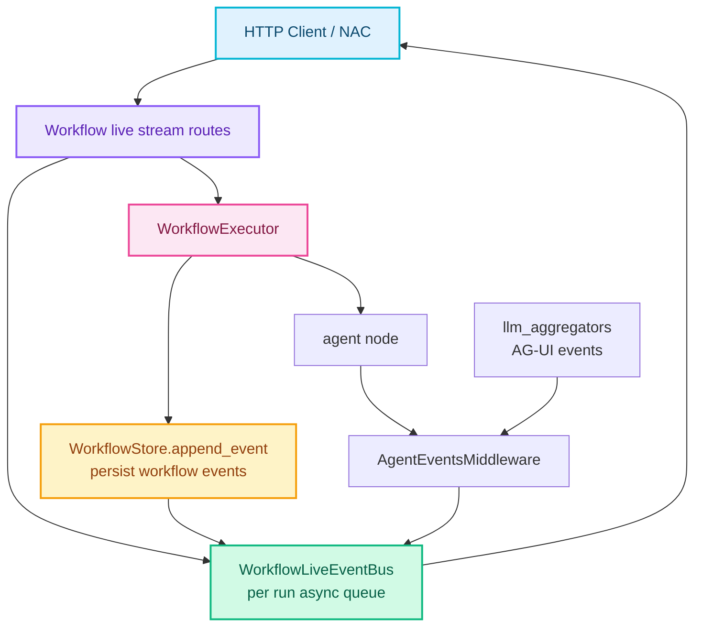
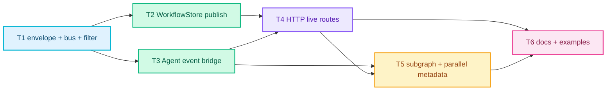

# RFC-0030: Workflow 与 Agent 事件统一流式输出

- **状态**: implemented
- **优先级**: P1
- **标签**: `workflow`, `streaming`, `agent`, `observability`, `dx`
- **影响服务**: `nexau/archs/workflow/`, `nexau/archs/transports/http/workflow_routes.py`, `nexau/archs/main_sub/execution/middleware/agent_events_middleware.py`, `nexau/archs/llm/llm_aggregators/events.py`, `docs/`, `examples/`
- **创建日期**: 2026-05-24
- **更新日期**: 2026-05-24

## 摘要

RFC-0027/0028/0029 已经让 Workflow 可以 durable 地编排 Agent、Human、Subgraph 和 Parallel Map，但当前 Workflow HTTP SSE 只输出 `WorkflowStore` 中持久化的 workflow 事件，例如 `node_started`、`checkpoint_created`、`parallel_item_completed`。Agent 节点内部的 LLM token delta、tool call args、tool result、usage、agent run lifecycle 等事件仍只存在于普通 Agent `/stream` 或 AgentTeam stream 中，无法在 Workflow UI 中实时展示。

本 RFC 新增 **Workflow Live Stream**：在启动或 resume workflow 时，通过单一 SSE 连接同时输出两类事件：

1. **workflow_event**: 来自 durable workflow event log，可持久化、可 replay；
2. **agent_event**: 来自 AgentEventsMiddleware / llm_aggregators 的 AG-UI 事件，live-only 默认不落库，但携带 workflow node scope metadata。

现有 `GET /workflow-runs/{run_id}/events` 保持为持久化 workflow event replay API，不混入 token 级 agent event。新增 live stream API 用于前端实时体验。

## 动机

### 1. 当前 Workflow SSE 只展示编排边界

`WorkflowStore.append_event()` 只记录 durable control-plane 事件。用户运行 QA workflow 时可以看到：

- `workflow_run_started`
- `node_started`
- `subgraph_started`
- `checkpoint_created`
- `parallel_item_completed`
- `workflow_run_completed`

但在 `agent` node 内部，模型生成文本、思考块、tool call 参数流、tool result、usage update 都不可见。对长时间运行的 Agent 节点来说，Workflow UI 看起来像卡在 `node_started`，直到最后 `node_completed` 才突然出现结果。

### 2. Workflow UI 需要展开 Agent 节点内部过程

NAC 或其他客户端需要在一个树形视图里显示：

```text
workflow run
  generate_cases node
    agent run started
    text delta...
    complete_task tool call args...
    tool result...
    usage update
  review_cases subgraph
    review human checkpoint
  run_cases parallel_map
    item C001
      runner agent text/tool events...
```

如果没有 Agent event 和 Workflow scope 的关联，前端只能额外打开 agent session stream，且无法可靠知道该事件属于哪个 workflow node、subgraph frame 或 parallel item。

### 3. Durable event log 与 live stream 语义不同

Workflow event log 是恢复真源，必须精简、可 fold、可长期保存。Agent token delta 体积大、可能包含敏感内容、没有 workflow recovery 价值，默认不应该写入同一个 durable log。

因此需要明确区分：

- durable workflow events: 必须持久化，可 replay；
- live agent events: 默认只在连接期间推送，用于 UI 实时展示；
- optional future persistence: 可由单独的 transcript/event archive 处理，不污染 workflow state fold。

### 4. Parallel Map 和 Subgraph 需要精确 scope

RFC-0028/0029 引入了 `scope_path`、`graph_id`、`parent_node_id`、`parallel_node_id`、`item_key` 等 metadata。Agent stream 必须继承这些 metadata，否则并行 item 的 token/tool 事件会混在一起，UI 无法归位。

## 非目标

1. **不改变现有 durable event log 的 fold 语义**：Agent token/tool delta 不参与 workflow recovery。
2. **不让 `GET /workflow-runs/{run_id}/events` 返回 agent token events**：该 API 继续表示 persisted workflow event replay。
3. **不实现跨进程 live stream fanout**：首版只保证启动/resume workflow 的同一进程内 SSE 连接能收到 live agent events。跨 worker subscribe 可后续实现。
4. **不持久化所有 agent events**：默认 live-only。后续可通过单独 archive 或 sampling 策略扩展。
5. **不替代现有 Agent `/stream` 和 Team `/team/stream`**：这些 API 继续服务单 Agent 和 AgentTeam 场景。
6. **不改变 AgentEventsMiddleware 的 AG-UI event contract**：Workflow 只包一层 envelope 并补充 workflow metadata。
7. **不默认暴露 reasoning/thinking 内容**：需要通过 stream option 显式开启或配置 event filter。

## 设计

### 概述

新增 Workflow Live Stream 数据通路：



核心原则：

1. Workflow live stream 使用统一 envelope，客户端不需要同时订阅 workflow 和 agent 两个 stream。
2. `workflow_event` 来自 `WorkflowStore.append_event()`，和持久化事件一一对应。
3. `agent_event` 来自注入到 AgentConfig 的 workflow-owned `AgentEventsMiddleware`。
4. Agent event 必须携带 workflow node scope metadata，支持 subgraph 和 parallel item 展开。
5. Agent event 默认 live-only，不写入 `WorkflowEventModel`。
6. SSE 连接断开时，workflow run 是否取消由 route option 决定，默认继续运行到下一个 durable boundary。

### 1. 统一 Stream Envelope

新增 `WorkflowStreamEnvelope`，作为 HTTP SSE `data` 的 JSON payload：

```json
{
  "type": "agent_event",
  "stream_sequence": 42,
  "run_id": "wf_qa_release_1234",
  "timestamp": 1790000000000,
  "workflow": {
    "workflow_name": "qa_release_check",
    "graph_id": "qa_release_check",
    "node_id": "run_one_case",
    "node_type": "agent",
    "scope_path": "run_cases[C001]/run_one_case",
    "parent_node_id": null,
    "subgraph": null,
    "parallel_node_id": "run_cases",
    "item_index": 0,
    "item_key": "C001",
    "item_scope_path": "run_cases[C001]"
  },
  "agent": {
    "agent_name": "qa_runner",
    "agent_run_id": "run_abc",
    "session_id": "session_1:parallel:C001",
    "event": {
      "type": "TOOL_CALL_START",
      "tool_call_id": "call_1",
      "name": "complete_task"
    }
  },
  "persisted": false
}
```

Envelope 类型：

| `type` | 来源 | 是否持久化 | 说明 |
|--------|------|------------|------|
| `workflow_event` | `WorkflowStore.append_event()` | 是 | 与现有 workflow event log 一致 |
| `agent_event` | `AgentEventsMiddleware.on_event` | 默认否 | AG-UI event，带 workflow metadata |
| `stream_status` | HTTP route / executor | 否 | `started`、`waiting`、`completed` 等 live stream 状态 |
| `error` | HTTP route / executor | 否 | stream 或 workflow 执行错误 |
| `complete` | HTTP route | 否 | SSE 连接正常结束 |

SSE framing：

```text
event: workflow_event
data: {"type":"workflow_event", ...}

event: agent_event
data: {"type":"agent_event", ...}
```

为了兼容现有客户端，`workflow_event` envelope 中保留当前 `GET /workflow-runs/{run_id}/events` 使用的字段：

- `event_id`
- `sequence`
- `event_type`
- `node_id`
- `scope_path`
- `attempt`
- `graph_id`
- `parent_node_id`
- `subgraph`
- `depth`
- `parallel_node_id`
- `item_index`
- `item_key`
- `item_scope_path`
- `body_node_id`
- `payload`
- `created_at`

### 2. WorkflowLiveEventBus

新增进程内 live bus：

| 方法 | 说明 |
|------|------|
| `subscribe(run_id) -> AsyncIterator[WorkflowStreamEnvelope]` | route 在启动/resume 前订阅 |
| `publish_workflow_event(event: WorkflowEventModel)` | `WorkflowStore.append_event()` 成功落库后发布 |
| `publish_agent_event(context, event: Event)` | AgentEventsMiddleware 回调发布 |
| `publish_status(run_id, status, payload)` | route/executor 发布 stream lifecycle |
| `close(run_id)` | run 到 boundary 后关闭当前 stream |

要求：

1. Workflow events 必须先落库，再 publish，避免客户端看到无法 replay 的 durable event。
2. Agent event callback 是同步 `Callable[[Event], None]`，bus 必须支持从任意线程发布，例如通过 `loop.call_soon_threadsafe(...)`。
3. 每个 SSE 连接维护单调递增 `stream_sequence`，用于客户端按连接内顺序渲染。
4. 队列需要 backpressure 策略。首版建议：
   - workflow events 不丢弃；
   - agent events 使用 bounded queue；
   - 队列满时丢弃低价值 delta，并发送一次 `agent_event_dropped` stream status；
   - `TOOL_CALL_START`、`TOOL_CALL_END`、`TOOL_CALL_RESULT`、`RUN_STARTED`、`RUN_FINISHED`、`RUN_ERROR`、`USAGE_UPDATE` 不应丢弃。

### 3. WorkflowStore 发布 Durable Workflow Events

`WorkflowStore` 增加可选 `live_event_bus`：

```python
store = WorkflowStore(engine, live_event_bus=workflow_live_event_bus)
```

`append_event(...)` 完成 DB create 后：

1. 返回 `WorkflowEventModel`；
2. 若配置了 bus，则调用 `publish_workflow_event(event)`；
3. 若无 bus，则行为不变。

这样所有现有 executor 代码路径自动覆盖：

- root graph events
- subgraph events
- human checkpoint events
- parallel map item events
- uncertain/reconcile events

### 4. Agent Event Bridge

`WorkflowExecutor` 增加可选 `agent_event_sink` 或 `live_event_bus` 参数。执行 agent node 前，构造 workflow-aware callback：

```python
def on_agent_event(event: Event) -> None:
    live_event_bus.publish_agent_event(
        run_id=run_id,
        workflow_context=current_node_context,
        agent_name=node.agent,
        agent_session_id=session_id,
        event=event,
    )
```

然后把 workflow-owned `AgentEventsMiddleware` 注入到 AgentConfig copy：

1. deep-copy 原始 `AgentConfig`；
2. 保留用户已配置 middlewares；
3. 追加或合并一个 `AgentEventsMiddleware(session_id=agent_session_id, on_event=on_agent_event)`；
4. 强制 `llm_config.stream = True`，除非 stream option 显式关闭 agent events；
5. 对 structured output 路径同样生效，因为 `run_agent_structured_async(...)` 会复制传入 config 并创建 Agent。

如果 AgentConfig 已经包含 `AgentEventsMiddleware`：

- 不允许产生重复事件；
- workflow runtime 应 wrap 原 callback，使它同时发给原 consumer 和 workflow live bus；
- 若无法安全识别，则记录 warning 并优先保留 workflow-owned middleware。

`agent_runner` 测试替身默认不产生 agent events。需要测试 agent events 时，可新增测试专用 runner sink，或走真实 AgentEventsMiddleware + fake LLM stream 路径。

### 5. Stream Options

新增请求模型：

```python
class WorkflowStreamOptions(BaseModel):
    include_workflow_events: bool = True
    include_agent_events: bool = True
    include_thinking_events: bool = False
    include_usage_events: bool = True
    include_tool_events: bool = True
    include_text_deltas: bool = True
    persist_agent_events: bool = False
    cancel_on_disconnect: bool = False
```

首版 `persist_agent_events` 只保留字段，必须为 `false`。如果传 `true`，API 返回 400，避免用户误以为 token event 已 durable 保存。

Agent event filter 默认不暴露 thinking/reasoning 内容。需要前端明确开启 `include_thinking_events`。

### 6. HTTP API

保留现有 API：

| API | 行为 |
|-----|------|
| `POST /workflows/{workflow_name}/runs` | 非 streaming，运行到 boundary |
| `GET /workflow-runs/{run_id}` | 查询 materialized run |
| `GET /workflow-runs/{run_id}/events` | replay persisted workflow events |
| `POST /workflow-runs/{run_id}/resume` | 非 streaming resume |

新增 live API：

| API | 行为 |
|-----|------|
| `POST /workflows/{workflow_name}/runs/stream` | 启动或恢复 run，并 live stream workflow + agent events |
| `POST /workflow-runs/{run_id}/resume/stream` | resume checkpoint，并 live stream 后续 workflow + agent events |

Start stream request：

```json
{
  "run_id": "wf_qa_release_1234",
  "inputs": {
    "requirement": "Checkout retry should show a clear error."
  },
  "user_id": "user_1",
  "session_id": "session_1",
  "stream": {
    "include_workflow_events": true,
    "include_agent_events": true,
    "include_tool_events": true,
    "include_text_deltas": true,
    "include_thinking_events": false
  }
}
```

Resume stream request：

```json
{
  "checkpoint_id": "wf_ckpt_123",
  "output": {
    "approved": true,
    "cases": [],
    "review_note": "Approved."
  },
  "stream": {
    "include_workflow_events": true,
    "include_agent_events": true
  }
}
```

SSE example：

```text
event: workflow_event
data: {"type":"workflow_event","workflow_event":{"event_type":"node_started","node_id":"generate_cases",...}}

event: agent_event
data: {"type":"agent_event","agent":{"event":{"type":"TEXT_MESSAGE_CONTENT","delta":"Create"}},"workflow":{"node_id":"generate_cases",...}}

event: workflow_event
data: {"type":"workflow_event","workflow_event":{"event_type":"node_completed","node_id":"generate_cases",...}}

event: complete
data: {"type":"complete","run_id":"wf_qa_release_1234","status":"waiting","checkpoint_id":"wf_ckpt_123"}
```

### 7. Human Checkpoint 与 Resume

当 run 进入 `waiting`：

1. stream 发送 `workflow_event(checkpoint_created)`；
2. stream 发送 `stream_status(status="waiting")`；
3. stream 发送 `complete` 并关闭当前 SSE 连接。

用户提交 human output 时：

- 使用现有 `POST /workflow-runs/{run_id}/resume` 可非 streaming resume；
- 使用新增 `POST /workflow-runs/{run_id}/resume/stream` 可继续收到后续 workflow + agent events。

### 8. Parallel Map 与 Subgraph Metadata

Agent event envelope 的 `workflow` 字段必须继承 `_ExecutionFrame` metadata：

| 字段 | 来源 |
|------|------|
| `workflow_name` | root workflow |
| `graph_id` | 当前 frame graph |
| `node_id` | 当前 agent node id |
| `node_type` | `agent` |
| `scope_path` | 当前 scoped node path |
| `parent_node_id` | subgraph parent node |
| `subgraph` | include graph key |
| `depth` | subgraph depth |
| `parallel_node_id` | parallel map node id |
| `item_index` | parallel item index |
| `item_key` | parallel item key |
| `item_scope_path` | parallel item scope |

客户端应使用 `scope_path` 作为主要归位 key。`node_id` 不是全局唯一，因为 parallel item 和 subgraph frame 会复用同一个 node id。

### 9. 事件过滤与安全

Agent event 可能包含：

- 用户/模型正文；
- tool 参数；
- tool result；
- provider reasoning/thinking；
- usage 和 run lifecycle。

首版过滤规则：

1. `include_agent_events=false` 时不注入 AgentEventsMiddleware。
2. `include_text_deltas=false` 时过滤 `TEXT_MESSAGE_CONTENT`。
3. `include_tool_events=false` 时过滤 `TOOL_CALL_*` 和 `TOOL_CALL_RESULT`。
4. `include_usage_events=false` 时过滤 `USAGE_UPDATE`。
5. `include_thinking_events=false` 时过滤 `THINKING_*`。
6. `RUN_STARTED`、`RUN_FINISHED`、`RUN_ERROR` 默认保留，因为它们是 agent node 展开视图的结构边界。

后续如需要更细粒度控制，可扩展 `allowed_event_types` / `redact_fields`。

## 权衡取舍

### 考虑过的替代方案

| 方案 | 优点 | 缺点 | 结论 |
|------|------|------|------|
| 把 Agent events 写入 `WorkflowEventModel` | replay 简单，单一事件源 | token 事件体积大，会污染 workflow recovery fold，隐私风险高 | 不采用 |
| 前端同时订阅 Workflow SSE 和 Agent `/stream` | 后端改动少 | 无法可靠关联 workflow node/subgraph/parallel item，连接管理复杂 | 不采用 |
| 只在 `node_completed` payload 中保存 agent transcript | durable 且简单 | 不是 streaming，长 Agent 节点仍无实时反馈 | 不采用 |
| 新增独立 AgentEventStore | 可 replay agent stream | 范围大，需要 retention、压缩、权限和成本策略 | 后续 RFC |
| Workflow Live Stream envelope | 实时、可关联、对 durable log 零污染 | 需要 event bus、middleware 注入、backpressure 设计 | 采用 |

### 缺点

1. 首版 live stream 是进程内能力。若 run 在另一个 worker 执行，订阅者收不到 live agent event。
2. Agent event 默认不持久化，断线后只能 replay workflow boundary，不能 replay token delta。
3. 同步 AgentEventsMiddleware callback 需要线程安全投递，不能简单 `await queue.put(...)`。
4. 并行 item 中 agent events 的全局顺序只表示到达顺序，不表示业务确定性。
5. 开启 text/tool delta 会增加 HTTP 流量，需要前端和部署层处理 backpressure。

## 实现计划

### 阶段划分

- [x] Phase 1: Stream envelope、event bus、过滤器
- [x] Phase 2: WorkflowStore durable event publish
- [x] Phase 3: WorkflowExecutor agent event bridge
- [x] Phase 4: HTTP live stream start/resume APIs
- [x] Phase 5: tests、docs、example runner

### 子任务分解

| ID | 子任务 | 依赖 | 验收标准 |
|----|--------|------|----------|
| T1 | 定义 `WorkflowStreamEnvelope`、metadata model、event filter、`WorkflowLiveEventBus` | 无 | 单元测试覆盖 envelope 序列化、filter、thread-safe publish |
| T2 | `WorkflowStore.append_event()` 发布 `workflow_event` 到 live bus | T1 | 现有 workflow tests 不变；新增测试证明 append 后 SSE envelope 与 persisted event 一致 |
| T3 | `WorkflowExecutor` 注入 workflow-owned `AgentEventsMiddleware` 并补充 node scope metadata | T1 | Agent node live stream 能看到 `RUN_STARTED`、text/tool/usage、`RUN_FINISHED`，并带 `scope_path` |
| T4 | 新增 `runs/stream` 与 `resume/stream` HTTP routes | T1, T2, T3 | 集成测试覆盖 start -> waiting、resume -> completed 的完整 SSE |
| T5 | 支持 subgraph + parallel_map agent event metadata | T3, T4 | 集成测试中并行两个 item 的 agent events 分别带不同 `item_key` / `item_scope_path` |
| T6 | 更新 docs/examples，说明 persisted workflow events 与 live agent events 的差异 | T4, T5 | QA workflow example 可打印统一 live stream；文档包含 API 示例和安全说明 |



### 相关文件

| 文件 | 变更 |
|------|------|
| `nexau/archs/workflow/streaming.py` | 新增 envelope、bus、filter、serializer |
| `nexau/archs/workflow/store.py` | append durable workflow event 后 publish live envelope |
| `nexau/archs/workflow/executor.py` | 注入 AgentEventsMiddleware，传递 workflow node metadata |
| `nexau/archs/workflow/structured_output.py` | 确保 structured output Agent 保留 workflow event middleware |
| `nexau/archs/transports/http/workflow_routes.py` | 新增 start/resume live stream endpoints |
| `nexau/archs/llm/llm_aggregators/events.py` | 如有需要补充 event type union 或 serialization helper |
| `examples/workflows/qa_release_check/` | 更新示例，展示 live workflow + agent event stream |
| `docs/advanced-guides/workflows.md` | 增加 live streaming 使用说明 |

## 测试方案

### 单元测试

1. `WorkflowStreamEnvelope` JSON 序列化字段稳定。
2. `WorkflowEventFilter` 正确过滤 text/tool/usage/thinking events。
3. `WorkflowLiveEventBus` 支持 async publish 和 thread-safe sync publish。
4. 队列 overflow 时 agent delta 被丢弃并发出 `agent_event_dropped` status，workflow event 不丢。
5. Workflow metadata 从 `_ExecutionFrame` 映射到 envelope 后字段完整。

### 集成测试

1. `POST /workflows/{name}/runs/stream` 启动含 Agent node 的 workflow，SSE 同时包含：
   - `workflow_event(node_started)`
   - `agent_event(RUN_STARTED)`
   - `agent_event(TEXT_MESSAGE_CONTENT)` 或 tool call event
   - `workflow_event(node_completed)`
2. human checkpoint workflow：
   - start stream 到 `waiting` 后关闭；
   - `resume/stream` 继续输出后续 workflow + agent events；
   - existing non-stream resume 不回归。
3. subgraph workflow：子图内部 agent event 带 `graph_id`、`parent_node_id`、`subgraph`、`scope_path`。
4. parallel_map workflow：两个并发 item 的 agent events 带不同 `item_key` 和 `item_scope_path`。
5. `include_agent_events=false` 时只输出 workflow events。
6. `include_thinking_events=false` 时不输出 `THINKING_*`。
7. 现有 `GET /workflow-runs/{run_id}/events` 只返回 persisted workflow events，不包含 agent events。

### 手动验证

1. 运行 QA release workflow live stream。
2. 确认 `generate_cases` agent node 下能实时看到 text/tool events。
3. human checkpoint 出现后 stream 正常结束为 waiting。
4. 调用 resume stream 后，`parallel_map` 每个 case 的 runner agent events 显示在对应 item 下。
5. 刷新页面后，通过 `GET /workflow-runs/{run_id}/events` 只能 replay workflow boundary；UI 显示 agent token history 不可 replay 或标注为 live-only。

## 未解决的问题

1. 是否需要在后续 RFC 中实现 `AgentEventArchive`，支持 token/tool event replay、retention 和 redaction？
2. 多 worker 部署时，live stream 是否通过 Redis/NATS/Postgres LISTEN/NOTIFY 广播？
3. `cancel_on_disconnect` 的默认值是否应按 endpoint 或 request option 区分？
4. Agent event filtering 是否需要 policy-level 权限，而不是 request-level option？
5. 是否需要把 AgentTeam 内部事件作为 workflow agent node 的 nested stream 统一封装？

## 参考资料

- [RFC-0027: Agent Workflow 编排与结构化输出](./0027-agent-workflow-orchestration.md)
- [RFC-0028: Workflow 子图支持](./0028-workflow-subgraph-support.md)
- [RFC-0029: Workflow 并行 Map 与结果收集](./0029-workflow-parallel-map-execution.md)
- [RFC-0023: Aggregator Unification](./0023-aggregator-unification.md)
- [Streaming Events](../advanced-guides/streaming-events.md)
- [Workflows](../advanced-guides/workflows.md)
