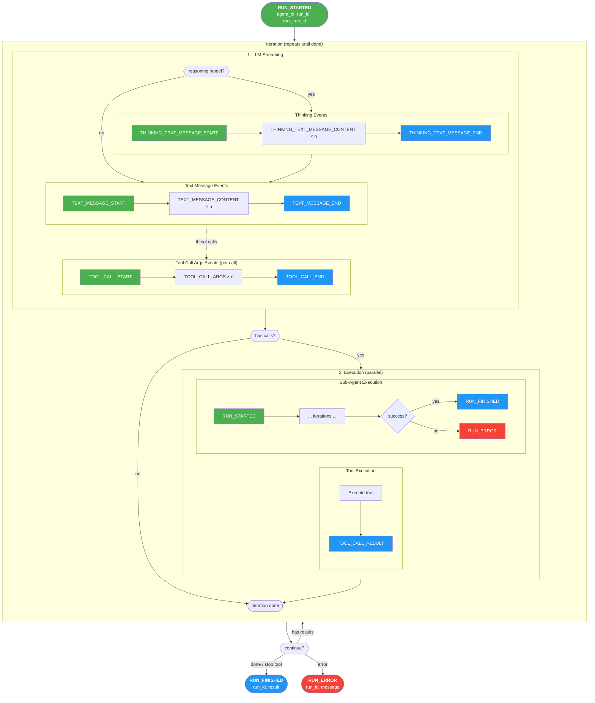
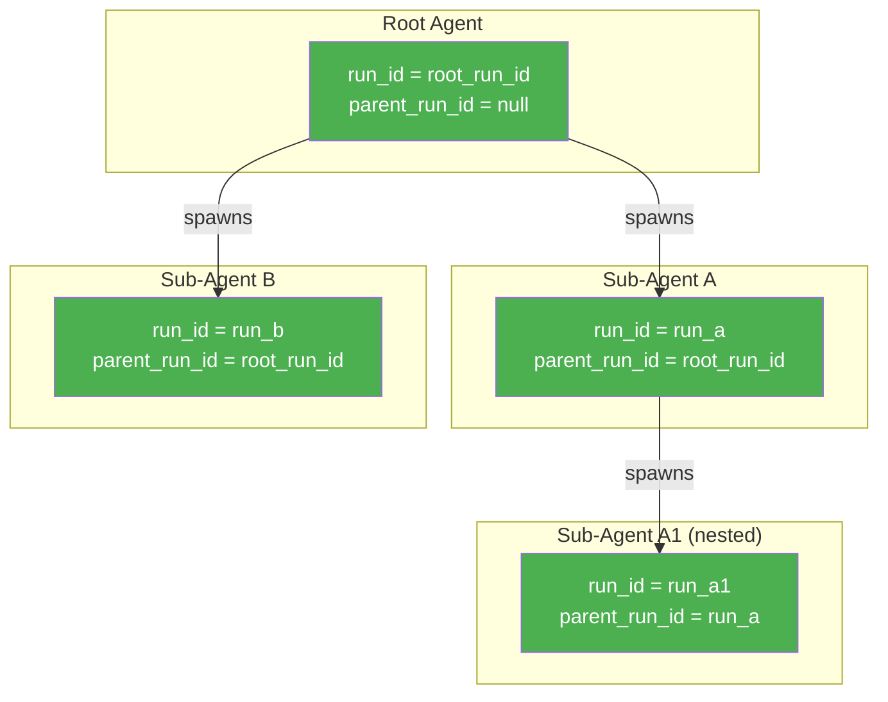
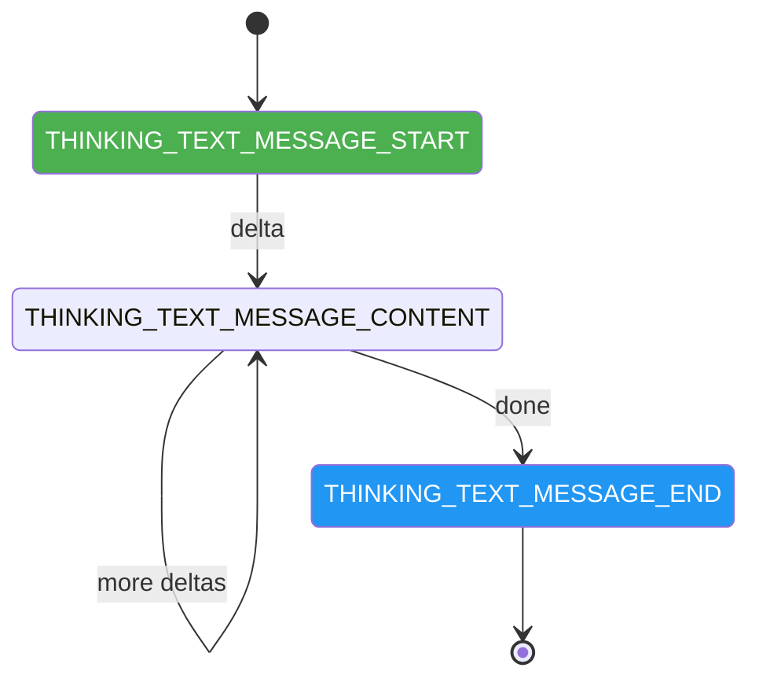
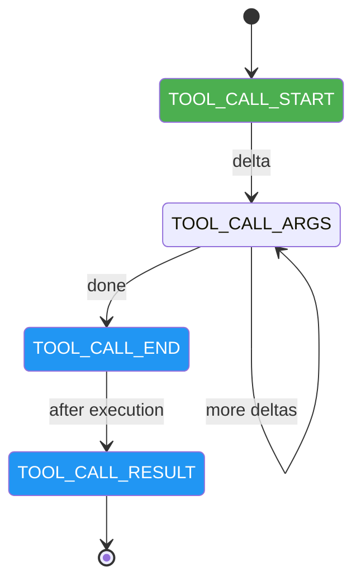
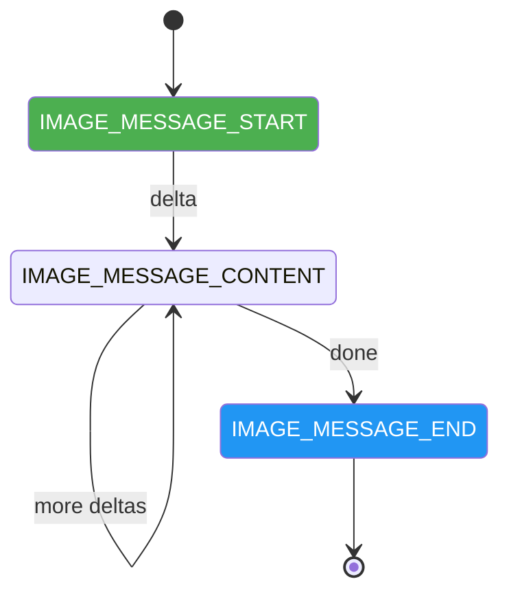

# Streaming Events

> **⚠️ Experimental**: This feature is under active development. APIs may change.

Streaming events are **incremental, provider-agnostic** notifications emitted during LLM streaming. They let you update UIs in real time, log progress, or drive other streaming logic without depending on vendor-specific chunk formats.

Events are emitted by **Agent / Transports** — e.g. `AgentEventsMiddleware` and transport layers (HTTP/SSE, stdio) during agent runs.

## Event types

All events share a `type` field. Use `match event.type` or similar to handle them.

### Text message events

| Event | Description |
| ----- | ----------- |
| `TEXT_MESSAGE_START` | Start of a text message. Carries `run_id`, `message_id`. |
| `TEXT_MESSAGE_CONTENT` | Incremental content. `delta` holds the new fragment. |
| `TEXT_MESSAGE_END` | End of the message. `message_id` links to start. |

### Thinking / reasoning events

For models that output reasoning (e.g. o1, DeepSeek-R1):

| Event | Description |
| ----- | ----------- |
| `THINKING_TEXT_MESSAGE_START` | Start of reasoning. `parent_message_id`, `thinking_message_id`, `run_id`. |
| `THINKING_TEXT_MESSAGE_CONTENT` | Reasoning delta. `thinking_message_id`, `delta`. |
| `THINKING_TEXT_MESSAGE_END` | End of reasoning. `thinking_message_id`. |

### Tool call events

| Event | Description |
| ----- | ----------- |
| `TOOL_CALL_START` | Start of a tool call. `tool_call_id`, `parent_message_id`, `run_id`, `name`. |
| `TOOL_CALL_ARGS` | Incremental args. `tool_call_id`, `delta` (partial JSON). |
| `TOOL_CALL_END` | End of args streaming. `tool_call_id`. |
| `TOOL_CALL_RESULT` | Tool result sent back. `tool_call_id`, `content`, `role`. |

### Image message events

| Event | Description |
| ----- | ----------- |
| `IMAGE_MESSAGE_START` | Start of an image. `message_id`, `mime_type`, `run_id`. |
| `IMAGE_MESSAGE_CONTENT` | Base64 image data. `message_id`, `delta`. |
| `IMAGE_MESSAGE_END` | End of image. `message_id`. |

### Run lifecycle events

| Event | Description |
| ----- | ----------- |
| `RUN_STARTED` | Run started. `agent_id`, `run_id`, `root_run_id`, `timestamp`. |
| `RUN_FINISHED` | Run finished. `thread_id`, `run_id`, `result`, `timestamp`. |
| `RUN_ERROR` | Run error. `run_id`, `message`, `timestamp`. |
| `TRANSPORT_ERROR` | Transport-level error. `message`, optional `timestamp`. |

---

## Event lifecycles

### Agent run lifecycle

An **agent run** spans from `RUN_STARTED` to `RUN_FINISHED` (or `RUN_ERROR`). Inside a run there are one or more **iterations**. Each iteration consists of:

1. **LLM streaming phase** — The model generates a response, emitting:
   - Thinking events (optional, for reasoning models)
   - Text message events
   - Tool call args events (if the model invokes tools)

2. **Execution phase** — Tools and sub-agents execute **in parallel**:
   - Each tool emits `TOOL_CALL_RESULT` when done
   - Each sub-agent emits its own `RUN_STARTED` … `RUN_FINISHED` (or `RUN_ERROR`)

3. **Loop decision** — Continue if there are tool/sub-agent results to process; stop otherwise.



**Stop conditions:**

- No tool/sub-agent calls in the response
- A stop tool was triggered
- Max iterations reached
- An error occurred

---

### Run nesting (agents and sub-agents)

The root agent's run has `run_id == root_run_id` and `parent_run_id == null`. Sub-agents start their own runs with distinct `run_id`, `parent_run_id` pointing to the invoking run, and the same `root_run_id`. Sub-agents can spawn further sub-agents, forming a tree.



---

### Text message event sequence

Text follows a **START → CONTENT × n → END** pattern. `message_id` correlates all events; `delta` carries incremental fragments.


---

### Thinking event sequence

Reasoning models emit thinking events before the main text. Same **START → CONTENT × n → END** pattern. `thinking_message_id` correlates events; `parent_message_id` links to the parent response.



---

### Tool call event sequence

A tool call streams as **START → ARGS × n → END**. `tool_call_id` correlates all events. `TOOL_CALL_RESULT` is emitted separately after execution.



---

### Image message event sequence

Images use the same **START → CONTENT × n → END** pattern. `message_id` correlates events; `delta` carries base64 data.



---

## Handler pattern

Events are Pydantic models from `nexau.archs.llm.llm_aggregators.events`. Handle them by `type`:

```python
from nexau.archs.llm.llm_aggregators import Event

def handle_event(event: Event) -> None:
    match event.type:
        case "TEXT_MESSAGE_START":
            ...  # e.g. reset UI buffer
        case "TEXT_MESSAGE_CONTENT":
            print(event.delta, end="", flush=True)
        case "TEXT_MESSAGE_END":
            ...  # e.g. flush message
        case "TOOL_CALL_START":
            ...  # event.name, event.tool_call_id
        case "TOOL_CALL_ARGS":
            ...  # event.tool_call_id, event.delta
        case "RUN_FINISHED":
            print(f"\nDone: {event.result}")
        case "RUN_ERROR":
            print(f"Error: {event.message}")
        case _:
            pass
```

---

## Using events with transports

When using the HTTP/SSE transport, stream events via `SSEClient.stream_events()`:

```python
from nexau.archs.transports.http.sse_client import SSEClient

client = SSEClient("http://localhost:8000")

async for event in client.stream_events(
    message="Hello",
    user_id="user_123",
    session_id="sess_456",
):
    if event["type"] == "event":
        ev = event["event"]
        if ev.get("type") == "TEXT_MESSAGE_CONTENT":
            print(ev.get("delta", ""), end="", flush=True)
    elif event["type"] == "complete":
        print(f"\n\n{event.get('response')}")
```

See [Transport System](./transports.md) for more.

---

## Best practices

1. **Always handle `RUN_ERROR` and `TRANSPORT_ERROR`** for robust UX and logging.
2. **Use `run_id`** to correlate events to a specific run (important for multi-agent UIs).
3. **Prefer `match event.type`** over `getattr`/`hasattr` for type-safe handling.
4. **Keep handlers lightweight** — they run on the streaming path; defer heavy work if needed.

---

## See also

- [Transport System](./transports.md) — How transports use events for streaming (SSE, stdio, etc.).
