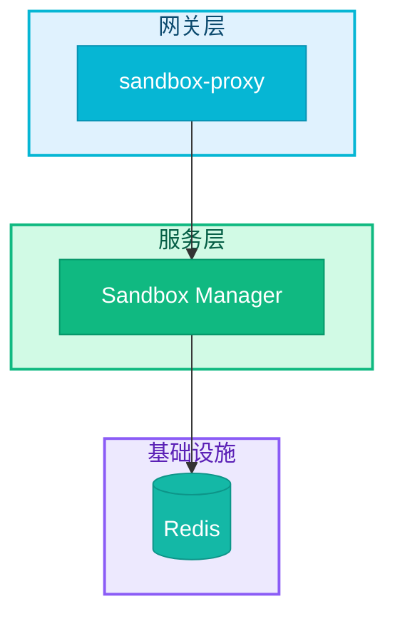

# RFC 撰写指南

本文档规范 NexAU Cloud 项目 RFC 的撰写标准，确保所有 RFC 格式一致、内容完整。

## 文件命名

```
{编号}-{简短标题}.md

示例:
0022-sandbox-networking.md
0015-unified-artifacts.md
```

**命名规则**:
- 编号：4 位数字，顺序递增（如 `0001`, `0022`）
- 标题：小写英文，单词间用 `-` 连接
- 不使用中文或特殊字符

## 标题规范

```markdown
# RFC-{编号}: {中文标题}
```

**示例**:
```markdown
# RFC-0022: Sandbox 网络与 E2B 协议支持
# RFC-0013: Agent Sandbox Manager
```

**注意**:
- 标题使用中文（便于阅读）
- RFC 编号与文件名一致
- 标题简洁明了，概括核心内容

## Front Matter

每个 RFC 必须包含以下元数据（位于标题后）：

```markdown
- **状态**: draft | accepted | implementing | implemented | superseded | rejected
- **优先级**: P0 | P1 | P2 | P3
- **标签**: `tag1`, `tag2`, ...
- **影响服务**: service1, service2, ...
- **创建日期**: YYYY-MM-DD
- **更新日期**: YYYY-MM-DD
```

### 状态说明

| 状态 | 含义 | 下一步 |
|------|------|--------|
| `draft` | 草稿，正在讨论 | 等待评审 |
| `accepted` | 已接受，待实现 | 开始开发 |
| `implementing` | 实现中 | 继续开发 |
| `implemented` | 已实现 | 维护 |
| `superseded` | 被新 RFC 取代 | 标注新 RFC 编号 |
| `rejected` | 已拒绝 | 记录原因 |

### 优先级说明

| 优先级 | 含义 | 示例 |
|--------|------|------|
| `P0` | 阻塞性，必须立即处理 | 安全漏洞、核心功能缺失 |
| `P1` | 高优先级，当前迭代完成 | 主要功能、性能问题 |
| `P2` | 中优先级，计划内完成 | 优化、增强功能 |
| `P3` | 低优先级，有时间再做 | nice-to-have |

### 常用标签

| 标签 | 用途 |
|------|------|
| `architecture` | 架构设计 |
| `security` | 安全相关 |
| `performance` | 性能优化 |
| `networking` | 网络相关 |
| `dx` | 开发者体验 |
| `api` | API 设计 |
| `database` | 数据库相关 |
| `ci-cd` | CI/CD 相关 |

## 内容结构

### 必需章节

```markdown
## 摘要
一段话概括 RFC 要解决的问题。

## 动机
- 当前存在什么问题？
- 为什么需要这个变更？
- 不做会怎样？

## 设计
### 概述
高层次架构图或设计思路。

### 详细设计
技术细节，包括：
- API 设计
- 数据模型
- 流程图/时序图

## 权衡取舍
### 考虑过的替代方案
| 方案 | 优点 | 缺点 | 决定 |
|------|------|------|------|
| 方案 A | ... | ... | 采用/否 |

### 缺点
当前方案的限制或不足。

## 实现计划
- [ ] Phase 1: ...
- [ ] Phase 2: ...

## 未解决的问题
需要进一步讨论的问题。
```

### 内容深度原则

**RFC 是设计文档，不是实现文档**。遵循以下原则：

| 应该包含 | 不应该包含 |
|----------|------------|
| 架构图、流程图 | 完整的代码实现 |
| API 接口定义（路径、参数、响应） | 函数内部实现细节 |
| 数据模型/表结构 | ORM 映射代码 |
| 配置项说明 | 完整的配置文件 |
| 关键算法思路 | 算法的完整代码 |
| 技术选型和理由 | 依赖库的安装步骤 |

**示例对比**：

❌ **过于详细**（不推荐）：
```rust
pub fn init_tracing() {
    let env_filter = EnvFilter::from_default_env()
        .add_directive("info".parse().expect("valid directive"));
    let fmt_layer = fmt::layer().json().with_target(true);
    // ... 50 行实现代码
}
```

✅ **适当抽象**（推荐）：
```markdown
日志初始化通过 `nexau_cloud_service::init_tracing()` 完成，支持：
- 环境变量 `RUST_LOG` 控制日志级别
- 环境变量 `NEXAU_LOG_FORMAT` 切换 JSON/Pretty 格式
- 可选的 OpenTelemetry OTLP 导出
```

**代码示例的使用场景**：

- ✅ 展示 API 调用方式（3-5 行）
- ✅ 展示配置格式（关键字段）
- ✅ 展示数据结构定义
- ❌ 展示完整函数实现
- ❌ 展示错误处理细节
- ❌ 展示测试代码

### 可选章节

```markdown
## 示例
代码示例或使用示例。

## 相关文件
| 文件 | 说明 |
|------|------|
| `path/to/file.rs` | 描述 |

## 参考资料
- [链接](url) - 说明
```

## 图表规范

RFC 中的图表必须遵循 [Mermaid 图表样式规范](../mermaid-style-guide.md)。

### 颜色快速参考

```
🟢 已完成/可信:        #10B981 / #059669
🟠 进行中/部分实现:    #F59E0B / #D97706
🔵 测试代码:          #3B82F6 / #2563EB
🔴 错误/不可信:        #EF4444 / #DC2626
🟣 Docker/容器:       #8B5CF6 / #7C3AED
🔷 网关/协议:         #06B6D4 / #0891B2
🔹 监控/可观测性:     #6366F1 / #4F46E5
🩵 存储/数据库:       #14B8A6 / #0D9488
⚪ 中性/默认:         #6B7280 / #4B5563
```

### 架构图示例



### ASCII 图（备选）

如果 Mermaid 不适合，可使用 ASCII 图：

```
┌─────────────────────────────────────────┐
│              外部用户/浏览器              │
└──────────────────┬──────────────────────┘
                   │
┌──────────────────▼──────────────────────┐
│           Nginx (TLS 终止)               │
└──────────────────┬──────────────────────┘
                   │
┌──────────────────▼──────────────────────┐
│           sandbox-proxy                  │
└──────────────────┬──────────────────────┘
                   │
        ┌──────────┴──────────┐
        ▼                     ▼
   sandbox-a             sandbox-b
```

## 代码示例规范

### Rust 代码

```rust
/// 函数说明
pub async fn example_function(
    param: &str,
) -> Result<Response> {
    // 实现
    Ok(response)
}
```

### Python 代码

```python
def example_function(param: str) -> Response:
    """函数说明"""
    # 实现
    return response
```

### 配置示例

```yaml
# 配置说明
service:
  port: 8080
  timeout: 30s
```

## 表格规范

### 对比表

```markdown
| 方案 | 优点 | 缺点 | 决定 |
|------|------|------|------|
| A | 简单 | 功能有限 | 否 |
| B | 功能完整 | 复杂 | **采用** |
```

### 配置表

```markdown
| 配置项 | 默认值 | 说明 |
|--------|--------|------|
| `PORT` | `8080` | 服务端口 |
```

### 状态表

```markdown
| 阶段 | 状态 | 说明 |
|------|------|------|
| Phase 1 | ✅ | 已完成 |
| Phase 2 | 🚧 | 进行中 |
| Phase 3 | ⏳ | 待开始 |
```

## 检查清单

提交 RFC 前检查：

- [ ] 文件名格式正确 (`{编号}-{标题}.md`)
- [ ] 标题格式正确 (`# RFC-{编号}: {中文标题}`)
- [ ] Front matter 完整（状态、优先级、标签、服务、日期）
- [ ] 包含所有必需章节（摘要、动机、设计、权衡、实现计划）
- [ ] 图表使用统一颜色规范
- [ ] 代码示例可运行
- [ ] 表格格式正确
- [ ] 更新 `rfcs/README.md` 索引

## 示例 RFC

参考以下 RFC 作为范例：

- [RFC-0010: 服务架构简化重构](./0010-service-architecture.md) - 架构类
- [RFC-0013: Agent Sandbox Manager](./0013-agent-sandbox-manager.md) - 服务设计类
- [RFC-0022: Sandbox 网络与 E2B 协议支持](./0022-sandbox-networking.md) - 网络/协议类

---

_如有问题，请参考现有 RFC 或联系项目负责人_
