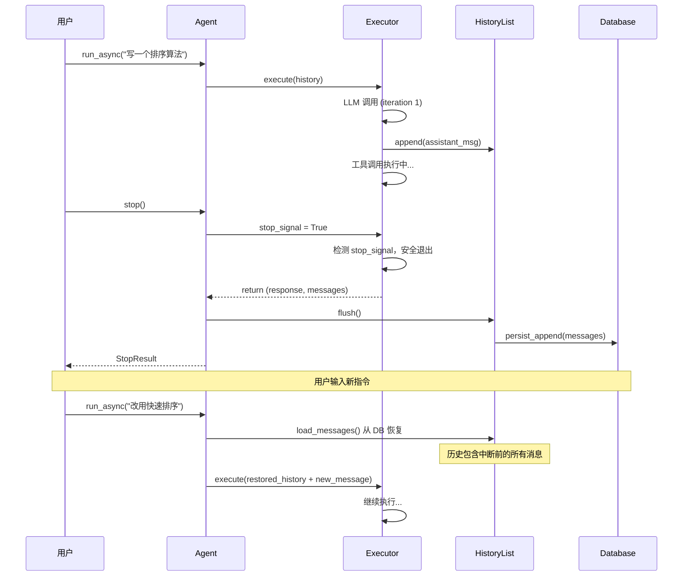

# RFC-0001: Agent 中断时状态持久化

- **状态**: implemented (Phase 1-4)
- **优先级**: P1
- **标签**: `architecture`, `dx`, `session`
- **影响服务**: `nexau` (core framework)
- **创建日期**: 2026-02-14
- **更新日期**: 2026-02-14

## 摘要

当用户中断（stop）正在运行的 Agent 时，当前 run 期间积累的所有消息（用户输入、LLM 响应、工具调用结果）会丢失，因为 `HistoryList.flush()` 仅在 run 正常结束时调用。本 RFC 提出"中断时持久化"机制，确保 stop 时已产生的消息被保存，并支持用户在中断后输入新指令继续对话。

## 动机

### 当前问题

1. **消息丢失**：`HistoryList` 采用批量持久化模型——`append()`/`extend()` 仅写入内存 `_pending_messages`，只有在 `flush()` 被调用时才真正写入数据库。`flush()` 的调用点仅在 `Agent._run_inner()` 的 try/except 块末尾（[agent.py:972](nexau/archs/main_sub/agent.py#L972), [agent.py:988](nexau/archs/main_sub/agent.py#L988), [agent.py:996](nexau/archs/main_sub/agent.py#L996)）。当 `agent.stop()` 从外部调用时，执行路径可能绕过这些 flush 点。

2. **stop 路径缺陷**：`agent.stop()` → `executor.cleanup()` 设置 `stop_signal=True` 并用 `cancel_futures=True` 关闭 ThreadPoolExecutor（[executor.py:1032-1058](nexau/archs/main_sub/execution/executor.py#L1032-L1058)）。Executor 主循环在下一次迭代边界检测到 stop_signal 后返回（[executor.py:274-285](nexau/archs/main_sub/execution/executor.py#L274-L285)），但存在以下问题：
   - 如果 Agent 正在等待 LLM 响应，stop_signal 要等到 LLM 调用完成后才被检测
   - `asyncify` 包装的 future 被取消时，`CancelledError`（继承自 `BaseException`）不会被 `_run_inner` 的 `except Exception` 捕获，导致 flush 被跳过
   - 即使 executor 正常返回，`_run_inner` 之上的 `run_async` 方法中 `_persist_session_state` 也可能被跳过

3. **无法"中断后继续"**：类似 Cursor、Claude Code 等编码 Agent 允许用户随时中断并输入新指令。NexAU 当前的 stop 是"硬停止"——中断后历史丢失，用户必须从头开始新的对话轮次，丧失了之前的上下文。

4. **缺少中断停止原因**：`AgentStopReason` 枚举（[stop_reason.py:18-26](nexau/archs/main_sub/execution/stop_reason.py#L18-L26)）没有 `USER_INTERRUPTED` 值，stop_signal 触发时传递 `stop_reason=None`，导致 after_agent hooks 无法区分中断和其他停止原因。

### 不做会怎样

- 用户在长时间运行的 Agent 任务中无法安全中断，只能等待完成或丢失所有进度
- 与主流编码 Agent 的交互体验存在明显差距
- 在生产环境中，进程异常退出会导致整个 session 的最近一轮对话丢失

## 设计

### 概述

```
用户中断 Agent
       │
       ▼
┌──────────────────────────────────────────────────┐
│  agent.stop(force=False)                         │
│                                                  │
│  1. 设置 stop_signal = True                      │
│  2. 等待当前 LLM 调用完成（或超时取消）            │
│     (force=True 时跳过等待，直接 cleanup)          │
│  3. 收集已产生的消息（含部分 LLM 响应）            │
│  4. 调用 history.flush() 持久化                   │
│  5. 标记 stop_reason = USER_INTERRUPTED           │
│  6. 返回 StopResult                              │
└──────────────────────────────────────────────────┘
       │
       ▼
┌──────────────────────────────────────────────────┐
│  用户输入新指令                                    │
│                                                  │
│  agent.run_async(message="新指令")                │
│  → 从持久化的历史中恢复（包含中断前的消息）         │
│  → 继续对话                                       │
└──────────────────────────────────────────────────┘
```

### 详细设计

#### 1. 新增 `USER_INTERRUPTED` 停止原因

在 `AgentStopReason` 枚举中新增：

```python
class AgentStopReason(Enum):
    MAX_ITERATIONS_REACHED = auto()
    STOP_TOOL_TRIGGERED = auto()
    ERROR_OCCURRED = auto()
    CONTEXT_TOKEN_LIMIT = auto()
    SUCCESS = auto()
    NO_MORE_TOOL_CALLS = auto()
    USER_INTERRUPTED = auto()  # 新增
```

Executor 在检测到 stop_signal 时使用此值：

```python
if self.stop_signal:
    stop_response = "Stop signal received."
    stop_response, messages = self._apply_after_agent_hooks(
        agent_state=agent_state,
        messages=messages,
        final_response=stop_response,
        stop_reason=AgentStopReason.USER_INTERRUPTED,  # 替代 None
    )
    return stop_response, messages
```

#### 2. Executor 中断时 flush 保障

在 `executor.cleanup()` 中不直接取消正在运行的主执行线程，而是：

- 设置 `stop_signal = True`（已有）
- 设置 `_shutdown_event`（已有）
- **不再** 立即 `shutdown(wait=False, cancel_futures=True)` 取消所有 executor
- 新增 `_shutdown_event: threading.Event`，让主执行循环在安全点退出

在 `_run_inner` 中增加 finally 块确保 flush：

```python
async def _run_inner(self, agent_state, merged_context, **kwargs) -> str:
    try:
        response, updated_messages = await asyncify(self.executor.execute)(...)
        self.history = updated_messages
        self.history.flush()
        return response
    except Exception as e:
        # ... 现有错误处理 ...
        self.history.flush()
        raise
    finally:
        # 无论正常返回、异常还是取消，都尝试 flush
        if self.history._pending_messages:
            self.history.flush()
```

#### 3. 部分 LLM 响应保存

当 stop_signal 在 LLM 调用期间被设置时，需要处理两种情况：

**情况 A：流式响应（Streaming）**

LLM 调用使用流式 API 时，已接收的 token 可以被保存：

- 在 `LLMCaller` 中检测 `stop_signal`，在流式迭代中提前终止
- 将已接收的部分响应作为 assistant message 追加到 history
- 追加一条标记消息表明响应被截断

**情况 B：非流式响应**

- 等待当前 LLM 调用完成（设置合理超时，如 30s）
- 如果超时，丢弃该响应（不保存不完整的非流式响应）

#### 4. 统一 `agent.stop()` API

通过 `force` 参数区分"立即停止"和"优雅停止"，两种模式都保证持久化：

```python
class Agent:
    async def stop(self, *, force: bool = False, timeout: float = 30.0) -> StopResult:
        """停止 Agent 并持久化当前状态。

        Args:
            force: True 立即停止（不等待当前执行完成），
                   False 优雅停止（等待当前执行安全退出）
            timeout: 等待当前执行完成的最大秒数（仅 force=False 时生效）

        Returns:
            StopResult 包含停止时的消息快照和停止原因
        """
        # 1. 设置中断信号
        self.executor.stop_signal = True
        self.executor.shutdown_event.set()

        if force:
            # 2a. 立即停止：硬清理 executor
            self.executor.cleanup()
        else:
            # 2b. 优雅停止：等待当前执行安全退出（带超时）
            await self._wait_for_execution_complete(timeout=timeout)

        # 3. 确保 flush
        self.history.flush()

        # 4. 持久化 session state
        await self._persist_session_state(...)

        return StopResult(
            messages=list(self.history),
            stop_reason=AgentStopReason.USER_INTERRUPTED,
        )

    def sync_cleanup(self) -> None:
        """同步清理（用于 __del__ 和其他同步上下文）。"""
        self.executor.cleanup()
```

#### 5. StopResult 数据模型

```python
@dataclass
class StopResult:
    """Agent 停止结果。"""
    messages: list[Message]
    stop_reason: AgentStopReason
    interrupted_at_iteration: int
    partial_response: str | None = None  # 部分 LLM 响应（如有）
```

#### 6. 中断后恢复流程

现有的 `run_async` 已支持从持久化历史恢复（[agent.py:741-774](nexau/archs/main_sub/agent.py#L741-L774)）。中断后用户调用 `agent.run_async(message="新指令")` 时：

1. `load_messages()` 从数据库重建历史（包含中断前的消息）
2. 用户新消息追加到历史末尾
3. Agent 继续执行，拥有完整的上下文

无需额外修改恢复逻辑，只需确保中断时 flush 正确执行。

### 时序图



## 权衡取舍

### 考虑过的替代方案

| 方案 | 优点 | 缺点 | 决定 |
|------|------|------|------|
| A: 每条消息实时持久化 | 零丢失风险 | 大量 DB 写入，性能下降严重；破坏现有 event sourcing 的 run-level 语义 | 否 |
| B: 定时 checkpoint（如每 10s flush） | 实现简单 | 仍有最多 10s 的数据丢失窗口；增加后台线程复杂度 | 否 |
| C: 中断时 flush（本方案） | 仅在中断时额外写入一次；保持 run-level 语义；对正常执行零开销 | 需要扩展 `stop()` API（`force` 参数）；部分 LLM 响应处理有复杂度 | **采用** |
| D: WAL（Write-Ahead Log）模式 | 极低丢失风险 | 过度工程化；需要额外的 WAL 基础设施 | 否 |

### 缺点

- `stop(force=False)` 需要等待当前 LLM 调用完成或超时，不是瞬时的
- 部分流式响应的保存可能包含不完整的内容（如截断的代码块）
- 新增的 `finally` 块中的 flush 在极端情况下（进程被 SIGKILL）仍无法保证持久化

## 实现计划

### 阶段划分

- [x] Phase 1: 基础中断持久化
  - 新增 `AgentStopReason.USER_INTERRUPTED`
  - 在 `_run_inner` 添加 `finally` 块确保 flush
  - 修改 executor stop_signal 处理传递正确的 stop_reason
  - 单元测试覆盖

- [x] Phase 2: 统一 `agent.stop()` API
  - 实现 `stop(force=False, timeout=30.0)` 方法和 `StopResult`
  - 实现 `_wait_for_execution_complete` 带超时等待
  - `force=True` 立即停止 + 持久化，`force=False` 优雅停止 + 持久化
  - `sync_cleanup()` 用于 `__del__` 等同步上下文
  - 集成测试覆盖

- [x] Phase 3: 流式响应部分保存
  - 在 `LLMCaller` 中支持 stop_signal 检测
  - 流式响应提前终止并保存已接收内容
  - 添加截断标记到保存的消息中

- [x] Phase 4: Transport 层集成
  - TransportBase 新增 `_running_agents` 注册表追踪运行中的 Agent
  - `handle_request` / `handle_streaming_request` 自动注册/注销 Agent
  - 新增 `handle_stop_request()` 方法查找并停止运行中的 Agent
  - HTTP/SSE: 新增 `POST /stop` 端点 + `StopRequest`/`StopResponse` 模型
  - Stdio: 新增 `agent.stop` JSON-RPC 方法
  - 单元测试覆盖

### 相关文件

| 文件 | 说明 |
|------|------|
| `nexau/archs/main_sub/agent.py` | Agent 容器，统一 `stop(force=)` API |
| `nexau/archs/main_sub/execution/executor.py` | Executor 主循环，修改 stop 处理逻辑 |
| `nexau/archs/main_sub/execution/stop_reason.py` | 新增 `USER_INTERRUPTED` 枚举值 |
| `nexau/archs/main_sub/execution/stop_result.py` | `StopResult` 数据模型 |
| `nexau/archs/main_sub/history_list.py` | HistoryList，确保 finally flush |
| `nexau/archs/session/agent_run_action_service.py` | 持久化服务，无需修改 |
| `nexau/archs/transports/` | Transport 层，暴露 `POST /stop` 和 `agent.stop` 端点 |

## 测试方案

### 单元测试

- 测试 `stop()` 调用后 `_pending_messages` 被正确 flush
- 测试 stop_signal 在不同执行阶段（LLM 调用中、工具执行中、迭代间）的行为
- 测试 `AgentStopReason.USER_INTERRUPTED` 正确传递到 after_agent hooks
- 测试 `finally` 块在 `CancelledError` 场景下仍执行 flush

### 集成测试

- 端到端测试：run → stop → 验证 DB 中消息完整 → run（新指令）→ 验证历史恢复
- 并发测试：run 和 stop 同时调用的竞态条件
- 超时测试：LLM 调用超时场景下的 stop 行为

### 手动验证

1. 启动 Agent，发送需要多轮工具调用的任务
2. 在执行过程中调用 stop
3. 验证中断前的消息已持久化
4. 发送新指令，验证 Agent 能恢复上下文继续对话

## 已解决的问题

> 以下问题在实现过程中已确定方案并落地。

### 1. 中断超时策略

**决定**: 默认 30s，可通过 `stop(timeout=)` 参数配置。

- `agent.stop(timeout=30.0)` — 调用方可按需调整
- Transport 层透传：`StopRequest.timeout` 字段（HTTP）、`params.timeout`（Stdio JSON-RPC）均支持自定义超时
- 30s 对大多数场景足够（LLM 单次调用通常 < 20s）；对长时间工具调用的场景，调用方可传更大值
- 超时后 `_wait_for_execution_complete` 返回（不抛异常），`stop()` 继续执行 flush 和返回结果

### 2. 部分工具结果

**决定**: 已提交的工具调用正常完成并保存结果；未提交的工具调用被跳过。

- Executor 在工具提交循环中逐个检查 `_shutdown_event`（[executor.py:813](nexau/archs/main_sub/execution/executor.py#L813)），中断后跳过剩余未提交的工具调用
- 已提交到 ThreadPoolExecutor 的工具调用会正常执行完毕，其结果包含在 `messages` 中
- 不额外保存"工具调用已发起但未完成"的记录——因为 `_shutdown_event` 检查发生在提交前，已提交的调用一定会完成
- LLM 批量返回多个 tool_call 时（如 5 个），可能只有前 N 个被提交执行，其余被跳过

### 3. 子 Agent 中断

**决定**: 当前采用硬 stop（通过 `subagent_manager.shutdown()`），不递归 stop。

- `executor.cleanup()` 调用 `self.subagent_manager.shutdown()`（[executor.py:1086](nexau/archs/main_sub/execution/executor.py#L1086)），直接停止子 Agent
- `_shutdown_event` 阻止新的子 Agent 调用被提交
- 未实现递归 `stop()` 的原因：子 Agent 的 session 独立于父 Agent，其历史由自身的 HistoryList 管理；子 Agent 的 `_run_inner` finally 块会确保 flush
- 后续如需递归停止语义，可在 `agent.stop()` 中遍历 `subagent_manager` 的活跃子 Agent 并逐个调用 `stop()`

### 4. 流式响应截断标记

**决定**: 当前不添加显式截断标记。

- 流式响应中检测到 `shutdown_event` 后，streaming 循环提前 break，LLM caller 返回 `None`（[llm_caller.py:248](nexau/archs/main_sub/execution/llm_caller.py#L248)）
- Executor 主循环收到 `None` 后检测 `stop_signal`，以 `USER_INTERRUPTED` 原因退出
- 已接收的部分 token 不会作为 assistant message 保存（因为 LLM caller 返回 `None` 表示本轮无有效响应）
- 恢复时 LLM 看到的是上一轮完整的 assistant message + tool results，不存在截断内容，无需特殊标记
- 如果未来需要保存部分流式响应，可在 LLM caller 中累积已接收 token 并作为 partial assistant message 返回

### 5. Transport 层语义

**决定**: 采用独立端点，不通过 SSE 控制消息。

- HTTP/SSE: `POST /stop` 独立端点，接收 `StopRequest`（user_id, session_id, agent_id, force, timeout），返回 `StopResponse`（status, stop_reason, message_count, error）
- Stdio: `agent.stop` JSON-RPC 方法，参数结构与 HTTP 一致
- 选择独立端点的原因：
  - SSE 是单向通道（server → client），不适合接收客户端控制指令
  - 独立端点可以返回结构化的中断结果（消息数量、停止原因等）
  - 客户端实现更简单——一个 HTTP POST 即可，无需在 SSE 连接上实现双向通信

## 参考资料

- [Claude Code 中断机制](https://docs.anthropic.com/en/docs/claude-code) - 用户可随时 Escape 中断并输入新指令
- [Cursor Agent 交互模式](https://cursor.sh) - 支持中断后继续的编码 Agent
- NexAU 现有 Session 持久化：`nexau/archs/session/agent_run_action_service.py`
- NexAU HistoryList 实现：`nexau/archs/main_sub/history_list.py`
