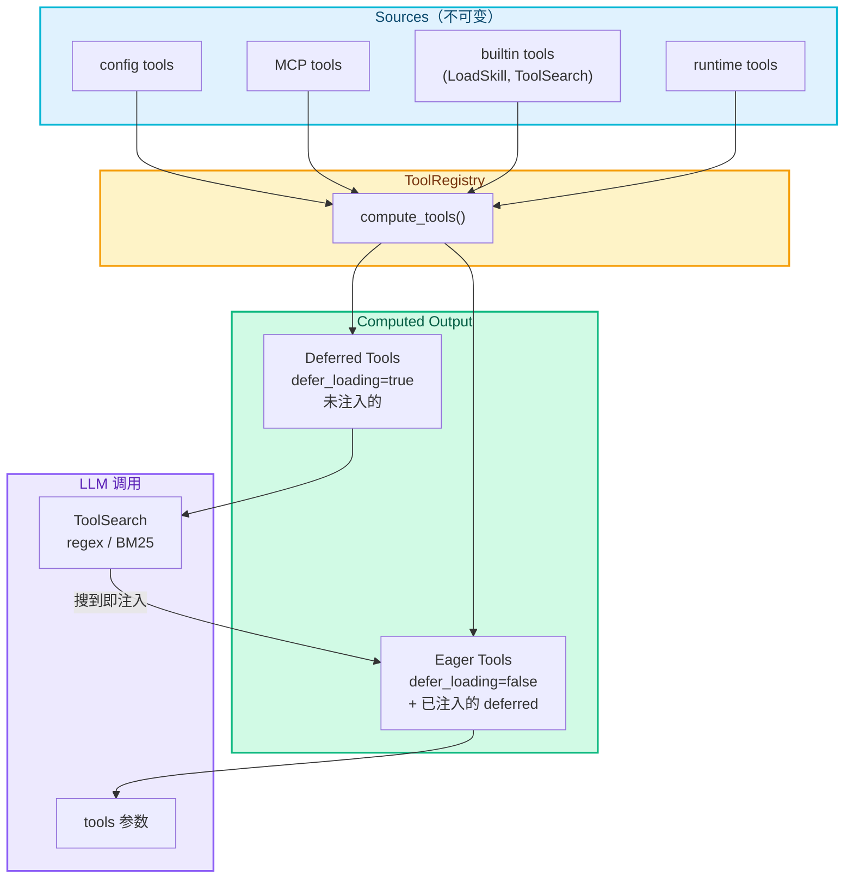
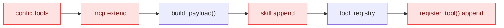
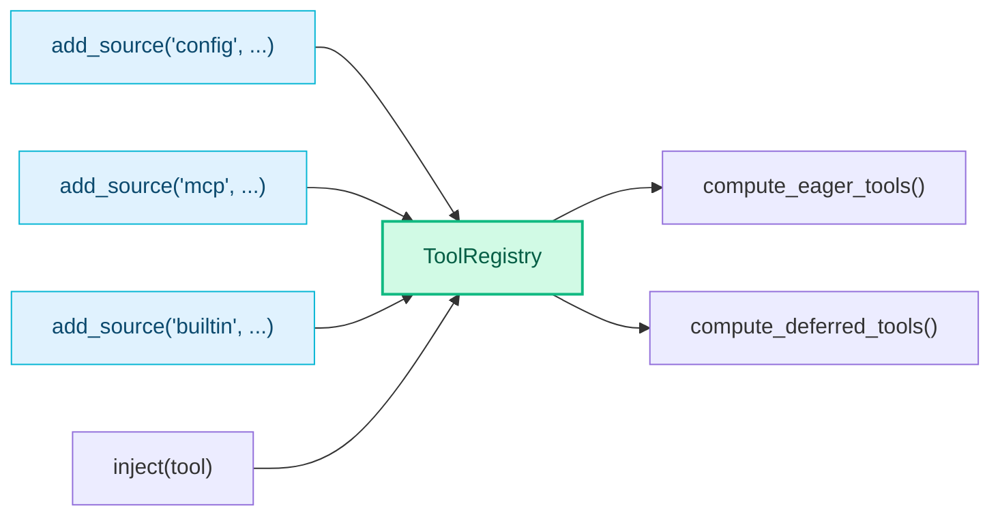

# RFC-0005: Tool Search — 工具按需动态注入

- **状态**: draft
- **优先级**: P1
- **标签**: `architecture`, `performance`
- **影响服务**: nexau (agent runtime)
- **创建日期**: 2026-03-06
- **更新日期**: 2026-03-06

## 摘要

当前 NexAU 将所有注册工具的完整 JSON Schema 全量传入 `tools` 参数，随着工具数量增长 context 开销线性膨胀。本 RFC 提出两个改进：

1. **Tool Search**：`defer_loading: true` 的工具不在启动时注入，通过 `ToolSearch` 工具按需搜索并自动注入
2. **Computed Tools**：重构工具组装逻辑，不可变来源 + 计算输出，替代当前的 mutation 模式

## 动机

- 每个工具 schema 约 200-500 tokens，20 个工具占 4000-10000 tokens，大部分任务只用 2-3 个
- MCP Server 接入后工具数量可达数十甚至上百，全量注册不可持续
- 现有 `as_skill` 解决的是"description 太长"，不解决"schema 太多"
- 行业趋势：Claude Code 2.1.69 通过类似机制将 context 从 18k 降至 4.8k tokens

## 设计

### 整体架构



### `defer_loading` 属性

在 `Tool` 上新增 `defer_loading: bool`，与 `as_skill` 完全正交：

| | `defer_loading=false` | `defer_loading=true` |
|---|---|---|
| **`as_skill=false`** | 默认：schema 全量注入，description 在 prompt 展示 | schema 按需注入，description 在 prompt 展示 |
| **`as_skill=true`** | schema 全量注入，description 通过 LoadSkill 加载 | schema 按需注入，description 通过 LoadSkill 加载 |

- `as_skill` 控制 **prompt 里的文档展示方式**
- `defer_loading` 控制 **tool schema 是否按需注入**

### ToolSearch 工具

注册为 eager tool，LLM 可调用。description 中附带 deferred tools 的简短索引（名字 + 一句话描述）。

**搜索策略**（二选一，配置指定）：

| 策略 | 匹配方式 | 适用场景 |
|------|---------|---------|
| **regex**（默认） | 对工具名做正则/前缀匹配 | LLM 知道工具名 |
| **bm25** | 对名字 + description 做关键词匹配 | LLM 描述意图 |

**行为**：搜到即注入，无需额外 activate 步骤。下一轮 LLM 直接 function call。

### Computed Tools 重构

#### 现状问题



多处 mutate 同一个 `config.tools`，顺序依赖，`build_payload()` 在 skill tool 添加之前执行。

#### 改造后



`ToolRegistry` 的核心接口：

- `add_source(name, tools)` — 注册工具来源（只追加，不修改已有条目）
- `compute_eager_tools()` — 计算当前应传给 LLM 的工具列表
- `compute_deferred_tools()` — 计算 ToolSearch 搜索池
- `inject(tool)` — 运行时注入 deferred tool（不修改任何 source）
- `get_all()` — 获取完整注册表（用于工具执行）

每次 LLM 调用前从 `compute_eager_tools()` 重新计算，`inject()` 后下一轮自动生效。

## 权衡取舍

### 考虑过的替代方案

| 方案 | 优点 | 缺点 | 决定 |
|------|------|------|------|
| 复用 `as_skill` 做 defer | 少一个属性 | 语义混淆，`as_skill` 已有明确职责 | **否** |
| Embedding 索引 | 语义匹配更准确 | 增加外部依赖和复杂度 | 否 |
| 搜索 + 单独 activate 步骤 | 可审核搜索结果 | 浪费一轮调用 | **否** |
| regex / BM25，搜到即注入 | 零依赖，零额外延迟 | 可能注入较多工具 | **采用** |

### 缺点

- 首次使用 deferred tool 多一轮 ToolSearch 调用
- 模糊搜索可能注入过多工具（通过 `max_inject_per_search` 限制）
- 弱模型可能不理解何时需要搜索（`defer_loading` 是 opt-in）

## 实现计划

### Phase 1: 核心机制

- [ ] `ToolRegistry` 类（不可变来源 + computed tools + inject）
- [ ] `Tool` 新增 `defer_loading` 属性
- [ ] `ToolSearch` 内置工具（regex / BM25，搜到即注入）
- [ ] `Agent` 改用 `ToolRegistry`
- [ ] `Executor` 每轮从 `compute_eager_tools()` 计算 tools

### Phase 2: 增强

- [ ] MCP Server 工具自动标记 `defer_loading: true`
- [ ] 已注入工具的自动卸载
- [ ] 工具使用频率统计

### 相关文件

| 文件 | 说明 |
|------|------|
| `nexau/archs/tool/tool.py` | 新增 `defer_loading` 属性 |
| `nexau/archs/tool/tool_registry.py` | 新文件：ToolRegistry |
| `nexau/archs/main_sub/agent.py` | 改用 ToolRegistry |
| `nexau/archs/main_sub/execution/executor.py` | 每轮计算 tools |
| `nexau/archs/tool/builtin/tool_search.py` | 新文件：ToolSearch |

## 未解决的问题

1. 已注入工具的生命周期：整个 session 保持还是自动卸载？
2. 注入数量上限的合理默认值？
3. 与 Context Compaction（RFC-0004）的交互：compaction 时是否保留 ToolSearch 历史？

## 附录：Claude Code 2.1.69 Tool Search 逆向分析

以下内容通过反编译 `@anthropic-ai/claude-code@2.1.69` npm 包的 `cli.js` 得出。

### 工具分类

**Core Tools（10 个，始终加载）：**

| 工具 | 用途 |
|------|------|
| Bash | 执行 shell 命令 |
| Read | 读文件/图片/PDF/notebook |
| Write | 创建或覆盖文件 |
| Edit | 修改文件内容 |
| Glob | 按文件名/通配符查找 |
| Grep | 用 regex 搜索文件内容（ripgrep） |
| Agent | 委派工作给 subagent |
| Skill | 调用 slash-command skill |
| StructuredOutput | 返回结构化 JSON 响应 |
| ListMcpResourcesTool | 列出 MCP server 资源 |

**Deferred Tools（18 个，通过 ToolSearch 按需加载）：**

| 工具 | 用途 |
|------|------|
| WebSearch | 搜索互联网 |
| WebFetch | 抓取 URL 内容 |
| NotebookEdit | 编辑 Jupyter notebook |
| LSP | 代码智能（定义/引用/符号/hover） |
| AskUserQuestion | 向用户提多选问题 |
| EnterPlanMode / ExitPlanMode | plan 模式切换 |
| EnterWorktree | 创建 git worktree |
| TodoWrite | 管理 session 任务清单 |
| TaskCreate/Get/Update/List/Stop/Output | 后台任务管理（6 个） |
| SendMessage | 向 agent 队友发消息（swarm） |
| TeamCreate / TeamDelete | 多 agent swarm 管理 |

**MCP 工具自动全部 deferred。**

分类策略：**文件操作 + shell + 代码搜索 = 始终加载；网络/任务管理/协作/高级功能 = 按需加载。**

### 启用条件

```
是否启用 ToolSearch = 三个条件全满足：
  1. 模型支持 tool_reference（Sonnet 4+, Opus 4+，排除 haiku）
  2. ToolSearch 工具已注册
  3. deferred 工具的 token 占用 ≥ context 窗口的 10%（默认阈值）
```

- 阈值通过 `ENABLE_TOOL_SEARCH` 环境变量可调（数字=百分比，`auto`=默认 10%，`100`=禁用）
- Feature flag `tengu_defer_all_bn4` 开启后所有工具都 defer（除 ToolSearch 自身）

### 搜索机制

ToolSearch 的 `call()` 实现支持两种模式：

1. **直接选择**：`select:ToolName1,ToolName2` — 按名称精确匹配，支持逗号分隔多个
2. **关键词搜索**：自然语言查询，分词后对每个 deferred tool 计算加权分数：
   - 工具名精确匹配某个 token: +10 分（MCP 工具 +12）
   - 工具名部分包含: +5 分（MCP +6）
   - 工具名全文包含: +3 分
   - `searchHint` 匹配: +4 分
   - description 匹配: +2 分
   - 支持 `+keyword` 语法做前置过滤（先筛后排序）
   - 默认返回 top 5

### 注入机制：tool_reference

Claude Code **不是**在 client 侧拼接 tools 参数。而是利用了 **Claude API 的 `tool_reference` 协议**：

```
ToolSearch 返回结果时，tool_result 的 content 不是文本，而是：
[{type: "tool_reference", tool_name: "WebSearch"}, ...]
```

Claude API 收到 `tool_reference` 后，自动将对应工具的完整 schema 注入到模型的可用工具列表中。这是 **服务端行为**，client 不需要手动修改 tools 参数。

这意味着：
- 注入是由 API server 完成的，不是 client 侧行为
- Client 只需要在初始 `tools` 参数中包含所有工具（但标记 `defer_loading`），API 会处理 schema 的延迟加载
- `tool_reference` 目前是 Claude 专有协议，其他 LLM provider 不支持

### 增量通知

每次 system prompt 构建时，通过 `deferred_tools_delta` section 告知模型 deferred 工具池的变化（新增/移除），避免重复发送完整索引。

### 对 NexAU 的启示

1. **NexAU 不能直接用 `tool_reference`**：这是 Claude API 专有协议，NexAU 需要支持 OpenAI/Gemini 等多种 provider
2. **NexAU 的注入必须在 client 侧完成**：ToolSearch 搜到后，client 主动将工具 schema 加入下一轮的 `tools` 参数
3. **搜索逻辑可以借鉴**：加权关键词搜索 + `searchHint` + `select:` 直接选择模式
4. **阈值自动判断**：只有 deferred 工具占比超过 context 的 10% 时才启用，避免工具少时的无谓开销

## 参考资料

- [Claude Code 2.1.69 Tool Search](https://x.com/thecat88tw/status/2029485559362842631)
- [Tool 与 Skill 的分层设计](https://sxddhcrtbqu.feishu.cn/wiki/ChVwwdXJiiDNHzksQEmc9ktAnte)
- 反编译源码：`npm pack @anthropic-ai/claude-code@2.1.69`，`cli.js` 13079 行
- Issue #280
