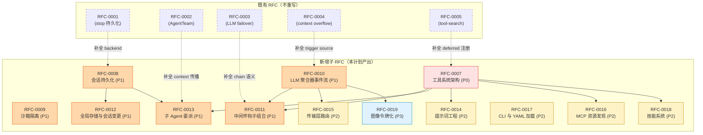
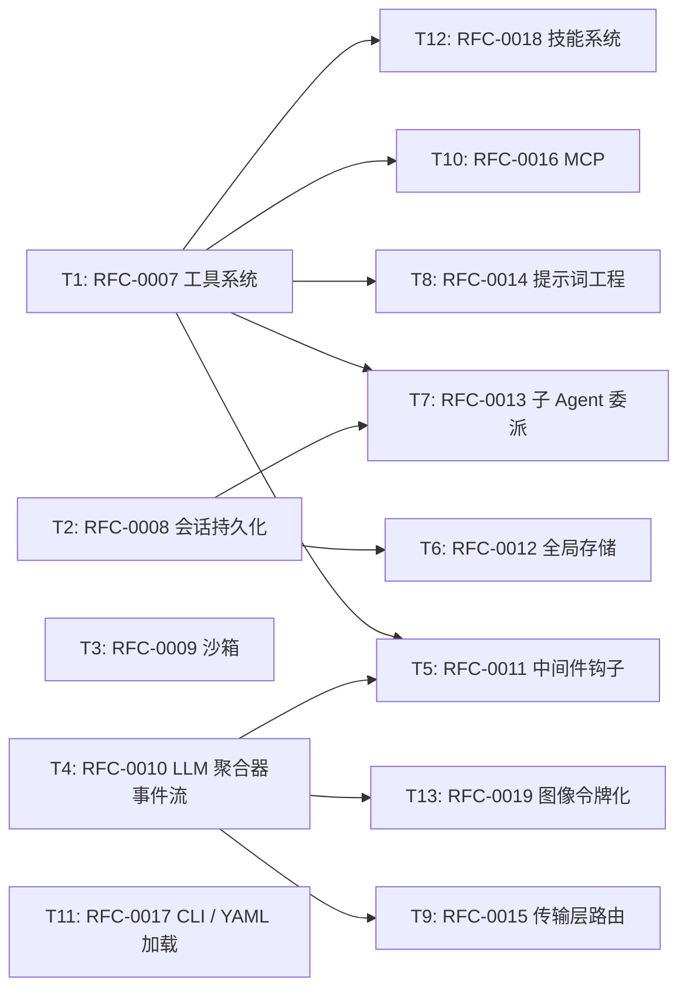

# RFC-0006: NexAU RFC 目录补全总纲

- **状态**: implementing
- **优先级**: P0
- **标签**: `architecture`, `documentation`, `governance`, `dx`
- **影响服务**: `nexau`（整个仓库的设计文档体系）
- **创建日期**: 2026-04-16
- **更新日期**: 2026-04-16

## 摘要

本仓库目前仅存在 5 篇 RFC（RFC-0001 ~ RFC-0005），覆盖 stop 持久化、AgentTeam、LLM failover、context overflow、tool search 五个相对窄的专题。但代码库实际已经实现了 13 个未被任何 RFC 文档化的子系统（工具系统架构、会话持久化、沙箱、LLM 聚合器、中间件钩子、全局存储、子 Agent 委派、提示词工程、传输层、MCP、CLI/YAML、技能系统、图像令牌化）。本 RFC 是一份**追溯式设计目录**的总纲，规划通过 13 篇子 RFC（RFC-0007 ~ RFC-0019）系统补全设计文档；每篇子 RFC 单独描述其专题域的设计意图、关键决策、与其他子系统的接口契约。本 RFC 自身只负责：(a) 定义补全策略；(b) 列出 13 个 gap 的边界、优先级、依赖关系；(c) 约束子 RFC 的格式与产出工艺。

## 动机

### 为什么现在补全 RFC 目录

1. **设计意图正在丢失**
   - 当前 `nexau/archs/` 下的 8 个子系统目录中，只有 `session` 与 `main_sub` 的执行器被 RFC-0001 / RFC-0002 部分覆盖；其余的 `tool`、`sandbox`、`llm`、`transports`、`tracer`、`config` 都没有专门的设计文档。
   - 设计意图分散在 docstring、test fixture 与 PR 评论中，新成员理解一个子系统的成本是"读完整个目录 + 翻 git log"。

2. **重构风险偏高**
   - 没有 canonical contract 文档时，跨子系统重构（如改造 tool registry 或 session backend）容易破坏未被显式记录的隐式契约。
   - 已经发生过：context compaction 修改触发了 token-counter 的非预期路径，事后才用 RFC-0004 补救。

3. **新功能容易跳过设计阶段**
   - skills 系统、MCP 集成、子 agent 委派等都是在没有前置 RFC 的情况下直接实施的。
   - 部分能力到现在仍是 "implementing" 状态、缺少未解决问题列表，阻碍后续演进。

4. **现有 RFC 之间无法形成体系**
   - 5 篇 RFC 各自独立，未明示它们与其他子系统的依赖关系；无法回答 "如果我要改 tool registry，会受 RFC-0005 (tool-search) 哪些约束？" 这种问题。
   - 缺一份"目录地图"：哪些子系统已有 RFC、哪些缺、缺的优先级。

### 不补全会怎样

- 重构前必须做 archaeology，效率随代码量线性下降。
- skills、MCP 这些 "implementing" 状态的能力无法毕业到 "implemented"，因为缺标准设计落地节点。
- 新成员（含 AI agent）的 onboarding 时间被显式契约不足拖累。

## 设计

### 概述

补全策略采用 "**主 RFC + N 个子 RFC**" 的目录结构，遵循 north-coder skill 的 `rfc-completion-workflow.md` 方法论：

- **本 RFC（master plan）** 负责整体规划：列出全部 gap、定义优先级、建立依赖 DAG。
- **子 RFC（RFC-0007 ~ RFC-0019）** 每篇覆盖一个高耦合子系统域；每篇都是**追溯式设计文档**，描述已经存在的代码所体现的设计意图。
- **现有 5 篇 RFC（RFC-0001 ~ RFC-0005）** 被视为已存在的部分覆盖；本 RFC 会显式声明它们与新增 RFC 的依赖与互补关系，但**不重写**。
- **格式约束**：每篇 RFC 同时产出 `.md`（设计文档，遵循 `rfcs/0000-template.md` 的 8 节结构）+ `.json`（元数据 sidecar，存放在 `rfcs/meta/NNNN-title.json`）。本仓库历史 5 篇 RFC 仍保留单文件 legacy 格式，本期不强制迁移；新增 RFC 全部使用 `.md + .json` 双文件格式。

### 关键设计决策

1. **子 RFC 颗粒度按"高耦合子系统域"划分，而非按代码模块或文件**
   - 原因：单个 `nexau/archs/<x>/` 目录可能内含多个独立设计意图；强行以目录映射会产生过细 RFC 或多个 RFC 共享同一边界。
   - 结果：13 个 gap 中有些跨多个目录（如 C5 中间件钩子横跨 `archs/main_sub/` 与 `archs/llm/`），有些只覆盖一个目录的子集（如 C13 图像令牌化只是 `archs/llm/` 的局部能力）。
   - 应用：见"子任务列表"中每个 task 的"代码锚点"。

2. **RFC 编号方案：连续递增**
   - 原因：仓库 README 已规定连续编号、不跳号；子 RFC 必须从 0007 起按 gap 优先级顺序连续分配。
   - 结果：本 RFC 占 0006，子 RFC 占 0007 ~ 0019。
   - 注意：编号顺序≠生成顺序；生成顺序按"优先级 + DAG 拓扑序"确定（见 Process 2 章节与 `## 实现计划 / 阶段划分`）。

3. **"gap" 的判定标准**
   - 原因：避免 over-documentation（把已被 docstring/CLAUDE.md 充分说明的小能力也写成 RFC）。
   - 结果：必须满足以下至少一条才算 gap：
     - 子系统在代码层面体现了至少 2 个非显然的设计 trade-off
     - 子系统对其他子系统暴露了稳定的隐式契约（破坏会导致跨模块测试失败）
     - 子系统已经被列为 "需要演进" 但没有设计文档支撑下一步
   - 应用：见每个子任务的 "范围 / 验收标准 / 代码锚点"。

4. **现有 5 篇 RFC 的处理策略**
   - 原因：用户明确要求"现有 RFC 不重写，纳入大纲"。
   - 结果：本 RFC 在 `## 参考资料` 列出 RFC-0001 ~ 0005，并在每个相关子任务的"依赖" / "关联 RFC" 中引用它们。子 RFC 必须显式声明 "如何与现有 RFC 互补"，而非重新设计已被既有 RFC 覆盖的部分。
   - 互补示例：RFC-0008（会话持久化）补全 backend abstraction 与 history append/replace 语义；RFC-0001 已覆盖 stop 路径下的持久化触发，二者不重叠。

5. **master-plan 任务状态更新批量策略**
   - 原因：`rfc-completion-workflow.md` Step 2.5 要求每个子 RFC 提交后更新 master plan 的 `tasks[T_i].status`；可选"per-tick commit"或"批量每 N 篇更新"。
   - 结果：本 master plan 选择 **per-tick commit**——每写完一个子 RFC 就单独提交一个"tick commit"更新本 RFC 的 .json `tasks[T_i].status`。
   - 原因细化：本任务全程在单分支单线程上推进，per-tick 让每个 commit 自洽（reviewer 能看到 master plan 与 sub-RFC 同步），不会出现批量过期窗口。

6. **`tasks[].ref` 在 master plan 中的语义重载**
   - 原因：`rfcs/0000-template.md` 中 `tasks[].ref` 定义为 "PR / commit 链接"；但在 master plan 上下文里，`ref` 改用作 "目标子 RFC `.md` 的相对路径"。
   - 结果：本 RFC 的所有 `tasks[].ref` 都形如 `rfcs/NNNN-title.md`；这是 master plan 的明确语义重载，不影响子 RFC 内部 `tasks[].ref` 的原义（仍是 PR/commit 链接）。

### 接口契约

本 RFC 不引入对外运行时接口契约。本 RFC 对**子 RFC 作者**（含未来的 AI agent）暴露以下文档级契约：

1. **格式契约**：每篇子 RFC 必须严格遵循 `rfcs/0000-template.md` 的 8 节结构（摘要 / 动机 / 设计 / 权衡取舍 / 实现计划 / 测试方案 / 未解决的问题 / 参考资料），并同时产出 `.json` sidecar。
2. **范围契约**：子 RFC 不得跨越本 master plan 中其他 task 的 "范围 / 验收标准"；如果发现跨界，应在子 RFC 的 `## 未解决的问题` 中提出，并由本 RFC 后续修订决定。
3. **依赖契约**：子 RFC `.json` 的 `requires` 数组必须与本 master plan `tasks[T_i].depends_on` 一致；若发现差异，以 sub-RFC 实际依赖为准并回写本 master plan。
4. **状态契约**：每个子 RFC 的 status 反映**子系统当前实现状态**（不是文档撰写状态）；典型映射：subsystem 已稳定 → `implemented`；subsystem 在持续演进 → `implementing`；subsystem 仅设计未实施 → `accepted` / `draft`。

### 架构图

下图呈现 13 个新增子 RFC 与 5 个既有 RFC 之间的依赖与互补关系。实线箭头为 `requires`（子 RFC 必须先理解的前置概念），虚线为 `related`（互补但非阻塞）。

### 详细设计

详细设计由 13 个子 RFC 各自承担。本 RFC 不重复任何子系统的实现细节；每个子任务条目（见下文）只给出"范围 / 验收标准 / 代码锚点"，作为子 RFC 作者的起点。

## 权衡取舍

### 考虑过的替代方案

| 方案 | 优点 | 缺点 | 决定 |
|------|------|------|------|
| 不补全，依赖代码与 docstring | 零额外文档维护成本 | onboarding 与重构成本持续上升；无法形成跨子系统契约 | 否 |
| 仅补全 P0/P1（C1 ~ C7） | 工作量减半 | P2/P3 留下"半完成目录"，反而比无文档更迷惑（读者以为这就是全部） | 否 |
| 一篇大 RFC 覆盖所有 13 个 gap | 单文件易索引 | 评审困难；任何修订需要全文 review；违反 6-task 上限的精神 | 否 |
| 每个子 RFC 同时强制 implementation 改造 | 文档与代码一次对齐 | 把 "back-document" 与 "refactor" 混为一谈；scope 失控 | 否 |
| **本方案：master plan + 13 篇追溯式子 RFC，不动代码** | 文档可独立交付；代码改动留给后续显式 RFC | 子 RFC 数量较多（13 篇），周期长 | **是** |

### 缺点

1. **形式不一致**：新增 13 篇用 `.md + .json` 双文件，既有 5 篇仍是 legacy 单文件；前端工具 / CI 校验需要兼容两种格式，否则会过滤掉旧 RFC。
2. **追溯式 RFC 易停留在描述层**：back-document 容易写成"这段代码做了什么"而不是"为什么这样设计"；需要 reviewer 严格把关，避免 RFC 退化为 docstring 复述。
3. **依赖关系可能在写子 RFC 时被发现需要修正**：本 master plan 的 DAG 是基于 T2 阶段的 gap inventory；个别依赖（如 C5 与 C7 的耦合度）需要在写子 RFC 时再核对。

## 实现计划

### 阶段划分

按优先级桶分阶段推进；每阶段内部按 DAG 拓扑序逐篇生成。

- [ ] Phase 1（P0）：T1 单篇 — RFC-0007 工具系统架构
- [ ] Phase 2（P1）：T2 ~ T7 共 6 篇 — RFC-0008 ~ RFC-0013
- [ ] Phase 3（P2）：T8 ~ T12 共 5 篇 — RFC-0014 ~ RFC-0018
- [ ] Phase 4（P3）：T13 单篇 — RFC-0019 图像令牌化
- [ ] Phase 5：跨 RFC 一致性审查（DAG 一致、依赖回写、`rfcs/README.md` 更新）

每完成一篇子 RFC，本 master plan 的 `.json` `tasks[T_i].status` 同步更新为 `implemented`（per-tick commit，见关键设计决策 5）。

### 子任务分解

> **格式说明**：本 master plan 的子任务表使用扩展列 `优先级 / 子 RFC / 状态`，是对 `0000-template.md` canonical 4 列表（`ID / 标题 / 依赖 / Ref`）的 master-plan-only 扩展，理由见 `rfc-completion-workflow.md` Step 1.3。
>
> `状态` 列的值反映"该子 RFC 文档撰写进度"，不是子系统实现进度（后者由子 RFC `.json` 自身的 `status` 字段表达）。

#### 依赖关系图

#### 子任务列表

| ID | 标题 | 优先级 | 依赖 | 子 RFC | 状态 |
|----|------|--------|------|--------|------|
| T1 | 工具系统架构与绑定模型 | P0 | - | RFC-0007 | implemented |
| T2 | 会话持久化与历史管理 | P1 | - | RFC-0008 | pending |
| T3 | 沙箱隔离与生命周期管理 | P1 | - | RFC-0009 | pending |
| T4 | LLM 聚合器事件流设计 | P1 | - | RFC-0010 | pending |
| T5 | 中间件钩子组合与语义 | P1 | T1, T4 | RFC-0011 | pending |
| T6 | 全局存储与会话级变更 | P1 | T2 | RFC-0012 | pending |
| T7 | 子 Agent 委派与上下文传播 | P1 | T1, T2 | RFC-0013 | pending |
| T8 | 提示词工程与模板化 | P2 | T1 | RFC-0014 | pending |
| T9 | 传输层路由与请求调度 | P2 | T4 | RFC-0015 | pending |
| T10 | MCP 资源发现与错误恢复 | P2 | T1 | RFC-0016 | pending |
| T11 | CLI 与 YAML 配置加载 | P2 | - | RFC-0017 | pending |
| T12 | 技能系统与嵌入模型 | P2 | T1 | RFC-0018 | pending |
| T13 | 图像令牌化与缓存 | P3 | T4 | RFC-0019 | pending |

> **并行提示**：P0 阶段只有 T1，必须先完成；T2/T3/T4/T11 在 P1+ 阶段可与 T1 完成后并行启动；T8/T9/T10/T12 在各自依赖满足后并行；T13 收尾。本任务在单线程下顺序推进，per-tick commit 即可，无需并行 session。

#### 子任务定义

**T1: RFC-0007 工具系统架构与绑定模型 (P0)**
- **范围**：tool registry、tool binding（agent-level vs session-level）、tool invocation lifecycle、tool result envelope、deferred / search tool 接入点。明示 RFC-0005（tool-search）作为已被覆盖的子主题，本 RFC 只补全其上层的 registry / binding / invocation 抽象。
- **验收标准**：(a) 解释 tool 在 YAML、Python 类、运行时注册三种入口的统一抽象；(b) 给出 tool capability metadata（read-only、destructive、result size 等）的表达方式；(c) 明示与子 Agent / 中间件 / MCP / 技能系统的接口契约。
- **代码锚点**：`nexau/archs/tool/`（特别是 registry、binding、invoke）；`nexau/archs/main_sub/agent.py` 中 tool 调用路径；`examples/*/tools/`。
- **关联既有 RFC**：RFC-0005（tool-search 是本系统的一个子能力）。

**T2: RFC-0008 会话持久化与历史管理 (P1)**
- **范围**：HistoryList 设计、session backend abstraction（memory / sqlite / 远端）、append/replace/undo 语义、flush 时机（除 stop 路径外）。
- **验收标准**：(a) 描述 session 与 history 的数据模型；(b) 说明 backend 切换的契约边界；(c) 明示与 RFC-0001（stop 持久化）的互补点：本 RFC 覆盖正常路径，RFC-0001 覆盖中断路径。
- **代码锚点**：`nexau/archs/session/`；`nexau/archs/main_sub/agent.py` 中 flush 调用点。
- **关联既有 RFC**：RFC-0001（互补，不重叠）。

**T3: RFC-0009 沙箱隔离与生命周期管理 (P1)**
- **范围**：sandbox 工作目录、生命周期（create / use / cleanup）、跨工具的环境隔离、对 host fs/net 的边界。
- **验收标准**：(a) 描述沙箱抽象与具体实现（local fs / docker / remote）；(b) 给出 sandbox 与 tool / Agent 生命周期的耦合方式；(c) 明示已知边界问题（如 sandbox 跨 run 复用策略）。
- **代码锚点**：`nexau/archs/sandbox/`；`examples/code_agent/` 中沙箱使用模式。

**T4: RFC-0010 LLM 聚合器事件流设计 (P1)**
- **范围**：provider-neutral chunk 抽象、事件聚合（content / tool_use / usage / stop_reason）、流式与非流式统一表示、错误事件与中断信号。
- **验收标准**：(a) 描述 LLM 事件流的 canonical 模型；(b) 说明 OpenAI/Anthropic/Gemini 适配如何归一化；(c) 与 RFC-0003（failover）和 RFC-0004（context overflow）的事件穿透契约。
- **代码锚点**：`nexau/archs/llm/`（特别是 aggregator、stream 处理）。
- **关联既有 RFC**：RFC-0003（failover 在事件流上的注入点）、RFC-0004（context-overflow 事件如何穿透聚合器）。

**T5: RFC-0011 中间件钩子组合与语义 (P1)**
- **范围**：middleware pipeline、hook 类型（before/after agent/llm/tool）、组合顺序、错误传播与跳过语义、failover-style 链式 middleware 与 compaction-style 终止 middleware 的统一抽象。
- **验收标准**：(a) 描述 hook 注册与执行模型；(b) 说明组合多个 middleware 时的顺序、隔离、错误规则；(c) 明示与 RFC-0003 / RFC-0004 的对齐方式。
- **代码锚点**：`nexau/archs/main_sub/`（middleware pipeline）；`nexau/archs/llm/`（failover middleware）。
- **关联既有 RFC**：RFC-0003、RFC-0004。

**T6: RFC-0012 全局存储与会话级变更 (P1)**
- **范围**：GlobalStorage、AgentState、跨 run 的可变状态、与 session history 的隔离原则、未来收敛到 FrameworkContext 的迁移路径。
- **验收标准**：(a) 描述当前 GlobalStorage / AgentState 的设计意图与已知问题；(b) 给出与 session 的边界（哪些数据应该 persist、哪些 transient）；(c) 标注未解决问题：FrameworkContext 是否取代二者。
- **代码锚点**：`nexau/archs/main_sub/global_storage.py`、`agent_state.py`（按实际位置调整）。

**T7: RFC-0013 子 Agent 委派与上下文传播 (P1)**
- **范围**：subagent 调用接口、context 传播（哪些数据穿透、哪些隔离）、result envelope、与 AgentTeam（RFC-0002）的关系。
- **验收标准**：(a) 描述 subagent 委派的调用 / 隔离模型；(b) 说明 context 传播规则；(c) 明示本 RFC 与 RFC-0002 的分工：RFC-0002 关注 team-level orchestration，本 RFC 关注单次 delegation 的边界。
- **代码锚点**：`nexau/archs/main_sub/`；`examples/nexau_building_team/`、`examples/deep_research/`。
- **关联既有 RFC**：RFC-0002。

**T8: RFC-0014 提示词工程与模板化 (P2)**
- **范围**：system prompt 组织（YAML 注入 vs 文件引用 vs 拼接）、模板渲染、多 prompt 场景（codex / swe / gpt 等示例下的多版本 prompt）。
- **验收标准**：(a) 描述当前 prompt 加载与渲染流程；(b) 说明多 prompt 文件的命名 / 选用约定；(c) 标注未来可能引入的 prompt 模板 DSL。
- **代码锚点**：`nexau/archs/config/`、`examples/code_agent/systemprompt*.md`、`examples/code_agent/*.yaml`。

**T9: RFC-0015 传输层路由与请求调度 (P2)**
- **范围**：HTTP/SSE、stdio 等 transport 的统一接口、请求路由（per-provider / per-model）、超时 / 重试策略与 LLM failover middleware 的协作。
- **验收标准**：(a) 描述 transport 抽象与实现；(b) 说明路由决策点与可观测性 hook；(c) 与 RFC-0003 / T4 的边界。
- **代码锚点**：`nexau/archs/transports/`。

**T10: RFC-0016 MCP 资源发现与错误恢复 (P2)**
- **范围**：MCP client 设计、资源发现（list_tools / list_resources / list_prompts）、连接生命周期、错误恢复（断连重连、tool 失败重试）。
- **验收标准**：(a) 描述 MCP 客户端的接入抽象；(b) 说明 tool / resource / prompt 三类资源的归一化；(c) 标注已知错误恢复局限。
- **代码锚点**：`examples/mcp/`、`nexau/archs/tool/`（MCP tool 适配）。

**T11: RFC-0017 CLI 与 YAML 配置加载 (P2)**
- **范围**：`cli/` 与 `cli_wrapper.py` 的命令模型、YAML 加载链（schema 校验、env interpolation、引用解析）、CLI 参数与 YAML 配置的优先级规则。
- **验收标准**：(a) 描述 CLI 命令树；(b) 说明 YAML 加载与覆盖语义；(c) 给出 misconfiguration 时的失败模式。
- **代码锚点**：`nexau/cli/`、`cli_wrapper.py`、`nexau/archs/config/`。

**T12: RFC-0018 技能系统与嵌入模型 (P2)**
- **范围**：`SKILL.md` 解析、skills 装载与触发、`LoadSkill` 工作流、与 prompt / tools / context 的接缝、可选的嵌入模型（如果存在向量召回）。
- **验收标准**：(a) 描述 skill 生命周期；(b) 说明 skill 与 tool 的差异与互操作；(c) 明示当前 skills 系统的局限（与 north-coder rfc-driven-development skill 的差距）。
- **代码锚点**：`examples/*/skills/`、若有 `nexau/archs/skills/` 则覆盖其内容。

**T13: RFC-0019 图像令牌化与缓存 (P3)**
- **范围**：图像消息的 tokenization、provider 特定的图像处理、cache（如果存在）、与 context overflow 的互动。
- **验收标准**：(a) 描述图像在 message 中的表达；(b) 说明 token 计数与 cache 策略；(c) 标注与 RFC-0004 的交互（图像在 compaction 时的处理优先级）。
- **代码锚点**：`nexau/archs/llm/`（image handling 路径）。
- **关联既有 RFC**：RFC-0004。

### 影响范围

- `rfcs/0007-*.md` ~ `rfcs/0019-*.md`（13 篇新增 RFC `.md`）
- `rfcs/meta/0006-*.json` ~ `rfcs/meta/0019-*.json`（14 篇新增 RFC `.json` sidecar，含 master plan 自身）
- `rfcs/README.md`（新增 13 篇 RFC 的索引行 + 主 RFC 入口）
- 不修改任何代码、不修改既有 5 篇 RFC

## 测试方案

### 单元测试

本 RFC 与所有子 RFC 不引入代码改动，无单元测试。

### 集成测试

属于"文档级集成测试"，由 vigil-reviewer 在每个 commit 后执行，验证：

1. 每篇生成的 `.json` 必须 parse 成功且字段符合 `rfcs/0000-template.md` schema。
2. 每篇 `.md` 必须包含 8 个强制 H2 段落（摘要 / 动机 / 设计 / 权衡取舍 / 实现计划 / 测试方案 / 未解决的问题 / 参考资料）。
3. 每篇子 RFC 的 `requires` 必须与本 master plan 的 `tasks[T_i].depends_on` 一致。
4. master plan `.md` 中的 mermaid DAG 必须与 `.json` `tasks[].depends_on` 完全一致。
5. 不修改既有 5 篇 RFC（`git diff main -- rfcs/0001..0005` 必须空）。
6. 每个子 RFC 的 `tasks[].ref`（若非空）必须按 canonical 含义使用（PR / commit 链接），不复用本 master plan 的语义重载。

### 手动验证

在 Phase 5（跨 RFC 一致性审查）执行：

1. 任选 2 篇子 RFC，对照其 "代码锚点" 实际打开代码 5 分钟，验证 RFC 描述与代码事实一致。
2. 检查 `rfcs/README.md` 索引行与新增文件一一对应。
3. 跑一遍 `python -c "import json; [json.load(open(f)) for f in glob.glob('rfcs/meta/*.json')]"` 确认 JSON 格式。

## 未解决的问题

1. 既有 5 篇 RFC 是否在本期之外 follow-up 迁移到 `.md + .json` 双文件格式？本期不强制；但 reader-side 工具（README 索引、未来 CI）需要兼容两种格式。
2. T6（全局存储）是否会因发现 GlobalStorage 与 AgentState 设计差异过大而需要拆为 2 篇 RFC？写到 T6 时再评估，必要时本 master plan 修订追加 T14。
3. T12（技能系统）是否包含嵌入模型？依赖 NexAU 当前是否存在 vector recall 能力；写到 T12 时若实际无嵌入能力，则范围收敛为 skill loading，标题与 affects 同步修订。
4. master plan 自身的 status：本 RFC 在 13 篇子 RFC 全部产出并通过 reviewer 后由 `draft` 推进到 `implemented`；中间状态为 `implementing`。
5. 编号是否会冲突：本规划假设 RFC-0006 ~ 0019 段无其他并行分支占用；若发现冲突，由本 RFC 在最终 commit 前重新分配并回写所有引用。

## 参考资料

- `rfcs/0001-state-persistence-on-stop.md` — 既有 RFC，与 T2 互补
- `rfcs/0002-agent-team.md` — 既有 RFC，与 T7 互补
- `rfcs/0003-llm-failover-middleware.md` — 既有 RFC，与 T5 互补
- `rfcs/0004-context-overflow-emergency-compaction-and-error-events.md` — 既有 RFC，与 T4 / T13 互补
- `rfcs/0005-tool-search.md` — 既有 RFC，T1 的子主题
- `rfcs/0000-template.md` — 单文件 RFC 模板（既有 5 篇仍遵循）
- `rfcs/WRITING_GUIDE.md` — 撰写指南
- `rfcs/mermaid-style-guide.md` — Mermaid 样式
- north-coder `backend/north_coder/agent/skills/rfc-driven-development/references/rfc-completion-workflow.md` — 本 RFC 遵循的方法论（Process 1 + Process 2）
- north-coder `backend/north_coder/agent/skills/rfc-driven-development/references/rfc-template.md` — `.md + .json` 双文件 canonical 格式参考
- north-coder `docs/ref/nexau-rust-rfc-plan/0001-nexau-rust-clean-room-master-plan.md` — master plan 风格样本
