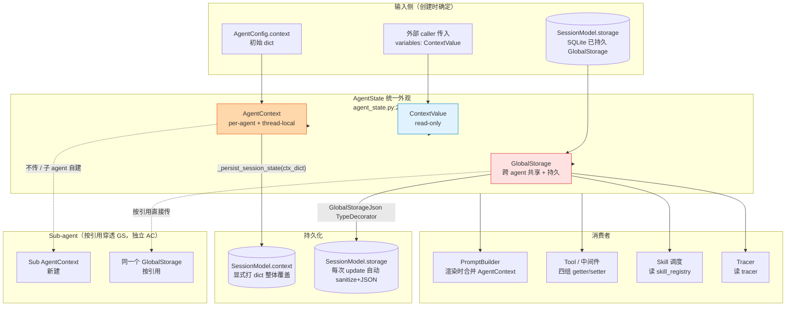

# RFC-0012: 全局存储与会话级变更

- **状态**: implemented
- **优先级**: P1
- **标签**: `architecture`, `state`, `storage`, `session`, `concurrency`
- **影响服务**: `nexau/archs/main_sub/agent_context.py`, `nexau/archs/main_sub/agent_state.py`, `nexau/archs/main_sub/context_value.py`, `nexau/archs/session/models/session.py`
- **创建日期**: 2026-04-16
- **更新日期**: 2026-04-16

## 摘要

NexAU 的"运行时可变状态"由三个独立的容器组成：`ContextValue`（`context_value.py:20`，外部只读输入，三段式 template / runtime_vars / sandbox_env）、`AgentContext`（`agent_context.py:29`，每个 agent 自己的可修改字典 + thread-local 入栈机制 + 修改回调）、`GlobalStorage`（`agent_context.py:187`，跨 agent 层级共享、线程安全、可持久化）。三者由 `AgentState`（`agent_state.py:29`）作为统一入口暴露给中间件 / tool / skill。本 RFC 描述：(a) 这三层的边界（哪些数据放哪里、为什么）；(b) 持久化的不对称——`GlobalStorage` 通过 SQLAlchemy `GlobalStorageJson` TypeDecorator 自动整体序列化，`AgentContext` 仅在 `_persist_session_state(context: dict)` 时被显式打成 dict 写入；(c) sub-agent 传播规则——`global_storage` 按引用直接共享，`AgentContext` 每个 agent 独立创建；(d) 已知的"约定键"（`skill_registry` / `tracer` / `parallel_execution_id` / `__nexau_full_trace_messages__`）以及它们的命名约定。本 RFC 不引入新代码，只追溯并锁定现有抽象的语义。

## 动机

### 为什么要专门为可变状态写一篇 RFC

1. **三个容器，三套 API，但调用方常常混淆**
   - `AgentState` 同时暴露 `get_context_value` / `get_global_value` / `get_variable` / `get_sandbox_env` 四组 getter（`agent_state.py:83-147`）；新中间件作者经常把 prompt-relevant 的临时值写进 `global_storage`，或把跨 agent 共享的 registry 写进 `context`。
   - 选错容器的代价：写错 `context` 会污染 prompt 渲染；写错 `global_storage` 会被持久化到 SQLite 永远残留；写错 `runtime_vars` 没有任何效果（它是只读的）。

2. **持久化路径不对称且不显眼**
   - `GlobalStorage` 在 SQLAlchemy 层面通过 `GlobalStorageJson` TypeDecorator（`session/models/types.py:57`）自动 sanitize + JSON 化，写入 `SessionModel.storage` 列；任何 `set()` 都会在下一次 `_persist_session_state` 时被序列化。
   - `AgentContext` 不被自动持久化——只有在 `Agent._persist_session_state(context: dict)` 显式调用（`agent.py:1147` 附近）时，才把当时的 `context` dict 整体覆盖到 `SessionModel.context` 列。
   - 这种不对称性没有在任何 docstring 里被点明，导致历史上有过把"敏感对象"塞进 `global_storage` 后才发现它真的进了 SQLite 的事故。

3. **sub-agent 共享语义模糊**
   - `SubagentManager`（`subagent_manager.py:60-133`）把父 agent 的 `global_storage` 按引用直接传给子 agent；这意味着子 agent 写入会立刻被父 agent 看到、并最终被父 agent 的 session 持久化。
   - 但 `AgentContext` 是每个 agent 独立创建的（`agent.py:902-916` 中 `context=ctx` 是子 agent 自己的 `AgentContext`），不会跨 agent 共享。
   - 这两条规则没有写在任何文档里，是从代码反推出来的；写新的 sub-agent 编排逻辑时极易踩坑。

4. **存在"约定键"但没有显式 schema**
   - 几个 well-known key（`skill_registry` 在 `agent.py:185` / `tracer` 在 `agent.py:322` / `parallel_execution_id` 在 `subagent_manager.py:155` / `__nexau_full_trace_messages__` 在 `agent.py:1092`）目前散落在代码各处；新加 key 时既不知道命名约定（带 `_` 前缀？带 `__nexau_` 前缀？），也没法判断会不会和现有键冲突。
   - 急需一份"约定键登记表"，至少把现存键的 owner / 生命周期 / 是否参与 prompt 写明白。

### 不补全会怎样

- 中间件作者继续凭直觉选容器，污染 prompt 或意外持久化敏感数据。
- 未来想做的"FrameworkContext 收敛"（把三层合并为一个统一容器）没有 baseline 文档可以对照。
- sub-agent 编排重构时无法知道哪些状态应当随子 agent 隔离、哪些应当穿透。

## 设计

### 概述

NexAU 的 "运行时可变状态" 划分为**三层独立容器 + 一个统一外观**：

```
┌──────────────────────────────────────────────────────────────┐
│  AgentState  (agent_state.py:29)                             │
│  ─────  统一外观，所有 hook / tool / skill 经此访问         │
│                                                              │
│  ├── context: AgentContext         ← 每 agent 一份，prompt   │
│  ├── global_storage: GlobalStorage ← 跨 agent 共享 + 持久化  │
│  └── _variables: ContextValue      ← 外部输入，只读          │
└──────────────────────────────────────────────────────────────┘
```

每一层都有**明确的可变性、共享范围、持久化策略**，下表是边界判定：

| 容器 | 来源 | 可变性 | 共享范围 | 持久化 | 典型用途 |
|---|---|---|---|---|---|
| `ContextValue` (`context_value.py:20`) | 外部 caller 在 `Agent.run()` 时通过 `variables=` 传入 | 不可修改 | 仅当前 agent 看见 | 否 | API key、租户标识、sandbox env |
| `AgentContext` (`agent_context.py:29`) | `AgentContext.from_sources(initial_context, legacy_context, template)`（`agent_context.py:121`）合并三源 | 可改：`set_context_value` / `update_context` | **每 agent 独立**；不向父或子穿透 | 显式：`_persist_session_state(context_dict)` 时整体覆盖 `SessionModel.context` | prompt 模板变量、context-compaction full-trace 缓存 |
| `GlobalStorage` (`agent_context.py:187`) | `Agent.__init__` 时由 `_init_session_state` 决定（user override 或 session restore） | 可改：`set` / `update` / `delete`，全部线程安全 | **按引用**穿透到所有 sub-agent（`subagent_manager.py:123/133`） | 自动：SQLAlchemy `GlobalStorageJson` TypeDecorator 在每次 session flush 时把 `to_dict()` 经 `sanitize_for_serialization` 序列化 | 单例 registry（skill_registry / tracer）、跨 agent 协调状态（parallel_execution_id） |

### 关键设计决策

1. **三层独立容器而非"一个大字典"**
   - **原因**：每层有不同的"权威性"和"生命周期"。`ContextValue` 是 caller 的合同（不能被 agent 修改）；`AgentContext` 是单 agent 内的可变工作台；`GlobalStorage` 是跨 agent 的持久共享池。把它们合并会让"哪条状态被持久化"的判定退化为运行时巡检。
   - **结果**：`AgentState` 同时持有三者，并暴露**四组**显式 getter（`get_context_value` / `get_global_value` / `get_variable` / `get_sandbox_env`），强迫调用方在写代码时就声明数据归属。
   - **代码锚点**：`agent_state.py:83-147`。

2. **`AgentContext` 是 thread-local context manager，不是普通字典**
   - **原因**：prompt 渲染管线需要在不持有 agent 引用的远端代码（如自定义 jinja filter）里访问"当前 agent 的 context"；用 thread-local 比层层透传 agent 更简洁。
   - **结果**：模块级 `_current_context` 变量（`agent_context.py:156`）+ `__enter__` / `__exit__` 入栈语义（`agent_context.py:41-65`）。`get_context()` / `get_context_dict()` / `get_context_variables()` / `merge_context_variables()`（`agent_context.py:159-184`）是模块级访问点。
   - **副作用**：`AgentContext` 修改时会触发 `_modification_callbacks`（`agent_context.py:81-92`）——目前唯一已知用途是 prompt refresh，但这是设计上对未来"context-aware re-render" 的钩子。
   - **trade-off**：thread-local 对 asyncio 的兼容性需要小心——本 RFC 不重新设计这一点；若未来切到 `contextvars.ContextVar` 是另一个 RFC 的范围。

3. **`GlobalStorage` 的并发模型：per-key RLock + global RLock**
   - **原因**：单一全局锁会让"高频 key（如 tracer 读取）"的 contention 拖慢所有写入；纯 per-key 锁又无法保护"对不存在的 key 的并发 set"。
   - **结果**：默认走 `_storage_lock`（`agent_context.py:193`）；调用方可主动通过 `lock_key(key)` / `lock_multiple(*keys)` 申请 per-key `RLock`（`agent_context.py:311-326`），后续对该 key 的所有 `set/get/delete/update` 都改走 per-key 锁（`agent_context.py:233-285`）。
   - **副作用**：`lock_multiple` 内部对 keys 做 `sorted` 排序（`agent_context.py:325`）以避免 deadlock——这是隐式契约，复用该锁集合的代码必须保留排序。
   - **代码锚点**：`agent_context.py:187-326`。

4. **持久化策略不对称：`GlobalStorage` 自动 + `AgentContext` 显式**
   - **原因**：`GlobalStorage` 的语义就是"跨 run 持久"（registry / state）；`AgentContext` 的语义是"prompt 渲染所需的临时变量"，并不是每次修改都值得 fsync。
   - **结果**：
     - `GlobalStorage` → SQLAlchemy 层 `GlobalStorageJson` TypeDecorator（`session/models/types.py:57-104`）在每次 `update_session_storage` / `update_session_state`（`session_manager.py:279-340`）时自动 sanitize + JSON 化。
     - `AgentContext` → 只有 `Agent._persist_session_state(context: dict)`（`agent.py:1147` 附近）显式调用时，才把当时传入的 `context` dict 整体覆盖到 `SessionModel.context`；`AgentContext` 自身的 modification flag（`agent_context.py:94-105`）目前并不驱动持久化，仅驱动 prompt refresh。
   - **副作用**：写 `global_storage` 必须假定值会被 `sanitize_for_serialization` 处理——非 JSON-safe 对象（如 `tracer`）虽然能 set 进去，落库时会被静默替换。
   - **trade-off**：见 § 权衡取舍 #1。

5. **sub-agent 的传播规则：`global_storage` 按引用穿透，`AgentContext` 每 agent 独立**
   - **原因**：`global_storage` 的存在意义就是跨 agent 共享 registry；`AgentContext` 的 prompt 变量必须按 agent 隔离（否则子 agent 的渲染会污染父 agent 的 prompt）。
   - **结果**：
     - `SubagentManager.__init__` 接收父 agent 的 `global_storage`（`subagent_manager.py:60`），并在 spawn / recall 时按引用直接传递（`subagent_manager.py:123` / `:133`）——子 agent 的 `global_storage.set(k, v)` 立刻被父 agent 看见。
     - `AgentContext` 在每个子 agent 的 `Agent.__init__` 中通过 `from_sources(...)` 重新构造（`agent.py:902-916` 中 `context=ctx`）；子 agent 修改自己的 context 不会影响父 agent。
   - **副作用**：sub-agent 协调状态（如 `parallel_execution_id`，`subagent_manager.py:155`）必须放 `global_storage`；prompt-bound 临时值（如 context-compaction 的 full-trace 快照，`context_compaction/middleware.py:694-718`）必须放 `AgentContext`。

6. **"约定键"登记机制（最低限度）**
   - **原因**：现存有 4 个跨模块约定键，没有任何 schema 或命名约定登记。本 RFC 不引入运行时校验，但锁定一份"已知键"清单作为后续 PR 的写入门槛。
   - **结果**（已知键列表，按 owner 分组）：

   | 键 | 容器 | Owner | 写入位置 | 读取位置 | 生命周期 |
   |---|---|---|---|---|---|
   | `skill_registry` | GlobalStorage | Agent 初始化 | `agent.py:185` | `skill.py:185` | agent 实例生命周期；不应跨 session 复用 |
   | `tracer` | GlobalStorage | `_setup_tracer` | `agent.py:322` | `agent.py:781`, `llm_caller.py:213`, `tool_executor.py:116` | agent 实例生命周期；持久化时被 sanitize 丢弃 |
   | `parallel_execution_id` | GlobalStorage | SubagentManager | `subagent_manager.py:155` | sub-agent 协调路径 | 单次并行执行批次 |
   | `__nexau_full_trace_messages__` / `_FULL_TRACE_MESSAGES_KEY` / `_FULL_TRACE_SEEN_IDS_KEY` | AgentContext | ContextCompactionMiddleware | `context_compaction/middleware.py:717-718` | `agent.py:1092`, `context_compaction/middleware.py:694-697` | 一次 run 内 |

   - **命名约定（建议、非强制）**：
     - 单例 registry：明文命名（`skill_registry`、`tracer`）
     - 跨 sub-agent 协调：明文（`parallel_execution_id`）
     - 框架内部、中间件私有：双下划线 `__nexau_` 前缀（`__nexau_full_trace_messages__`），避免与用户代码冲突

### 接口契约

| 调用方 | 应使用的 API | 不应使用的 API |
|---|---|---|
| Tool / 中间件需要 prompt 渲染期可见的临时值 | `agent_state.set_context_value(key, val)` | `set_global_value`（会被持久化），`get_variable`（只读） |
| Tool / 中间件需要跨 agent 共享的 registry / 协调状态 | `agent_state.set_global_value(key, val)`，**值必须 JSON-serializable**或接受被 sanitize | `set_context_value`（不跨 agent） |
| Tool 需要 caller 注入的 secret / 租户标识 | `agent_state.get_variable(key)` | `get_context_value`（会被序列化进 prompt） |
| Tool 需要 sandbox 环境变量 | `agent_state.get_sandbox_env(key)` | 直接读 `os.environ`（不被沙箱隔离） |
| 自定义中间件需要"前一次 run 留下"的状态 | `global_storage`（已自动持久化） | `AgentContext`（不被自动持久化） |
| 中间件需要 prompt-only 临时变量、不希望持久化 | `AgentContext` | `global_storage`（会被 fsync） |

### 架构图



### 详细设计

#### `ContextValue` —— 外部只读输入

`context_value.py:20` 是一个 Pydantic `BaseModel`，3 个字段：

- `template: dict[str, str]` — Jinja2 system prompt 变量；`Agent.run()` 接收后立刻被 `AgentContext.from_sources(template=...)`（`agent_context.py:121-153`）合并进 `AgentContext`，**之后只通过 `AgentContext` 访问**，原 `ContextValue.template` 不再被读取。
- `runtime_vars: dict[str, str]` — 运行时变量（API key 等），不进 prompt，仅通过 `agent_state.get_variable(key)`（`agent_state.py:125-135`）访问。
- `sandbox_env: dict[str, str]` — 沙箱环境变量，初始化时由 sandbox 模块注入到 `BaseSandbox.envs`，沙箱内部以 `$KEY` 形式访问。

`AgentState._variables` 持有原始 `ContextValue`（`agent_state.py:80`），**不做任何修改**——agent 内部代码无法 mutate `ContextValue`。

#### `AgentContext` —— 单 agent 可变工作台

- 数据：`self.context: dict[str, Any]`（`agent_context.py:34`）。
- 入栈语义：`__enter__` 把模块级 `_current_context` 暂存到 `_original_context`，再把自己设为当前；`__exit__` 还原。这允许嵌套 `with agent_context: ...` 而不会丢失父级（`agent_context.py:41-65`）。
- 修改回调：`set_context_value` 和 `update_context` 都会调用 `_mark_modified`（`agent_context.py:81-92`），后者遍历 `_modification_callbacks` 触发回调（异常被吞）。目前唯一已知挂钩是为 prompt refresh 预留，本 RFC 不引入新回调用户。
- 多源合并：`from_sources(initial_context, legacy_context, template)`（`agent_context.py:121-153`）按"initial < legacy < template"优先级合并；`legacy_context` 在合并时打 `DeprecationWarning`，是过渡期 API。
- 模块级访问：`get_context()` / `get_context_dict()` / `get_context_variables()` / `merge_context_variables(existing)`（`agent_context.py:159-184`）从 thread-local `_current_context` 取值；其中 `get_context_dict` 在没有 active context 时**抛 `RuntimeError`**——这是有意为之，避免在 prompt 渲染管线里出现"静默拿到空 dict"的 bug。

#### `GlobalStorage` —— 跨 agent 共享 + 自动持久

- 数据：`self._storage: dict[str, Any]`（`agent_context.py:191`）。
- 锁：
  - `_storage_lock: threading.RLock`（`agent_context.py:193`）默认锁。
  - `_locks: dict[str, threading.RLock]`（`agent_context.py:192`）按需创建的 per-key 锁，由 `_get_lock(key)`（`agent_context.py:303-308`）懒分配。
  - `_locks_lock: threading.RLock`（`agent_context.py:194`）保护 `_locks` 字典本身。
- 操作语义：
  - `set / get / delete`：先查 `_locks.get(key)`，命中则用 per-key 锁，否则用全局锁。
  - `update(updates)`：若 `updates.keys()` 与 `_locks` 有交集，逐 key 走 `set`；否则一次性走全局锁。
  - `lock_key(key)` / `lock_multiple(*keys)`：上下文管理器，`lock_multiple` 内部 `sorted(keys)` 防 deadlock。
- 序列化：
  - Pydantic 集成：`__get_pydantic_core_schema__`（`agent_context.py:226-232`）让 `GlobalStorage` 字段在 Pydantic 模型里既能 validate dict / `GlobalStorage` 输入（`_validate`，`agent_context.py:200-208`），也能 serialize 成 sanitized dict（`_serialize`，`agent_context.py:210-223`）。
  - SQLAlchemy 集成：`GlobalStorageJson(TypeDecorator)`（`session/models/types.py:57-104`）在 bind 阶段 `value.to_dict()` → `sanitize_for_serialization` → `json.dumps`；在 result 阶段反向 `json.loads` → `GlobalStorage()`（重建空实例 + `update`）。
  - 注意：result 阶段**不重建 per-key 锁**——锁元数据是运行时的，不参与持久化；这意味着重启后所有 key 都退化到 `_storage_lock`，需要重新 `lock_key` 才会激活 per-key 锁。

#### `AgentState` —— 统一外观

- 字段（`agent_state.py:39-81`）：8 个必传 / 4 个可选；其中 `context` / `global_storage` / `_variables` 直接持有上述三层。
- 4 组 getter/setter（`agent_state.py:83-147`）：
  - `(get|set)_context_value` → `AgentContext`
  - `(get|set)_global_value` → `GlobalStorage`
  - `get_variable` → `ContextValue.runtime_vars`（只读）
  - `get_sandbox_env` → `ContextValue.sandbox_env`（只读）
- 子 agent 关系：`parent_agent_state: AgentState | None` 字段（`agent_state.py:76`）让 hook 沿父链回溯（如 `subagent_manager.py:155` 中 `parent_agent_state.set_global_value(...)`）。
- 沙箱懒加载：`get_sandbox()`（`agent_state.py:159-170`）优先走 `_sandbox_manager.start_sync()`，回退到直接的 `_sandbox`——这是为 e2b httpx 客户端的 event-loop 隔离做的妥协，详见 RFC-0009。

## 权衡取舍

### 考虑过的替代方案

| 方案 | 优点 | 缺点 | 决定 |
|---|---|---|---|
| 单一大字典 `dict[str, Any]` | API 极简 | 持久化、共享、可变性边界完全靠约定，灾难性的口径分歧 | 否 |
| `GlobalStorage` 改用 `asyncio.Lock` | 与异步代码一致 | 现有调用方多在同步路径（prompt 渲染、tool 调用），改动面巨大 | 否 |
| `AgentContext` 改用 `contextvars.ContextVar` | 原生支持 asyncio 任务隔离 | 需要重写 `__enter__`/`__exit__` 入栈语义；callback 模型需重设计 | 否（留给后续 RFC） |
| `AgentContext` 也走 SQLAlchemy TypeDecorator 自动持久 | 持久化策略统一 | 高频 prompt 变量（每轮可能改）会触发大量 fsync；且很多临时值（如 full-trace 缓存）不应跨 run | 否 |
| `GlobalStorage` 不 sanitize、强制调用方传 JSON-safe | 持久化更可预期 | 调用方很难在写入时知道 SQLite 列的精确 schema；现存大量"set tracer"路径会断 | 否 |
| **本方案：三层独立容器 + AgentState 外观 + 不对称持久化** | 边界清晰；持久化与可变性解耦；sub-agent 共享语义可预期 | API 表面较大（4 组 getter）；新人需要查表才能选对容器 | **是** |

### 缺点

1. **API 表面大、容易选错容器**：4 组 getter / 3 个底层容器是显式设计代价。缓解：本 RFC §设计 / 接口契约表格列出"该用什么"映射；未来可考虑加 lint 规则（如"set_global_value 不允许传 callable"）。

2. **`GlobalStorage` sanitize 是静默的**：`_serialize` 路径里 `RecursionError / ValueError / TypeError` 都被吞为 warning（`agent_context.py:219-223`），并返回空 dict——意味着真的有"持久化失败"时，下一次 restore 会拿到空 GlobalStorage，问题难定位。缓解：日志已带 `"GlobalStorage serialization failed: %s"` warning，但缺少 metric / event；见 § 未解决的问题 #2。

3. **`AgentContext` thread-local 与 asyncio 不完全兼容**：`_current_context` 是模块级变量，跨 task 切换时若调用方未显式 `with agent_context:` 入栈，`get_context_dict()` 会抛 `RuntimeError`——这是设计上的"明显失败"而非"静默错误"，但仍要求所有 prompt-related call site 必须在 `with` 块内。

4. **持久化不对称容易意外**：写 `global_storage` 是"自动持久"，写 `context` 是"等下次 `_persist_session_state`"——这条规则没有任何运行时报警；新中间件作者可能会把"想跨 run 共享"的状态错放在 `context` 里。缓解：本 RFC 和 `接口契约` 表是唯一来源。

5. **per-key 锁元数据不持久**：重启后所有 key 都先走全局锁，直到再次显式 `lock_key`；性能上是降级而非错误，但对依赖 per-key 锁实现 read-heavy 的场景需要重新 warm-up。

## 实现计划

### 阶段划分

本 RFC 是追溯式文档，不引入新代码。阶段定义为"文档落地 + 后续可选改造"：

- [x] Phase 1（文档落地）：本 RFC + sidecar JSON 写入 `rfcs/`，纳入 RFC-0006 master plan。
- [ ] Phase 2（可选改造，留给后续 RFC）：
  - 引入 `WellKnownGlobalKey` enum / 常量集合，把 4 个约定键收敛到一处。
  - 给 `_serialize` 失败路径加 metric / event。
  - 评估是否把 `AgentContext` 切到 `contextvars.ContextVar`。

### 子任务分解

> 本 RFC 自身仅产出文档，无子任务。Phase 2 改造在确认必要性后另开 RFC（候选编号见 § 未解决的问题 #1）。

### 影响范围

- 新增：`rfcs/0012-global-storage-and-session-mutations.md`、`rfcs/meta/0012-global-storage-and-session-mutations.json`
- 不修改：任何 `nexau/` 代码、其他 RFC

## 测试方案

### 单元测试

无新增代码，沿用既有：

- `agent_context.py` 的 `GlobalStorage` 并发 / 锁 / 序列化逻辑由现有 `tests/` 中相关单元测试覆盖（具体路径不在本 RFC 范围）。
- `AgentContext.from_sources` 的优先级合并（`initial < legacy < template`）由既有 prompt-render 集成测试间接覆盖。

### 集成测试

文档级集成测试由 vigil-reviewer 在每次 commit 后执行：

1. 8 个强制 H2 段落齐全。
2. JSON sidecar 解析无错；`requires` 与 master plan `tasks[T6].depends_on=["T2"]` 一致。
3. 所有代码锚点（`file:line`）真实存在且语义匹配，特别是：
   - `agent_context.py:29`（`AgentContext` 类）
   - `agent_context.py:187`（`GlobalStorage` 类）
   - `agent_state.py:29`（`AgentState` 类）
   - `context_value.py:20`（`ContextValue` 类）
   - `session/models/types.py:57`（`GlobalStorageJson`）
   - `session/models/session.py:74`（`SessionModel.storage` 字段）
   - `subagent_manager.py:60-133`（global_storage 穿透）
4. 不修改既有 RFC 与代码（`git diff main -- rfcs/0001..0011 nexau/` 仅含新增文件）。

### 手动验证

跨 RFC 一致性审查（在 RFC-0006 Phase 5 阶段）：

1. 与 RFC-0008（会话持久化）核对：本 RFC 的 § 持久化策略不对称 与 RFC-0008 的 backend abstraction 描述不冲突；RFC-0008 明示 backend，本 RFC 明示"哪些状态进 backend"。
2. 与 RFC-0001（stop 持久化）核对：本 RFC 不重新定义 stop 路径；stop 时的 `flush` 由 RFC-0001 覆盖。
3. 与 RFC-0011（中间件钩子）核对：context-compaction 中间件使用 `AgentContext` 缓存 full-trace 的细节是 RFC-0011 设计决策的具体落地，二者引用同一行号 `context_compaction/middleware.py:694-718`，无冲突。

## 未解决的问题

1. **是否需要 `WellKnownGlobalKey` 收敛**？现存 4 个约定键散落在 4 个文件；写入处和读取处之间缺少类型保护。候选方案：在 `agent_context.py` 增加 `class GlobalStorageKey: SKILL_REGISTRY = ...`；本期不动。如果做，建议另开 RFC-0020 系列。

2. **`GlobalStorage._serialize` 失败的可观测性**：当前只有 warning 日志，没有 event / metric / 持久化失败回执。是否需要把"持久化失败"作为运行时事件（与 RFC-0010 的 `RunErrorEvent` 同级）暴露给 caller？本期不动；后续可在 RFC-0015（传输层路由）或 RFC-0010 的演进版本中决定。

3. **`AgentContext` 切换到 `contextvars.ContextVar`**：thread-local 在密集 asyncio 路径下需要调用方显式 `with` 入栈，否则 `get_context_dict()` 会抛错。`contextvars` 原生支持 task-local，但需要重写 callback 模型与 `__enter__`/`__exit__` 语义。本期保留 thread-local；切换是单独 RFC 的范围。

4. **sub-agent 写 `global_storage` 是否需要 namespace**？目前所有 sub-agent 与父 agent 共享同一个 `_storage` 字典，命名冲突全靠"约定键"前缀。若未来 sub-agent 数量增多（如 RFC-0013 子 Agent 委派的并行场景），可能需要 per-agent namespace 或 prefix 隔离。

5. **`AgentContext` 是否值得加自动持久化触发器**？目前 `_modification_callbacks` 已经能感知修改，但 callback 只用于 prompt refresh，没有触发 `_persist_session_state`。如果未来希望"context 也自动持久"，可加一个挂钩；本期保持显式控制。

## 参考资料

- `rfcs/0001-state-persistence-on-stop.md` — 既有 RFC，互补：本 RFC 描述容器，RFC-0001 描述 stop 路径下的 flush
- `rfcs/0008-session-persistence-and-history.md` — 本 RFC 的依赖：RFC-0008 描述 session backend；本 RFC 描述存进 backend 的状态结构
- `rfcs/0011-middleware-hook-composition.md` — 中间件读写 `AgentContext` / `GlobalStorage` 的具体场景由 RFC-0011 的 hook 模型支撑
- `rfcs/0006-rfc-catalog-completion-master-plan.md` — 本 RFC 是 T6 的产出
- `nexau/archs/main_sub/agent_context.py` — `AgentContext` (line 30) + `GlobalStorage` (line 181) 实现
- `nexau/archs/main_sub/agent_state.py` — `AgentState` 统一外观 (line 28)
- `nexau/archs/main_sub/context_value.py` — `ContextValue` 输入模型 (line 21)
- `nexau/archs/session/models/session.py` — `SessionModel.storage` / `.context` 列定义 (line 74)
- `nexau/archs/session/models/types.py` — `GlobalStorageJson` TypeDecorator (line 58)
- `nexau/archs/session/session_manager.py` — `update_session_storage` / `update_session_state` (line 278-340)
- `nexau/archs/main_sub/execution/subagent_manager.py` — sub-agent global_storage 传播 (line 60-133)
- `nexau/archs/main_sub/execution/middleware/context_compaction/middleware.py` — `AgentContext` full-trace 缓存示例 (line 694-718)
