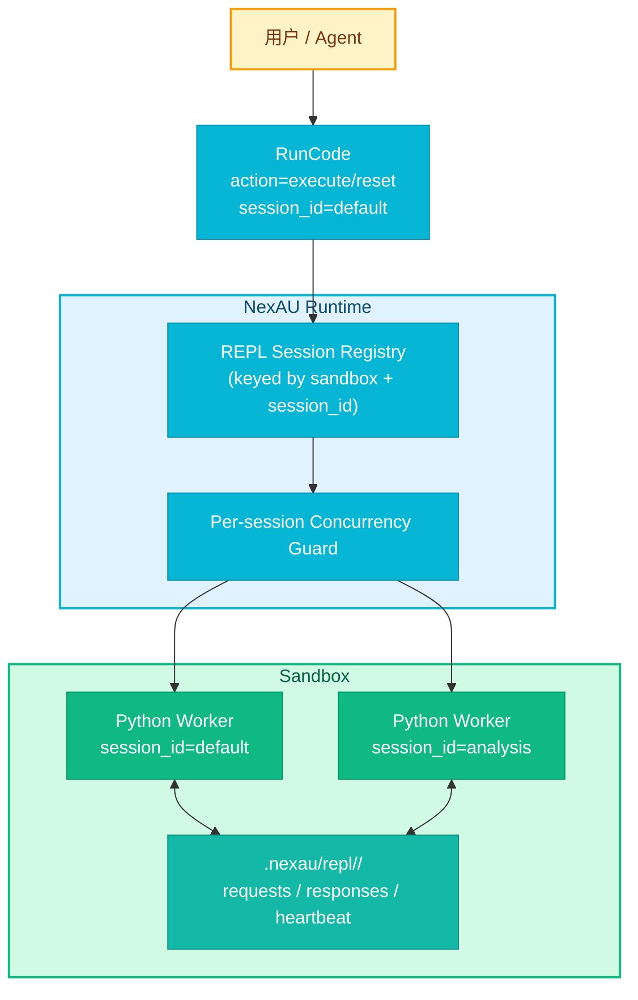

# RFC-0012: RunCode 会话内 REPL 执行

- **状态**: draft
- **优先级**: P1
- **标签**: `architecture`, `dx`, `sandbox`
- **影响服务**: `nexau` (tool runtime), `nexau` (sandbox integration)
- **创建日期**: 2026-03-18
- **更新日期**: 2026-03-18

## 摘要

当前 NexAU 的 `RunCode` 仅支持一次性执行一段 Python 代码，每次调用都会启动新的执行过程，无法在同一对话中保留变量和中间结果。本 RFC 提议把 `RunCode` 扩展为 **同一 sandbox 内的会话化 REPL 工具**：工具新增 `session_id`（默认 `default`）和 `action`（`execute` / `reset`），让同一 `session_id` 在存活 sandbox 内复用同一个 Python 命名空间；切换到新的 `session_id` 时自动创建新的 REPL 会话。第一版仅支持 Python，直接返回原始 `stdout` / `stderr`，提供超时与并发保护，但**不做跨 sandbox 状态恢复**。

## 动机

### 当前问题

仓库中的 `run_code_tool` 现状是“单次执行器”，而不是 REPL：

- `nexau/archs/tool/builtin/run_code_tool.py` 直接调用 `sandbox.execute_code(code_block, language="python", timeout=timeout)`；
- `LocalSandbox.execute_code()` 会将代码写入临时 `.py` 文件后执行，调用结束后临时文件删除，进程退出；
- 这意味着类似下面的多轮工作流无法成立：
  1. 第一轮：加载大型数据结构、解析仓库索引、构建变量；
  2. 第二轮：基于前一轮变量继续筛选、聚合、画图；
  3. 第三轮：仅输出最终结论，而不是反复重算全部上下文。

对代码代理场景而言，这会带来三个明显问题：

1. **重复计算成本高**：每一轮都要重新 import、重新扫描、重新构造中间对象；
2. **多步探索体验差**：LLM 不能把 Python 环境当作 scratchpad / workbench；
3. **输出控制不理想**：没有持久上下文时，Agent 倾向于把更多中间结果塞回消息历史，增加 token 成本。

### 现有基础能力

本仓库已经具备实现该能力所需的关键基础：

- `AgentState.get_sandbox()` 可以让工具访问当前 sandbox；
- sandbox 已支持前台代码执行与后台命令执行；
- `run_shell_command` / `background_task_manage_tool` 已验证了“长生命周期后台进程 + 状态检查/终止”的运行模型；
- `E2BSandboxConfig.status_after_run` 默认是 `pause`，天然适合保留 sandbox 内存状态；
- session / global storage 已能保存轻量元数据，但本 RFC 不要求把 REPL 命名空间序列化到 session 中。

### 不做会怎样

- RunCode 仍然只能当“一次性 Python 执行器”，无法支撑真正的多轮分析；
- 用户为了保住中间结果，只能把大量结构化结果写回消息历史或文件，增加 context 和工具调用负担；
- 与 Claude Code、Cursor 等 coding agent 的“工作台式 REPL”体验相比会有明显短板。

## 设计

### 概述

本 RFC 选择 **在现有 `RunCode` 上扩展**，不新增独立 REPL 工具，也不引入 Jupyter kernel。核心思路是：

1. `RunCode` 新增 `session_id`，默认 `default`；
2. 每个 `(sandbox, session_id)` 对应一个后台 Python worker；
3. worker 在 sandbox 中长时间存活，并维护自己的 Python 命名空间；
4. `RunCode(action="execute")` 把代码片段提交给该 worker 执行；
5. `RunCode(action="reset")` 销毁该 worker，并在下次执行时懒创建新会话；
6. 工具直接返回原始 `stdout` / `stderr`，不在工具层做摘要；
7. 状态仅保证在**同一个存活 sandbox**内成立，不保证跨 sandbox 重建恢复。



### 详细设计

#### 1. 工具接口：继续使用单一 `RunCode`

第一版不新增 `ResetRepl`、`InspectRepl` 等工具，而是在现有 `RunCode` 上扩展输入参数。

建议接口：

```python
def run_code_tool(
    code_block: str | None = None,
    timeout: int | None = None,
    description: str | None = None,
    session_id: str = "default",
    action: Literal["execute", "reset"] = "execute",
    agent_state: AgentState | None = None,
) -> ExecutionResult: ...
```

行为约束：

- `session_id` 默认值为 `default`；
- 指定一个新的 `session_id` 时，如果会话不存在，则**自动创建新 REPL 会话**；
- `action="execute"` 时需要 `code_block`；
- `action="reset"` 时忽略 `code_block`，重置指定 `session_id`；
- 第一版仅支持 Python，不开放 `language` 参数。

#### 2. `session_id` 的语义与边界

`session_id` 是 **RunCode 内部 REPL 会话标识**，不是 NexAU 顶层 SessionManager 的 `session_id`。

其语义如下：

- 作用域：**当前 sandbox 内**；
- 默认值：`default`；
- 新值：自动创建新 REPL 命名空间；
- 同名复用：命中同一 worker / 同一 Python namespace；
- 跨 sandbox：不保证可见，不做恢复。

为了避免路径注入与实现复杂度，`session_id` 需要满足严格校验规则：

- 长度限制，例如 1-64；
- 只允许安全字符（如字母、数字、`_`、`-`、`.`）；
- sandbox 内实际目录名可使用安全编码后的 `session_id`，避免直接拼接原始值。

#### 3. REPL worker：采用“后台 Python 进程”，不引入 Jupyter

当前仓库已经具备后台任务管理能力，因此第一版采用 **长生命周期 Python worker**，而不是引入 Jupyter kernel 协议。

选择该方案的原因：

- 可复用现有 sandbox 后台进程能力；
- 不引入额外依赖（如 jupyter_client、kernel gateway、ZMQ）；
- 对 LocalSandbox 与 E2B 都更容易保持统一实现；
- 能以较小改动完成“变量持续存在”的核心目标。

建议的 worker 组织方式：

```text
.nexau/repl/
  default/
    worker.py
    requests/
    responses/
    heartbeat.json
  analysis/
    worker.py
    requests/
    responses/
    heartbeat.json
```

worker 进程职责：

1. 在内存中维护一个长期存在的 Python namespace；
2. 轮询 `requests/` 目录中的执行请求；
3. 捕获本次执行的 `stdout` / `stderr` / traceback；
4. 将结果写入 `responses/`；
5. 更新 heartbeat，供 tool 侧健康检查；
6. 处理 reset / shutdown 指令。

#### 4. 执行流程

##### 首次 `execute`

1. `RunCode` 获取 sandbox；
2. 校验 `session_id` 与参数；
3. 查找 registry 中是否已有该 session 的 worker 元数据；
4. 若不存在，或健康检查失败，则在 sandbox 内启动新的 Python worker；
5. 写入本次 request 文件；
6. 等待 response 文件生成或超时；
7. 返回原始 `stdout` / `stderr`。

##### 后续 `execute`

1. 复用同一个 `session_id` 对应的 worker；
2. worker 在同一 namespace 中执行代码；
3. 之前定义的变量、函数、import 继续可用。

##### `reset`

1. 查找该 `session_id` 的 worker；
2. 若存在则终止 worker，并清理该 session 的临时 request/response 目录；
3. 清除 registry 中对应元数据；
4. 返回 reset 成功；
5. 下次 `execute` 再懒启动全新的空 namespace。

示例：

```json
{"action": "execute", "session_id": "default", "code_block": "x = 41\nprint('ready')"}
```

```json
{"action": "execute", "session_id": "default", "code_block": "print(x + 1)"}
```

```json
{"action": "reset", "session_id": "default"}
```

```json
{"action": "execute", "session_id": "analysis", "code_block": "data = [1, 2, 3]\nprint(sum(data))"}
```

#### 5. 并发保护

第一版必须提供 **per-session 并发保护**，避免同一个 `session_id` 被并行执行导致命名空间状态不确定。

设计选择：

- 并发粒度：`(sandbox_identity, session_id)`；
- 锁语义：**非可重入、单活跃执行**；
- 第二个并发调用在锁已占用时直接返回 `busy`，而不是在工具层排队；
- 不同 `session_id` 之间允许并行；
- 同一 sandbox 下多个 REPL 会话彼此隔离。

第一版不引入分布式锁，也不尝试跨多个 NexAU 进程协调；目标是优先保证单个运行时进程内的正确性与可预测性。

#### 6. 超时策略

第一版必须支持 timeout，但要优先保证实现简单与状态一致性。

约定如下：

- `timeout` 仍以毫秒为单位，沿用当前 RunCode 的语义；
- 若本次执行超时，返回 `status="timeout"`；
- 为避免 worker 进入不确定状态，**超时后销毁该 `session_id` 对应 worker**；
- 该 REPL 会话在下次 `execute` 时重新创建，命名空间从空状态开始。

这意味着 timeout 是“强隔离恢复点”，而不是“中断后保留全部内存状态”。该取舍换来更简单、可维护、跨 backend 更一致的实现。

#### 7. 返回值：直接返回原始 `stdout` / `stderr`

用户要求第一版直接返回原始输出，因此 RunCode 不在工具层做摘要或压缩。建议返回结构如下：

```json
{
  "status": "success",
  "session_id": "default",
  "duration_ms": 123,
  "stdout": "42\n",
  "stderr": "",
  "exit_code": 0
}
```

错误 / 超时场景：

```json
{
  "status": "error",
  "session_id": "default",
  "duration_ms": 98,
  "stdout": "",
  "stderr": "Traceback ...",
  "exit_code": 1,
  "error": "NameError: name 'x' is not defined"
}
```

```json
{
  "status": "timeout",
  "session_id": "default",
  "duration_ms": 30000,
  "stdout": "",
  "stderr": "Execution timed out. Session was reset.",
  "exit_code": 124,
  "error": "Execution timed out"
}
```

```json
{
  "status": "busy",
  "session_id": "default",
  "duration_ms": 0,
  "stdout": "",
  "stderr": "",
  "exit_code": 2,
  "error": "RunCode session 'default' is busy with another execution"
}
```

说明：

- “直接返回原始 `stdout` / `stderr`”不等于绕过全局中间件；
- 如果上层启用了 `LongToolOutputMiddleware`，超长输出是否被截断仍由该中间件统一决定；
- 本 RFC 只要求 **RunCode 本身不额外做 summary/compact**。

#### 8. sandbox 生命周期前提

该能力依赖 **sandbox 在多轮对话间继续存活**。

仓库现状：

- `E2BSandboxConfig.status_after_run` 默认是 `pause`，适合本 RFC；
- `BaseSandboxConfig.status_after_run` 默认是 `stop`；
- `LocalSandboxConfig` 若沿用默认 `stop`，每轮 run 结束都会销毁 sandbox，REPL 自然无法保活。

因此需要明确以下约束：

- 若用户想使用 RunCode REPL，sandbox 生命周期必须是 `pause` 或 `none`，或者 backend 自身具备等效的内存保活能力；
- 若 sandbox 在 run 间被 stop，RunCode 的 REPL 会话必然丢失；
- 该行为属于配置前置条件，不通过 session 恢复机制兜底。

#### 9. 与 session 持久化的关系

本 RFC **不修改** `SessionModel` schema，不新增跨 sandbox REPL 快照字段。

边界如下：

- 可在 `GlobalStorage` 中保存轻量 registry 元数据（如最近一次已知 worker pid / session dir），作为运行时 hint；
- 但这些元数据**不是** REPL 命名空间的 source of truth；
- worker 丢失、sandbox 重建、pid 失效时，RunCode 应基于健康检查自愈并重建空会话；
- 不要求把 Python 变量序列化到数据库，也不要求从 `sandbox_state` 恢复 REPL 内存。

#### 10. 与 `FrameworkContext` 的关系

当前 `FrameworkContext` 尚未提供 sandbox 分组 API，而 `run_code_tool` 已经通过 `agent_state.get_sandbox()` 访问 sandbox。

为控制范围，第一版继续沿用 `agent_state` 注入获取 sandbox，不把“新增 `ctx.sandbox` API”纳入本 RFC。后续若 `FrameworkContext` 增加 sandbox API，可在不改变 RFC 行为的前提下迁移实现。

### 示例

#### 用户视角示例

第一轮：

```json
{
  "code_block": "files = ['a.py', 'b.py']\nprint(len(files))"
}
```

第二轮：

```json
{
  "session_id": "default",
  "code_block": "print(files[0])"
}
```

切换新会话：

```json
{
  "session_id": "repo-index",
  "code_block": "index = {'src': 128, 'tests': 42}\nprint(index['src'])"
}
```

重置：

```json
{
  "action": "reset",
  "session_id": "repo-index"
}
```

## 权衡取舍

### 考虑过的替代方案

| 方案 | 优点 | 缺点 | 决定 |
|------|------|------|------|
| 保持现有一次性 `sandbox.execute_code()` | 实现最简单 | 无法保留变量，不满足 REPL 目标 | 否 |
| 新增独立 `ResetRepl` / `InspectRepl` 工具 | 接口更细 | 增加工具面，超出第一版需求 | 否 |
| 使用单一 `RunCode` + `session_id` + `action` | 迁移成本小，易理解 | 一个工具承担两类行为 | **采用** |
| 引入 Jupyter kernel / notebook 协议 | 中断与富输出生态更成熟 | 依赖重、协议复杂、跨 backend 集成成本高 | 否 |
| 每个 Agent 只有一个隐式 REPL | 接口更简单 | 无法让用户并行维护多个 scratchpad | 否 |
| `session_id` 命名 REPL 会话 | 灵活且显式 | 需要额外并发/生命周期管理 | **采用** |
| 超时后保留 worker | 变量可能继续存在 | worker 可能进入不确定状态 | 否 |
| 超时后销毁并懒重建 worker | 实现稳健，状态边界清晰 | timeout 后丢失该 session 内存 | **采用** |

### 缺点

- REPL 状态仅在存活 sandbox 内有效，sandbox stop 后即丢失；
- 第一版不支持变量检查、历史回放、对象浏览等 richer introspection；
- 超时会重置该 REPL session，可能丢失一部分用户希望保留的中间状态；
- 非阻塞 `busy` 错误要求上层 agent 自己决定重试或换 session_id；
- 文件轮询式 worker 通信相比嵌入式 kernel 协议更朴素，极端高频调用下效率不是最优。

## 实现计划

### 阶段划分

- [ ] Phase 1: 扩展 `RunCode` 输入 schema，新增 `session_id` 与 `action=execute/reset`
- [ ] Phase 1: 在 sandbox 中引入 REPL worker 与 request/response 协议
- [ ] Phase 1: 增加 per-session 并发保护与 worker 健康检查
- [ ] Phase 1: 实现 timeout → reset 的恢复策略
- [ ] Phase 1: 为 local / e2b sandbox 增加端到端测试覆盖
- [ ] Phase 1: 更新文档，明确 REPL 依赖 `status_after_run=pause|none` 的前置条件
- [ ] Phase 2: 评估是否增加 `inspect` / `list_sessions` / richer artifacts 支持（不在本 RFC 范围内）

### 相关文件

| 文件 | 说明 |
|------|------|
| `nexau/archs/tool/builtin/run_code_tool.py` | RunCode 主入口，扩展 session 化接口 |
| `nexau/archs/sandbox/base_sandbox.py` | sandbox 配置与生命周期约束文档参考 |
| `nexau/archs/tool/builtin/shell_tools/run_shell_command.py` | 现有后台任务模型参考 |
| `nexau/archs/tool/builtin/background_task_manage_tool.py` | 后台任务状态管理参考 |
| `tests/unit/...` | RunCode 参数校验、busy/timeout/reset 单元测试 |
| `tests/integration/...` | 同一 session 保活、多 session 隔离、sandbox stop 后丢失状态等集成测试 |

## 测试方案

### 单元测试

需要新增或更新以下测试场景：

1. `session_id` 默认值为 `default`；
2. `action=execute` 且无 `code_block` 时返回校验错误；
3. 新 `session_id` 自动创建新会话；
4. 同一 `session_id` 两次执行可共享变量；
5. 不同 `session_id` 变量互相不可见；
6. `reset` 后原变量不可再访问；
7. 超时返回 `timeout`，并在下一次执行时使用空 namespace；
8. 并发执行同一 `session_id` 时第二个请求返回 `busy`；
9. 非法 `session_id` 被拒绝；
10. 仍然只支持 Python。

### 集成测试

建议覆盖以下端到端场景：

1. **E2B / pause 生命周期**：第一轮定义变量，第二轮继续引用成功；
2. **LocalSandbox / stop 生命周期**：第一轮定义变量，下一轮因 sandbox 已 stop 而丢失状态；
3. **LocalSandbox / pause 或 none 生命周期**：同一 REPL session 保活成功；
4. **多 session 并存**：`default` 与 `analysis` 各自维护不同变量；
5. **reset 语义**：reset 后下次 execute 为全新命名空间；
6. **超时恢复**：超时后 worker 被重建，不复用旧状态。

### 手动验证

1. 配置一个 `status_after_run=pause` 的 sandbox；
2. 连续调用 `RunCode(session_id="default")`：
   - 第一次：`x = 10`；
   - 第二次：`print(x + 5)`，期望输出 `15`；
3. 调用 `RunCode(session_id="analysis")` 设置 `x = 100`；
4. 回到 `default` 执行 `print(x)`，期望仍为 `10`；
5. 调用 `RunCode(action="reset", session_id="default")`；
6. 再执行 `print(x)`，期望得到未定义错误。

## 未解决的问题

1. 第一版的 worker 通信是采用文件轮询、Unix socket，还是其他更轻量的 sandbox 内 IPC？
2. `busy` 是否应在未来升级为“短暂等待 + 可取消排队”，而不是立即报错？
3. 是否需要在后续阶段补充 `inspect` / `list_sessions` / `delete_session` 等控制能力？
4. 是否需要在文档或配置层面对“REPL requires sandbox persistence”做更显式的启动期检查或警告？

## 参考资料

- `nexau/archs/tool/builtin/run_code_tool.py` - 当前 RunCode 一次性执行实现
- `nexau/archs/sandbox/local_sandbox.py` - LocalSandbox 的 `execute_code()` 为临时文件 + 新进程模型
- `nexau/archs/tool/builtin/shell_tools/run_shell_command.py` - 后台进程执行与状态轮询参考
- `nexau/archs/tool/builtin/background_task_manage_tool.py` - 后台任务状态管理参考
- `nexau/archs/sandbox/base_sandbox.py` - `status_after_run` 生命周期配置定义
