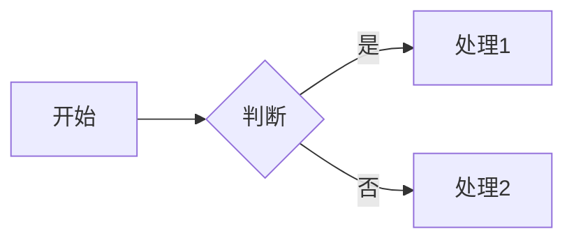
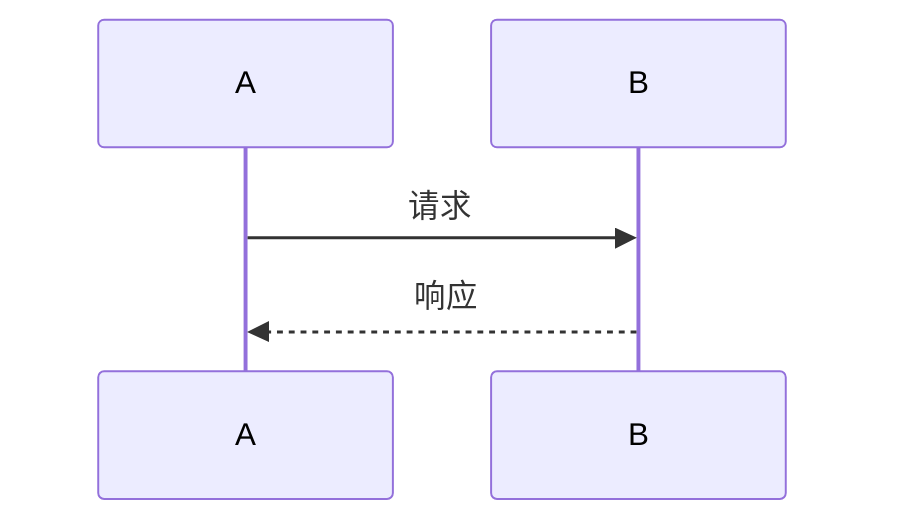
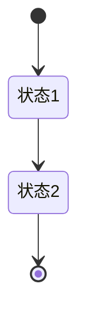
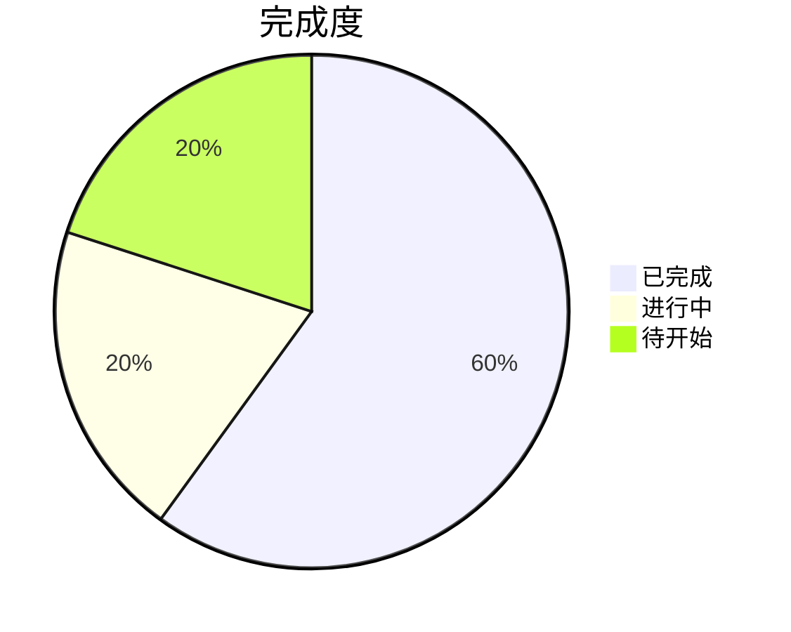
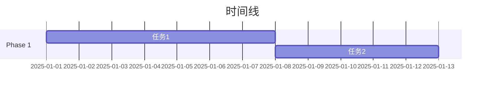
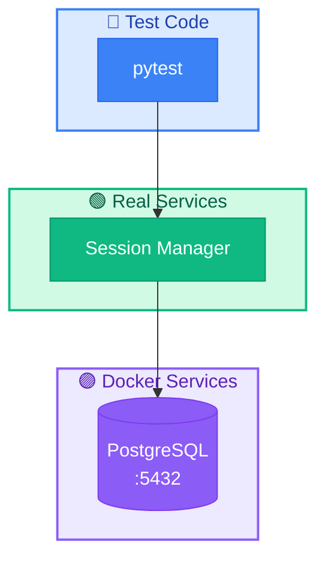

# Mermaid 图表样式规范

本文档定义了 NexAU Cloud 项目中 Mermaid 图表的统一颜色规范，确保所有文档中的图表风格一致。

## 颜色规范

### 节点元素（深色背景 + 白字）

| 语义            | Fill      | Stroke    | 代码                                             | 使用场景                         |
| --------------- | --------- | --------- | ------------------------------------------------ | -------------------------------- |
| 已完成/可信     | `#10B981` | `#059669` | `style X fill:#10B981,stroke:#059669,color:#fff` | 已完成服务、平台代码、真实服务   |
| 进行中/部分实现 | `#F59E0B` | `#D97706` | `style X fill:#F59E0B,stroke:#D97706,color:#fff` | 部分实现服务、待实现功能         |
| 测试代码        | `#3B82F6` | `#2563EB` | `style X fill:#3B82F6,stroke:#2563EB,color:#fff` | pytest、测试类、测试方法         |
| 错误/不可信     | `#EF4444` | `#DC2626` | `style X fill:#EF4444,stroke:#DC2626,color:#fff` | LLM生成代码、错误状态、失败      |
| Docker/容器     | `#8B5CF6` | `#7C3AED` | `style X fill:#8B5CF6,stroke:#7C3AED,color:#fff` | Docker容器、K8s Pod              |
| 网关/协议       | `#06B6D4` | `#0891B2` | `style X fill:#06B6D4,stroke:#0891B2,color:#fff` | Gateway、Proxy、Protocol、Config |
| 监控/可观测性   | `#6366F1` | `#4F46E5` | `style X fill:#6366F1,stroke:#4F46E5,color:#fff` | Langfuse、Trace、Metrics         |
| 存储/数据库     | `#14B8A6` | `#0D9488` | `style X fill:#14B8A6,stroke:#0D9488,color:#fff` | S3、PostgreSQL、Redis            |
| 中性/默认       | `#6B7280` | `#4B5563` | `style X fill:#6B7280,stroke:#4B5563,color:#fff` | 普通节点、可选功能               |

### Subgraph 容器（浅色背景 + 深色文字）

| 语义       | Fill      | Stroke    | 代码                                                                 |
| ---------- | --------- | --------- | -------------------------------------------------------------------- |
| 可信层     | `#D1FAE5` | `#10B981` | `style X fill:#D1FAE5,stroke:#10B981,stroke-width:2px,color:#065F46` |
| 平台层     | `#DBEAFE` | `#3B82F6` | `style X fill:#DBEAFE,stroke:#3B82F6,stroke-width:2px,color:#1E40AF` |
| 部分可信层 | `#FEF3C7` | `#F59E0B` | `style X fill:#FEF3C7,stroke:#F59E0B,stroke-width:2px,color:#92400E` |
| 不可信层   | `#FEE2E2` | `#EF4444` | `style X fill:#FEE2E2,stroke:#EF4444,stroke-width:2px,color:#991B1B` |
| 基础设施层 | `#EDE9FE` | `#8B5CF6` | `style X fill:#EDE9FE,stroke:#8B5CF6,stroke-width:2px,color:#5B21B6` |
| 网关层     | `#E0F2FE` | `#06B6D4` | `style X fill:#E0F2FE,stroke:#06B6D4,stroke-width:2px,color:#0C4A6E` |

### 颜色快速参考

```
🟢 已完成/可信:        #10B981 / #059669
🟠 进行中/部分实现:    #F59E0B / #D97706
🔵 测试代码:          #3B82F6 / #2563EB
🔴 错误/不可信:        #EF4444 / #DC2626
🟣 Docker/容器:       #8B5CF6 / #7C3AED
🔷 网关/协议:         #06B6D4 / #0891B2
🔹 监控/可观测性:     #6366F1 / #4F46E5
🩵 存储/数据库:       #14B8A6 / #0D9488
⚪ 中性/默认:         #6B7280 / #4B5563
```

## 常用图表类型

### 1. 流程图 (flowchart)



### 2. 时序图 (sequenceDiagram)



### 3. 状态图 (stateDiagram)



### 4. 饼图 (pie)



### 5. 甘特图 (gantt)



## 使用示例

### 测试架构图示例



## 最佳实践

1. **保持一致性**: 同一语义始终使用相同颜色
2. **分层清晰**: Subgraph 使用浅色背景，节点使用深色背景
3. **注释样式**: 在图表末尾统一添加 `%% Subgraph 容器样式` 和 `%% 节点样式` 注释
4. **语义优先**: 根据节点的语义含义选择颜色，而非随意选取
